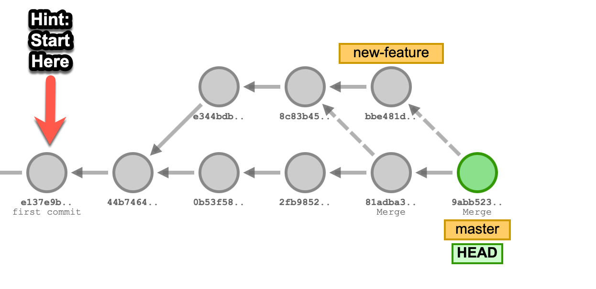

# Activity - git basics

### Part 1

1. Start in your`cs50-dev` directory
2. Create a subdirectory `repo1` and move into it
3. In the directory you just created initialize Git using `git init`
4. Create a `README.md` file in your directory using the `touch` command
5. Make sure `README.md` is in your _Working Directory_ by checking your status with `git status`
6. Move `README.md` from the _Working Directory_ to the _Staging Area_ by using `git add`
7. Make sure `README.md` is in your _Staging Area_ by checking your status with `git status`
8. Commit `README.md` to your repository using `git commit`
9. Make sure your _Working Directory_ and _Staging Area_ are clean with `git status`
10. Make sure your commit has been logged into your repository by using `git log`

### Part 2

1. (Continuing from Part 1)

2. Check that you are on the `main`/`master` (depending on your version of `git`) branch.

3. Create a branch named `feature-1`

4. Checkout that new branch

5. Run `git status` to verify you are on the new branch.

6. Create a file named `hello.md` there with one line in it: `# This is the hello file`

7. Run `git status` to see the new file in the new branch.

8. Add this new file to your *Staging Area*

9. Commit the new file with a message of `initial commit`

10. Run `git log` to see your branch's log includes the original `README.md` commit and your `hello.md` commit.

11. Run `ls` and note that there are two files in your directory:  `hello.md` and  `README.md`

12. Checkout the original branch (`main` or `master`)

13. Run `git log` and note that the branch's commit doesn't appear

14. Run `ls` and note that only your `README.md` file is present.

15. Merge the `feature-1` branch into your `main`/`master` branch.

16. Run `git log` and note that the branch's commit now appears

17. Run `ls` and note that both files are now present.

### Part 3

Using the [Visualizing Git](https://git-school.github.io/visualizing-git) tool we discussed, your challenge is to come up with the sequence of `git commit`s , `git branch ...`, and `git checkout ...` commands to recreate the state shown in the picture:

<!--
#### Solution

-->
