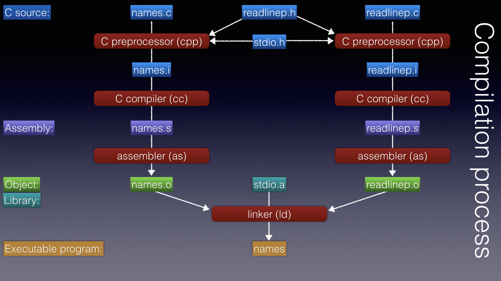
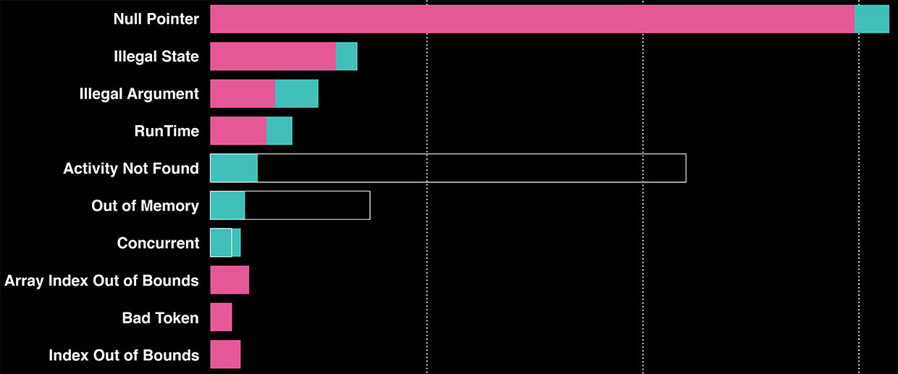
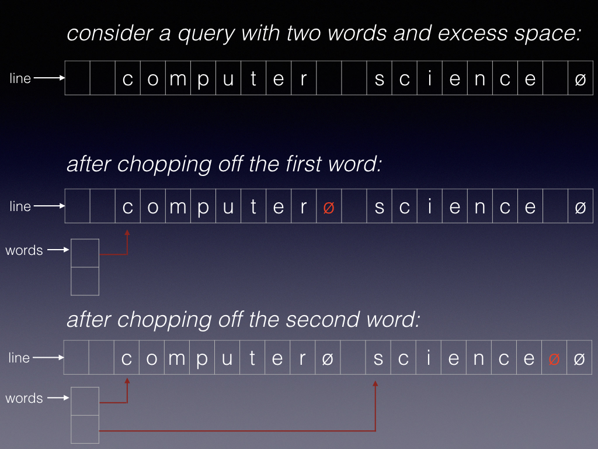

# CS50 reading units (all)
<!-- DO NOT EDIT THIS FILE... see ../build.py -->

This single page contains all CS50 knowledge units.
If you prefer to see units on separate pages check the [index](index.md).

You can find all the examples in the [examples repo](https://github.com/CS50Dartmouth21FS1/examples).

Some units are marked as optional, meaning you can skip over them and return to them if you are interested or need to learn more about that topic.
**Caveat**: these notes will not cover every detail.
You will also need to view the videos, read man pages and suggested references, and explore related websites.
Like any budding hacker you need to do some experimenting, find information to fill any gaps in your knowledge, and ask us for help if you're still stuck.


<!-- UNIT overview -->

# Unit: Welcome to CS50! <a name=unit-overview>

The aim of this course is to develop the foundation to tackle the design, implementation, and integration of a large software project working in small teams.
Along the way, you learn to write code in Bash and C, on Linux servers.
The challenge of the course is to quickly get you up to speed so there is sufficient time to get into the details of a complex software design project.
The first part of the course serves to develop design, programming and other skills such as source-code management, testing, and debugging.
The second part of the course is all about the project and team work.

The syllabus in a nutshell:

-   Unix: shell, commands, shell programming;
-   C: structure, arrays, pointers, dynamic memory, files;
-   Programming tools: gcc (compiler), make (builds software from source code), gdb (debugger), git (source-code management), valgrind (memory-leak checker).
-   Software development methodology: design, implementation, unit testing, integration, maintenance.
-   Programming: building a search engine (crawler, indexer, query engine).
-   Team project: it's a surprise!

The course includes six Unix and C programming assignments for the first part of the course; these assignments are to be done individually.
The last part (about 3 weeks) is devoted to the team project.
In the first part of the course you'll read and watch these units outside of class, and meet your team once a week to practice a group activity; in the last part of the course you'll meet your team during every class period.

**About logistics:** be sure to read the [Logistics](https://github.com/CS50Dartmouth21FS1/home/blob/main/logistics) and [systems](https://github.com/CS50Dartmouth21FS1/home/blob/main/logistics/systems.md) information.

**About engagement:** you will learn more from this course if you are actively engaged, where *engagement = preparation + participation.*
Read/watch these units and associated reading materials, practice at home, and participate in classroom activities.
The Learning Fellows are here to help with classroom activities.

**About the programming:** *There is a significant amount of programming in this course, requiring a considerable time commitment on the part of the student.*
You will need to be well organized to complete all the programming assignments and project.
Start each lab early.
It will be challenging, but we hope it will be fun!

**About the project**:
You will be assigned to a team of four students and given about three weeks to complete a large project requiring strong collaboration and a problem-solving mindset.
Each member is responsible for contributing to the overall system design, implementation, testing, integration, and documentation.
The goal of this activity is to help you develop the confidence, skills, and habits necessary to write large computer programs as part of a multi-person team.
You will become conversant in software engineering paradigms, such as source code control with `git` and other open-source tools that ease the software-development process.
In addition, you will develop vital skills in self-directed learning, problem solving, and communication.
The project concludes with a demo and a review of your design and implementation.
All members of the team get the same base grade, but we reserve the right to subtract points for members who do not contribute fully; there is a short evaluation form completed by all members at the end of the project.


---
<!-- END overview -->

<!-- UNIT intro-unix -->

# Unit: Introduction to Unix <a name=unit-intro-unix>

This unit covers the following:

-   The Unix operating system;
-   The concept of a *shell*;
-   The concept of a command line;
-   Logging on to a Unix machine;
-   Looking at the home directory and its files;
-   Some simple shell commands;
-   Logging out.

This and subsequent units are not a detailed presentation of the Unix OS and its programming tools -- it would require a whole term to cover all that material in detail.
We cover just enough about Unix and its tools to navigate our way around the system, write some basic shell scripts, and use its programming tools.

You'll note that we stick to the basics - we use a standard shell, we work at the command line, we use standard text-oriented editors.
We do not use any IDE (integrated development environment) or GUI (graphical user interface).
Why?
Because we believe it is important for you to understand the lowest common denominator, on which everything else is built, because you may need to work at this level someday.
Indeed, work on many embedded systems limits you to text-oriented, command-line interfaces only.
It's a good skill to have.

## OS and the shell

Unix is an *operating system*: "system software that manages computer hardware, software resources, and provides common services for computer programs." [Wikipedia](https://en.wikipedia.org/wiki/Operating_system)
In essence, it is the software that lays directly on top of the hardware, providing abstractions (like files and folders) to allow programmers to conveniently write applications.

> Unix arose in the 1960s; many derivatives came later, including Linux, FreeBSD, and MacOS.
> Except when it *really* matters, I use the term 'Unix' to refer to them all.

In their book *Program Design in the Unix Environment* (1984), Rob Pike and Brian Kernighan described the Unix philosophy:

> Much of the power of the Unix operating system comes from a style of program design that makes programs easy to use and, more important, easy to combine with other programs.
[...] This style was based on the use of tools: using programs separately or in combination to get a job done, rather than doing it by hand, by monolithic self-sufficient subsystems, or by special-purpose, one-time programs.

The core of the Unix operating system is called the *kernel*; the earliest human interface to the operating system was thus a program called the *shell* [[Wikipedia](https://en.wikipedia.org/wiki/Shell_(computing))].
Indeed, every Unix programmer needs to be comfortable working at the shell prompt, the *command line*.

## The command line

Unix was originally developed for computers with hardwired 'terminals', each of which was basically an electronic typewriter - a printer with a keyboard.
There were no graphical displays, and the concepts of 'windows' and 'mouse' had not yet been invented.
To interact with the computer, the user types on the keyboard, and the computer echos the keystrokes on the paper.
The system is controlled by typing *commands*, most of which print results for the user to see.
The interaction occurs over the *command line*.

Modern Unix systems support rich graphical user interfaces, but under the hood they all support the command line.

On my Mac I can launch 'Terminal', an application that emulates a traditional hardware terminal; it launches the *shell* -- a program that serves as my interface to the underlying MacOS (Unix) kernel.
The shell begins by printing a prompt, leaving my cursor at the end of the line so I can type a command.

```bash
[MacOS:~]$ 
```

Your prompt may look different - there are different shells and shells allow users to customize their prompts.
You'll see a few formats in the examples below.
Traditionally, shells like bash (used here) end their prompt with `$`.

But we're going to immediately jump off the laptop and over to Linux.

## CS50 Linux

In CS50 you will connect over the Internet to a set of Linux servers hosted at the Thayer School.
Before continuing, follow these [instructions](https://github.com/CS50Dartmouth21FS1/home/blob/main/logistics/systems.md#linux) to set up your Linux account... so you can experiment as you read the following.

**[:arrow_forward: Video: What do Linux servers look like?](https://dartmouth.hosted.panopto.com/Panopto/Pages/Viewer.aspx?id=d1217102-8db8-4f4c-a112-acfa00aebe7d)**

## Logging into a remote machine using ssh

**[:arrow_forward: Video: Logging in and viewing files](https://dartmouth.hosted.panopto.com/Panopto/Pages/Viewer.aspx?id=a9e2f6c3-998b-49bc-89e5-acfb0160e426)**

We can log into Thayer's Linux servers over the Internet, using the **s**ecure **sh**ell (`ssh`) command.
The `ssh` command establishes an encrypted connection between your laptop and the other server.

Below, I remotely log in as user `d31379t` (my Dartmouth NetID) to the server named `plank` by giving its full Internet hostname - `plank.thayer.dartmouth.edu`.

```
[MacOS:~]$ ssh d31379t@plank.thayer.dartmouth.edu
d31379t@plank.thayer.dartmouth.edu's password: 

  << You are currently using 4.01M of your 5.00G home directory quota. >>

d31379t@plank:~$ echo hello class!
hello class!
d31379t@plank:~$ logout
Connection to plank.thayer.dartmouth.edu closed.
[MacOS:~]$ 
```

It asked for my password, which is my usual Dartmouth password.

> If your connection failed, or timed out, double check that your computer is on the Dartmouth VPN or physically on the Dartmouth network.

The `echo` command takes an optional list of arguments, and simply prints them out.
Here I gave it two arguments.

I then used the command `logout` to leave, or "log out of" the `plank` system.

> It is good practice to `exit` or `logout` of any shell window, rather than just closing the window... you may need to properly exit background jobs or unsaved changes.
> The shell will warn you if you have left any background jobs running.

Let's log back in.
Notice how it sometimes pauses quite a while after entering your password.

```
[MacOS:~]$ ssh d31379t@plank.thayer.dartmouth.edu
d31379t@plank.thayer.dartmouth.edu's password: 

  << You are currently using 4.01M of your 5.00G home directory quota. >>

d31379t@plank:~$  echo The presence of this file disables login notification of your disk-quota usage. >  .notfsquota
d31379t@plank:~$ 
```

That pause was due to plank computing my disk utilization.
To save time, I created a new file `.notfsquota` which, when present, causes the login procedure to skip that quota calculation.
(I'm still subject to the quota, but I really don't care to see it every time I log in!)
Here, the `>` redirects the output of `echo` to the file named next; if that file does not exist, it is created; if it exists, it is overwritten.
We can see the contents of that file with the `cat` command:

```bash
d31379t@plank:~$ cat .notfsquota
The presence of this file disables login notification of your disk-quota usage.
d31379t@plank:~$ 
```

Why `cat`?
It is short for 'concatenate', because it prints each of the files listed in its arguments, one after another.
Here, of course, just one file.

Most commands quickly produce some output and then exit.
Some will run too long - perhaps printing too much output; you can stop (kill) the command, forcing it to exit, by typing control-C `^C` at the keyboard.
One silly program, `yes`, just prints an infinite sequence of `y` characters until you kill it:

```bash
d31379t@plank:~$ yes
y
y
y
^C
d31379t@plank:~$ 
```

Some commands ask for your input, and continue to read input until they read an "end of file" (EOF); if they are reading from your keyboard, you can cause the program to detect an EOF by typing control-D (`^D`) at the beginning of an input line.
Below I typed three lines of text, the (`^D`) at the start of the sixth input line, to the `sort` program:

```bash
d31379t@plank:~$ sort
sort
dartmouth
brown
yale
harvard
princeton
^D
brown
dartmouth
princetonsort
harvard
princeton
yale
d31379t@plank:~$ 

```

After sort reached EOF it sorted the input it had received and printed the sorted list.

Notice the difference between `^C` and `^D`; the former kills the program immediately, whereas the latter causes it to detect EOF when it reaches that point in reading input from the keyboard.


## Viewing files

As we saw above, you can print the contents of any file with the `cat` command, so named because it concatenates all the files listed as arguments, printing one after the other.
For very long files, though, the output will quickly scroll off your terminal.

So someone developed a program called `more`, which would fill the screen, then wait for you to press the space bar when you wanted to see more (get it?).

That was great, but someone else thought they could make an even better program, and they called it `less` (because less is more, get it?).

The syntax is `less filename` and `more filename`.
In each case you press space to see another screenfull, and `q` to quit early.
Take a look at the `man` pages to get the details of each.

Similarly, `head` and `tail` display a number of lines (selectable via switches, of course) at the beginning and end of a file, respectively.

See what these do: `cat /etc/passwd`, `head /etc/passwd`, `tail /etc/passwd`, `more /etc/passwd`, and `less /etc/passwd`.
The file `/etc/passwd` lists many, if not all, of the accounts on the system, and information about each account.

## Editing files

Long before there were windows and graphical displays, or even screens, there were text editors.
Two text editors are in common use on Unix system today: `emacs` and `vi`.
Actually, there is an expanded/improved version of `vi` called `vim`, which is quite popular.

You should try both and become comfortable with at least one.
Yes, it's tempting to use an external graphical editor (like Sublime), but there are times when you *must* use a text-only editor and thus you should get used to it.

See [about editors](https://github.com/CS50Dartmouth21FS1/home/blob/main/logistics/systems.md#editors) for some resources that can help you learn `emacs` or `vim`.


---
<!-- END intro-unix -->

<!-- UNIT hist-terminal -->

# History: Terminals <a name=unit-hist-terminal>

The name "Terminal" is still commonly used in Unix parlance, right down to the MacOS app by that name.
This term refers to the fact that early Unix computers, like other computers of its time, had a small number of interactive 'terminals' connected to it -- each directly connected by a dedicated wire to a card within the computer.
Each terminal was little more than a keyboard and a screen - or in the early days, a keyboard and a printer that would print each character as it was typed, and print the characters sent by the computer.

The first such terminals were "teletypes", adapted from the device used by newsrooms around the country, which printed characters transmitted over the phone line from a distant device.
This [video](https://www.youtube.com/watch?v=2B-U-5ylvWo) shows a teletype in action.
Indeed, it is connected to a refurbished PDP8/e, which is the first computer I used in high school.
It ran 'ETOS' and was programmed in 'BASIC'.

From the sound of the teletype, can you tell why television news shows' opening music usually has a stocatto tap-tap-tap-tap-tap background theme?


---
<!-- END hist-terminal -->

<!-- UNIT read-unix -->

# Reading: Unix shell and commands <a name=unit-read-unix>

We recommend these readings about Unix philosophy and history - including an interview with Dartmouth Adjunct Professor Doug McIlroy, who led the team that created Unix!
None of these readings are strictly necessary, but are short and will enhance your experience.

 - *[Choose your tools well](https://github.com/97-things/97-things-every-programmer-should-know/tree/master/en/thing_10)*
  [Giovanni Asproni]
 - *[Basics of the Unix Philosophy](https://homepage.cs.uri.edu/~thenry/resources/unix_art/ch01s06.html)* (just a few pages), a subset of chapter 1 of
   *[The Art of Unix Programming](http://www.catb.org/esr/writings/taoup/html/)*,
  by Eric S. Raymond.
 - *[The Strange Birth and Long Life of Unix](media/history/toomey-unix.pdf)*,
 by Warren Toomey -- *IEEE Spectrum* 2011
 - *[Interview with Doug McIlroy](media/history/DougMcIlroy.pdf)*,
 by Rik Farrow -- *;login* 2016
 - [MINIX retrospective](http://cacm.acm.org/magazines/2016/3/198874-lessons-learned-from-30-years-of-minix/fulltext), by Andrew Tanenbaum, a professor who created MINIX, and whose student Linus Torvalds created Linux.


---
<!-- END read-unix -->

<!-- UNIT hist-unix -->

# History: Origin of Unix <a name=unit-hist-unix>


[Unix](https://en.wikipedia.org/wiki/Unix) was developed at Bell Labs in the 1970s by a group led by [Doug McIlroy](https://en.wikipedia.org/wiki/Douglas_McIlroy), now an Adjunct Professor at Dartmouth (visit him in Sudikoff!).

> ``This is the Unix philosophy: Write programs that do one thing and do it well.
> Write programs to work together.
> Write programs to handle text streams, because that is a universal interface.''
> --- Doug McIlroy


---
<!-- END hist-unix -->

<!-- UNIT bash-intro -->

# Unit: The Bash shell <a name=unit-bash-intro>

In this unit we get an early feel for the shell.

**[:arrow_forward: Video](https://dartmouth.hosted.panopto.com/Panopto/Pages/Viewer.aspx?id=ad2d4e9b-521a-4ce1-ba72-acfb0163a642)**

## The shell

The shell provides an interface between the user and the kernel and executes programs called 'commands'.
For example, if a user enters `ls `then the shell executes the `ls` command, which actually executes a program stored in the file `/bin/ls`.
The shell can also execute other programs including scripts (text files interpreted by a program like python or bash) and compiled programs (e.g., written in C and compiled into binary code).
Even your own programs -- once marked 'executable' -- become commands you can run from the shell!

Although Unix (and the shell) have hundreds of commands, don't let yourself be overwhelmed; you will probably need only a couple dozen of them by the end of the term.

Unix has often been criticized for being very terse (it's rumored that its designers were bad typists).
Many commands have short, cryptic names and vowels are a rarity:

    cat, cut, cp, cd, chmod, echo, find, grep, ls, mv, rm, tr, sed, comm, vim

We will learn to use all of these commands and more.

Unix command output is also very terse - the default action on success is silence.
Only errors are reported, and error messages are often terse.
Unix commands are often termed 'tools' or 'utilities', because they are meant to be simple tools that you can combine in novel ways.

The shell interprets the first word on each command line as the *command*, and the remaining words as *arguments* to that command.
Arguments are separated by white space (spaces and tabs).
Many commands can be executed with or without arguments.
Others require arguments, or a certain number of arguments, (e.g., `cp sort.c anothersort.c`) to work correctly.

Any arguments are provided to the command as an array of words.
The first entry in the array is the command name itself.
In our `cp sort.c anothersort.c` example, argument 0 would be `cp`, argument 1 is `sort.c`, and argument 2 is  `anothersort.c`.
(This will matter to you when you start writing commands.)

Each command interprets its arguments according to its own rules.
One common convention is for the argument list to begin with a list of *options* (also known as *switches* or *flags*); these options are either a single letter preceded by a hyphen (e.g., `-v`) or a word preceded by two hyphens (e.g., `--verbose`).

For example, let's use the `ls` command and the `-l` (dash ell) option to list in long format the file `filename.c`.

    ls -l filename.c

Switches are often single characters preceded by a hyphen (e.g., `-l`).
Most commands accept switches in any order, though they generally must appear before all the real arguments (usually filenames).
In the case of the `ls` example below, the command arguments represent file or directory names.

Some commands also accept their switches grouped together.
For example, the following switches to `ls` are identical:

    ls -tla foople*
    ...
    ls -t -l -a foople*

As another example, the format of an `ssh` command line looks like this:

	ssh [options] [user@]hostname [command] [argument]...

I use the command `ssh d31379t@plank.thayer.dartmouth.edu` to indicate the user and host.

Note how I've described the syntax of the `ssh` command.
Those `[ ]` brackets and `...` are not literally part of the command - you never type them!
The `[ ]` are notation used to denote optional words; in the ssh syntax above, note the optional

    [command]

while the things outside of the `[ ]` , like `hostname`, must be specified.
Similarly, the `...` notation means that the prior word can optionally repeat.

Every command is different; these are just conventions.
You need to look at the manual for details.

## Getting Information using the online manual (man)

If you want the detailed syntax of a Unix command, read its page in the manual.
The Unix command `man` (short for *manual*) will find and print the 'man page' for the given command named in its argument; for example, `man ssh` produced the following:  

```man
SSH(1)                    BSD General Commands Manual                   SSH(1)

NAME
     ssh — OpenSSH SSH client (remote login program)

SYNOPSIS
     ssh [-46AaCfGgKkMNnqsTtVvXxYy] [-b bind_address] [-c cipher_spec]
         [-D [bind_address:]port] [-E log_file] [-e escape_char]
         [-F configfile] [-I pkcs11] [-i identity_file]
         [-J [user@]host[:port]] [-L address] [-l login_name] [-m mac_spec]
         [-O ctl_cmd] [-o option] [-p port] [-Q query_option] [-R address]
         [-S ctl_path] [-W host:port] [-w local_tun[:remote_tun]]
         [user@]hostname [command]

DESCRIPTION
     ssh (SSH client) is a program for logging into a remote machine and for
     executing commands on a remote machine.  It is intended to provide secure
     encrypted communications between two untrusted hosts over an insecure
     network.  X11 connections, arbitrary TCP ports and UNIX-domain sockets
     can also be forwarded over the secure channel.

     ssh connects and logs into the specified hostname (with optional user
     name).  The user must prove his/her identity to the remote machine using
     one of several methods (see below).

     If command is specified, it is executed on the remote host instead of a
     login shell.

     The options are as follows:

     -4      Forces ssh to use IPv4 addresses only.

     -6      Forces ssh to use IPv6 addresses only.

     -A      Enables forwarding of the authentication agent connection.  This
             can also be specified on a per-host basis in a configuration
             file.

 st

... and a whole lot more
```

This is just a snippet of the `man ssh` output.
The manual output includes all the nitty gritty details on options and about the command.
For many commands you can use the common option `--help` (two hyphens) to get a brief breakdown of the command and its switches.
This doesn't work for all commands (including `ssh`, interestingly), but in that case the use of `--help` is interpreted as an invalid command-line by ssh and it lists of the options anyway.

You can also use `man` to print information about common library functions, which are listed in different sections of the manual.
From the manual page for `man` (printed with command `man man`), we see there are 9 sections:

```bash
$ man man
...
      The table below shows the section numbers of the manual followed by  the  types
      of pages they contain.

      1   Executable programs or shell commands
      2   System calls (functions provided by the kernel)
      3   Library calls (functions within program libraries)
      4   Special files (usually found in /dev)
      5   File formats and conventions eg /etc/passwd
      6   Games
      7   Miscellaneous  (including  macro  packages  and  conventions), e.g. man(7),
          groff(7)
      8   System administration commands (usually only for root)
      9   Kernel routines [Non standard]

```

By default, `man` looks in section 1.
If you give a section number as the first argument, `man` will search that section instead.
Thus, `man printf` or `man 1 printf` will print the man page for the `printf` command (from section 1),
whereas `man 3 printf` will print information about the `printf` library function (from section 3).

> Caveat: You may be tempted to search for documentation about Unix commands (or library functions) online.
> You will certainly find useful material – and even man pages – but be warned: the details vary across Unix flavors, software versions, and even installations, so the local man pages are the definitive source of information.

Although the `man` command pauses at the end of each screenfull:

```man
Manual page xxx(n) line 1 (press h for help or q to quit)
```

If you enter '`h`' to see the help you will find many more commands than you're likely to ever use when reading `man` pages.
This is because the man-page reader is actually the `less` command of Unix.
I tend to use only a few:

* `f` or *space* (the spacebar) advances to the next screenful,
* `b` (or Page Up key) goes back to the previous screenful,
* `e` or down-arrow advances one more line,
* `y` or up-arrow goes back one line,
* `/` allows one to type a search phrase and hit return,
* `q` quits `man`, and returns to the shell prompt.


## The Shell's 'path'

**[:arrow_forward: Video](https://dartmouth.hosted.panopto.com/Panopto/Pages/Viewer.aspx?id=143b59d3-971b-4359-9726-acfb0164ccac)**

Typically, the shell processes the complete line after a carriage return is entered (by the user hitting the *Enter* or *Return* key) and then goes off to find the program that the command line specified.
If the command is a pathname, whether relative (e.g., `./mycommand`) or absolute (e.g., `/bin/ls` or `~/cs50-dev/mycommand`), the shell simply executes the program in that file.
If the command is not a pathname, the shell searches through a list of directories in your "path", which is defined by the shell variable called `PATH`.

The shell allows one to define *variables*; some have special meanings.
The `PATH` variable must be defined, with a colon-separated list of pathnames where commands can be found.
Take a look at your `PATH` by asking the shell to substitute its value (`$PATH`) and pass it as an argument to the `echo` command:

```bash
d31379t@plank:~$ echo $PATH
/thayerfs/home/d31379t/bin:/dartfs-hpc/admin/opt/el7/intel/compilers_and_libraries_2019.3.199/linux/bin/intel64:/usr/local/sbin:/usr/local/bin:/usr/sbin:/usr/bin:/sbin:/bin:/usr/games:/usr/local/games:/snap/bin:/thayerfs/apps/other:/thayerfs/apps/abaqus/bin:/thayerfs/apps/ansys/current/Framework/bin/Linux64:/thayerfs/apps/ansys/current/fluent/bin:/thayerfs/apps/cadence/bin:/thayerfs/apps/comsol/bin:/thayerfs/apps/eclipse:/thayerfs/apps/fiji:/thayerfs/apps/gams:/thayerfs/apps/idl/bin:/thayerfs/apps/julia/bin:/thayerfs/apps/maple/bin:/thayerfs/apps/mathematica/bin:/thayerfs/apps/matlab/bin:/thayerfs/apps/maya/bin:/thayerfs/apps/netgen/bin:/thayerfs/apps/paraview/bin:/thayerfs/apps/sagemath:/thayerfs/apps/synopsys/pcmstudio/bin:/thayerfs/apps/synopsys/sentaurus/bin:/thayerfs/apps/tecplot/bin:/thayerfs/apps/totalview/bin:/thayerfs/apps/turbovnc/opt/TurboVNC/bin:/thayerfs/apps/visit/bin:/thayerfs/apps/xilinx/bin
d31379t@plank:~$ 
```

> Wow! Thayer really puts a lot into the Shell's search path.

Where do the `sort` and `ls` commands reside?
Let's use another command to find out.

```bash
d31379t@plank:~$ which sort
sort is /usr/bin/sort
d31379t@plank:~$ which ls
ls is aliased to `ls -F --color=auto'
ls is /bin/ls
d31379t@plank:~$ 
```

We see that the `sort` command is actually a program stored in the file `/usr/bin/sort`.

The `ls` command, however, is actually a shell "alias".
The shell allows users to define "aliases", which act just like commands but are actually just a textual substitution of a command name (the alias) to some other string (in this case, `ls -F --color=auto`).
Thus, any time I type `ls blah blah`, it treats it as if I had typed `ls -F --color=auto blah blah`.
The `-F` option tells `ls` to add a trailing symbol to some names in its output; it adds a `/` to the names of directories, a `@` to the names of symbolic links (um, that's another conversation), and some other even specialized cases.
The `--color=auto` tells `ls` to print files of different types in different colors.

Of course, the shell then still needs to resolve `ls`.
It then searches the `PATH` to find an executable file with that name; in this case, it is found in `/bin`.
(If it found several, the shell will execute the first one, because it is found first in the PATH.)
Below you can see the effect of running `ls` (the alias) and `/bin/ls` (the raw command, without the `-F`).

```bash
d31379t@plank:~$ ls
bin/  cs50-dev/  dot@  go@  lib@  projects/  scripts@  staff/
d31379t@plank:~$ /bin/ls
bin  cs50-dev  dot  go	lib  projects  scripts	staff
d31379t@plank:~$ 
```

(I can't show the coloration here; try it yourself!)


---
<!-- END bash-intro -->

<!-- UNIT bash-files -->

# Unit: Unix filesystem <a name=unit-bash-files>

In this unit we explore the Unix file system a little.

**[:arrow_forward: Video](https://dartmouth.hosted.panopto.com/Panopto/Pages/Viewer.aspx?id=057b21b7-6055-40f1-b990-acfb0165dbc7)**

## Files and directories

The Unix file system is a *hierarchical file system*.
The file system consists of a very small number of different file *types*.
The two most common types are *files* and *directories*.

A directory (akin to a folder on a MacOS or Windows computer) contains the names and locations of all files and directories below it.
A directory always contains two special files `.` (dot) and `..` (dot dot); `.` represents the directory itself, and `..` represents the directory's parent.
In the following, I make a new directory, change my current working directory to be that new directory, create a new file in that directory, and use `ls` to explore the contents of the new directory and its parent.

```bash
d31379t@plank:~/cs50-dev$ ls
dotfiles/  README.md  shared@
d31379t@plank:~/cs50-dev$ mkdir demo
d31379t@plank:~/cs50-dev$ cd demo
d31379t@plank:~/cs50-dev/demo$ echo this is a new file > README
d31379t@plank:~/cs50-dev/demo$ ls
README
d31379t@plank:~/cs50-dev/demo$ cat README
this is a new file
d31379t@plank:~/cs50-dev/demo$ cd ..
d31379t@plank:~/cs50-dev$ ls 
dotfiles/  demo/  README.md  shared@
d31379t@plank:~/cs50-dev$ ls demo
README
d31379t@plank:~/cs50-dev$ ls -al demo
total 39
drwxr-xr-x 2 d31379t thayerusers  24 Mar 27 18:10 ./
drwxr-xr-x 5 d31379t thayerusers 121 Mar 27 18:10 ../
-rw-r--r-- 1 d31379t thayerusers  19 Mar 27 18:10 README
d31379t@plank:~/cs50-dev$ 
```

The `-al` flags to `ls` ask for the long-format listing (`-l`) and to show all files (`-a`); more on that below.

Directory names are separated by a *forward* slash `/`, forming pathnames.
A *pathname* is a filename that includes some or all of the directories leading to the file; an *absolute pathname* is relative to the root (`/`) directory and begins with a `/`, in the first example below, or begins with `~` (shorthand for the home directory).
A *relative pathname* is relative to the current working directory.
Notice that a relative pathname can also use `.` or `..`, as in the final examples below.


```bash
[d31379t@plank:~/cs50-dev$ ls /thayerfs/home/d31379t
bin/  cs50-dev/  dot@  go@  lib@  projects/  scripts@  staff/
d31379t@plank:~/cs50-dev$ ls /thayerfs/home/d31379t/cs50-dev
dotfiles/  demo/  README.md  shared@
d31379t@plank:~/cs50-dev$ ls ~
bin/  cs50-dev/  dot@  go@  lib@  projects/  scripts@  staff/
d31379t@plank:~/cs50-dev$ ls ~/cs50-dev
dotfiles/  demo/  README.md  shared@
d31379t@plank:~/cs50-dev$ ls ~/cs50-dev/demo
README
d31379t@plank:~/cs50-dev$ ls demo
README
d31379t@plank:~/cs50-dev$ ls ./demo
README
d31379t@plank:~/cs50-dev$ ls ../cs50-dev/demo
README
d31379t@plank:~/cs50-dev$ 
```

You can always "go home" by simply typing `cd ~` or even just `cd`, either of which change your current working directory to home.

### <a id="basename">basename and dirname</a>

When writing scripts, you sometimes have a pathname and want to break it into the directory-name component (dirname) and file-name component (basename).
Fortunately there are two commands to help:

```bash
$ pathname=~/cs50-dev/shared/examples/.gitignore
$ echo "$pathname"
/thayerfs/home/d31379t/cs50-dev/shared/examples/.gitignore
$ dirname "$pathname"
/thayerfs/home/d31379t/cs50-dev/shared/examples
$ basename "$pathname"
gitignore
$ 
```

Notice the shell expanded the `~` to the full pathname for my home directory when making the initial variable assignment.

The `dirname` and `basename` commands can be useful in a script to extract the relevant portion of the pathname into another variable, e.g., 

```bash
$ dir=$(dirname "$pathname")
$ file=$(basename "$pathname")
```
(here we use command substitution, described further below.)

## Listing and globbing files

Here are a popular set of switches you can use with `ls`:

    -l list in long format (as we have been doing)
    -a list all entries (including `dot` files, which are normally hidden)
    -t sort by modification time (latest first)
    -r list in reverse order (alphabetical or time)
    -R list the directory and its subdirectories recursively


The shell also interprets certain special characters:
`*` matches zero or more characters,
`?` matches one character, and
`[]` matches one character from the set (or range) of characters listed within the brackets.
This behavior is called *globbing*; the shell actually replaces what you write with a list of matching filenames.

Here are some examples:

```bash
d31379t@plank:~/cs50-dev/demo$ ls
game    game.o    README     test2.txt  test4.txt  test6.txt  test8.txt
game.c  Makefile  test1.txt  test3.txt  test5.txt  test7.txt  test9.txt
d31379t@plank:~/cs50-dev/demo$ ls game*
game  game.c  game.o
d31379t@plank:~/cs50-dev/demo$ ls game.*
game.c  game.o
d31379t@plank:~/cs50-dev/demo$ ls test*txt
test1.txt  test3.txt  test5.txt  test7.txt  test9.txt
test2.txt  test4.txt  test6.txt  test8.txt
d31379t@plank:~/cs50-dev/demo$ ls test?.txt
test1.txt  test3.txt  test5.txt  test7.txt  test9.txt
test2.txt  test4.txt  test6.txt  test8.txt
d31379t@plank:~/cs50-dev/demo$ ls test[2468].*
test2.txt  test4.txt  test6.txt  test8.txt
d31379t@plank:~/cs50-dev/demo$ ls test[7-9].*
test7.txt  test8.txt  test9.txt
d31379t@plank:~/cs50-dev/demo$ ls *.*
game.c  test1.txt  test3.txt  test5.txt  test7.txt  test9.txt
game.o  test2.txt  test4.txt  test6.txt  test8.txt
d31379t@plank:~/cs50-dev/demo$ echo [a-z]*    
game game.c game.o test1.txt test2.txt test3.txt test4.txt test5.txt test6.txt test7.txt test8.txt test9.txt
d31379t@plank:~/cs50-dev/demo$ echo [A-Z]*
Makefile README
d31379t@plank:~/cs50-dev/demo$ 
```

### Hidden files
The `ls` program normally does not list any files whose filename begins with `.`  There is nothing special about these files, except `.` and `..`, as far as Unix is concerned.
It's simply a convention - files whose names begin with `.` are to be considered 'hidden', and thus not listed by `ls` or matched with by the shell's `*` globbing character.
Home directories, in particular, include many 'hidden' (but important!) files.
The `-a` switch tells `ls` to list "all" files, including those that begin with a dot (aka, the hidden files).

```bash
d31379t@plank:~$ ls -a
./             .cache/    .gitconfig         .muttrc@     .signature@
../            cs50-dev/  .gitconfig-fancy@  .notfsquota  .ssh/
.bash_history  .cshrc@    .gnupg/            .plan@       staff/
.bash_logout   dot@       go@                .profile     .subversion@
.bashrc        .emacs     lib@               projects/    .vimrc
bin/           .emacs.d/  .login@            scripts@
```

In this case, `ls` sorted them alphanumerically without regard to the leading dot.
In some other Unix or `ls` implementations, it lists all the "dot files" first, then all the rest.

Again, it appends `/` to directory names.
It appends an `@` to indicate the file is actually a *symbolic link*, meaning, a pointer to a file that actually lives elsewhere.

Here's an important example:

```bash
d31379t@plank:~/cs50-dev$ ls
dotfiles/  demo/  README.md  shared@
d31379t@plank:~/cs50-dev$ ls -l shared
lrwxrwxrwx 1 d31379t thayerusers 34 Mar 27 14:56 shared -> /thayerfs/courses/21spring/cosc050/
d31379t@plank:~/cs50-dev$ ls shared/
examples/
d31379t@plank:~/cs50-dev$ ls shared/examples/
args.sh*   guess1a.sh*  guess2.sh*  guess4.sh*     shifter.sh*
gitignore  guess1b.sh*  guess3.sh*  imagepage.sh*
d31379t@plank:~/cs50-dev$ 
```

Notice how `ls -l` printed `->` and the name of the target for the `shared` symlink.
Because it has a trailing `/` slash, we can see it is a directory.
When we `ls shared/` (adding the slash), `ls` shows the contents of that directory, which happens to be one subdirectory `examples`.
That's where we provide CS50 examples!
(Just one is there so far.)
No matter where your current working directory, you can always see the examples:

```bash
d31379t@plank:~$ ls ~/cs50-dev/shared/examples/
args.sh*   guess1a.sh*  guess2.sh*  guess4.sh*     shifter.sh*
gitignore  guess1b.sh*  guess3.sh*  imagepage.sh*
d31379t@plank:~$ 
```

> How did I create that symbolic link (aka symlink)?
> When my current working directory was `cs50-dev`, I typed the command
> `ln -s /thayerfs/courses/21spring/cosc050 shared`.
> The parameters for `ln` are
> `-s` to indicate a *symbolic* link,
> the first pathname is the target of the link,
> and the second pathname is the (new) link itself.

Back to the home directory.
To see just the dot files, let's get clever with the shell's glob characters:

```bash
d31379t@plank:~$ ls -ad .??*
.bash_history  .cshrc@     .gitconfig-fancy@  .notfsquota  .ssh/
.bash_logout   .emacs      .gnupg/            .plan@       .subversion@
.bashrc        .emacs.d/   .login@            .profile     .vimrc
.cache/        .gitconfig  .muttrc@           .signature@
d31379t@plank:~$ 
```

All of these "dot files" (or "dot directories") are important to one program or another; you are likely to have the following:

* `.bash_history` - used by bash to record a history of the commands you've typed
* `.bash_logout` - executed by bash when you log out
* `.bashrc` - executed by bash whenever you log in or start a new shell
* `.emacs.d/` - a directory used by emacs text editor
* `.profile` - executed by bash when you log in
* `.ssh/` - directory used by ssh, including your private key
* `.vim/` - a directory used by vim text editor
* `.viminfo` - used by vim text editor
* `.vimrc` - used by vim text editor

The bash history file is really handy.
After you run a command, bash stores it in the history file.
If you want to run it again, you can just type the up-arrow (or `⌃p`) and the shell will retype the same command again, but not hit enter.
You can move the cursor around and edit the command, and hit enter to run it.  If you type two up-arrows (or two `⌃p`), you'll get two commands ago, and so on.


## Your home directory and its files

Each user has a designated _home directory_.
Immediately after you log in using `ssh` you are in your home directory - that is, the shell's notion of your 'current working directory'
is your home directory.

We can look at our home directory pathname using the `pwd` (**p**rint **w**orking **d**irectory) command.
Let's see what we have inside our Linux box.

```bash
d31379t@plank:~$ pwd
/thayerfs/home/d31379t
d31379t@plank:~$ ls
bin/  cs50-dev/  dot@  go@  lib@  projects/  scripts@  staff/
d31379t@plank:~$ 
```

The tilde (`~`) above is shorthand for 'home'.
My home directory is `/thayerfs/home/d31379t`.

Above, the `ls` lists several things within my home directory.
Some I see to be subdirectories, because `ls` added `/` to their names.
What's in the `cs50-dev` subdirectory?

```bash
d31379t@plank:~$ ls cs50-dev
dotfiles/  README.md  shared@
d31379t@plank:~$ 
```

Notice how I used an argument to `ls` to tell it which directory to list.
I see that `cs50-dev` has a subdirectory `dotfiles`, a file `README.md`, and a *symbolic link* called `shared` -- it's like an alias.
Let's go down into that subdirectory and look more closely.

```bash
d31379t@plank:~$ cd cs50-dev
d31379t@plank:~/cs50-dev$ pwd
/thayerfs/home/d31379t/cs50-dev
d31379t@plank:~/cs50-dev$ ls
dotfiles/  README.md  shared@
d31379t@plank:~/cs50-dev$ ls -l
total 79
drwxr-xr-x 2 d31379t thayerusers  159 Mar 27 14:57 dotfiles/
-rw-r--r-- 1 d31379t thayerusers 5357 Mar 27 14:56 README.md
lrwxrwxrwx 1 d31379t thayerusers   34 Mar 27 14:56 shared -> /thayerfs/courses/21spring/cosc050/
d31379t@plank:~/cs50-dev$ 
```

I changed directory (`cd`) so now my *current working directory* is `cs50-dev`; note that `pwd` printed its longer pathname, and the shell nicely updated its prompt to remind us of our current directory.
When I run plain `ls` again, it listed what is now the current directory.
Then, I asked for more detail by using the `-l` (dash ell) switch, which means 'long' format.
It provided more information about each file and directory.
For example, the second line says `README.md` has permissions `-rw-r--r--`, owner `cs50 `, group `thayerusers`, size 5357 bytes, and name `README.md`.

`ls` shows directories with `d` leading their permissions and with a trailing slash `/` after their name.

You need appropriate permissions to be able to change to a directory, list its contents, or read/write/create its files; for example, here I try to list another user's home directory:

```bash
d31379t@plank:~$ ls /thayerfs/home/f002tzm
ls: cannot open directory '/thayerfs/home/f002tzm': Permission denied
d31379t@plank:~$ 
```

### Bash shell startup files

The `bash` shell looks for several files in your home directory:

* `.profile` - executed by bash when you log in
* `.bashrc` - executed by bash whenever you start a new shell
* `.bash_logout` - executed by bash when you log out

and it creates/updates another file

* `.bash_history` - used by bash to record a history of the commands you've typed

The `.bashrc` file is especially important, because `bash` reads it every time you start a new `bash` shell, that is, when you log in, when you start a new interactive shell, or when you run a new bash script.
(In contrast, `.profile` is only read when you login.)
In each case,`bash` reads the files and executes the commands therein.
Thus, you can configure your `bash` experience by having it declare some variables, define some aliases, and set up some personal favorites.

The default `.bashrc` file is pretty good.
For CS50 we asked you to add one line to that file:

```
source ~/cs50-dev/dotfiles/bashrc.cs50
```

That command tells bash to read the given file, which provides the following customizations:

```bash
# aliases used for cs50 development
alias mygcc='gcc -Wall -pedantic -std=c11 -ggdb'
alias myvalgrind='valgrind --leak-check=full --show-leak-kinds=all'

# aliases for safety
alias rm='rm -i'
alias cp='cp -i'
alias mv='mv -i'

# aliases for convenience
alias ls='ls -F --color=auto'
alias mkdir='mkdir -p'
alias which='type -all'
```

Notice that `#` indicates a comment in bash.

The `mygcc` alias adds some extra options to `gcc`, the C compiler.

The `myvalgrind` alias adds some extra options to `valgrind`, which we'll cover later in the term.

The "safety" aliases protect you from accidentally deleting or overwriting files.

The "convenience" aliases give you some handy shortcuts and make the output of some commands more useful.


## Locating files

Many times you want to find a file but do not know where it is in the directory tree (Unix directory structure is a tree - rooted at the `/` directory) .
The `find` command can walk a file hierarchy:

```bash
d31379t@plank:~$ find cs50-dev
cs50-dev/
cs50-dev/README.md
cs50-dev/demo
cs50-dev/demo/game.c
cs50-dev/demo/test9.txt
cs50-dev/demo/test1.txt
cs50-dev/demo/test7.txt
cs50-dev/demo/test6.txt
cs50-dev/demo/game
cs50-dev/demo/game.o
cs50-dev/demo/Makefile
cs50-dev/demo/test3.txt
cs50-dev/demo/README
cs50-dev/demo/test5.txt
cs50-dev/demo/test4.txt
cs50-dev/demo/test8.txt
cs50-dev/demo/test2.txt
cs50-dev/shared
cs50-dev/dotfiles
cs50-dev/dotfiles/README.md
cs50-dev/dotfiles/profile.cs50
cs50-dev/dotfiles/gitconfig
cs50-dev/dotfiles/emacs
cs50-dev/dotfiles/vimrc
cs50-dev/dotfiles/bashrc.cs50
cs50-dev/.git
```

and it goes on, because `cs50-dev` is a git repository and git hides a lot of files and directories under `.git`.

Indeed, what other git repos do I have?

```bash
d31379t@plank:~$ find . -name .git
./staff/.git
./cs50-dev/.git
./projects/kotz-bin-lib/.git
./projects/metahashcheck/.git
d31379t@plank:~$ 
```

and where might I have Markdown files?
Markdown file names (by convention) end in `.md`.

```bash
d31379t@plank:~$ find . -name \*.md
./staff/README.md
./staff/moss_scripts/README.md
./staff/grading_scripts/README.md
./staff/go/README.md
./cs50-dev/README.md
./cs50-dev/dotfiles/README.md
./projects/kotz-bin-lib/README.md
./projects/metahashcheck/README.md
d31379t@plank:~$ 
```

This example uses a wildcard `*` to print pathnames of files whose name matches a pattern; the backslash `\` is there to prevent the shell from interpreting the `*`, allowing it to be part of the argument to `find`, which interprets that character itself.

Let's just list the directories (type 'd') under `cs50-dev`:

```bash
d31379t@plank:~$ find cs50-dev/ -type d
cs50-dev/
cs50-dev/demo
cs50-dev/dotfiles
cs50-dev/.git
cs50-dev/.git/branches
cs50-dev/.git/info
cs50-dev/.git/refs
cs50-dev/.git/refs/heads
cs50-dev/.git/refs/remotes
cs50-dev/.git/refs/remotes/origin
cs50-dev/.git/refs/tags
cs50-dev/.git/logs
cs50-dev/.git/logs/refs
cs50-dev/.git/logs/refs/heads
cs50-dev/.git/logs/refs/remotes
cs50-dev/.git/logs/refs/remotes/origin
cs50-dev/.git/hooks
cs50-dev/.git/objects
cs50-dev/.git/objects/pack
cs50-dev/.git/objects/info
d31379t@plank:~$ 
```


## File type

Unix itself imposes almost no constraints or interpretation on the contents of files - the only common case is that of a compiled, executable program: it has to be in a very specific binary format for the operating system (Unix) to execute it.
All other files are used by some program or another, and it's up to those programs to interpret the contents as they see fit.
The great power of Unix, and the common shell commands, is that any file can be read by any program; the most common format are plain-text (ASCII) files that are formatted as a series of "lines" delimited by "newline" characters (`\n`, known by its ASCII code 012).

Unix does not interpret the file *name* in any way, although some programs do.
For example, the C compiler expects to find C code in `foo.c` and compiled object code in `foo.o`.
You might think a file with a name ending in `.txt` is a text file, or ending in `.py` is a Python script, but those are just conventions.


If you are unsure about the contents of a file (text, binary, compressed, Unix executabe, some format specific a certain application, etc.), the `file` command is useful; it makes an attempt to judge the format of the file.
For example, here's what it thinks of all the files in my solution to Lab 4:

```bash
d31379t@plank:~/labs-private/tse/crawler$ ls
crawler*   crawler.o  IMPLEMENTATION.md  README.md        testing.sh
crawler.c  DESIGN.md  Makefile           REQUIREMENTS.md  valgrind.sh
d31379t@plank:~/labs-private/tse/crawler$ file *
crawler:           ELF 64-bit LSB shared object, x86-64, version 1 (SYSV), dynamically linked, interpreter /lib64/ld-linux-x86-64.so.2, for GNU/Linux 3.2.0, BuildID[sha1]=e86cbbdd6a3e803576c87fdfe2d070edaa4b95a7, with debug_info, not stripped
crawler.c:         C source, ASCII text
crawler.o:         ELF 64-bit LSB relocatable, x86-64, version 1 (SYSV), with debug_info, not stripped
DESIGN.md:         UTF-8 Unicode text
IMPLEMENTATION.md: ASCII text, with very long lines
Makefile:          makefile script, ASCII text
README.md:         ASCII text
REQUIREMENTS.md:   UTF-8 Unicode text, with very long lines
testing.sh:        ASCII text
valgrind.sh:       ASCII text
d31379t@plank:~/labs-private/tse/crawler$ 
```


---
<!-- END bash-files -->

<!-- UNIT scp -->

# Optional: Copying files to and from plank <a name=unit-scp>

This unit is a quick tutorial in how to copy files to and from plank.

**[:arrow_forward: Video](https://dartmouth.hosted.panopto.com/Panopto/Pages/Viewer.aspx?id=6819c17e-d2bd-491e-b6f7-acfb01694f84)**

## scp - Secure copy

The `plank` server and other Thayer Linux servers all share the same filesystem - so you can log into any of them, and you'll see the same home directory.

But what if you have a file on your laptop and want to copy it to `plank` -- or vice versa?
The simplest approach is the `scp` (secure copy) command, which should be available at the shell on any MacOS or Linux laptop (maybe Windows too?).

The `scp` command's most common usage is as follows:

```
	scp from to
```

where `from` is the source file and `to` is the destination file.
They could both be a simple pathname, in which case `scp` simply copies files within the local file system, just like `cp`.
But if either one is of the form `username@host:pathname`, referring to the `pathname` on server named `host` after logging into account `username`, `scp` copies the file across the network (in encrypted form).

For example, to copy a file called `somefile` from my Macbook to `plank`, and save it in the `cs50-dev` directory:

```
[MacOS:~]$ scp somefile d31379t@plank.thayer.dartmouth.edu:cs50-dev/somefile
d31379t@plank.thayer.dartmouth.edu's password: 
somefile                                      100%    0     0.0KB/s   00:00    
```

To copy the file `README.md` from my `cs50-dev` directory on `plank` to my Macbook:

```
[MacOS:~]$ scp d31379t@plank.thayer.dartmouth.edu:cs50-dev/README.md README.md
d31379t@plank.thayer.dartmouth.edu's password: 
README.md                                                100% 5357     2.3MB/s   00:00    
```

In these examples, I used the same filename on both sides, but I could have used a different name if desired.


---
<!-- END scp -->

<!-- UNIT hist-stibitz -->

# History: The first remote access to a computer <a name=unit-hist-stibitz>


Recall we mentioned "teletypes" above.
**It was *at Dartmouth* that a teletype was actually used to interact with a remote computer** - the first ever long-distance terminal, in 1940: decades before the Internet!
*Where on the Dartmouth campus can you find the plaque below?*
You have almost certainly walked right past it.


---
<!-- END hist-stibitz -->

<!-- UNIT bash-stdin-out -->

# Unit: Standard input and output <a name=unit-bash-stdin-out>

This unit covers the shell standard input, output, and error, and how to redirect them... and how to connect commands into pipelines.

> I replaced my shell prompt with `$` for readability.

**[:arrow_forward: Video](https://dartmouth.hosted.panopto.com/Panopto/Pages/Viewer.aspx?id=48d21ab8-70e2-4432-bedb-acfb016abeb2)**

## Redirection and pipes

The shell executes all Unix programs with an input file called *standard input* (stdin) and an output file called *standard output* (stdout).
It attaches the keyboard to stdin and the display to stdout.
But you can ask the shell to *redirect* the input and output of programs.
We've already seen an example of output redirection, like the following.

```bash
$ echo hello class > somefile
$ cat somefile
hello class
$ 
```

The output redirection `>` writes the output of `echo` to the file called `somefile`; that is, the 'standard output' of the `echo` process has been directed to the file instead of the default, the display.
If the file does not exist, it is created.
If the file already exists, it is erased before the new content is added.

```bash
$ date > listing
$ ls dotfiles >> listing
$ cat listing
Sun Mar 28 14:21:01 EDT 2021
README.md
bashrc.cs50
emacs
gitconfig
profile.cs50
vimrc
$ 
```

Here, the output redirection `>` writes the output of `date` to the file called `listing`; that is, the 'standard output' of the `date` process has been directed to the file instead of the default, the display.
Note that the `>` operation created a file that did not exist before the output redirection command was executed.
Next, we append a directory listing to the same file; by using the `>>` (double `>`) we tell the shell to *append* to the file rather than overwriting the file.

Note that the `>` or `>>` and their target filenames are *not* arguments to the command - the command simply writes to the standard output ("stdout"), as it always does, but the shell has arranged for stdout to be directed to a file instead of the terminal.

The shell also supports input redirection.
This provides input to a program (rather than the keyboard).
Let's create a file of prime numbers using output redirection.
The input to the `cat` command can come from the standard input (i.e., the keyboard).
We can instruct the shell to redirect the `cat` command's output (stdout) to file named `primes`.

```bash
$ cat > primes
61
53
41
2
3
11
13
18
37
5
19
23
29
31
47
53
59
$ 
```

Input redirection `<` tells the shell to use a file as input to the command rather than the keyboard.
After I typed all those numbers, I typed `^D` (control-d) at the beginning of an empty line, which sent an `EOF` to the `cat` program.
As far as `cat` was concerned, its input from its input file (stdin) was done and so it concluded its work, closed its output file (stdout) and exited.
In the input redirection example below `primes` is used as input to `cat` which sends its standard output to the screen.

```bash
$ cat < primes
61
53
41
2
3
11
13
18
37
5
19
23
29
31
47
53
59
$ 
```

I could redirect both stdin and stdout:

```bash
$ cat < primes > primes2
$ 
```

In all three cases, `cat` simply read from stdin and wrote to stdout, completely unaware of whether its input was a file or the keyboard, or its output was a file or the display.

Many Unix commands (e.g., `cat`, `sort`) allow you to provide input from stdin if you do not specify a file on the command line.

Unix also supports a powerful 'pipe' operator for passing data between commands using the operator `|` (a vertical bar, usually located above the `\` key on your keyboard).
Pipes connect commands that run as separate processes as data becomes available the processes are scheduled.

Pipes are a clever invention indeed, since the need for separate temporary files for sharing data between processes is not required.
Because commands are implemented as processes, a program reading an empty pipe will be "suspended" until there is data or information ready for it to read.
There is no limit to the number of programs or commands in the pipeline.
In our example below there are four programs in the pipeline, all running simultaneously waiting on the input:

```bash
$ sort -n primes | uniq | grep -v 18 | more
2
3
5
11
13
19
23
29
31
37
41
47
53
59
$ 
```

What is the difference between pipes and redirection?
Basically, redirection (`>`,`>>`,`<`) is used to direct the stdout of command to a file, or from a file to the stdin of a command.
Pipes (`|`) are used to redirect the stdout to the stdin of another command.
This operator allows us to 'glue' together programs as 'filters' to process the plain text sent between them (*plain text* between the processes - a nice design decision).
This supports the notion of reuse and allows us to build sophisticated programs quickly and simply.
It's another cool feature of Unix.

Notice three new commands above: `sort`, `uniq`, and `grep`.

* `sort` reads lines from from stdin and outputs the lines in sorted order; here `-n` tells `sort` to use numeric order (rather than alphabetical order);
* `uniq` removes duplicates, printing only one of a run of identical lines;
* `grep` prints lines matching a pattern (more generally, a *regular expression*); here, `-v` inverts this behavior: print lines that *do not* match the pattern.
In this case, the pattern is simply `18` and `grep` does not print that number as it comes through.

And, as we saw last time, `more` pauses the output when it would scroll off the screen.

Note that the original file - `primes` - is not changed by executing the command line above.
Rather, the file is read in by the `sort` command and the data is manipulated as it is processed by each stage of the command pipe line.
Because `sort` and `cat` are happy to read their input data from stdin, or from a file given as an argument, the following pipelines all achieve the same result:

```bash
 sort -n primes         | uniq | grep -v 18 | more
 sort -n < primes       | uniq | grep -v 18 | more
 cat   primes | sort -n | uniq | grep -v 18 | more
 cat < primes | sort -n | uniq | grep -v 18 | more
```

Which do you think would be most efficient?

**Another pipeline**: list the set of user accounts on our Linux box.
(These are mostly special users; regular Dartmouth users login via NetID and are not listed in `/etc/passwd`.)

```bash
 cut -d : -f 1 /etc/passwd | sort > usernames.txt
```

> See `man cut` to understand what the first command does, and how it interprets its five arguments.

**Another example**: what is the most popular shell?
Try each of these in turn:

```bash
 cut -d : -f 7 /etc/passwd
 cut -d : -f 7 /etc/passwd | less
 cut -d : -f 7 /etc/passwd | sort
 cut -d : -f 7 /etc/passwd | sort | uniq -c
 cut -d : -f 7 /etc/passwd | sort | uniq -c | sort -n
 cut -d : -f 7 /etc/passwd | sort | uniq -c | sort -nr
```

## Standard error

As we learned above, every process (a running program) has a *standard input* (abbreviated to "stdin") and a *standard output* ("stdout").
The shell sets stdin to the keyboard by default, but the command line can tell the shell to redirect stdin using `<` or a pipe.
The shell sets stdout to the display by default, but the command line can tell the shell to redirect stdout using `>` or `>>`, or to a pipe.

Each process also has a *standard error* ("stderr"), which most programs use for printing error messages.
The separation of stdout and stderr is important when stdin is redirected to a file or pipe, because normal output can flow into the file or pipe while error messages reach the user on the screen.

Inside the running process these three streams are represented with numeric *file descriptors*:

1. stdin
2. stdout
3. stderr

You can tell the shell to redirect using these numbers; `>` is shorthand for `1>` and `<` is shorthand for `0<`.
You can thus redirect the standard error (file descriptor 2) with the symbol `2>`.
Suppose I was curious about what HTML files exist in the course directories on thayerfs; I can use the `find` command:

```bash
$ find /thayerfs/courses/ -name \*.html > pages
find: '/thayerfs/courses/18winter/engs032': Permission denied
find: '/thayerfs/courses/18winter/engs020': Permission denied
find: '/thayerfs/courses/18winter/engs075': Permission denied
find: '/thayerfs/courses/18winter/engg199.01': Permission denied
find: '/thayerfs/courses/18winter/engs011': Permission denied
find: '/thayerfs/courses/18winter/engg199.02': Permission denied
find: '/thayerfs/courses/18winter/engs033': Permission denied
find: '/thayerfs/courses/18winter/engs105': Permission denied
...
```

I redirected the output of `find` to a file called `pages` - and indeed that file filled with useful information - but `find` printed its error messages (not all shown here!) to the screen so I could still see them.
That's because the shell connected the *standard error* output to my screen.
Suppose I wanted to capture those errors in a file too:

```bash
$ find /thayerfs/courses/ -name \*.html > pages 2> errors
$ 
```
The file `errors` contains the error messages we saw earlier.

In case you're curious, `wc` (word count) will count the number of lines (`-l`) in each file:

```bash
$ wc -l pages errors
  549 pages
   93 errors
  642 total
$ 
```

As another alternative, we could ignore the error output entirely by sending it to a place where all characters go and never return!

```bash
$ find /thayerfs/courses/ -name \*.html > pages 2> /dev/null
$ 
```
The file called `/dev/null` is a special kind of file - it's not a file at all, actually, it's a 'device' that simply discards anything written to it.
(If you read from it, it appears to be an empty file.)


---
<!-- END bash-stdin-out -->

<!-- UNIT hist-pipes -->

# History: Unix pipes <a name=unit-hist-pipes>

Unix pipes were invented by Doug McIlroy while he was working with Ken Thompson and Dennis Ritchie at AT&T Bell Labs.
(As I mentioned earlier, Doug has been an adjunct professor here at Dartmouth College since his retirement several years ago.)
In this [two-page interview](media/history/DougMcIlroy.pdf), at the middle of the third column, Doug tells how pipes were invented and the `|` character selected as the operator.
Pay special attention to the next paragraph: the Dartmouth Time Sharing System (an operating system developed at Dartmouth) had something similar, even earlier!


---
<!-- END hist-pipes -->

<!-- UNIT macos -->

# Optional: MacOS tip <a name=unit-macos>

In this course we work only on Linux.  
But because MacOS is Unix too, you may find yourself wanting to use some of the cool Unix tools at the MacOS commandline.

There are three great commands you should know - they are not on Linux, because they interact with MacOS: `open`, `pbpaste`, `pbcopy`.

The `open` command will open a file for viewing in the relevant MacOS application; for example, for a photo file you might type `open photo.jpg` and see Preview launch and open that file; for an html file you might type `open index.html` and see Safari launch and render that page.

The commands `pbpaste` and `pbcopy` are a great fit into many pipelines.
The first command prints the MacOS 'clipboard' to its standard output, and the second copies its standard input into the MacOS clipboard.
For example; select some text in a window somewhere, then *cmd-C* to copy it to the clipboard, then

```bash
	pbpaste | wc
```
to count the lines, words, and characters in the clipboard.
Or,

```bash
	ls -l | pbcopy
```
saves the directory listing in the clipboard, where you might paste it into Slack or an email message or some document.

I've often used this trick to process a list of email addresses, one per line, to make a semi-colon-separated list:

```bash
	pbpaste | tr \\n \; | pbcopy
```

great!


---
<!-- END macos -->

<!-- UNIT milestone -->

# Milestone: Before Activity 1 <a name=unit-milestone>

<!-- Shutterstock image licensed by David Kotz; unlimited web distribution -->


---
<!-- END milestone -->

<!-- UNIT bash-quoting -->

# Unit: Special characters, quoting, and sed <a name=unit-bash-quoting>

In this unit we discuss the *special characters* interpreted by the shell, how to *quote* them to prevent the shell from interpreting them.
We also explore the power of the `tr` and `sed` commands.

> I replaced my shell prompt with `$` for readability.

**[:arrow_forward: Video](https://dartmouth.hosted.panopto.com/Panopto/Pages/Viewer.aspx?id=d856c201-41e5-4d62-a945-acfb016e8d0b)**

There are a number of special characters interpreted by the shell - spaces, tabs, wildcard ('globbing') characters for filename expansion, redirection symbols, and so forth.
Special characters have special meaning and cannot be used as regular characters because the shell interprets them in a special manner.
These special characters include:

``& ; | * ?  ` " ' [ ] ( ) $ < > { } # / \ ! ~ ``

We have already used several of these special characters.
Don't try to memorize them at this stage.
Through use, they will become second nature.
We will just give some examples of the ones we have not discussed so far.


## Quoting

If you need to use one of these special characters as a regular character, you can tell the shell not to interpret it by escaping or quoting it.
To *escape* a single special character, precede it with a backslash `\`; in the example above, we used escaped the character `*` with `\*` to prevent the shell from interpreting `*.html` as a glob pattern; instead, we wanted that pattern to pass through unchanged to `find`, which does its own pattern matching.
To escape multiple special characters (as in `**`), quote each: `\*\*`.
You can also *quote* using single quotation marks such as `'**'` or double quotation marks such as `"**"` - but these have subtlety different behavior.
You might use this form when quoting a filename with embedded spaces: `"My Homework.txt"`.

You will often need to pass special characters as part of arguments to commands and other programs - for example, an argument that represents a pattern to be interpreted by the command; as happens often with `find` and `grep`.

There is a situation where single quotes work differently than double quotes.
If you use a pair of single quotes around a shell variable substitution (like `$USER`), the variable's value will not be substituted, whereas it would be substituted within double quotes:

```bash
$ echo "$LOGNAME uses the $SHELL shell and his home directory is $HOME."
d31379t uses the /bin/bash shell and his home directory is /thayerfs/home/d31379t.
$ echo '$LOGNAME uses the $SHELL shell and his home directory is $HOME.'
$LOGNAME uses the $SHELL shell and his home directory is $HOME.
$ 
```

***Example 1.***
Double-quotes are especially important in shell scripts, because the variables involved might have been user input (a command-line argument or a keyboard input) or might have be a file name or output of a command; such variables should *always* be quoted when substituted, because spaces (and other special characters) embedded in the value of the variable can cause confusion.
Thus:

```bash
directoryName="Homework three"
...
mkdir "$directoryName"
mkdir $directoryName
```

Try it!

***Example 2.***
Escapes and quoting can pass special characters and patterns passed to commands.

Suppose I have a list of email addresses, one per line, in a file.
Some email programs, or websites, require these to be comma-separated.
If I have the above text in my clipboard, I can change those newline characters to commas:

```bash
$ cat learning-fellows 
Jackson.R.McGary.23@dartmouth.edu
Jacob.M.Chen.22@dartmouth.edu
Jacob.E.Werzinsky.22@dartmouth.edu
Kelly.B.Westkaemper.22@dartmouth.edu
Rylee.R.Stone.21@dartmouth.edu
Darren.Gu.22@dartmouth.edu
Rachael.E.Williams.23@dartmouth.edu
Wending.Wu.23@dartmouth.edu
William.P.Dinauer.23@dartmouth.edu
$ tr \\n , < learning-fellows 
Jackson.R.McGary.23@dartmouth.edu,Jacob.M.Chen.22@dartmouth.edu,Jacob.E.Werzinsky.22@dartmouth.edu,Kelly.B.Westkaemper.22@dartmouth.edu,Rylee.R.Stone.21@dartmouth.edu,Darren.Gu.22@dartmouth.edu,Rachael.E.Williams.23@dartmouth.edu,Wending.Wu.23@dartmouth.edu,William.P.Dinauer.23@dartmouth.edu,$ 
```

> On Unix a single special character called 'newline' is what *defines* the end of one line and the beginning of the next.
A common syntax for the newline character, in programming languages, is `\n`.
But the `\` is special, in bash, so we need to escape it, um, with `\`; thus we have `\\n`.

The `tr` command filters stdin to stdout, translates each instance of the character given in the first argument (`\\n`) to the character given in the second argument (`,`).
Here, `tr` spit out the translated input - on one very long line that does not end with a newline.
Indeed, because it did not end in a newline, the shell prompt appears at the end of that line!
Let's put the output in a file, and add a newline:

```bash
$ tr \\n , < learning-fellows  > comma-sep-emails
$ echo >> comma-sep-emails 
$ cat comma-sep-emails 
Jackson.R.McGary.23@dartmouth.edu,Jacob.M.Chen.22@dartmouth.edu,Jacob.E.Werzinsky.22@dartmouth.edu,Kelly.B.Westkaemper.22@dartmouth.edu,Rylee.R.Stone.21@dartmouth.edu,Darren.Gu.22@dartmouth.edu,Rachael.E.Williams.23@dartmouth.edu,Wending.Wu.23@dartmouth.edu,William.P.Dinauer.23@dartmouth.edu,
$ 
```

I can then copy-paste that result into the pesky email program.

Outlook and Microsoft tools want *semicolons*, not commas; sigh.
But the semicolon is also special to bash; so we must escape it too:

```bash
	tr \\n \;
```

## sed

An even more powerful filtering tool - the stream editor called `sed` - allows you to transform occurrences of one or more patterns in the input file(s), producing the edited version on stdout:

```bash
	sed pattern [file]...  
```

For example, suppose I have a fancier list of addresses:

```bash
$ cat learning-fellows
Darren Gu         <Darren.Gu.22@dartmouth.edu>
David Kotz        <David.F.Kotz@dartmouth.edu>
Jack McGary       <Jackson.R.McGary.23@dartmouth.edu>
Jacob Chen        <Jacob.M.Chen.22@dartmouth.edu>
Jacob Werzinsky   <Jacob.E.Werzinsky.22@dartmouth.edu>
Kelly Westkaemper <Kelly.B.Westkaemper.22@dartmouth.edu>
Rachael Williams  <Rachael.E.Williams.23@dartmouth.edu>
Rylee Stone       <Rylee.R.Stone.21@dartmouth.edu>
Wendell Wu        <Wending.Wu.23@dartmouth.edu>
William Dinauer   <William.P.Dinauer.23@dartmouth.edu>
$ 
```

Remove myself, and excess white space:

```bash
$ sed -e /David.F.Kotz/d -e 's/\t/ /g' -e 's/  */ /g' learning-fellows
Darren Gu <Darren.Gu.22@dartmouth.edu>
Jack McGary <Jackson.R.McGary.23@dartmouth.edu>
Jacob Chen <Jacob.M.Chen.22@dartmouth.edu>
Jacob Werzinsky <Jacob.E.Werzinsky.22@dartmouth.edu>
Kelly Westkaemper <Kelly.B.Westkaemper.22@dartmouth.edu>
Rachael Williams <Rachael.E.Williams.23@dartmouth.edu>
Rylee Stone <Rylee.R.Stone.21@dartmouth.edu>
Wendell Wu <Wending.Wu.23@dartmouth.edu>
William Dinauer <William.P.Dinauer.23@dartmouth.edu>
$ 
```
Remove myself, remove names, print a comma-sep list of addresses:

```bash
$ sed -e /David.F.Kotz/d -e 's/.*<//' -e 's/>.*/,/' learning-fellows
Darren.Gu.22@dartmouth.edu,
Jackson.R.McGary.23@dartmouth.edu,
Jacob.M.Chen.22@dartmouth.edu,
Jacob.E.Werzinsky.22@dartmouth.edu,
Kelly.B.Westkaemper.22@dartmouth.edu,
Rachael.E.Williams.23@dartmouth.edu,
Rylee.R.Stone.21@dartmouth.edu,
Wending.Wu.23@dartmouth.edu,
William.P.Dinauer.23@dartmouth.edu,
$ 
```

The above uses the `-e` switch to `sed`, three times, each of which specifies one sed command.

Each sed command applies to lines matching a pattern, or to a *range* of lines matching a pattern.
The simplest pattern is a line number (like `1` to refer to the first line), and the simplest range is a pair of line numbers (like `1,10` to refer to the first ten lines).
But either or both can be a pattern (like `/^begin:/` to refer to a line starting with the text `begin:`), or the special number `$` representing the last line of the file.
Patterns are actually [regular expressions](http://sed.sourceforge.net/sedfaq3.html#s3.1.1); I use some above.

After the line number, or range, comes a single-letter command.
The most common sed commands are

 * `d` deletes lines matching the pattern
 * `s` substitutes text for matches to the pattern.
 * `p` prints lines matching the pattern (useful with `-n`)

See `man sed` for more detail.

***Example 4.***

I saved the email addresses of students enrolled in CS50 in the files `section1` and `section2`.
Each line is of the form `First.M.Last.XX@Dartmouth.edu`.

```bash
$ ls section?
section1  section2
$ wc -l section?
  54 section1
  55 section2
 109 total
$ 
```

Recall that the shell expands `section?` to `section1 section2`, using filename globbing, so `sed` actually receives two filename arguments; it processes each in turn.

Let's suppose you all decide to move to Harvard (gasp!).

```bash
$ sed s/Dartmouth/Harvard/ section?
...
$ sed -e s/Dartmouth/Harvard/ -e 's/\.[0-9][0-9]//' section?
...
```

The second form removes the dot and two-digit class number.
Notice how I quoted those patterns from the shell, and even escaped the dot from sed's normal meaning (dot matches any character) so sed would look for a literal dot in that position.
The dollar `$` constrains the semicolon match to happen at the end of the line.

Here's another fun pipe: count the number of students from each class (leveraging the class numbers in email addresses):

```bash
$ cat section? | tr -c -d 0-9\\n | sed 's/^$/other/'  | sort  | uniq -c | sort -nr
     50 23
     38 24
     15 22
      5 21
      1 other
$ 
```

See `man sed`,
 the [sed FAQ](http://sed.sourceforge.net/sedfaq.html),
 or the [sed home page](https://www.gnu.org/software/sed/)
 for more info.
You'll want to learn a bit about *regular expressions*, which are used to describe patterns in sed's commands; see [sed regexp info](http://sed.sourceforge.net/sedfaq3.html#s3.1.1).


---
<!-- END bash-quoting -->

<!-- UNIT bash-conditional -->

# Unit: Shell scripts and conditional expressions <a name=unit-bash-conditional>

In this unit, we discuss shell programming using bash.
The main goal is to write your own scripts.
But what are *scripts?*

In this unit we write simple interactive scripts, including sequences and conditional expressions.

> I replaced my shell prompt with `$` for readability.

**[:arrow_forward: Video](https://dartmouth.hosted.panopto.com/Panopto/Pages/Viewer.aspx?id=0552d103-59ba-4de6-836f-acfc01631cd8)**

## Interactive mode and shell scripts

The shell can be used in two different ways:

-   *interactive mode*, which allows you to enter more than one command interactively to the shell; we have been doing this already.
-   *shell scripts*, in which the shell reads commands a series of commands (or complex programs) from a text file.

The interactive mode is fine for entering a handful of commands but it becomes cumbersome for the user to keep re-entering these commands interactively.
It is better to store the commands in a text file called a shell script, or *script* for short, and execute the script when needed.
In this way, the script is preserved so you and other users can use it again.

In addition to calling Unix commands (e.g., `grep`, `cd`, `rm`) shell scripts can also invoke compiled programs (e.g., C programs) and other shell scripts.
Shell programming also includes control-flow commands to test conditions (`if...then`) or to do a task repeatedly (`for...do`).
These control structure commands found in many other languages (such as C, or other scripting languages like Python) allow the programmer to quickly write fairly sophisticated shell programs to do a number of different tasks.

Like Python, and unlike C or Java, shell scripts are not *compiled*; rather, they are *interpreted* and executed by the shell itself.

Shell scripts are used for many reasons -- building and configuring systems or environments, prototyping code, or an array of repetitive tasks that programmers do.
Shell programming is mainly built on the Unix shell commands and utilities; reuse of these existing programs enables programmers to simply build new programs to tackle fairly complex jobs.


## Separating groups of commands using ';'

Let's start to build up our knowledge of how scripts work by first looking at some basic operations of the shell.
The Unix shell allows for the unconditional execution of commands and allows for related commands to be kept adjacent as a command sequence using the semicolon character as shown below:

```bash
$ echo Directory listing; date; ls
Directory listing
Sun Mar 28 16:02:41 EDT 2021
Makefile  game    game.o     test2.txt  test4.txt  test6.txt  test8.txt
README    game.c  test1.txt  test3.txt  test5.txt  test7.txt  test9.txt
$ 
```

## Exit status - who cares?

When using the shell interactively it is often clear when we have made a mistake - the shell warns about incorrect syntax, and complains about invalid switches or missing files.
These warnings and complaints can come from the shell's parser and from the program being run (for example, from `ls`).

Error messages provide visual clues that something is wrong, allowing us to adjust the command to get it right.

Commands also inform the shell explicitly whether the command has terminated successfully or unsuccessfully due to some error.
Commands do this by returning an *exit status*, which is represented as an integer value made available to the shell and other commands, programs, and scripts.

The shell understands an exit status of `0` to indicate successful execution, and any other value (always positive) to indicate failure of some sort.

The shell environment variable `$?` is set to the exit status of the most-recent command when that command exits.

```bash
$ echo April Fool
April Fool
$ echo $?
0
$ ls April Fool
ls: cannot access 'April': No such file or directory
ls: cannot access 'Fool': No such file or directory
$ echo $?
2
$ 
```


## Conditional sequences - basic constructs

Why do we need to use the exit status?

Often we want to execute a command based on the success or failure of an earlier command.
For example, we may only wish to remove files if we are in the correct directory, or perhaps we want to be careful to only append info to a file if we know it already exists.

The shell provides both conjunction (and) and disjunction (or) based on previous commands.
These are useful constructs for writing decision-making scripts.
Take a look at the example below in which we make three directories, then try to remove the first:

```bash
$ mkdir labs && mkdir labs/lab1 labs/labs2
$ rmdir labs || echo whoops!
rmdir: failed to remove 'labs': Directory not empty
whoops!
$ 
```

In the first example, `&&` (without any spaces) specifies that the second command should be only executed if the first command succeeds (with an exit status of `0`); that is, we only make the subdirectories if we can make the top directory.

In the second example, (`||`) (without any spaces) requests that the second command is only executed if the first command failed (with an exit status other than `0`).

## Conditional execution using if, then, else

There are many situations when we need to execute commands based on the outcome of an earlier command.

```bash
if command0; then
	command1
	command2
fi
```

Here `command1` and `command2` will be executed if and only if `command0` returns a successful or true value (i.e., its exit status is `0`).

> The fact that `0` means true is confusing for many people!
> (In many high-level languages - like C - zero means false and non-zero means true; technology isn't always consistent.)
> The reason Unix uses `0` for success is that there is only one `0`, but there are many non-zero numbers; thus, `0` implies 'all is well' whereas non-zero implies 'something went wrong', and the specific non-zero value can convey information about *what* went wrong.

Similarly, we may have commands to execute if the conditional fails.

```bash
if command0; then
	command1
	command2
else
	command3
	command4
fi
```

Here `command3` and `command4` will be executed if and only if `command0` fails.

And we can chain if statements, with "else if":

```bash
if command0; then
	command1
	command2
elif
	command3
	command4
else
	command5
fi
```


### First Interactive Shell Program

Entering interactive scripts - that is, a tiny sequence of commands, typed at the keyboard in an interactive shell - is an easy way to get the sense of a new scripting language or to try out a set of commands.
During an interactive session the shell simply allows you to enter a 'one-command' interactive program at the command line and then executes it.

```bash
$ if cp README.md README.back; then
> echo $? copy succeeded!
> else
> echo $? copy failed!
> fi
0 copy succeeded!
$ 
```

The `>` character is the *secondary prompt*, issued by the shell indicating that more input is expected.

The exit status of the `cp` command is used by the shell to decide whether to execute the `then` clause or the `else` clause.
Just for yucks, I had `echo` show us the exit status `$?`; the above example confirms that `0` status means 'true' and triggered the `then` clause.

We can invert the conditional test by preceding it with `!`, as in many programming languages:

```bash
$ if ! cp README.md README.back; then
> echo $? copy failed!
> fi
cp: overwrite 'README.back'? n
$ 
```

Recall that we've set `cp` to `cp -i` so it will check before overwriting the existing file `README.back` (leftover from the previous example).

> Astute readers might note that I did not quote or escape the `!` in the echo commands.
I've noticed that the `!` is not special if it comes last, which is handy for writing interjections!

The `command0` can actually be a sequence or pipeline.
The exit status of the last command is used to determine the conditional outcome.

```bash
$ if mkdir backup && cp README.md backup/README.md
> then
>    echo backup success
> else
>    echo backup failed
> fi
backup success
$ 
```

In the above example, `then` was on the next line instead of at the end of the `if` line.
That's a stylistic choice; if you want it on the `if` line you simply need to put a semicolon (`;`) after the `if` condition and before the word `then`, as seen in the earlier examples.

### The test, aka [ ] command

The `command0` providing the exit status need not be an external command.
We can test for several conditions using the built-in `test` or (interchangeably) the `[ ]` command.
We use both below but we recommend you use the `[ ]` version of the test command because (a) it is more readable and (b) it's more commonly used.
Suppose I want to backup `README.md` only if it exists; the `-f` switch tests whether the following filename names an existing file.

```bash
$ if test -f README.md; then
>    mkdir backup && cp README.md backup/README.md || echo copy failed
> fi
cp: overwrite 'backup/README.md'? y
$ 
```

Rewritten with `[ ]`,

```bash
$ if [ -f README.md ]; then
>    mkdir backup && cp README.md backup/README.md || echo copy failed
> fi
cp: overwrite 'backup/README.md'? y
$ 
```

Note: it's important that you leave spaces around the brackets or you will get syntax errors.
That's because `[` is actually the name of a command (an alias for `test`) and so, like other commands, it must be separated from its arguments.
Similarly, `]` is an argument to that command, and it must be a separate argument.
In short: `[ ]` are not bash syntax, they're a command.

There are other options that can be used with the `[ ]` command.

```
   Option       Meaning
     -e         does the file exist?
     -d         does the directory exist?
     -f         does the file exist and is it an ordinary file (not a directory)?
     -r         does the file exist and is it readable?
     -s         does the file exist and have a size greater than 0 bytes
     -w         does the file exist and is it writeable?
     -x         does the file exist and is it executable?
```

To learn even more about the `test` command:  `man test`,
or see the relevant section of the [Bash reference manual](https://www.gnu.org/software/bash/manual/bash.html#Bash-Conditional-Expressions).

## Do not use [test]

We've introduced you to `test` and its alternate `[ ]` because they appear very commonly in shell scripts... but when using `bash`, we strongly encourage you to use the bash syntax `[[ ]]` for all such conditionals.

First of all, `[[ ]]` is actually syntax interpreted by the shell, not a command, so it is less prone to strange errors;
second, it supports a broader range of conditional expressions.

Bash also supports another syntax: `(( ))`, for conditional expressions involving arithmetic.
We'll see some examples in another unit, soon.

Thus, our last example should be written

```bash
$ if [[ -f README.md ]]; then
>     mkdir backup && cp README.md backup/README.md || echo copy failed
> fi
cp: overwrite 'backup/README.md'? n
$ 
```

Bottom line: use `[[ ]]` unless you need `(( ))` for arithmetic, and always avoid `[ ]`.

### TL;DR here's why

Let's explore each of these forms with a simple example.

```bash
$ five=5
$ six=6
$ ten=10
$ echo $five $six $ten
5 6 10
$ if [ $five > $six ]; then echo greater; else echo smaller; fi
greater
$ if [[ $five > $six ]]; then echo greater; else echo smaller; fi
smaller
$ if (( $five > $six )); then echo greater; else echo smaller; fi
smaller
$ ls
6
$ 
```

Interesting!
The `[` command always got it wrong... *and it created a file named `6`!*

That's because the `>` was left to the shell to interpret, and it interpreted it as "redirect output to the file named in the next word", which (after variable substitution) happened to be `6`.

The other two commands, `[[` and `((`, are built-in bash syntax and thus bash interprets the expression differently.
In those cases, `>` is interpreted as "alphabetically greater than".
In our example, that led to the outcome we expected.

But look at this - a similar example, changing five to ten. 

```bash
$ if [[ $ten > $six ]]; then echo greater; else echo smaller; fi
smaller
$ if (( $ten > $six )); then echo greater; else echo smaller; fi
greater
$ if [[ $ten -gt $six ]]; then echo greater; else echo smaller; fi
greater
$ 
```

In an alphabetic comparison, `10` is less than `6`, but of course it is numerically greater.

The `(( ))` syntax does arithmetic, and got the right answer.

The `[[ ]]` syntax is more common and (I think) more portable; here we can use `-gt` for arithmetic comparison and `>` for alphabetic comparison.

**Again:**
Use `[[ ]]` for all your conditionals, unless you need to do arithmetic within the conditional expression, in which case use `(( ))`.

**Reference:**
see the relevant section of the [Bash reference manual](https://www.gnu.org/software/bash/manual/bash.html#Bash-Conditional-Expressions).


---
<!-- END bash-conditional -->

<!-- UNIT bash-loops -->

# Unit: Looping in shell <a name=unit-bash-loops>

This unit introduces you to the shell's "for loop" construct.

> I replaced my shell prompt with `$ ` for readability.

**[:arrow_forward: Video](https://dartmouth.hosted.panopto.com/Panopto/Pages/Viewer.aspx?id=3cf18f7f-30b6-49dc-89fb-acfc0166b468)**

## Loops for lists

Many commands accept a list of files on the command line and perform actions on each file in turn.
However, what if we need to perform a sequence of commands on each file in the list of files?
Some commands can only handle one file (or argument) per invocation so we need to invoke the command many times.

The shell supports a simple iteration over lists of values - typically over lists of filenames.
In the following example, we create a Markdown-format file that displays all the `png` images in the current directory.

The first command creates the file with a header line, using `$(pwd)` to ask the shell to run `pwd` and place its output into the string passed to `echo`, which then echoes it into the file.

The loop appends three lines to the file (using `>>`) for each iteration of the loop: a blank line, a subheader, and an image reference.
The variable `img` is instantiated, one at a time, with the value of each argument in the list provided after `in`, and that value is substituted wherever `$img` occurs.


```bash
$ echo "# Images in $(pwd)" > media.md
$ for img in *.png
> do
>    echo >> media.md
>    echo "## $img" >> media.md
>    echo '![]'"($img)" >> media.md
>    echo added "$img"
> done
added ssh-add-key-1.png
added ssh-add-key-2.png
added ssh-copy.png
added ssh-generation.png
$ head media.md 
# Images in /Users/dfk/Desktop/demo

## ssh-add-key-1.png


## ssh-add-key-2.png


## ssh-copy.png

$ 
```

The syntax `` is Markdown, but we have to escape and quote those special characters so the shell won't interpret them.
Notice that the shell *does* interpret `$img` inside double quotes, but I had to use single quotes to hide that `!`.

When rendered by a Markdown viewer, this looks great!

We may place as many commands as we want inside the body of a loop.
We can use any combination of other if/else tests and nested loops, just like in traditional languages such as C.

We are not limited to use filenames (as generated by filename globbing) in our list:

```bash
$ for house in Allen "East Wheelock" "North Park" School South West LLC
> do
>   echo $house is the best house!
> done
Allen is the best house!
East Wheelock is the best house!
North Park is the best house!
School is the best house!
South is the best house!
West is the best house!
LLC is the best house!
$ 
```

Notice the quoting.

We can use the *contents of a file* to provide the list used by `for`:

```bash
$ cat learning-fellow-emails 
Darren.Gu.22@dartmouth.edu
David.F.Kotz@dartmouth.edu
Jackson.R.McGary.23@dartmouth.edu
Jacob.M.Chen.22@dartmouth.edu
Jacob.E.Werzinsky.22@dartmouth.edu
Kelly.B.Westkaemper.22@dartmouth.edu
Rachael.E.Williams.23@dartmouth.edu
Rylee.R.Stone.21@dartmouth.edu
Wending.Wu.23@dartmouth.edu
William.P.Dinauer.23@dartmouth.edu
$ for lf in $(<learning-fellow-emails); do echo "hello $lf"; done
hello Darren.Gu.22@dartmouth.edu
hello David.F.Kotz@dartmouth.edu
hello Jackson.R.McGary.23@dartmouth.edu
hello Jacob.M.Chen.22@dartmouth.edu
hello Jacob.E.Werzinsky.22@dartmouth.edu
hello Kelly.B.Westkaemper.22@dartmouth.edu
hello Rachael.E.Williams.23@dartmouth.edu
hello Rylee.R.Stone.21@dartmouth.edu
hello Wending.Wu.23@dartmouth.edu
hello William.P.Dinauer.23@dartmouth.edu
$ 
```

The example also demonstrates how one can use semicolons to write a simple loop all on one line!
> In fact, if you type a multi-line `if` or `for` statement, then execute it, and later use up-arrow (or ctrl-P) to have the shell retrieve your earlier command, you'll see that it formats it this way.

Notice the special shell syntax `$(<filename)`, which means to substitute the contents of `filename`.
Any spaces or newlines in the file will cause the shell to delineate *words* that become arguments to `for`.

```bash
$ cat learning-fellow-names 
Darren Gu
David Kotz
Jack McGary
Jacob Chen
Jacob Werzinsky
Kelly Westkaemper
Rachael Williams
Rylee Stone
Wendell Wu
William Dinauer
$ for lf in $(<learning-fellow-names); do echo "hello $lf"; done
hello Darren
hello Gu
hello David
hello Kotz
hello Jack
hello McGary
hello Jacob
hello Chen
hello Jacob
hello Werzinsky
hello Kelly
hello Westkaemper
hello Rachael
hello Williams
hello Rylee
hello Stone
hello Wendell
hello Wu
hello William
hello Dinauer
$ 
```

Whoops!  that's not quite what we intended.
Notice that the loop was over words, not lines, from the input file.

We can even use the *output of a command* to provide the list used by `for`;
this is called "command substitution".
In this case, we're going to strip out the last names from the file using `sed`:

```bash
$ for lf in $(sed 's/ .*//' learning-fellow-names); do echo "hello $lf"; done
hello Darren
hello David
hello Jack
hello Jacob
hello Jacob
hello Kelly
hello Rachael
hello Rylee
hello Wendell
hello William
$ 
```

Let's now pull out the last names, and sort them:

```bash
$ for lf in $(sed 's/.* //' learning-fellow-names | sort); do echo "hello $lf"; done
hello Chen
hello Dinauer
hello Gu
hello Kotz
hello McGary
hello Stone
hello Werzinsky
hello Westkaemper
hello Williams
hello Wu
$ 
```

In this case, we've used a pipeline of two commands to produce the list of arguments to `for`.

## Shell substitution

To summarize, the above examples demonstrated three forms of substitution provided by the shell.
In each case, when you write a substitution expression (led by `$`) the shell subsitutes the expression for some other value.

With **variable substitution** the shell substitutes the value of a variable for the expression; a simplest example is `$foo` for a variable named `foo`.
More on variables in the next unit.

With **command substitution** the shell substitutes the expression with the output of the command mentioned in the expression.
As an example, `$(find . -name \*.c)` is replaced with the output of `find`, in this case, a list of all `.c` files found below the current directory `.` (strictly speaking, is replaced with a list of words from the output of `find`; if any filenames include spaces, the above expression may not do what you desire).

With **file substitution** the shell substitutes the expression with contents of the file mentioned in the expression.
For example, `$(<learning-fellows)` is replaced with the list of words (not lines) found in the file `learning-fellows`.

---
<!-- END bash-loops -->

<!-- UNIT bash-script -->

# Unit: Shell scripts and variables <a name=unit-bash-script>

In this unit we actually create a *shell script* - a shell program saved into an executable file.
We also explore *variables*, including arrays, and built-in variables automatically provided by the shell.

> I replaced my shell prompt with `$ ` for readability.

**[:arrow_forward: Video](https://dartmouth.hosted.panopto.com/Panopto/Pages/Viewer.aspx?id=ac22e589-41a2-4c21-a219-acfc016984f2)**

## First Shell Script

Up until now we have entered scripts interactively into the shell.
It is a pain to have to keep re-entering scripts interactively.
It is better to store the script commands in a text file and then execute the script when we need it.
So how do we do that?

Simple!  Write the commands in a file, and ask `bash` to read commands from the file instead of from the keyboard.

For example, we can put our simple commands into a file:

```bash
$ cat > media.sh
echo "# Images in $(pwd)" > media.md
for img in *.png
 do
    echo >> media.md
    echo "## $img" >> media.md
    echo '![]'"($img)" >> media.md
done
$ 
```

Here I've typed it at the keyboard (ending with ^D), but for more complex scripts, you would of course want to use a text editor.

Indeed, we can go further, and make the file into a command executable at the shell prompt; to do so, you should

1. add a special string `#!/bin/bash` to the first line,
2. make it executable (with `chmod`), and
3. either
 - add it to a directory on our `PATH`, or
 - type its pathname at the commandline.

So, for `media.sh`, it looks like this:

```bash
$ emacs media.sh 
$ chmod +x media.sh
$ ls -l media.sh
-rwxr-xr-x  1 dfk  staff  162 Mar 28 16:51 media.sh*
$ cat media.sh
#!/bin/bash
echo "# Images in $(pwd)" > media.md
for img in *.png
 do
    echo >> media.md
    echo "## $img" >> media.md
    echo '![]'"($img)" >> media.md
done
$ ls
media.sh*		ssh-add-key-1.png	ssh-copy.png
media.sh~		ssh-add-key-2.png	ssh-generation.png
$ ./media.sh 
$ ls
media.md		ssh-add-key-1.png	ssh-generation.png
media.sh*		ssh-add-key-2.png
media.sh~		ssh-copy.png
```

There are a couple of things to note about this example.

First, there is the `#!/bin/bash` line.
What does this mean?
Typically, the `#` in the first column of a file denotes the start of a comment until the end of the line.
Indeed, in this case, this line is treated as a comment by `bash`.
*Unix, however, reads that line when you execute the file and uses it to determine which command should be fed this file;* thus, in effect, Unix will execute ```/bin/bash ./media.sh```.
Then bash reads the file and interprets its commands.
The `#!/bin/bash` must be the first line of the file, exactly like that - no spaces.

Second, there is `chmod +x`,  which sets the 'execute' permission on the file.
(Notice the 'x' characters in the file permissions displayed by `ls`.)  Unix will not execute files that do not have 'execute' permission, and the shell won't even try.

Third, we used the pathname `./media.sh` when treating our script as a command, because `.` is not on our `PATH`.
If `.` were on our `PATH`, we could have typed just `media.sh`.

> It is very tempting to have `.` on your `PATH`, but it is a big security risk.
If you `cd` to a directory with an executable file called, say, `ls` and you don't notice, bad things might happen when you type the command `ls`.
If `.` is on your `PATH` before `/bin` you will run the local command `./ls` instead of the official `/bin/ls`... and the local `ls` may be malicious and do something bad!

Fourth, this script has no comments, and is limited to png files.
Let's look instead at [imagepage.sh](https://github.com/CS50Dartmouth21FS1/examples/blob/main/imagepage.sh).

```bash
#!/bin/bash
#
# image page: build an index page for a set of images.
# Creates index.md to refer to *.{jpg,jpeg,png,gif,tif,tiff,pdf}
#
# David Kotz, March 2021

cat > index.md <<EOF
# Images

EOF

# see https://www.gnu.org/software/bash/manual/html_node/The-Shopt-Builtin.html
shopt -s nullglob

for img in *.{jpg,jpeg,png,gif,tif,tiff,pdf}
do
    echo "" >> index.md
    echo >> index.md
done

exit 0
```

It is good practice to identify the program, how its command-line should be used, and a description of what it does (if anything) with stdin and stdout.
And to list the author name(s) and date.

Notice the script returns the exit status `0`, which can be viewed using the `echo $?` command, as discussed earlier.
The return status is typically not checked when scripts are run from the command line.
However, when a script is called by another script the return status is typically checked - so it is important to return a meaningful exit status.

Notice also a new form of redirection, which we used on `cat`.
It is called a "here document".
The syntax `<<EOF` indicates that stdin should be fed from whatever follows, up to a line containing exactly the word `EOF`.
We use it to initialize the header of the index file.

---

**Remember:**
You can find all the example programs in the directory `~cs50-dev/shared/examples/`.
We encourage you to copy examples from that directory, and experiment!
For this example,

```bash
$ cp ~cs50-dev/shared/examples/imagepage.sh .
```

copies the `imagepage.sh` file to your current directory `.`;
`cp` is smart enough to realize that you mean it to create `./imagepage.sh`.


---

## Variables and arrays

**[:arrow_forward: Video](https://dartmouth.hosted.panopto.com/Panopto/Pages/Viewer.aspx?id=a2ac8956-441f-4c73-b6c7-acfc016c3330)**

We've already seen that you can declare variables in the shell.
Variables are typically not declared before they are used in scripts.

```bash
$ a=5
$ message="good morning"
$ echo $a
5
$ echo $message
good morning
$ echo ${message}
good morning
$ 
```

> Note that tab-key expansion works on bash variables!  
> type this:
> `echo $mes[tabkey]`
> you should see $message completed !

Above we create two variables (`a` and `message`).
The final command shows the `${varname}` syntax for variable substitution; this is the general form whereas `$varname` is a shorthand that works for simple cases; note that `${message}` is identical to `$message`.  The `{}` are needed to resolve ambiguity, so it's safer to always use them.  For example:

```bash
var=hello
echo $varworld
# Prints nothing because there is no variable 'varbar'
echo ${var}world
# helloworld
```

Like variables, arrays are typically not declared before they are used in scripts.
(Exception: associative arrays; I won't get into that here.)

```bash
[$ colors=(red orange yellow green blue indigo violet)
$ echo $colors
red
$ echo ${colors[1]}
orange
$ echo $colors[4]  # whoops!
red[4]
$ echo ${colors[6]}
violet
$ echo ${colors[7]}

$ 
```

Above we create one array (`colors`).
Notice that `$colors` implicitly substitutes the first element.
The later commands show the `${varname}` syntax for variable substitution; this is the general form whereas `$varname` is a shorthand that works for simple cases; `$colors` is equivalent to `${colors[0]}` (we computer scientists like counting from zero).
When desiring to subscript an array variable, you must use the full syntax, as in `${colors[1]}`.
Finally, note that `${colors[7]}` is empty because it was not defined.

Even cooler, the array can be used in combination with file substitution `$(<filename)` and command substitution `$(command)`:

```bash
$ cat learning-fellow-emails 
Darren.Gu.22@dartmouth.edu
David.F.Kotz@dartmouth.edu
Jackson.R.McGary.23@dartmouth.edu
Jacob.M.Chen.22@dartmouth.edu
Jacob.E.Werzinsky.22@dartmouth.edu
Kelly.B.Westkaemper.22@dartmouth.edu
Rachael.E.Williams.23@dartmouth.edu
Rylee.R.Stone.21@dartmouth.edu
Wending.Wu.23@dartmouth.edu
William.P.Dinauer.23@dartmouth.edu
$ lfs=($(<learning-fellow-emails))
$ echo ${lfs[2]}
Jackson.R.McGary.23@dartmouth.edu
$ juniors=($(grep .22. learning-fellow-emails))
$ echo ${juniors}
Darren.Gu.22@dartmouth.edu
$ echo ${lfs[*]}
Darren.Gu.22@dartmouth.edu David.F.Kotz@dartmouth.edu Jackson.R.McGary.23@dartmouth.edu Jacob.M.Chen.22@dartmouth.edu Jacob.E.Werzinsky.22@dartmouth.edu Kelly.B.Westkaemper.22@dartmouth.edu Rachael.E.Williams.23@dartmouth.edu Rylee.R.Stone.21@dartmouth.edu Wending.Wu.23@dartmouth.edu William.P.Dinauer.23@dartmouth.edu
$ 
```

The last line demonstrates how you can substitute all values of the array, with the `[*]` index.

## The shell's variables

The shell maintains a number of important variables that are useful in writing scripts.
We have come across some of them already.

```
  Variable            Description
     $USER              username of current user
     $HOME              pathname for the home directory of current user
     $PATH              a list of directories to search for commands
     $#                 number of parameters passed to the script
     $0                 name of the shell script
     $1, $2, .. $#      arguments given to the script
     $*                 A list of all the parameters in a single variable.
     $@                 A list of all the parameters in a single variable; always delimited
     $$                 process ID of the shell script when running
```

The variable `$#` tells you how many arguments were on the command line; if there were three arguments, for example, they would be available as `$1`, `$2`, and `$3`.
In the command line `myscript.sh a b c`, then, `$#=3`, `$0=myscript.sh`, `$1=a`, `$2=b`, and `$3=c`.

See example [args.sh](https://github.com/CS50Dartmouth21FS1/examples/blob/main/args.sh).
It prints `$#` and `$0` as well as `$1`, `$2`, `$3`.
It double-quotes the variable substitution, but also prints single-quotes so we can easily see the beginning and ending of each string substituted.
Try it with no arguments, and one or two arguments.

The two variables `$*` and `$@` both provide the list of command-line arguments, but with subtle differences; again, look at example [args.sh](https://github.com/CS50Dartmouth21FS1/examples/blob/main/args.sh), to see the difference.

Let's try it on a command with four simple arguments.

```bash
$ ./args.sh John Paul George Ringo
There are 4 arguments to ./args.sh.
The first  argument is 'John'
The second argument is 'Paul'
The third  argument is 'George'

for arg in $* (likely not what you expect)
John
Paul
George
Ringo

for arg in "$*" (likely not what you expect)
John Paul George Ringo

for arg in $@ (likely not what you expect)
John
Paul
George
Ringo

for arg in "$@" (likely best for all common scripts)
John
Paul
George
Ringo
$
```

You can't tell the difference between three forms of the for loop, but now let's try it on a command with arguments that have embedded spaces.

```bash
$ ./args.sh "John Lennon" "Paul McCartney" "George Harrison" "Ringo Starr"
There are 4 arguments to ./args.sh.
The first  argument is 'John Lennon'
The second argument is 'Paul McCartney'
The third  argument is 'George Harrison'

for arg in $* (likely not what you expect)
John
Lennon
Paul
McCartney
George
Harrison
Ringo
Starr

for arg in "$*" (likely not what you expect)
John Lennon Paul McCartney George Harrison Ringo Starr

for arg in $@ (likely not what you expect)
John
Lennon
Paul
McCartney
George
Harrison
Ringo
Starr

for arg in "$@" (likely best for all common scripts)
John Lennon
Paul McCartney
George Harrison
Ringo Starr
$
```

Study the difference of each case.
You should use `"$@"` to process command-line arguments, nearly always, because it retains the structure of those arguments.

As a shorthand, `for arg` is equivalent to `for arg in "$@"`.

> My choice of the variable name `arg` is immaterial to the shell.


---
<!-- END bash-script -->

<!-- UNIT bash-while -->

# Unit: Shell 'while' loops <a name=unit-bash-while>

The 'for-loop' construct is good for looping through a series of strings but not that useful when you do not know how many times the loop needs to run.
The `while do` command is perfect for this.

> I replaced my shell prompt with `$ ` for readability.

### guess1: while loop, prompted user input

**[:arrow_forward: Video](https://dartmouth.hosted.panopto.com/Panopto/Pages/Viewer.aspx?id=4813c35b-d598-4ae0-94d2-acfc016f900c)**

The contents of [guess1a.sh](https://github.com/CS50Dartmouth21FS1/examples/blob/main/guess1a.sh) use the 'while-do' construct.
The script allows the user to guess a number between 1-100.

```bash
#!/bin/bash
#
# guess1.sh
# 
# Description: The user tries to guess a number between 1-100 
# This is not a good program. There is no check on what the
# user enters; it might be outside the range.
# Heck - it might not even be a number and might be empty!
# Some defensive programming would check the input.
# 
# Input: The user enters a guess
#
# Output: Status on the guess

echo "I'm thinking of a number between 1-100."
# The correct answer.
answer=31

read -p "Guess my number: " guess

while [ $guess != $answer ]; do
    echo "Wrong! try again"
    read -p "Guess my number: " guess
done

echo Correct!
exit 0
```

This script has user-defined variables `number` and `guess`.
It introduces the `read` command, which prompts (`-p`) and waits for user input, placing that user input into the named variable (here `guess`).
Finally, note the semicolon after the `while` command and before the `do` command.
As with the `if` command and its `then` branch, or the `for` command and its `do`, we could have put `do` on the next line if we prefer that style.

```bash
$  ~/cs50-dev/shared/examples/guess1a.sh  
I'm thinking of a number between 1-100.
Guess my number: 40
Wrong! try again
Guess my number: 1
Wrong! try again
Guess my number: 0
Wrong! try again
Guess my number: 100
Wrong! try again
Guess my number: 31
Correct!
$ 
```

Notice the command used by `while` is `[`, that is, the `test` command.
As written, the expression `[ $guess != $answer ]` compares the contents of the two variables *as strings*.
In this game, though, we want the user to guess a number, so we really should compare them *as numbers*.
We need to use the more advanced bash operator `[[`, which leads us to [guess1b.sh](https://github.com/CS50Dartmouth21FS1/examples/blob/main/guess1b.sh).
The loop now looks like:

```bash
while [[ $guess -ne $answer ]]; do
    echo "Wrong! try again"
    read -p "Guess my number: " guess
done
```

We use the `-ne` (not equal) operator because that performs a numeric comparison, whereas the `!=` operator performs a string comparison.
For more info, see the relevant section of the [Bash reference manual](https://www.gnu.org/software/bash/manual/bash.html#Bash-Conditional-Expressions).


### guess2: better game

**[:arrow_forward: Video](https://dartmouth.hosted.panopto.com/Panopto/Pages/Viewer.aspx?id=929ba055-7374-4e0e-ba5e-acfc01717e04)**

Let's make this game more interesting by giving the user guidance; notice the `if` statement inside the loop.
See [guess2.sh](https://github.com/CS50Dartmouth21FS1/examples/blob/main/guess2.sh):

```bash
while [[ $guess -ne $answer ]]; do
    # The -gt treats the comparison as numeric rather than alpha.
    if [[ $guess -gt $answer ]]; then
        echo too high!
    else
        echo too low!
    fi

    read -p "Guess my number: " guess
done
```

Here we use the `-gt` (greater than) operator to obtain a numeric comparison.
The `>` operator would do an alphabetic comparison.
For example: `6 -gt 10` is false but `6 > 10` is true.

By the way, you can use `diff` to see differences between versions of these examples:

```diff
$ diff guess1b.sh guess2.sh
3c3
< # guess1.sh
---
> # guess2.sh
6,11c6,7
< # We change the expression to use [[ and -gt for arithmetical comparison.
< #
< # This is not a good program. There is no check on what the
< # user enters; it might be outside the range.
< # Heck - it might not even be a number and might be empty!
< # Some defensive programming would check the input.
---
> # This time, we guide the user toward an answer.
> # It still needs some defensive checks on the input!
24c20,26
<     echo "Wrong! try again"
---
>     # The -gt treats the comparison as numeric rather than alpha.
>     if [[ $guess -gt $answer ]]; then
>         echo too high!
>     else
>         echo too low!
>     fi
> 
$
```

### guess3: functions

**[:arrow_forward: Video](https://dartmouth.hosted.panopto.com/Panopto/Pages/Viewer.aspx?id=45719e60-d670-4bd5-a575-acfc01724d40)**

Like most procedural languages, shell scripts have structure and function support.
Typically, it is a good idea to use functions to make scripts more readable and structured.
In what follows, we add a function to create [guess3.sh](https://github.com/CS50Dartmouth21FS1/examples/blob/main/guess3.sh).
To demonstrate function arguments, I updated the prompt to remind the user of the expected range of their guess.

```bash
...

# Ask the user to guess, and fill global variable $guess with result.
# usage: askguess low high
#   where [low-high] is the range of numbers in which they should guess.
function askguess() {
    read -p "Guess my number (between $1 and $2): " guess
}

echo "I'm thinking of a number between 1-100."
# The correct answer.
answer=31

# ask them once
askguess 1 100

while [[ $guess -ne $answer ]]; do
    # The -gt treats the comparison as numeric rather than alpha.
    if [[ $guess -gt $answer ]]; then
        echo too high!
    else
        echo too low!
    fi

    # ask them again
    askguess 1 100
done
...
```

Notice that defining a function effectively adds a new command to the shell, in this case, `askguess`.
And that command can have arguments!
And those arguments are available within the function as if they were command-line arguments `$1`, `$2`, and so forth.
All other variables are treated as 'global' variables, like `guess` in this example.

Try this script; it's very fragile.
See what happens when you enter multiple numbers - or any multiple words - like `4 5 6` or `ab cd`.
Why does that happen?


### guess4: defensive input processing

**[:arrow_forward: Video](https://dartmouth.hosted.panopto.com/Panopto/Pages/Viewer.aspx?id=f9edf185-81f6-478f-b093-acfc01735bf3)**

Finally, we should be careful about what the user enters as a guess.
It might be an empty string, or a non-number, or multiple words.
We should never use `$guess` without quoting it, `"$guess"`, because otherwise the shell will paste all of its words separately... likely leading to syntax errors.

In [guess4.sh](https://github.com/CS50Dartmouth21FS1/examples/blob/main/guess4.sh) we now see why it was important to move the user input into a function: because that function can also encapsulate the error-checking code.

```bash
function askguess() {
    read -p "Guess my number (between $1 and $2): " guess
    # Validate their input; it must not be empty, or contain a non-digit.
    # Note we quote $guess because it might be empty or multi-word.
    if [[ "$guess" == "" || "$guess" =~ [^0-9] ]]; then
        echo bad number...
        guess=0
    fi
    # at this point, $guess is guaranteed to be a number.
}
```

Notice the use of the `=~` comparison operator, which means "matches pattern".
The pattern (a *range expression*) `[0-9]` would match any digit, and a range expression can be negated by prefixing with `^`; thus `[^0-9]` matches any character that is not a digit.
Thus, if variable `guess` contains any character that is not a digit, it will match that pattern... and lead to printing "bad number...".

> Note: these patterns are *regular expressions*, not glob patterns.
> So, for example, if you want to test whether `$f` is a filename ending in `.sh`, you need `[[ "$f" =~ .*\.sh$ ]]` not `[[ "$f" =~ *.sh ]]`.
> That regular expression means "match zero or more instances (`*`) of any character (`.`), followed literally by a dot (`\.`), followed by the characters `sh` at the end of the string.)

## Comments

Shell scripts, like any program, need to be well commented!
Our examples demonstrate several of the best practices for commenting code:

- Comments should clarify the code, not obscure it.
- They should enlighten, not impress.
- If you used a special algorithm or text, mention it and give a reference!
- Don't just add noise or chitchat.
- Say in comments what the code cannot.


---
<!-- END bash-while -->

<!-- UNIT bash-tips -->

# Optional: Shell tips and tricks <a name=unit-bash-tips>

More tips about bash programming.

Note there are some good Bash references on the [systems page](https://github.com/CS50Dartmouth21FS1/home/blob/main/logistics/systems.md#bash);
although the [Bash reference manual](https://www.gnu.org/software/bash/manual/bash.html) is excellent, keep in mind it is for the latest version of Bash and `plank` may be running an older version that differs slightly.

## The 'shift' command

Sometimes you want to discard the first argument (or two) and then loop over the remainder.
The `shift` command is there to help!
Play with example [shifter.sh](https://github.com/CS50Dartmouth21FS1/examples/blob/main/shifter.sh):

```bash
echo I see $# arguments: "$@"
shift
echo now I see $# arguments: "$@"
```

## Printing error messages

You might need to inform the user of an error; in this example, the 2nd argument is supposed to be a directory and the script found that it is not:

```bash
echo 1>&2  Error: "$2" should be a directory
```

Here we see how to push the output of `echo`, normally to stdout (`1`), to the stderr (`2`) instead, by redirecting the stdout to the stderr using the confusing but useful redirect `1>&2`, which means "make this command's stdout go to the same place as the stderr."


## Checking arguments

When writing scripts it is important to write defensive code that checks whether the input arguments are correct.
Below, the program verifies that the command has exactly three arguments, using the 'not equal to' operator.

```bash
if [[ $# -ne 3 ]]; then
   echo 1>&2 Usage: incorrect argument input
   exit 1
fi
```

Notice also that the script then exits with a non-zero status.


## Simple debugging tips

**Print debugging information:**
When you run a script you can use `printf` or `echo` to print debugging information to the screen.
I found it helpful to define a function `debugPrint` so I can turn on and off all my debug statements in one place:

```bash
# print the arguments for debugging; comment-out 'echo' line to turn it off.
function debugPrint() {
#    echo "$@"
    return
}
...
debugPrint starting to process arguments...
for arg; do
	debugPrint processing "$arg"
	...
```

**Look upward for syntax errors:**
If you get a syntax error; for example:

```
./ziplab1.sh: line 18: syntax error near unexpected token `else'
./ziplab1.sh: line 18: `else'
```

The error is on or before line 18.

> In `emacs` edit the file `./ziplab1.sh` and go to line 18 using the sequence of key strokes `ESC g` -- that is, hit the `ESC` key and hit `g`.
> (If you did not install the customized `~cs50-dev/dotfiles/emacs` file as your own `~/.emacs`, you may need to hit `g` twice.)
> Then, enter the line number 18 and you will be brought to that line.

In this example, the actual error was on line 13, not 18; on line 13 the `if` statement began, but I forgot the semicolon before `then`...
the shell finally realized a problem when it reached the `else` command at line 18.
So you may need to work backwards through the code, looking carefully to find the syntax problem.

**Backup copies:**
Every time you launch `emacs` to edit a file, it saves a backup copy of that file.
For example, when you edit `foo.sh` and save it, `emacs` saves the pre-editing version in `foo.sh~`.
If you're later wondering what changed,

```bash
$ diff foo.sh~ foo.sh
```

will print the differences between the two files.

## 'let' me do arithmetic!

The `let` command carries out arithmetic operations on variables.

```bash
$ let a=1

$ let b=2

$ let c = a + b
-bash: let: =: syntax error: operand expected (error token is "=")

# ... note, the let command is sensitive to spaces.

$ let c=a+b

$ echo $c
3

$ echo "a+b=$c"
a+b=3

$ echo "$a+$b=$c"
1+2=3

$ let a*=10  # equivalent to  let a=a*10
$ echo $a
10

```


## Temporary files

If your script needs to create some temporary files to do its work, it is good practice to create those files in a place *other than the current directory*, and with a filename that is unlikely to be used by another script - even another concurrently running copy of your script.

The directory `/tmp` is the conventional place to put temporary files - but it is readable and writable by everyone - so it's not a great place to put important files!
We recommend you create and use your own tmp directory:

```bash
$ mkdir ~/tmp
```

Savvy scripts also recognize you might run multiple copies of the script, simultaneously; such scripts include `$$`, an automatic shell variable containing a number unique to that process, as part of the filename.
For example, a script `print` might do the following:

```bash
#!/bin/bash
# build up an output file, then print it.
# name of temporary file includes our process id $$
tmpfile=~/tmp/print$$
echo > $tmpfile

for arg
do
	# print a nice header then the file
	echo "======================" >> $tmpfile
	echo "$arg" >> $tmpfile
	cat "$arg" >> $tmpfile
	echo >> $tmpfile
done

lpr $tmpfile		# print the result
rm -f $tmpfile	# clean up after ourself
exit 0
```

This script defines a variable `tmpfile` once - and uses it throughout, for clarity and consistency throughout the script.

Just remember to clean out your tmp directory from time to time!


## Catching interrupts, cleaning up

Many scripts create intermediate or temporary files, and might leave a mess if interrupted part-way through their operation.

The `trap` command can catch such interrupts, such as those caused by the user typing `ctrl-C` at the keyboard while the script works.
It is good form to catch this interrupt and clean up before exiting.
In the above example, we would extend the above example as follows:

```bash
# name of temporary file includes our process id $$
tmpfile=~/tmp/print$$
trap "rm -f $tmpfile" EXIT
```

This `trap` command gives the shell a command to run whenever the script exits, for any reason (whether due to an `exit` command or due to an interrupt that kills the process).
Very handy!
Notice that I define the `trap` *immediately* after defining the variable name, so that it will be in effect whenever the temporary file is later created.
The `-f` flag ('force') to `rm` causes it to override some kinds of errors, notably, to not complain if the `$tmpfile` does not yet exist.

Sometimes you need a whole directory for your temporary use:

```bash
tmpdir=~/tmp/printdir$$
trap "rm -rf $tmpdir" EXIT
mkdir -p $tmpdir
cd $tmpdir
```

Here I used `mkdir -p` to make the directory, and `rm -rf` to recursively remove it.


---
<!-- END bash-tips -->

<!-- UNIT hist-ai -->

# History: Origin of "Artificial Intelligence" <a name=unit-hist-ai>


Another important moment in computing history, that happened at Dartmouth!


Do you know in which building this plaque appears?
(Hint: in 2021 it is closed for construction.)


---
<!-- END hist-ai -->

<!-- UNIT milestone -->

# Milestone: Before completing Lab 1 <a name=unit-milestone>

<!-- Shutterstock image licensed by David Kotz; unlimited web distribution -->


---
<!-- END milestone -->

<!-- UNIT read-shell -->

# Reading: Unix and shell programming <a name=unit-read-shell>

The rest of this reading is not strictly necessary, but is short and will enhance your CS50 experience. Really!

- *[The Unix tools are your friends](https://github.com/97-things/97-things-every-programmer-should-know/blob/master/en/thing_88/README.md)*
by Diomidis Spinellis (possible paywall)
- *[The professional programmer](https://github.com/97-things/97-things-every-programmer-should-know/blob/master/en/thing_67/README.md)*
by Uncle Bob
- *[Know how to use command line tools](https://github.com/97-things/97-things-every-programmer-should-know/blob/master/en/thing_43/README.md)*
by Carroll Robinson
- *[Comment only what the code cannot say](https://github.com/97-things/97-things-every-programmer-should-know/blob/master/en/thing_17/README.md)*
by Kevlin Henney


---
<!-- END read-shell -->

<!-- UNIT read-c1 -->

# Reading: C programming <a name=unit-read-c1>

## C style guidelines

You really *must* read the [CS50 coding style guidelines](https://github.com/CS50Dartmouth21FS1/home/blob/main/logistics/style.md).

## Reference books

We elected not to require a specific textbook on C.
There are many to choose from, including a good text online (see the [systems page](https://github.com/CS50Dartmouth21FS1/home/blob/main/logistics/systems.md)).
The Harbison and Steele book is highly recommended as a reference resource.
But it is not a tutorial.
When I do reference it, I will use the shorthand "H&S".
Past incarnations of this course used the text by Bronson, *[A First Book of ANSI C](http://www.amazon.com/First-Book-Fourth-Introduction-Programming/dp/1418835560/ref=sr_1_1?ie=UTF8&qid=1326594741&sr=8-1)*.
It's not bad, and there are lots of others, including some that you can get electronically, like Prinz's *[C in a Nutshell](http://www.amazon.com/C-Nutshell-OReilly-ebook/dp/B0043GXMRK/ref=sr_1_2?ie=UTF8&qid=1326594935&sr=8-2)* (O'Reilly).

## Manuals for stdio, stdlib

C programming depends on a suite of standard libraries for input/output, strings, math, memory allocation, and so forth.
Most or all of these functions are documented in man pages, just like shell commands.
Try `man strcpy`, for example.

For some C functions there are shell commands with identical names; if you type `man printf`, for example, you'll see the man page for the bash `printf` command and not the C function `printf()`.
You can ask `man` to look only for library functions (section 3 of the manual) with `man 3 printf`.


---
<!-- END read-c1 -->

<!-- UNIT c-intro -->

# Unit: Introduction to C <a name=unit-c-intro>

The first few units have been a crash course in the shell and shell programming.
Now we move to the C language.
We now begin developing our C programming skill set by first understanding the basics of the language and then (through examples) study good code and write our own.
This first unit serves as an introduction to the C language:

- Structure of a C program
- Compiling and running a C program
- Input and output with stdin, stdout
- Random numbers
- Functions

## C

C can be correctly described as a successful, general-purpose programming language, a description also given to Java and C++.
C is a *procedural* programming language, not an *object-oriented language* like Java or C++, and not a *functional programming language* like Haskell or Clojure.
Programs written in C can be described as 'good' programs if they are written clearly, make use of high-level programming practices, and are well-documented with sufficient comments and meaningful variable names.
Of course, all of these properties are independent of C and are traits of good programming in any high-level language.

C has the high-level programming features provided by most procedural programming languages - strongly typed variables, constants, structured types, enumerated types, a mechanism for defining your own types, aggregate structures, control structures, recursion and program modularization.

C does not support sets of data, Java's concept of a *class* or objects, nested functions, nor subrange types and their use as array subscripts, and has only recently added a Boolean datatype.

C does have, however, separate compilation, conditional compilation, bitwise operators, pointer arithmetic and language independent input and output.
The decision about whether C, C++, or Java is the best general-purpose programming language (if that question can be decided, or even needs to be decided), is not going to be an easy one.

C is the programming language of choice for most systems-level, engineering, and scientific programming.
The world's popular operating systems - Linux, Windows, and Mac OS X, are written in C; the infrastructure of the Internet, including most of its networking protocols, web servers, and email systems, are written in C; software libraries providing graphical interfaces and tools, and efficient numerical, statistical, encryption, and compression algorithms, are written in C; and the software for most embedded devices, including those in cars, aircraft, robots, smart appliances, sensors, and game consoles, is written in C.
Recent mobile devices such as the iPhone, iPad, and some Microsoft products use languages derived from C, such as Objective C, C#, and Swift.

C's overall philosophy is "get out of the programmer's way."
Sometimes that's just what the programmer needs; on the other hand, C is often criticized for allowing the programmer to do pretty much whatever she wants.

The shell scripts we wrote are interpreted, rather than compiled.
Interpreted languages are fed (in source code) to an *interpreter* that checks and executes it immediately.
A *compiler*, on the other hand, checks the code and translates it to a simple code called Assembly language, which is itself then translated ("assembled") into machine code (aka 'binary' code).


## Examples

In class we iteratively build a C version of our friend [guess1a.sh](https://github.com/CS50Dartmouth21FS1/examples/blob/main/guess1a.sh), and then enhance it.

> ***NOTE: if the `mygcc` command doesn't work for you on plank,***
> you may have overlooked one of the setup steps in the 'Systems' section of
> [Lab0](https://github.com/CS50Dartmouth21FS1/home/blob/main/labs/lab0), specifically,

  ```bash
  echo source ~/cs50-dev/dotfiles/bashrc.cs50 >> ~/.bashrc
  echo source ~/cs50-dev/dotfiles/profile.cs50 >> ~/.profile
  ```
> After these commands, log out of plank, log back in, and try again.

**Advice:**
watch the video first, then look at the linked examples.
The video shows the iterative development of ever-better code for the guessing game, with verbal explanations along the way.
You can later study, copy, and play with the example code for further elucidation.
The examples include better commenting than in the video, which skipped over some commenting to keep the videos shorter.

**[:arrow_forward: Video about guess1,2,3](https://dartmouth.hosted.panopto.com/Panopto/Pages/Viewer.aspx?id=c30c9ea4-e481-4849-9c81-ad0100b02488)**

**[:arrow_forward: Video about guess4,5,6](https://dartmouth.hosted.panopto.com/Panopto/Pages/Viewer.aspx?id=6aaee5ab-44c2-4065-8458-ad0100b5ae04)**

As you work through the C versions below, note you can see what changes from one version to the next using `diff` (here, I use the `[]` filename globbing syntax in bash):

```diff
$ diff guess[23].c
2,3c2,3
<  * guess2.c - a C version of our simple bash demo program guess1
<  *  (we guide the user toward an answer.)
---
>  * guess3.c - a C version of our simple bash demo program guess1
>  *  (we move the repeated code into a function.)
9a10,26
> /* ***************** askGuess ********************** */
> /*
>  * Ask the user to guess, and return the guess.
>  *  where [low-high] is the range of numbers in which they should guess.
>  */
> int
> askGuess(const int low, const int high)
> {
>   int guess;
> 
>   printf("Guess my number (between %d and %d): ", low, high);
>   scanf("%d", &guess);
> 
>   return guess;
> }
> 
> /* ***************** main ********************** */
17,18c34
<   printf("Guess my number: ");
<   scanf("%d", &guess);
---
>   guess = askGuess(1, 100);
26,27c42
<     printf("Guess my number: ");
<     scanf("%d", &guess);
---
>     guess = askGuess(1, 100);
```


## guess1

> see video demo above

[guess1.c](https://github.com/CS50Dartmouth21FS1/examples/blob/main/guess1.c): (simple replacement for the bash program)

* notice the `#include` files, which textually include some standard C definitions into the code there.
* specifically, we always include `stdio.h` and `stdlib.h` because they provide important library functions.
* notice the `main()` function must always exist for a complete program.
* notice that `main` returns an integer - which will be the exit status of the program.
* notice we use `const` to indicate the variable is a constant - its value can never change.
* `printf` prints to stdout with a format, but here it just prints a simple string.  `\n` refers to newline.
* `scanf` reads stdin using a format, here indicating a decimal integer (`%d`)


## guess2

> see video demo above

[guess2.c](https://github.com/CS50Dartmouth21FS1/examples/blob/main/guess2.c): (provide the user guidance toward answer)

* we just add an `if` statement to provide guidance.
* we always use curly brackets for nesting, though they are not always required.

## guess3

> see video demo above

[guess3.c](https://github.com/CS50Dartmouth21FS1/examples/blob/main/guess3.c): (move the repeated code into a function)

* we move the repeated ask/input code to a function.
* we place the function before `main()` because otherwise `main` will not know it exists.
* we enhance the prompt to the user, adding information about the valid range.
* we use `const int` for the parameters to indicate those values cannot change within the function.

## guess4

> see video demo above

[guess4.c](https://github.com/CS50Dartmouth21FS1/examples/blob/main/guess4.c): (move the function to the bottom, so main() stays at top)

* we move the function to the bottom, allowing `main()` to stay at the top, for readability.
* to do so, we must *declare* the function `askGuess` before `main()` so `main` knows it exists.
* the declaration is a *function prototype*, meaning, everything except the body of the function.

## guess5

> see video demo above

[guess5.c](https://github.com/CS50Dartmouth21FS1/examples/blob/main/guess5.c): (add command-line arguments, check validity of guess, allow them to quit early)

* we add command-line arguments, which arrive as parameters to `main()`: an array of strings, and a number of arguments.
* the command name is always `argv[0]`, and subsequent arguments (if any) are `argv[1]`, ...
* `argc` is thus always at least one; `argc >= 1`.
* we carefully check the argument count and content.
* we use `sscanf`, which is like `scanf` except it reads from a string, to parse the first arg into an integer.
* we also pick a random answer, using `rand()`.
* but for it to be truly random, we must *seed* the randum-number generator with a different seed on every run.
* one simple way to get a different seed is to provide the current date/time - which is returned by `time()`.
* we also check for various types of error in user's input/guess.


## <a id="guess6">guess6</a>

> see video demo above

[guess6.c](https://github.com/CS50Dartmouth21FS1/examples/blob/main/guess6.c): (read input as a string, convert to integer, check input more carefully)

This example takes a major step forward, by leveraging a separate module I've written, in `readline.c` and `readline.h`.
(See the unit about the [compilation process](https://github.com/CS50Dartmouth21FS1/home/blob/main/knowledge/units/c-compile.md).)
That module provides a function `readLine()`, which fills a string (character array) with the contents of the whole line (or as much as fits).
We use it to read the user's whole input line as a string, then convert that string to an integer.
There is a lot to see here!
Let's go through some highlights.


```c
...
#include <stdbool.h>
#include "readline.h" // informs C about functions in readline.c file.

bool str2int(const char string[], int* number);
...
```

C now includes a Boolean data type, but to use it you must `#include <stdbool.h>`.
To inform C of the presence of the `readLine()` function, we must include my `readline.h` file.
(More on such files, another day.)
The `str2int` function will convert the given string to a number and return true if it succeeds.

```c
  printf("Guess my number (between %d and %d, or 0 to give up): ", low, high);

  // use readLine() to read a whole line, or as much as fits into our buffer
  // if it returns false, the line was too long, or an EOF occurred. 
  if (!readLine(inputLine, bufsize)) {
    if (feof(stdin)) {    // end of file
      printf("EOF\n");
      return 0;
    } else {      // error in input
      return -1;
    }
  }
```

The `askGuess` function can now use `readLine` to read the line as a string.
We check its return value to see whether it succeeded.
If failure, then we check for EOF; in that case, assume the user wants to quit and return 0.

Since we now read a string, we can compare it against strings; here we allow the user to type "quit" to exit.

```c
  // now they can type 'quit' or '0' to exit.
  if (strcmp(inputline, "quit") == 0) {
    return 0;
  }
```

But otherwise, we should look for an integer.
We use our new `str2int` function to convert.
If it returns false, then `!str2int(..)` is true, and return with error.

```c
  // now they can type 'quit' or '0' to exit.
  if (strcmp(inputLine, "quit") == 0) {
    return 0;
  }
...
```

Now, how do we convert a string to an integer?  
We used `sscanf` before, but let's look more closely.

```c
/* ***************** str2int ********************** */
/*
 * Convert a string to an integer, returning that integer.
 * Returns true if successful, or false if any error. 
 * It is an error if there is any additional character beyond the integer.
 * Assumes number is a valid pointer.
 */
bool str2int(const char string[], int* number)
{
  // The following is one of my favorite tricks.
  // We use sscanf() to parse a number, expecting there to be no following
  // character ... but if there is, the input is invalid.
  // For example, 1234x will be invalid, as would 12.34 or just x.
  char nextchar;
  return (sscanf(string, "%d%c", number, &nextchar) == 1);
}
```

Here I ask `sscanf` to look for an integer followed by a character.
Normally, it should find just the integer, and return 1 indicating it was able to retrieve just one item (the integer).
But if it returns 0, there was no valid integer; if it returns 2, there was a valid integer and some character afterward.
Both would be an error.
We return the result (true/false) of the comparison between `sscanf` return value and `1`.

This function gets a little ahead of ourselves... because `number` here is a *pointer*, the results of passing `&guess` to the function.
We'll come back to explain pointers later.

## atoi

Another example, which explores the same `sscanf` trick used in `guess6`, is [atoi.c](https://github.com/CS50Dartmouth21FS1/examples/blob/main/atoi.c).

There actually is a function `atoi()` in the standard C library, but I find it too weak; it does not adequately catch and indicate errors in translation, like the approach in our version.


---
<!-- END c-intro -->

<!-- UNIT c-compile -->

# Unit: The C compilation process <a name=unit-c-compile>

As you begin C programming we ask you to use several command-line flags that cause the C compiler to be especially careful.
Specifically, you should compile every program like this:

```bash
gcc -Wall -pedantic -std=c11 -ggdb  program.c -o program
```

* `-Wall` turns on "all" possible warnings (`-W`), to help warn you of possible mistakes
* `-pedantic`, to be extra picky about syntax, again, to help avoid mistakes;
* `-std=c11`, to insist that your code follow the 'c11' version of the C language standard, and
* `-ggdb` to enable the resulting program to be debugged by the `gdb` debugger (more on that later).

To make this easier for you, our customized bash configuration defines an "alias":

```bash
alias mygcc='gcc -Wall -pedantic -std=c11 -ggdb'
```

which creates a new bash command `mygcc`, so the above can just be typed

```bash
mygcc  program.c -o program
```

Here you ask gcc to compile `program.c` and to output (`-o`) to file `program`.

> A word of warning: Whether using `gcc -o hello hello.c` or `mygcc -o hello hello.c` you must take care to avoid getting the order of the files wrong with the `-o` switch which tells the complier that the name of the file following the `-o` switch will be the name of the executable.
> One student compiled the correct way `mygcc -o hello hello.c` (producing a executable `hello` correctly) and then recompiled but got the order wrong: `mygcc -o hello.c hello`.
> What the `gcc` compiler did wasn't pleasant.
> It took the executable `hello` as the source file and and `hello.c` as the name of the executable to be created.
> The result was the real source file `hello.c` disappeared!
> Well, it didn't actually disappear, it was just erased by the compiler as it got ready to produce a new output file of that same name.
> So please be careful: the `-o` tells the compiler that the executable it creates should be given the name that follows the `-o`.

Because `mygcc` is a bash alias, it is only available at the bash commandline.
If you want to compile your program elsewhere, e.g., from within emacs, you'll need to type out the full commandline above.

The compilation of a C program actually requires several steps: preprocessing, compiling, assembling, and linking, as shown below. 
We will return to this diagram as we learn more about C, and are better able to understand the purpose of each step.



In this diagram, I envision compiling a program `names.c` and linking it with the module `readlinep.c`.
When we run the compiler like this:

```bash
$ mygcc names.c readlinep.c -o names
```

It is actually running a series of commands, creating (and later removing) various intermediate files:

* run the C preprocessor `cpp` on `names.c` to produce `names.i`: still C source code, but with comments removed and with `#include` files incorporated.
* run the C compiler `cc` on `names.i` to produce assembly language `names.s`. This is still a text file, but no longer in C.
*  run the assembler `as` on `names.s` to produce the object code `names.o`.  This is now a binary file containing machine instructions.
*  repeat those steps for `readlinep.c`, resulting in `readlinep.o`.
*  run the linker `ld` on `names.o` and `readlinep.o`, linking them together and with common libraries like `stdio.a`, to produce an executable binary program `names`.

We use `gcc`, the Gnu C compiler, which may actually use Gnu versions of the above programs (like `gcc` instead of `cc` and `gas` instead of `gas`) for some steps.


Here's a video describing the process of compiling *and linking* these modules together:

**[:arrow_forward: Compilation process video](https://dartmouth.hosted.panopto.com/Panopto/Pages/Viewer.aspx?id=c4bd1000-66ca-4557-a46e-acb100003d81)**

In the accompanying demo, I write, compile, assemble, and link a simpler program `play.c`.

> At one point (4:25) I misspoke, saying "I'm going to run the assembler" when I should have said "I'm going to run the compiler to produce assembly code".


---
<!-- END c-compile -->

<!-- UNIT git -->

# Unit: Git concepts and commands <a name=unit-git>

In this unit, we dive into Git to better understand its core concepts and commands.
We learn several things:

-  the concept of version control
-  The git workflow and the Three State Model
-  git setup
-  basic git commands
-  the concept of a *commit history*
-  the concept of *branches*
-  the concept of *remotes*
-  git commands to commit, branch, merge, push, and pull

We cannot describe everything about git in these notes.
See our list of [git resources](https://github.com/CS50Dartmouth21FS1/home/blob/main/logistics/systems.md#github).

[:arrow_forward: Video demo](https://dartmouth.hosted.panopto.com/Panopto/Pages/Viewer.aspx?id=3abb3714-8c8b-4404-a7f6-ad0201356d04) of most of these concepts and tools.
(apologies for the low video resolution!)

## Version control

It may be a surprise to you, but you have probably used your own 'version-control system' before.

Whenever you edit a Google Doc, for example, the application saves a history of your edits.
Whether you have been editing the document for several days, or even several months, you can click a link and see the day-by-day history of changes to the file – or choose to revert to an earlier version of the file.
Google Docs automatically and transparently provides this version-control feature.

*Version-control systems* are just tools to help you do just that: to maintain multiple versions of files or a set of files over time.

In software development, such systems are usually called *source-code control systems* (sccs).
Today, **git** is the most common source-code control system, inheriting ideas from earlier systems like svn, cvs, rcs, and sccs, all of which are still occasionally seen in use.

Git and these other systems maintain an organized historical record of an entire software project, potentially including hundreds of source files spread across dozens of directories, and shared with dozens or hundreds of other developers.

In every such system, a devloper explicitly *commits* an updated version of one or more files to the ongoing *repository* of files (unlike Google Docs where updates occur automatically and transparently).
The result is a *commit history* -- a sequence of commits over time -- that reflect the changing state of the source code.

Git and its predecessors also allow developers to compare the current state of files to earlier commits, or to revert the current files to their contents from an earlier commit.

Although git is extremely powerful, and its features sometimes complicated, anyone can learn the basic use of git with a little practice.

## Git repositories and clones

The *repository* is a core concept in git: it is simply a directory of files and subdirectories, managed as a unit.
In geek speak, we call it a *repo*.

It is possible to have multiple copies of a git repository; each is called a *clone*.
When working alone, you typically have exactly one clone of your repository.
When working in a team, every member of the team has their own clone, usually on their own computer, and each considers it their *local repository*.
Every clone contains the entire history of the repository, all the way back to its original commit.
Every team member can work totally independently, or even offline, editing files and committing changes to their own clone.
We'll postpone for a moment how those changes are exchanged among team members.

## Git workflow

When you edit files in your local repository, you need to understand that git conceives of three different 'areas' that hold versions of the file: the *working copy*, the *staging area*, and the *local repository*.

The *working copy* is the file you see in your editor, or in a directory listing.

The *staging area* is where files are (virtually) copied when you *add* them (aka *stage* them) for the next commit.

The *local repository* contains versions committed in earlier commits.

Let's work through a simple example.

1. Create a new directory and `cd` into it.
   This directory is where you will establish your new project, holding your working copy of all files in that project.
2. Initialize git with `git init`.
   Now this directory is a git repository.
   (It creates a hidden subdirectory `.git` where it keeps all of its information; never touch anything inside there!)
3. Run `git branch -m main`; we'll explain why later.
3. Create a README.md file, in Markdown format, to describe the contents of this project.
4. Run `ls` and you'll see README.md.
5. Run `git status`, which will tell us what git thinks about the status of our repository.
  Notice that it lists `README.md` under "untracked files"; git recognizes it as a new file, but does not yet consider it to be part of the repository - it is not "tracked by git" in an effort to track the history of this software project.

If we want git to start tracking the file, we need to move `README.md` to the *staging area*; that is, we want git to *stage* the file to be included in the next commit (snapshot) I make to the repository.

```
git add README.md
git status
```

The result should show that `README.md` is ready to be committed, i.e., to be included in the next "commit".

Finally, to move this file from the staging area to the local repository, so it becomes part of the historical record of the project, we need to commit it into our repository.
This step will create a new snapshot - which git calls "a commit", to the repository.
Since every commit is an important event, we always include a short explanatory message with the commit.
The message needs to be meaningful and not just a description of the change you made.
For example, a message like "changed 41 to 42" isn't helpful since that change is obvious; instead, your message should indicate *why* you changed 41 to 42 is a useful message.

```
git commit -m "...message..."
```

or just

```
git commit
```

In the second case git will open your [default editor](https://github.com/CS50Dartmouth21FS1/home/blob/main/logistics/systems.md#set-editor) and will wait for you to enter a message and hit Save.

## Git log

To see the history of commits, use the `git log` command.
If the log gets long, it will page like you are using `less`, so you can hit the space bar for the next page, or hit `q` to quit the listing.

Notice that every commit has a unique *hash* - a long string of characters and numbers.
Although meaningless, each is unique and represents a particular commit in the history.
They can often be abbreviated to the first seven characters.

## Git diff

To compare your working copy with the prior commit, run `git diff`; it will highlight all the changes in all the files, using a `less`-like interface to scroll if there are many.

To compare with an earlier commit, mention the commit's hash (obtained from `git log` on the command line):

```bash
git diff 56fd541
```

## Git branches

We refer above to the commit history as a sequence of commits.
In the simplest repo, that may be true, but for most serious work it is common to create *branches* in the commit history.

Consider this scenario: you spent the morning developed a nice new piece of software, tested it, confirmed it meets all the specifications exactly.
You committed your code to the repository and celebrated with a nice mug of cappucino.
Then your client calls, and urgently requests a new feature; let's call it `fribble`.
You could start editing right there in your working copy, adding and updating code to create this new feature, confident that (in the worst case)  you could roll back to the working version in your earlier commit.
But what if the client calls again and says "hang on, we have a higher-priority feature request; set aside that work you've been doing and add this other feature by tomorrow!"
This priority feature is called `urgent`.

This is when you really need branches!

Right after that cappucino you should create a branch:

```
git branch fribble
git switch fribble
```

Now you are working "on the fribble branch"; any commits you make here will happen on that `fribble` branch, not the original `main` branch.
You might be working here for days or months, but you can always switch back to `main` if needed.

```
git commit -a -m "setting aside work on fribble for now..."
git status       # make sure you have no untracked files that missed the commit!
git switch main  # switch back to work on the main branch
```

*Note that it's best to commit any changes before you switch.*

When the priority call arrived, you could make a new branch for it, too.
Assuming you are already working on main,

```
git branch urgent
git switch urgent
```

Now you are working "on the urgent branch"; any commits you make here will happen on that `urgent ` branch, not the original `main` branch.

To see the list of branches in your local repo,

```
git branch
```

The branch labeled with `*` is the current branch – the one on which your new commits will occur.

To switch to a different branch,

```
git switch otherbranch
```

or, in older versions of git, which did not have the `switch` command,

```
git checkout otherbranch
```


## Git merging

Eventually, when you complete work on the feature, and feel like it is ready for testing, you can merge it back into the `main` branch:

```
git commit ...     # any final changes to fribble branch...
git switch main    # switch back to the main branch
git merge fribble  # merge in the fribble branch
```

Git will try to merge everything automatically; if `main` has not changed since the `fribble` branch was created, this merge will happen seamlessly.

Sometimes, however, there is a *conflict* - such as the same line being edited in different ways on the two branches - and then it is left to the user to figure out what to do.
Read more about [merge conflicts](https://docs.github.com/en/github/collaborating-with-issues-and-pull-requests/resolving-a-merge-conflict-on-github) here.

We will look later at a more sophisticated approach, called *git flow*, for managing and merging branches.

In any case, the result of merging two branches creates a new commit that represents that moment in history; such a commit is called a *merge commit*.


## Visualizing git branches

Check out this [website](https://git-school.github.io/visualizing-git) that can help to visualize commits, branching, and merging.


## Git remotes

So far everything we've said imagines you are the only developer, and there is only one clone of the git repository: on your own computer (or, in the case of plank, in your own account).

Git clones can live on servers, too.
These *remote repositories* (often just called *remotes*) usually live on a special-purpose git server, such as those run by GitHub or GitLab.

If you already have a local repository, you can set up a remote copy on GitHub.
Visit GitHub in your browser and go to your account home.

1. Click on the *New Repository* button and give it a name; by convention, its name should be the same as the directory name holding your local repository, but they need not be.
2. Decide whether you want your repository private (initially for you only) or public (literally the whole world).
3. Click *Create repository*.

Follow the instructions to "add a remote" to your existing repository.

If your existing branch is called `main`,

```
git remote add origin git@github.com:username/reponame.git
```

adds a remote named `origin` (just a convention, but a very strong convention) that refers to the new repo on GitHub; here, of course, you should provide the `git@github` address you copied from GitHub.

Then, if your existing branch is called `main`,

```
git push -u origin main
```

"pushes" all the commits on branch `main` to the remote named `origin`.
The inclusion of `-u` sets that remote as the default "upstream" remote for the future; that means you can, after more commits, simply type 

```
git push
```

and not need to specify which remote or which branch.

You can give collaborators access to your GitHub repo; they can then *clone the repo*, that is, to download a copy of the repository history and create a local directory that holds a working copy of the repository.
This new *clone* is their *local repository*, and it is tied to the same *remote* on GitHub.
If they then then make some commits, and push changes to that remote, your local repository (clone) is out of date with respect to its remote copy on GitHub; to update your local copy,

```
git pull
```

or, to be explicit,

```
git pull origin main
```

To pull updates to the `main` branch from the remote called `origin`.

To see your list of current remotes,

```
git remote -v
```

## Branch 'master' vs 'main'

The git software ecosystem is in transition.
The default branch name for new repos has long been `master`; in recent years, tools (like git) and services (like GitHub) are starting to default to `main` (as we do in CS50).

Just in case, when creating a fresh repo, you should rename the initial branch to ensure it has the expected name (`main`):

```
git init
git branch -M main
```

> If you forget, you can rename the branch later, but be careful: if you have collaborators sharing your remote, you'll need to coordinate very carefully.

Many older online git documents and tutorials refer to "the master branch"; although in CS50 we use "the main branch", as do newer git tutorials, the concepts are identical.
We've noticed newer documents referring to "the base branch" as a generic reference to "the 'master' or 'main' branch, whichever you use in your repo."

## gitignore

Normally git allows you to add any sort of file to a git repository.
It is good practice, however, to commit only the *source files*, and never any *derived files*, that is, files derived from source files.
The principle is that other users can clone your repository and rebuild from source, re-creating the derived files when needed.
The inclusion of derived files can lead to conflicts, and (because derived binaries are very large) can explode the size of your repository.

It is also a good idea to exclude editor-produced backup files, operating-system files (like `.DS_Store` on MacOS) that are meaningful only to the local user, and so forth.

So, git looks for a file called `.gitignore` in the current working directory *and any parent directory, up to the root of the repository*, to see what files you want it to ignore.
For CS50 we recommend this [gitignore](https://github.com/CS50Dartmouth21FS1/examples/blob/main/.gitignore) file, and place it in the root directory of every lab starter kit.
This file excludes common patterns, like the `.o` object files produced by the C compiler and `~` backup files produced by emacs.

**You will need to add/extend gitignore files.**
Specifically, you'll need to add the name of any compiled binary file; by doing so, git won't warn you that the file is "untracked" (making your `git status` easier to read) and you won't accidentally add it to your repository.

> The most common mistake is to type `git add .`, which adds every non-ignored file in your current directory and, recursively, all subdirectories.
> Never take this approach!

For example, suppose you are writing a software system with two programs, `server` and `client`.
To keep the code organized, you have two subdirectories, which (sensibly) are also called `server` and `client`.
Here's how you might set up the `.gitignore` files:

```bash
$ cp ~/cs50-dev/shared/examples/.gitignore .gitignore
$ echo server >> server/.gitignore
$ echo client >> client/.gitignore
$ git add .gitignore server/.gitignore client/.gitignore 
$ tree -a
.
|-- .gitignore
|-- README.md
|-- client
|   |-- .gitignore
|   |-- README.md
|   `-- client.c
`-- server
    |-- .gitignore
    |-- README.md
    `-- server.c

2 directories, 8 files
$ 
```

The top-level `.gitignore` will cover the usual patterns that should be ignored throughout, but then each subdirectory lists the files that should be ignored *within that directory*.
I find this approach works well and enables each directory to describe its own needs, more clearly than lumping everything into one top-level gitignore file.

## GitHub

You'll note that all of the above information is based on command-line use of git, even for repositories stored on GitHub.
We recommend this practice for CS50.

Most importantly, however, we urge you **never to edit files on GitHub**, via the browser.
We've seen too many CS50 students create conflicts and confusion this way.
Make all your edits in a local clone, and commit and push in the usual way as described above.


---
<!-- END git -->

<!-- UNIT read-git -->

# Reading: Git reference and reading <a name=unit-read-git>

We recommend quickly scrolling through some of the [git resources](https://github.com/CS50Dartmouth21FS1/home/blob/main/logistics/systems.md#github) so you are familiar with where you might look for help when you are puzzled.
Some of the interactive tutorials are very helpful.
GitHub's own documentation is quite good.


---
<!-- END read-git -->

<!-- UNIT milestone -->

# Milestone: Before Activity 2 <a name=unit-milestone>

<!-- Shutterstock image licensed by David Kotz; unlimited web distribution -->


---
<!-- END milestone -->

<!-- UNIT hist-c -->

# History: Programming languages <a name=unit-hist-c>

For the interesting history of programming languages, see the [*The Evolution of Computer Languages Over 136 Years*](https://interestingengineering.com/the-evolution-of-computer-languages-over-136-years).
It also refers to the TIOBE Programming Community index, an indicator of the popularity of programming languages.
Updated monthly, it provides a great historical look at this topic.
See the latest results [here](http://www.tiobe.com/index.php/content/paperinfo/tpci/index.html).


---
<!-- END hist-c -->

<!-- UNIT c-names -->

# Unit: C - naming constants, variables, functions <a name=unit-c-names>

In C, the names of symbols (variables, constants, functions, types, etc.) must commence with a letter or the underscore character (thus, one of `A-Z a-z _`) and be followed by zero or more letters, underscores, or digits (thus, `A-Z a-z 0-9 _`).
Most C compilers, such as `gcc`, accept names to be up to 256 characters in length.
(Some older C compilers only supported variable names with up to 8 unique leading characters and keeping to this limit may be preferred to maintain portable code.)
Names are case sensitive, so `MYLIMIT`, `mylimit`, `Mylimit` and `MyLimit` are four different names.
By convention, all-caps names are typically used for constants (such as `BUFSIZE`, `AVAGADROS_NUMBER`, `MAXUSERS`),
and lower-case names are used for variables and function names.

For names that represent a compound word, you may encounter several naming styles, such as

* **camelCase**: writing compound words with the first letter of each word capitalized, except for the first word's first letter, which is not capitalized.

* **PascalCase**: writing compound words just as in camelCase with the first letter of the first word also capitalized.
(In Java it is common to use this case for class names, but Camel case for member names.)

* **snake\_case**: writing compound words with an underscore between each word with little, if any, capitalization.

> For an interesting discussion of these and other naming conventions, and why they are so important, check out this [devopedia post](https://devopedia.org/naming-conventions).

Any programming project should pick a naming style and *stick with it*.

**In CS50 we define a specific naming convention in our [Coding Style](https://github.com/CS50Dartmouth21FS1/home/blob/main/logistics/style.md),**
and your code is expected to follow that style.


---
<!-- END c-names -->

<!-- UNIT c-math -->

# Unit: C - math library <a name=unit-c-math>

Although the standard C library includes many useful functions, there is an entirely separate library with a plethora of mathematics functions.

For details, study the `man` page for the desired function, such as

* `man 3 sqrt` - square root
* `man 3 pow`  - raise a number to a power
* `man 3 cos`  - cosine

Here we give an argument `3` to `man` to ask it to look in "section 3 of the manual", because library functions are described in section 3 (whereas commands like `ls` and `bash` are in section 1).

To use any of these functions, you must include the header file in your `.c` file:

```c
#include <math.h>
```

*and* you must ask the linker to link with the math library:

```bash
$ mygcc sqrt.c -lm -o sqrt
```

The `-l` option indicates you want to link with one of the standard libraries, and the library called `m` is the math library.

Look at the example [sqrt.c](https://github.com/CS50Dartmouth21FS1/examples/blob/main/sqrt.c), and the following example run:

```bash
$ ./sqrt
$ ./sqrt 4 
sqrt(4.000000) = 2.000000
$ ./sqrt 4 10 100 x 99.y 
sqrt(4.000000) = 2.000000
sqrt(10.000000) = 3.162278
sqrt(100.000000) = 10.000000
x: invalid number
99.y: invalid number
$ echo $?
2
$
```

This program demonstrates 

* floating-point variables and the `%f` specifier for `printf()` and `scanf()`,
* use of the math function `sqrt()` from the math library,
* a defensive way to parse an argument string into a number (like the `str2int()` trick we've seen before),
* definition of variables (here, `i`, `number`, and `extra`) that are only defined within the *scope* of a loop (here, the `for` loop),
* use of a variable to track the future exit status of the program – which should be 0 on success, non-zero for any failures,
* the bash special variable `$?` that holds the exit status of the most recent command.


---
<!-- END c-math -->

<!-- UNIT c-operators -->

# Optional: C - operators <a name=unit-c-operators>

This section is for quick reference.

## Basic Operators

Nearly all operators in C are identical to those of Java.
Here are the basic operators:

- Assignment
    `=`
- Arithmetic
    `+, -, *, /, %`
- Priorities may be overridden with `( )`'s.
- Relational (all of these have the same precedence)
    `>, >=, <, <=`
- Equality
    `==` , `!=`
- Logical
    `&&` (and), `||` (or), `!` (not)

## Decrement and increment operators

Any (integer, character, or pointer) variable may be either incremented or decremented before or after its value is used in an expression.

For example:

`--fred`  will decrement `fred` before its value is used

`++fred`  will increment `fred` before its value is used

`fred--`  will get (old) value and then decrement `fred`

`fred++`  will get (old) value and then increment `fred`

Take a close look at the output of [increment.c](https://github.com/CS50Dartmouth21FS1/examples/blob/main/increment.c):

```bash
$ mygcc -o increment increment.c
$ ./increment 
Start; fred = 3 and a = 3
a = --fred; fred = 2 and a = 2
a = ++fred; fred = 3 and a = 3
a = fred--; fred = 2 and a = 3
a = fred++; fred = 3 and a = 2
$ 
```

## Bitwise operators and masking

Ultimately, every integer variable is just a bit string, so C has operators to allow you to manipulate an integer as a sequence of bits:

`&` (bitwise and), `|` (bitwise or), `~` (bitwise negation).

You can use these to check if certain bits are on, as in `(nextchar & 0x30)`, which computes a bitwise 'and' operation between the variable `nextchar` and the hexadecimal constant number `0x30`.

You can also shift bits to the left or right:

Shift operators `<<` (shift left), `>>` (shift right)

Note: results may vary based upon whether the type of the variable being shifted is "signed" or "unsigned".
See H&S pp.231-233.

## Combining operations with assignment

You can also combine an operation with an assignment;
for example, `a += 2` is equivalent to `a = a + 2`.

Explore the example [combined.c](https://github.com/CS50Dartmouth21FS1/examples/blob/main/combined.c).


## Precedence of operators

Expressions are all evaluated from left-to-right, and the default precedence may be overridden with brackets.

| Operator  |
| Precedence|
| :--------:|
| *highest* |
| `( )`     |
| `++ -- !` |
| `* / % |` |
| `+ - `    |
| `==  !=`  |
| `&`       |
| `|`       |
| `&&`      |
| `||`      |
| `?:`      |
| `=`       |
| `,`       |
| *lowest*  |


---
<!-- END c-operators -->

<!-- UNIT c-flow -->

# Optional: C - control flow <a name=unit-c-flow>

Control flow within C programs is almost identical to the equivalent constructs in Java.
However, C provides no exception mechanism, and so C has no constructs like `try`, `catch`, and `finally`.

Conditional execution

```c
      if ( expression )
           statement1;

      if ( expression ) {
           statement1;
           statement2;
           ......
      }

      if ( expression ) {
           statement;
      } else {
           statement;
      }
```

Although the braces `{ }` are not required when the 'then' or 'else' clauses are a single statement, in CS50 we insist on including the braces every time.
Doing so helps to avoid mistakes that can occur if the indentation makes it look like a statement is part of a clause when it actually is not.
For example;

```c
      if ( expression )
           statement1;
           statement2;
      statement3;
```

will always execute `statement2` and `statement3`, even though it *looks* like `statement2` would only be executed when `expression` is true.
The compiler ignores indentation and treats the above as if it were written

```c
      if ( expression )
           statement1;
      statement2;
      statement3;
```

If that was not the programmers' intent, they should have written


```c
      if ( expression ) {
           statement1;
           statement2;
      }
      statement3;
```

Thus: always use braces, they'll avoid surprises.


## <a id="while-loop">while and do-while loops</a>

```c
      while ( conditional-expression ) {
           statement1;
           statement2;
           ......
      }

      do {
           statement1;
           statement2;
           ......
      } while ( conditional-expression );
```

As for the `if` statement, the braces `{ }` are not required when the loop body is a single statement, but in CS50 we insist on including the braces every time.


## <a id="for-loop">for loops</a>

```c
      for( initialization ; conditional-expression ; adjustment ) {
           statement1;
           statement2;
           ......
      }
```

Any of the components of the `for` statement's *for-expressions* may be missing; if the conditional-expression is missing, it is always true.
Infinite loops may be coded in C with `for( ; ; )` ... or with `while(true)` ...

As for the `while` loop, the braces `{ }` are not required when the loop body is a single statement, but in CS50 we insist on including the braces every time.

Note the above `for` loop is exactly equivalent to

```c
      initialization;
      while ( conditional-expression ) {
            statement1;
            statement2;
            ......
            adjustment;
      }
```


## <a id="switch">The switch statement</a>

The `switch` statement allows you to execute a different statement depending on the value of an expression, as follows:

```c
      switch ( expression ) {
           case const1 : statement1; break;
           case const2 : statement2; break;
           case const3 :
           case const4 : statement4;
           default : statementN; break;
      }
```

One of the few differences here between C and Java is that C permits control to "drop down" to following case constructs, unless there is an explicit `break` statement.


## <a id="break">The break statement</a>

The `break` statement causes control to break out of the innermost loop (`for` or `while`) or `switch` statement.

```c
      for ( expression1 ; expression2 ; expression3 ) {
           statement1 ;
           if( ... )
              break;
           statementN ;
      }
      // after 'break', execution continues here

      while ( expression1 ) {
           statement1 ;
           if( ... )
              break;
           statementN ;
      }
      // after 'break', execution continues here

      switch ( expression1 ) {
           case const1:
              statement 1;
              break;

           case const2:
              statement 2;
              break;

           case const3:
              statement 3;
              break;

           default:
              statement n;
              break;
       }
       // after 'break', execution continues here
```

## <a id="continue">The continue statement</a>

The `continue` statement causes control to jump to the bottom of the innermost enclosing loop (`for` or `while`), and continue looping from there.

```c
      for ( expression1 ; expression2 ; expression3 ) {
           statement1 ;
           if( ... )
              continue;
           statementN ;
           // after 'continue', execution continues here
      }

      while ( expression1 ) {
           statement1 ;
           if( ... )
              continue;
           statementN ;
           // after 'continue', execution continues here
      }
```


---
<!-- END c-flow -->

<!-- UNIT c-types -->

# Optional: C - types <a name=unit-c-types>

In C, every constant, variable, or function name is declared to be of a certain type.
This type may be either a base type supported by the C language itself, or a user-defined type consisting of elements drawn from C's set of base types.

## Basic types

Here are C's basic types:

| type  | description |
| :---- | :---------- |
| `void`  | the void type |
| `char`  | the character type |
| `short` | the short integer type (sometimes shorter than `int`) |
| `int`   | the standard integer type |
| `long`  | the longer integer type (sometimes longer than `int`) |
| `bool`  | the Boolean type, representing true/false |
| `float` | the standard floating-point (real) type |
| `double` | the extra precision floating-point type |
| `long double` | the super precision floating-point type |

> To use `bool` one must `#include <stdbool.h>`.

We can determine the number of bytes required for datatypes (and other things, as we will see later) with the `sizeof` operator.
In contrast, Java defines how long each datatype may be.
In C, the sizes vary from machine to machine, with the details managed by the compiler.
C's only guarantee is that:

    sizeof(char) <= sizeof(short) <= sizeof(int) <= sizeof(long)

Examine [data-types.c](https://github.com/CS50Dartmouth21FS1/examples/blob/main/data-types.c), which defines variables of each of the base types and prints the `sizeof` each one.

```bash
$ mygcc data-types.c -o data-types
$ ./data-types 
-------contents ------- sizeof()------

contents of char is a --- sizeof 1 bytes

contents int is  2 --- sizeof  4 bytes

contents short is  3 --- sizeof 2 bytes

contents long is 4 --- sizeof 8 bytes

contents bool is 1 --- sizeof 1 bytes

contents float is 1000.256714 --- sizeof 4 bytes

contents double is  1.100000e+24 --- sizeof 8 bytes

contents long double is  1E+31 --- sizeof 16 bytes
$ 
```

The above ran on `plank.thayer.dartmouth.edu`.
Although these sizes are common for Linux machines today (2021), it is possible they may change in the future; code should not be dependent on specific sizes.

## void

The `void` type is different than all of the others, in that it is not possible to define and use a `void` variable.
As such, it has no size.
It is used for two purposes:
(1) to indicate that a function returns no value, or
(2) to indicate (with `void*`) a "pointer to anything".
We'll see examples of both.

## Type coercion

C permits assignments and parameter passing between variables of different types using *type casts* or *coercion*.

For example,

```c
int a = 4;
float b = 0.0;

b = a;  // implicitly converts from int to float
a = b;  // implicitly converts from float to int
a = (int) b; // explicit "cast" from float to int 
```

Some casts in C must be made explicit, and are used where some languages require a 'transfer function'.
We will see examples of C's cast operator later in the course.

## Unsigned integers

Normal integers (`int`, `short`, `long`) can represent both negative and positive numbers.
For example, we saw above that a `short` is 2 bytes in size, thus 16 bits; it can represent -32,767 .. +32,768 (plus or minus 2^15).
But an `unsigned short`, still 16 bits in size, represents only non-negative integers, thus from 0 .. 65,535 (2^16-1).

Programs use unsigned integers when they need double the precision and never need to represent a negative value.

## <a id="const">Constant variables</a>

Although a *constant variable* sounds like an oxymoron, and it is, C allows us to define just such a thing.
Some examples:

```c
const float pi = 3.14159535;
const int maxNameLength = 50;

int main(const int argc, const char* argv[]);
```

The `const` *storage modifier* tells the compiler that this named value cannot be changed; it is useful for constants (like the first two examples) or for declaring that a function will not change its parameter values.
In CS50 we urge the use of `const` whereever appropriate, that is, whereever the programmer expects that named value to never change... and if the code accidentally tries to change the value, the compiler will issue a warning.
Helps avoid tragic mistakes!

## <a id="typedef">User-defined types (typedef)</a>

It is often helpful to define a new type, in effect, an 'alias' for an existing type.
Doing so can make the code more readable, or help to abstract the particularities of an implementation from other code that uses the type.

For example, before C supported a Boolean type, it was common to implement it this way:

```c
typedef short boolean;   // defines a new type named 'boolean'
const boolean TRUE = 1;  // defines a new constant of type 'boolean'
const boolean FALSE = 0; // defines a new constant of type 'boolean'
```

Then one could write code with Boolean variables, e.g.,

```c
boolean success = FALSE; // defines a new variable of type 'boolean'
```

In CS50 we'll see `typedef` used more often for compound types.
Those come later.

## extern

Variables, constants, and functions can be declared `extern`, meaning that their implementation occurs in a different C source file.
It is common to see `extern` declarations in a header (`.h`) file, which when included in a source (`.c`) file allows the compiler to learn about the existence of something whose definition lays elsewhere.
The compiler makes a note of it, leaving it for the linker to resolve later.
For example, we see the following *declaration* in [readline.h](https://github.com/CS50Dartmouth21FS1/examples/blob/main/readline.h):

```c
extern bool readLine(char* buf, const int len);
```

and then in [readline.c](https://github.com/CS50Dartmouth21FS1/examples/blob/main/readline.c) we see the *definition* (implementation) of that function:

```c
bool 
readLine(char* buf, const int len) 
{
...
}
```

## static

The confusingly-named `static` modifier has two uses.
For global names (outside of any function), they indicate to the compiler that this name should only be visible within the current source (`.c`) file.

In CS50, we most commonly see `static` used to "hide" functions within a a source file representing a module; as a result they are not visible to other source files, and they are not part of the "interface" to the module.
In this regard, it is like the difference between "private" and "public" methods in Java.
We'll come back to this idea in more detail, later.

>The `static` modifier has another use, though you will not use it in CS50.
> Inside a function, the `static` modifier on a local variable indicate that the value of this variable should persist even after the function returns.
> This feature should be used in only special circumstances and with great care.


---
<!-- END c-types -->

<!-- UNIT c-scopes -->

# Unit: C - global and local scopes <a name=unit-c-scopes>

As we saw in the [unit about naming in C](https://github.com/CS50Dartmouth21FS1/home/blob/main/knowledge/units/c-names.md), in C you can name constants, variables, functions, and even types.
Each name has a *scope*, that is, the section of the source file where the variable is 'visible', that is, valid for use in the code.

C has true main types of scope, *global* and *local*, though in principle every block and sub-block (as defined by `{}` braces) can define a new subsidiary scope.

Once a name is defined, it is valid from that point in the source file down to the end of its scope.

*Global* names are typically defined near the top of the source file and are thus valid through the rest of the source file, within every function and the blocks within them.

*Local* names occur within a function; these include the function parameters, and other names defined within the function body.
As a matter of style and convention, local names are declared at the top of a function body, although there are instances where it is more readable to declare them further below.

Other, narrower scopes can occur inside a statement block within a function body; the most common example are loop variables – names valid only within the loop body.

Let's look at an example of each of these three types: global, local, and loop scopes.
But first, a quick note about initialization.

## Initialization of variables

Constant variables can be assigned only once: either initialized when they are defined, or assigned once thereafter.

**In CS50 we advocate for initializing every variable** right there in the definition, even if only to some default value.
Here's why.

*Global* variables are initialized to zero, by the compiler and linker.

*Local* variables (whether at the function or block level) *are not initialized*; thus, their initial value is undefined, aka, garbage.
It is dangerous to use the value of an uninitialized variable, especially a pointer, because it leads to undetermined results - or crashes your program.


## Global names

Global names (variables, functions, types, etc.) are visible from the point where they are declared until the end of that file.
Thus, they are typically declared near the top of the file.

This rule (from the declaration to the end of the file) is the main reason why we tend to declare all a file's functions near the top of the file: so they can be called from any point within the file.
For example, look at [guess6.c](https://github.com/CS50Dartmouth21FS1/examples/blob/main/guess6.c), which declares three functions near the top:

```c
/* function prototype *declaration*; the function is *defined* below */
int askGuess(const int low, const int high);
int pickAnswer(const int high);
bool str2int(const char string[], int* number);
```

and then uses them in the `main()` function.
(As a matter of style, we prefer to define the `main()` function first in the file.)

In CS50 we **never use global variables**.
They are risky, and thus bad style.
Thus, in CS50, global names are primarily functions, constants, and types.

### static vs extern

If a global name is declared or defined with a `static` modifier, it means that the variable is only available from within that file.

If a global name is declared with an `extern` modifier, it means it is not necessarily defined (implemented) within this file; the linker will need to later find its definition in another file, and *link* its use in this file with the implementation in that other file.
The variable may be *declared* as `extern` in all files, but must be *defined* (and not as a `static`!) in exactly one file.

Look again at [guess6.c](https://github.com/CS50Dartmouth21FS1/examples/blob/main/guess6.c); because it includes [readline.h](https://github.com/CS50Dartmouth21FS1/examples/blob/main/readline.h) near the top, the code from that file is incorporated into `guess6` right at that point, including the line

```c
extern bool readLine(char* buf, const int len);
```

Later, in a separate run of the compiler, [readline.c](https://github.com/CS50Dartmouth21FS1/examples/blob/main/readline.c) *also* includes [readline.h](https://github.com/CS50Dartmouth21FS1/examples/blob/main/readline.h) near the top of its file, declaring function `readLine()`.
In this case, the compiler also finds the *definition* of function `readLine()`.
That's fine; the function is declared in several files, but defined in only one.

> If neither `static` or `extern` modifier is applied, that name may be accessed from another source file... though in that file, it would need to be labeled with the `extern` modifier.
> Look again at [guess6.c](https://github.com/CS50Dartmouth21FS1/examples/blob/main/guess6.c); the three functions it declares and defines are not marked `static` or `extern`; they would thus be potentially visible to other code modules linked with this program.
> In such a small program, this issue is not important, but in a larger, more sophisticated program, we should mark those functions `static`.


## Local names

Local names (typically local variables and constants) are accessible from the point of their definition until the end of the block in which they are defined.

When the function returns, the variable's memory is automatically deallocated and, if the function is called again, is reallocated... but with undetermined content.
As above, we recommend initializing *all* local variables.

A local name may *shadow* that of a global variable, making that global variable inaccessible.
Blocks do not have names, and so shadowed variables cannot be named.
For example,

```c
int x, y, z;  // global variables

int foo(int x, int y) // shadows the globals named 'x' and 'y'
{
	int z = 99; // shadows the global named 'z'
	int sum = x + y + z;  // uses the local variables only
}

```


## Loop variables and statement blocks

Variables may also be declared at the beginning of a statement block, but may not be declared anywhere other than the top of the block.
Such variables are visible until the end of that block.

The most common use of this capability is for *loop variables*, specifically, for loops.
For example, we diagram the core of [sqrt.c](https://github.com/CS50Dartmouth21FS1/examples/blob/main/sqrt.c) below.


The function `main()` has three local names: two parameters (`argc`, `argv`, both defined with the `const` modifier and thus they act as local constants) and one local variable (`exit_status`).

Its `for` loop is a nice example of the use of a loop variable `i` to index the iterations over an array, and two statement-block variables to hold information only needed within that statement block (the body of the `for` loop).


---
<!-- END c-scopes -->

<!-- UNIT c-string -->

# Unit: C - strings <a name=unit-c-string>

C does not have a "string" type, so C programs represent strings as an array of characters.
For example, consider the following:

```c
char* CS = "Computer Science";
```

This code declares a variable named `CS`, whose type is `char*`, that is, a *pointer to a character*.
We'll dig into 'pointers' more deeply, but for now think of it as pointing at a single byte in memory, which holds the first character of the string; the other characters of the string appear in the following bytes of memory.


After the last character of the string there is a byte with value zero; C represents that as `'\0'`.

When you provide a *string constant* like `"Computer Science"`, C will add that null character for you.
All other string operations in C are done by library functions, such as `printf()` or `strcmp()`.
All those functions expect a string parameter to be a pointer to the first character (`char*`) and then expect to read through memory until they hit a null character, indicating end of string.

## String variables

There are two ways to declare a *string variable*.

**First**, you can declare a new *string* (an array of characters):


```c
char dept[30];     // an array of characters, with uninitialized content
dept[0] = '\0';    // initialize it to the empty string
```

The first line defines a new variable `dept` and allocates room for a string of up to 29 characters (not 30!) because we need to allow one spot for the terminating null character;
the second line sets the first character to null, effectively initializing the string to be the empty string.

Alternatively, we could skip the initialization and immediately fill the new string with a copy of an existing string:

```c
strcpy(dept, "Computer Science");
```

Here we actually copy the string pointed at by `CS` into the space allocated for `dept`.
Because the C language does not provide any way to manipulate strings, we depend on a library function called `strcpy()`.

> Note the `strcpy()` parameters are like `strcpy(to, from)`, not `strcpy(from, to)`.

**Second**, you can just declare a *string pointer*, if you want a variable that will point to an existing string, e.g.,

```c
char* CS = "Computer Science";  // initialized to point at a constant string
char* department = NULL;  // initialized to "null pointer"
department = CS;          // now pointing to the same string.
```

When defining a new string pointer variable, it is always good practice to immediately initialize it; in this case, to the *null pointer*, that is, pointing at location zero in memory, which by convention is used to represent an unassigned pointer.

After the third line, both `CS` and `department` point at the same string -- it copies the pointer, not the string itself.

You may sometimes see the `[]` syntax, which implies an array of unspecified size:

```c
char   firstName[];  // this syntax...
char  *firstName;    // is equivalent to this syntax, and
char * firstName;    // is equivalent to this syntax, and
char*  firstName;    // is equivalent to this syntax.
```

The first form is most often seen as a function parameter, and is equivalent to the other forms: in all cases, `firstName` is a pointer to a character, but the first form makes it more clear to a reader that it is pointing to an *array* of characters (likely to a string) -- not to just one character.
We generally use the fourth syntax in CS50.

A final note: although `NULL` and `'\0'` are really both just names for the number zero, `NULL` is a pointer (*null pointer*) and `'\0'` is a character (*null character*).

## String library

The C library contains many useful string functions; see `man string`.
To use them, include the following at the top of your C code,

```c
#include <strings.h>
```


---
<!-- END c-string -->

<!-- UNIT c-args -->

# Unit: C - command-line arguments <a name=unit-c-args>

As we've seen, the user of a shell (like bash) can specify zero or more *command-line arguments* for each *command* - and most commands are simply programs.
Some programs are scripts interpreted by other programs (like bash or python), and other programs are machine-code binaries compiled from another language (like C or C++).
In any case, the shell asks the operating system (OS) to execute the program, and passes along the arguments.
When the OS executes a compiled C program, it calls the function `main()` with two parameters:

1.  an integer argument count (conventionally called `argc`),
2.  an array of pointers to character strings (conventionally called `argv`)

> Notice that in many previous examples we've provided a `main()` without any parameters all.
> C does not check the length and types of parameter lists of functions for which it does not know a prototype.

> In addition, the function `main()` has no special significance to the C compiler.
> Only the linker requires `main()` as the apparent starting point of any program.

Most C programs you see will look like this:

```c
int main(int argc, char* argv[])
```

I prefer to declare them as constant so we let the C compiler help us avoid modifying these input parameters:

```c
int main(const int argc, const char* argv[])
```

The following program prints out its command line.
Note that `argv[0]` is the command name and `argv[1]` ... `argv[argc-1]` are the command-line arguments (after any expansion or subsitutions done by the shell).

Look at a quick run of the tiny program [arguments.c](https://github.com/CS50Dartmouth21FS1/examples/blob/main/arguments.c):

```bash
$ mygcc arguments.c -o args
$ ./args
1 arguments:
0: ./args
$ ./args a b c "d f k"
5 arguments:
0: ./args
1: a
2: b
3: c
4: d f k
$ 
```

We declared `argv` as *array of pointers to char*.
For any given argument *i*, `argv[i]` is one of those pointers; that is, `argv[i]` is of type `char*`.
We can pass that pointer to functions like `printf`, wherever it expects a string.

## Command-line switches

A common activity at the start of a C program is to search the argument list for command-line switches commencing with a dash character.
The remaining command-line parameters are often assumed to be filenames.

Study the example [nosort.c](https://github.com/CS50Dartmouth21FS1/examples/blob/main/nosort.c), which shows one way to parse the command line of a hypothetical replacement for the `sort` command.
Its commandline should look like `nosort [-r] [-u] [-n] filename...`
as follows:

```bash
$ mygcc nosort.c -o nosort
$ ./nosort
$ ./nosort x
next argument 'x'
$ ./nosort -r x
reverse sort
next argument 'x'
$ ./nosort -r -n -u x y z
numeric sort
unique sort
reverse sort
next argument 'x'
$ 
```

The switches can be listed in any order, but not combined as in

```bash
nosort -run
```

Note the example's defensive programming: if the user enters a missing or bad option then the user is informed with a usage message:

```bash
$ ./nosort -
Error: missing option '-'
Usage:  ./nosort [-r] [-u] [-n] filename...
$ ./nosort -x
Error: bad option '-x'
Usage:  ./nosort [-r] [-u] [-n] filename...
$ 
```

The example also demonstrates several things about C, and C idioms:

 1. the `switch` statement and its component `case` and `break` statements.
 2. the use of `argc--; argv++` as a way of stepping through an array. Note: each time `argv` is incremented, it changes the base address on which a subscript like `[1]` is interpreted.
 3. the syntax for subscripting a two-dimensional array, like `argv[1][0]`.

> Note `argv` is not (strictly speaking) a two-dimensional array, and C does not (strictly speaking) support multi-dimensional arrays; the first subscript selects one of the `char*` pointers in the array-of-pointers that is `argv`; the second subscript selects one of the characters in the array of characters to which that pointer refers.
> Thus, `argv[1]` is a `char*` (a pointer to a character string), and by subscripting *that* further, in `argv[1][0]`, we refer to the character itself.


---
<!-- END c-args -->

<!-- UNIT c-stdio -->

# Unit: C - files: opening, reading, and writing <a name=unit-c-stdio>


Unlike Java and Python, the C language itself does not define any syntax for input or output.
Instead, the C library provides a standard set of functions to perform file-based input and output.
The *standard I/O library* (aka `stdio`) functions provide efficient, buffered I/O to and from both terminals and files.

Every C file using functions in the standard I/O library must include this line near the top of the source file:

```c
#include <stdio.h>
```

All transactions through the standard I/O functions require a *file pointer*:

```c
  FILE* fp;

  fp = fopen("file.txt", "r");
  ...
  fclose(fp);
```

Although a 'file pointer' is, strictly speaking, a C pointer, we don't care much about what it is - we simply pass this pointer to functions in the standard C library.

> Some texts will refer to this pointer as a *file stream* (and C++ confused this term even more), but these should not be confused with nor be described as akin to Java's "streams".

The stdio library predefines three file pointers: `stdin`, `stdout`, and `stderr`, which are already opened for you (by the shell or other program that executed your C program) and which you can read, write, or manipulate using stdio functions.

Several functions are provided to check the status of file operations on a given file pointer, including:

```c
  feof(fp)      /* is the file (fp) at the 'end of file'? */
  ferror(fp)    /* was there an error in the last action on file (fp)? */ 
```

The standard I/O functions all return `NULL` or `1` (as appropriate) when an error is detected.
Here is an example of opening a file, checking for success, and later closing the file:

```c
#include <stdio.h>

int
main(int argc, char *argv[])
{
  char* filename = "/etc/passwd";
  FILE* fp;
  int exit_code = 0;

  if ((fp=fopen("/etc/passwd", "w")) == NULL) {
    fprintf(stderr,"*** could not open file!\n");
    exit_code = 1;
  } else {
    printf( "File opened!\n");
    /* ... print to the file ... */
    fclose(fp);
  }
  return exit_code;
}
```

> In the preceding, notice how it embeds an assignment statement inside the condition of the `if` statement!
> That's ok, because an assignment statement is an expression that itself has a value - the value that is assigned to the variable on the left-hand side - and that value is then used in the outer expression (here, a conditional expression testing equality).
> Thus, the `if` statement could have been written as

```c
  fp = fopen("/etc/passwd", "w");

  if(fp == NULL) {
  ...
```

> but such a construct appears so often that they are often combined.
> When the assignment is included in the `if` condition, it was wrapped in parentheses just to be sure that it's treated as a whole, as the left-hand-side of the `==` comparison operator.

For details, `man fopen`, `man fclose`.

## printf, scanf

The most frequently used functions in the C standard I/O library perform output of formatted data.

```c
  fprintf(FILE* fp, char* format, arg1, arg2, ...);
```

for example,

```c
  int class = 50;
  char *department = "Computer Science";

  fprintf(fp, "Course: %s %02d\n", department, class);
```

The `fprintf` function is a generalization of `printf`.
Put another way, `printf(format, arg...)` is shorthand for `fprintf(stdout, format, arg...)`.


Many standard I/O functions accept a *format specifier*, which is a string describing how the following arguments are to be interpreted.
This mechanism is in contrast to Java's `toString` facility in which each object knows how to output/display itself as a `String` object.
There are many possible format specifiers, the most common ones being `c` for character values, `d` for decimal values, `f` for floating-point values, and `s` for character strings.
Format specifiers may be preceded by a number of *format modifiers*, which may further specify their data type and may indicate the width of the required output (in characters).

For details, `man 3 printf` (note the `3` to ensure `man` prints the page about the `printf` functions rather than the `printf` shell command).

The C standard I/O library provides efficient "buffering".
This means that although it appears that the output has gone to the `FILE` pointer, it may still be held within an internal character buffer in the library (and will hence not be actually written to the hard disk or to the screen until more output is accumulated and the buffer becomes full).
We often need to "flush" our output to allow us to *know* when the output will be written to disk or the screen:

```c
  /* ... format some output ...*/
  fflush(fp);
```

As you might expect, `FILE` pointers are automatically flushed when a file is closed or the process exits.

A related function `sprintf` allows us 'output' to a character array (a string):

```c
  int class = 50;
  char *department = "Computer Science";
  char buffer[BUFSIZ];

  sprintf(buffer, "Course: %s %02d\n", department, class);
```

> Security alert! What is the potential exposure in the code above?
> Read `man snprintf`.

C's standard I/O library may also be used to input values from `FILE` pointers and character arrays using `fscanf()` and `sscanf()`.
Because we want the contents of C's variables to be modified by the standard I/O functions, we need to pass them *by reference*, which in C is accomplished by passing the 'address' of the variables using the `&` operator:

```c
  fscanf(fp, format, &arg1, &arg2, ...);
```

like this:

```c
  int i, res;
  char buffer[BUFSIZ];
  fscanf(fp, "%d %d", &i, &res);
  sscanf(buffer, "%d %d", &i, &res);
```

We'll talk more about addresses and pointers in an upcoming unit.

## getchar, putchar

Below is a common idiom that reads a file character by character and, in this case, simply prints it right back out.
(It's like `cat` without command-line arguments.)
From [getput.c](https://github.com/CS50Dartmouth21FS1/examples/blob/main/getput.c):

```c
  while ((c = getchar()) != EOF) {
    putchar(c);
  }
```

Here,
`getchar()` reads a single character from stdin,
`putchar()` writes a single character to stdout;
you could of course include other logic within the loop.

> Similar functions `fgetc()` and `fputc()` allow you to specify a FILE for input or output.

Notice how the character variable `c` is assigned the return value of `getchar()` within a parenthetical expression `(c = getchar())`; the value of that expression is the same assigned value, and thus it is *that* value compared against the stdio-defined constant `EOF`.
Because `getchar()` returns `EOF` on end of file or error, this loop eventually terminates.

For details on this family of functions, `man 3 getchar`.

## Choose the right approach

Sometimes, it is convenient to read input line by line; for that we recommend the `readline()` function from [readline.c](https://github.com/CS50Dartmouth21FS1/examples/blob/main/readline.c).

Other times, it is more convenient for the logic of the program to read input character by character, as above.

Finally, there are times when the input can be assumed to be clean, such as a sequence of numbers or words; in those rare cases, it may be convenient to loop over calls to `scanf()`.


## Check for errors

When using the C standard I/O functions, we must pay attention to the particular return values from those functions.
The functions themselves may return `NULL` file pointers, the number of input items read, the number of characters written, or special non-zero values that indicate the end of a file or some other error condition.
Always check the `man` page to be sure.
Some of the special return values have constants defined in the system include files for convenience, improved code readability, and consistency.


---
<!-- END c-stdio -->

<!-- UNIT c-gets -->

# Optional: C - gets, fgets, and buffer overflows <a name=unit-c-gets>


## <a id="gets-fgets">gets and fgets</a>

There is a saying - you learn from your mistakes, so make lots of them.
There is another one: don't make the same mistake twice.
The use of the stdio function `gets()` is a mistake.
Lots of programmers have made this mistake, and caused headaches for millions of computer users around the world.
**The lesson: never use `gets()`!**

The reason: `gets()` reads a line from `stdin` into a character buffer - an array of characters provided by the caller - but has no idea how big is the buffer.
If the input contains more characters than fit in the buffer, `gets()` will happily continue to write characters into memory beyond the end of the buffer.
But there is likely something else important stored in that region of memory!
The resulting *buffer overflow* has been the mechanism for many cyberattacks, in which hackers craft clever strings that will overflow an input buffer and write just the right sort of data or code into adjacent memory, causing the program to do something its programmer never intended - but which serves the hacker's interest.

The stdio library includes a safer function, `fgets()`, which reads from any FILE into a character buffer... but requires the user to provide the length of the buffer.  As long as the programmer supplies the right size with the right buffer, `fgets` will never overflow the buffer.

I won't go into more detail here, because it's too much of a digression... in this class, we won't use `gets` (because it's so dangerous nobody should ever use it) or `fgets` (because we developed more convenient alternatives, `readline()` and `readlinep()`).

## Buffer overflows

Let's look at an example that could have been named `really-bad-code.c`.

**Example: [buffer-overflow.c](https://github.com/CS50Dartmouth21FS1/examples/blob/main/buffer-overflow.c)**

Warning! this does not follow CS50 style!
Even the compiler warns us about the danger:

```bash
$ mygcc buffer-overflow.c -o overflow
/tmp/cchc9T0P.o: In function `main':
buffer-overflow.c:54: warning: the `gets' function is dangerous and should not be used.
$ 
```

Let's look at the output when running the program first with `gets()` and then with the safer `fgets()`.
If we run the code with `gets()` we get a segmentation fault when entering 60 characters.

```
$ ./overflow 
Hello is less than - Hello there

The length of string1 is 5 characters
The length of string2 is 11 characters

After concatenation, string1 contains the string value
Hello there World!
The length of this string is 18 characters

Please enter a line of text for string2, max 50 characters: 012345678901234567890123456789012345678901234567890123456789
Thanks for entering 012345678901234567890123456789012345678901234567890123456789
After copying string2 to string1 the string value in string1 is:
012345678901234567890123456789012345678901234567890123456789
The length of string1 is 60 characters


The starting address of the string1 string is: 0x7ffeb9b92d90

The starting address of the string2 string is: 0x7ffeb9b92dd0
*** stack smashing detected ***: <unknown> terminated
Aborted (core dumped)
$ file core
core: ELF 64-bit LSB core file x86-64, version 1 (SYSV), SVR4-style, from './overflow', real uid: 23925, effective uid: 23925, real gid: 168108, effective gid: 168108, execfn: './overflow', platform: 'x86_64'
$
```

This is a bad program!
The basic idea of the program is to accept and manipulate strings using arrays of chars.
However, there is a serious flaw in the program.
Some older books use the function `gets()`; it is a seriously dangerous function call.
***Do not use gets()!***

The program defines a buffer of 50 chars in length.
The user types in characters from the keyboard and they are written to the buffer, i.e., `string1` and `string2`.

The input parameter to `gets()` is the name of the array (which is a pointer - more on pointers later).
The function does not know how long the array is!
It is impossible to determine the length of `string1` and `string2` from a pointer alone.

If we run the program and type in 50 characters, including the newline, all is safe.
But if we type 51 or 60 or more characters, we overrun or 'overflow' the buffer.
We end up writing past the end of the array!
Fortunately, modern C compilers insert some code to detect the worst cases of such overflows, which tends to "smash the stack"; above you see the program exited when it detected that result, and "dumped core" (saved an copy of the memory from the running program, for later analysis and debugging).
Unfortunately, such detection methods are not perfect ... and even when they work, they crash your program.

This overflow can happen even without calling an unsafe function such as `gets()`, so it's an important lesson to learn.
Buffer overflows can have rather spectacular results!

Bugs often happen at boundary conditions and one important boundary is the end of the array.
If we overwrite `string1`, we might write into `string2`.
Recall that, by convention, C strings are terminated by `\0` (aka null character).
If this character is overwritten then a piece of code operating on the array will keep on scanning until it finds a `\0`.

If we run this code and type in more than 50 chars (as we did above) anything can happen; for example: 1) the code could work with no visible affect of the bug; 2) immediate segfault; 3) segfault later in the code stream; 3) mistakes happen in unrelated functions (e.g., strcat() in our code).

Some books use `gets()` and promote its use.
Just Say NO!
Instead, use the safe `fgets()` as it is a buffer-safe function.
Its prototype is:

```c
    char *fgets(char *s, int size, FILE *stream);
```

It requires you to identify *which file*, yes, but more importantly, it requires you to identify the size of the character buffer into which it will write characters; `fgets` will not write more characters than the size of the buffer.

Example:

```c
    fgets(buf, sizeof(buf), stdin);
```

The `fgets()` function shall read bytes from stream into the array pointed to by `buf`, until `sizeof(buf)-1` bytes are read, or a newline is read and transferred to `buf`, or an end-of-file condition is encountered.
The string is then terminated with a null byte.

We replace `gets()` with `fgets()` in the above code and now we are safe.


---
<!-- END c-gets -->

<!-- UNIT random -->

# Optional: C library - random numbers <a name=unit-random>

The C standard library provides a pair of functions to generate a pseudorandom sequence of integers.

In short, a call to `rand()` returns a random non-negative integer.
Subsequent calls will return an apparently random sequence of integers.
The sequence is *pseudorandom*, because the sequence is determined by the *seed* from which it begins; the function `srand()` allows you to set the seed.

If you use `rand()` without `srand()` you will always get the same sequence of numbers.

If you use `rand()` after `srand(seed)`, you will always get the same sequence of numbers for a given seed `seed`.
**Your program should call `srand()` only once**.
It "seeds" the random sequence, and then `rand()` provides a new value every time you call it.

If you want a different sequence of numbers every time you run the program, you need to seed the generator with a different number every time you run the program.
Below is a common approach:

```c
#include <unistd.h>
..
// if the user provided a seed, use it to initialize the random sequence:
srand(seed);
// if they did not, seed the random-number generator with the process id
srand(getpid());
```

This works because `getpid()` returns a number unique to this process (a running copy of your program), so even if you start multiple copies of the program on the same host at the same time, each will have a different pid and thus seed the generator differently.

For more details, `man 3 rand`.

---
<!-- END random -->

<!-- UNIT c-sorter01 -->

# Unit: C demo: sorter0, sorter1 <a name=unit-c-sorter01>

This unit begins a series of demonstration programs that highlight several aspects of C programming:

-  arrays, and arrays of strings
-  command-line arguments
-  opening and reading from files
-  a `freadline()` variant of `readLine()`
-  compiling code from multiple files into one program

In this unit, and similar demonstrations to follow, we envision a crude replacement for the `sort` program, which reads lines of input and then prints them back out in sorted order.
We call our version `sorter`, although we begin with a simpler effort: to read lines of input into memory, and print them back out; some later versions will sort.

[:arrow_forward: **Video of demo**](https://dartmouth.hosted.panopto.com/Panopto/Pages/Viewer.aspx?id=b5ded04d-15fe-42b7-8600-ad0600135056)

> string, array of strings,
> stdio, fopen, fclose, feof, fprintf, readLine, freadLine, getc, getchar

## sorter0

This first version of the program simply reads a list of lines into memory, and prints them back out, numbered, in the order they arrived.
It has a hard-coded limit on the length of each input line, and the number of input lines; it ignores extra characters on each line and extra lines.
Its code comprises three files, two of which you've seen in earlier demos:

* [sorter0.c](https://github.com/CS50Dartmouth21FS1/examples/blob/main/sorter0.c)
* [readline.c](https://github.com/CS50Dartmouth21FS1/examples/blob/main/readline.c)
* [readline.h](https://github.com/CS50Dartmouth21FS1/examples/blob/main/readline.h)

Here are some things to notice in [sorter0.c](https://github.com/CS50Dartmouth21FS1/examples/blob/main/sorter0.c).

* the inclusion of a local include file `readline.h` - indicated as local because its filename in quotes `"readline.h"` rather than brackets, as in standard include files like `<stdio.h>`.
* use of `const` for values that will never change.
* declaration of `lines` as two-dimensional array; think of it as a one-dimensional array of strings.
* `for` loop with three parts:
	* 1: `n=0` initializer
	* 2: two reasons to end (`lines` is full, or file reaches EOF)
	* 3: empty
* `printf` loop demonstrates `%d` (decimal integer) and `%s` (string) format characters.

## sorter1

* [sorter1.c](https://github.com/CS50Dartmouth21FS1/examples/blob/main/sorter1.c)
* [freadline.c](https://github.com/CS50Dartmouth21FS1/examples/blob/main/freadline.c)
* [freadline.h](https://github.com/CS50Dartmouth21FS1/examples/blob/main/freadline.h)

This example shows how to use command-line arguments, and how to open and read from a file.

* `main` actually takes arguments `argc` (an integer) and `argv` (an array of strings)
* the command name is always `argv[0]`, and subsequent arguments (if any) are `argv[1]`, ...
* `argc` is thus always at least one; `argc >= 1`.
* check number and content of arguments for validity
* use of `fopen` to open a file for reading (`"r"`)
* error messages printed to `stderr` with `fprintf`
* `fclose(fp)` later called to close the file - good practice.
* `freadline` is like `readline` except it uses `getc(fp)` instead of `getchar()` so the program can read any file, not just `stdin`
* note the type of `fp` is `FILE*`; it's a pointer to an object of type FILE.
* `FILE` and functions like `fprintf` are defined in `stdio.h`.
* the use of `char*` representing a string, as in the [unit about strings](https://github.com/CS50Dartmouth21FS1/home/blob/main/knowledge/units/c-string.md).


---
<!-- END c-sorter01 -->

<!-- UNIT read-c2 -->

# Reading: C programming, memory allocation, data structures <a name=unit-read-c2>

Ok, if you skipped it last time, now you really *must* read the [CS50 coding style guidelines](https://github.com/CS50Dartmouth21FS1/home/blob/main/logistics/style.md).
Style matters.

The rest of this reading is short and is worth your while.

 * *[Don't Just Learn the Language, Understand its Culture](https://github.com/97-things/97-things-every-programmer-should-know/blob/master/en/thing_27/README.md)*, by Anders Norås
 * *[Comments on Comments](https://github.com/97-things/97-things-every-programmer-should-know/blob/master/en/thing_16/README.md)*, Cal Evans
 * *[Take Advantage of Code Analysis Tools](https://github.com/97-things/97-things-every-programmer-should-know/blob/master/en/thing_79/README.md)*, by Sarah Mount


---
<!-- END read-c2 -->

<!-- UNIT hist-basic -->

# History: BASIC invented here <a name=unit-hist-basic>


Another important computer language, [BASIC](https://en.wikipedia.org/wiki/BASIC), was developed here at Dartmouth in 1964 - and implemented by undergraduate students.

Dartmouth College created two videos on BASIC's 50th anniversary in 2014: 
[Birth of BASIC](https://www.youtube.com/watch?v=WYPNjSoDrqw), 
[BASIC at 50](https://www.youtube.com/watch?v=gxo9LVIgOiI&t=3s).


In 2021, the [IEEE recognized BASIC as a milestone in technology](https://news.dartmouth.edu/news/2021/02/new-ieee-plaque-collis-center-marks-birth-basic), with the placement of this plaque.


You can find this plaque on the sunny side of Collis.


---
<!-- END hist-basic -->

<!-- UNIT milestone -->

# Milestone: Before completing Lab 2 <a name=unit-milestone>

<!-- Shutterstock image licensed by David Kotz; unlimited web distribution -->


---
<!-- END milestone -->

<!-- UNIT milestone -->

# Milestone: Before Activity 3 <a name=unit-milestone>

<!-- Shutterstock image licensed by David Kotz; unlimited web distribution -->


---
<!-- END milestone -->

<!-- UNIT madlibs -->

# Unit: Mad Libs <a name=unit-madlibs>

Many of you may be familiar with the [Mad Libs](http://www.madlibs.com) books; each page is a game in which one player reads through a short story that contains fill-in blanks.
Each blank space is labeled with a part of speech, e.g., "noun", "verb", "adverb", and so forth.
The other players -- who cannot see the story -- respond with words, and the first player writes them in the corresponding blanks.
When all blanks are full, the first player reads the complete story.
The results are often amusing!

In [Activity 3](https://github.com/CS50Dartmouth21FS1/home/blob/main/activities/activity3) we look at [madlib.c](https://github.com/CS50Dartmouth21FS1/examples/blob/main/madlib.c).
Read the code and the questions posed in the activity, carefully, before you look at the 
[solution](https://github.com/CS50Dartmouth21FS1/home/blob/main/activities/activity3/solution.md).
It's worth studying!


---
<!-- END madlibs -->

<!-- UNIT memory -->

# Unit: Memory, pointers, and malloc <a name=unit-memory>

To truly understand C, and in particular, the use of pointers, you need to understand how C programs use memory.
These same concepts underly nearly all procedural languages, though some languages cover up the details.

**[:arrow_forward: Video lecture](https://dartmouth.hosted.panopto.com/Panopto/Pages/Viewer.aspx?id=1b3ddb77-7569-4705-9e20-ad09018889a7)**

In this unit we use a set of [slides](media/memory/memory-pointers-C.pdf) to explain memory, addresses, and pointers, complementing the notes below.
The slides reference several examples:

* [pointer0.c](https://github.com/CS50Dartmouth21FS1/examples/blob/main/pointer0.c)
* [pointer1.c](https://github.com/CS50Dartmouth21FS1/examples/blob/main/pointer1.c)
* [pointer2.c](https://github.com/CS50Dartmouth21FS1/examples/blob/main/pointer2.c)
* [pointer3.c](https://github.com/CS50Dartmouth21FS1/examples/blob/main/pointer3.c)
* [crash.c](https://github.com/CS50Dartmouth21FS1/examples/blob/main/crash.c)
* [sorter2.c](https://github.com/CS50Dartmouth21FS1/examples/blob/main/sorter2.c)

Since then, we added another example:

* [pointers.c](https://github.com/CS50Dartmouth21FS1/examples/blob/main/pointers.c)

## Memory, and addresses

Every bit of information the computer needs must be stored somewhere in memory - whether instructions or data.
The computer's memory is a sequence of bytes, each byte with its own numeric *address*.
If the computer has one megabyte of memory, these 2^20 bytes will be numbered from 0 to 2^20-1, that is, from 0 to 1,048,575.
Or, since we're computer scientists, we write numbers in [hexadecimal](https://en.wikipedia.org/wiki/Hexadecimal) rather than decimal; the bytes are numbered from 00000 to FFFFF.
In practice, we tend to write hexadecimal numbers in C notation: 0x00000 to 0xFFFFF.

Given a variable, we can use a C operator `&` to get its address.
You might read this operator as "address of...".

```c
int x = 42;    // x is an integer with value 42
int* xp = &x;  // xp is a pointer to x
int y = *xp;   // y is a copy of the integer (42) pointed at by xp
```

The first variable `x` is an integer.
The second variable `xp` is a pointer to an integer, and it is initialized to the address in memory where `x` is stored.
The third variable is also an integer, and it is initialized to the contents of memory at the address given by the pointer called `xp`; in the expression `*xp` we say the code is "dereferencing the pointer `xp`".
Because `xp` has type `int*`, `*xp` has type int, and we are able to assign that value to the new variable `y`.

> By the way, the `NULL` pointer is simply address zero (0x00000).
The OS arranges for that memory segment to be illegal for reading or for writing, so if you try to dereference a null pointer for reading or writing (think `char* p=NULL; char c = *p;`) the OS will catch it and trigger a 'segmentation fault'.
> Compile and run [crash.c](https://github.com/CS50Dartmouth21FS1/examples/blob/main/crash.c) to experience this 'segfault' for yourself!

Check out this [animated explanation of pointers](https://www.youtube.com/watch?v=5VnDaHBi8dM).
Fun!

### Four regions of memory

When you run your program, it becomes a *process* within Unix.
(To see a list of all your processes, type `ps` at the bash commandline.
To see *everyone's* processes running on the system, try `ps ax`.)
The OS gives each process its own memory, completely independent of all other processes.
Each byte in memory has a unique numeric *address*, such as from 0x00000000 through 0xFFFFFFFF.

C stores all your program's code, and all of the data your process manipulates, in four distinct regions of memory (aka *segments*).
There's nothing special about each region - they're all somewhere in that linear sequence of bytes - but C manages each differently.
The [pointers.c](https://github.com/CS50Dartmouth21FS1/examples/blob/main/pointers.c) example does a nice job of explaining and demonstrating the fact that pointers are just addresses, and distinguishing these four regions.

Let's look at each region in turn.

#### Code memory (aka text)

Your program's executable code (including any libraries like stdio or math) is copied into memory so the processor can read the instructions and execute them.
C stores all that code in a segment called the *code* segment (duh).
When your process is created, the C runtime system expects to call a function called `main()`, and your code takes it from there.
Because all your code is in memory, every function has an *address* in memory, specifically, in the code segment.

> Sometimes the code segment is called the *text* segment.

#### Global memory (aka static)

The simplest region is called 'global' (or 'static') storage, and it's where global variables live.
If you define a constant or variable outside of any function, it has

 * *global scope* - meaning that it is visible to all code in any function within the current file (well, from the point it is declared down to the end of the file), and
 * *static storage* - meaning that C allocates space for it (and initializes the contents) before the program begins executing; its address will never change throughout the execution of the program (hence the name 'static').

For example,

```c
const float pi=3.1415926535;
const char usage[] = "Usage: dog [-n] [-m mapfile] [-] [filename]...\n";
int error_count = 0;

int main()
{
...
}
```

The above declares three global variables, two of which are constants and one of which is a variable.
All are visible to functions defined below their declaration.
By convention, global variables are always declared at the top of a C file, after `#include` directives and before any function definitions.

Global variables can be handy, and sometimes necessary, but it is good style to avoid use of global variables.
(Global constants are generally ok.)
Well-modularized programs "keep their data close" - passing the data (or pointers to data) among functions.

There are two kinds of 'globals' in C: globals within a C file, and globals across all C files in the program.
The former are reasonable, if used carefully, but the latter are more dangerous; avoid cross-file global variables at all costs.

#### The Stack (for local variables)

Another segment of memory is the *stack*, which holds local variables and tracks the calls and returns of functions as the program executes.
We call it a stack because it acts much like the 'stack' data-structure you saw in CS10; calling a function pushes data onto the stack, and returning from that function pops data off the stack.

All of the example code we've seen so far makes extensive use of local variables; these variables are defined within a function and have

* *local scope* - meaning that the variable is visible within the function only, and
*  *stack storage* - meaning that C allocates space for the variable within the stack frame for this particular instance of this function call.

**Note:** Local variables include the function's parameters.

When the program starts, C allocates a chunk of bytes on the stack to hold all the variables defined in `main`.
This chunk is called a 'stack frame'.
*It does not initialize these bytes* - the program must initialize variables, either in the variable definition or in the code to follow.
Later, when `main` calls another function, say, `freadLine`, it allocates another chunk of bytes on the stack (we say it *pushes another frame on the stack*) to hold the variables defined by `freadLine`.
When `freadLine` calls `fgetc`, it pushes another stack frame on the stack, a chunk of bytes to hold the variables defined within `fgetc`.
When `fgetc` returns, it *pops the frame off the stack*.
When `freadLine` returns, it pops that frame off the stack.
The local variables defined in `freadLine` are not just syntactically inaccessible to `main` (out of scope), their memory is no longer allocated.
Indeed, when `main` calls another function, say, `printf`, a stack frame is pushed on to the stack for `printf`, re-using the same memory that had been allocated to `freadLine ` and `fgetc`.

#### The Heap (dynamically allocated memory)

The final region of data memory is called the *heap*.
It is a large region of memory managed by a pair of library functions called `malloc()` and `free()`.
Each call to `malloc()` selects a chunk of bytes from the heap region, and returns a pointer to that chunk.
It keeps careful records of which chunks have been allocated, and which are free.
It is the programmer's responsibility to, eventually, return unused chunks by calling `free(p)` where `p` is a pointer earlier returned by `malloc`.
If the programmer forgets to call `free`, that chunk can never be reused, and eventually `malloc` will run out of free chunks to be allocated.
(This situation is called a 'memory leak.')   It is also the programmer's responsibility not to call `free` multiple times for the same pointer; doing so may corrupt the records kept by the memory-allocation library, and will likely lead to program crashes.
We'll get into the details in one of the next units.

### On exit

 When the process exits, all its memory is released - the four segments (code, global, stack, and heap) disappear.

 That said, it is good style to explicitly `free` all the memory you have allocated with `malloc`.
 In CS50, this practice is *required*.

## crash.c

Let's look at [crash.c](https://github.com/CS50Dartmouth21FS1/examples/blob/main/crash.c) to see what happens when we dereference a NULL pointer.

```c
int main()
{
  int *x = NULL;

  *x = 42;

  return 0;
}
```

when we run it, we get the dreaded ***segmentation fault***, so-called because the program is violating the 'segmentation' of memory, in this case, trying to access a 'segment' that is marked unreadable.

```
[~/cs50-dev/demo]$ ./crash
Segmentation fault (core dumped)
[~/cs50-dev/demo]$
```

The result is a file called `core`, which is copy of the process's memory at the moment the program crashed.
Let's examine the core file using the `gdb` debugger.

> If you run this program and don't see a file `./core`, run the `ulimit` command first.

```
$ ulimit -c unlimited
$ ./crash 
Segmentation fault (core dumped)
$ file core
core: ELF 64-bit LSB core file x86-64, version 1 (SYSV), SVR4-style, from './crash', real uid: 23925, effective uid: 23925, real gid: 168108, effective gid: 168108, execfn: './crash', platform: 'x86_64'
$ gdb crash core
GNU gdb (Ubuntu 8.1.1-0ubuntu1) 8.1.1
...
Reading symbols from crash...done.
[New LWP 31323]
Core was generated by `./crash'.
Program terminated with signal SIGSEGV, Segmentation fault.
#0  0x000055a2b123060a in main () at crash.c:14
14	  *x = 42;
(gdb) 
```

We can see exactly which line was being executed when the fault occurred, and we  can explore all of the variables in place at the time.
We'll explore `gdb` in more depth in another unit.


---
<!-- END memory -->

<!-- UNIT malloc -->

# Unit: Dynamic memory allocation <a name=unit-malloc>

In this unit we explore `malloc()` and `free()`, which allocate and de-allocate memory from the heap.
We provide two examples; one is an array of pointers to strings, and the other is a linked list.

**[:arrow_forward: Video](https://dartmouth.hosted.panopto.com/Panopto/Pages/Viewer.aspx?id=d06c3356-4852-4c4f-87cd-ad0a000e0eb7)**

## Dynamic memory allocation

C does not have language support for dynamically allocating new 'things'.
Instead, the programmer has to call a library function called `malloc()` to allocate a new chunk of memory from the *heap segment*, and later call `free()` to return that chunk of memory to the heap.
The programmer has to remember to initialize the chunk of bytes received from `malloc()` -- which otherwise should be assumed to contain random data.
The programmer has to be careful allocate a large enough chunk to hold the data she intends to store there, and not to use pointers to write "outside" that chunk of memory.
Lots of flexibility and power - but as with any great power, one must take great care in using it.

> In Java, you can use `new` to dynamically create a new object, and `delete` to discard an object created with `new`, but for the most part the Java compiler and runtime handles object deletion and memory recovery automatically - it's called 'garbage collection.'

<!-- 
**[Slides with detailed examples](media/malloc/MemoryFunctions.pdf)**
-->

There are two functions you must understand:

* **malloc:** `p = malloc(n)` allocates a chunk of `n` bytes of heap memory; the memory contents remain uninitialized.
* **free:** `free(p)`, where `p` is a pointer to a chunk previously returned by `malloc` or one of its relatives below, releases that portion of heap memory for future use.

The function `malloc()` returns a pointer of type `void*`, that is, a *pointer to unspecified type*.
That's because `malloc` simply finds space in memory for `n` bytes, and returns the address of the first byte of that chunk of memory.
It's up to you to assign that pointer to a variable of a specific type, such as `char*` for a string, or `int*` for an array of integers.
It is also up to you to initialize the contents of that memory: `malloc` makes no guarantees about the contents, which you should assume are garbage.

There are two related functions that can be worth knowing:

* **calloc:** `p = calloc(count, size)` allocates `count*size` bytes of heap memory *and* initializes the contents to zero; this call is appropriate when you want to allocate an array of `count` items, each of `size` bytes.
* **realloc:** `p = realloc(p, n)`, where `p` is a pointer previously returned by `malloc` or `realloc`, expands (or shrinks) its allocation to `n` bytes.

For an example using `realloc`, read about [how readLinep() works](https://github.com/CS50Dartmouth21FS1/home/blob/main/knowledge/units/readlinep.md).

Like `malloc()`, both of these return a pointer of type `void*`, that is, a *pointer to unspecified type*.
Unlike `malloc()`, `calloc()` initializes the chunk to all-zeroes, and `realloc()` copies the original chunk to the new chunk, if needed; if the new chunk is larger than the old chunk, it does not initialize the space beyond the original chunk.

## Example: sorter2

Let's revise our [sorter1.c](https://github.com/CS50Dartmouth21FS1/examples/blob/main/sorter1.c) program, using an array of pointers instead of a two-dimensional array of characters: the result is [sorter2.c](https://github.com/CS50Dartmouth21FS1/examples/blob/main/sorter2.c).
It uses a new "readLine" function called `freadLinep`, which allocates space for the string returned.

> As an aside, notice `readlinep.c` has a "unit test" at the bottom.
To try it, compile with a flag that defines `UNIT_TEST` as follows:
> `mygcc -D UNIT_TEST readlinep.c -o readlinetest`

Here, the two-dimensional `lines` array is replaced by a one-dimensional array of string pointers, which is more common in C, and which allows the names to be of any length - each array entry points to a dynamically allocated memory from the heap, big enough to hold that name.

You may want to read more about the [implementation](https://github.com/CS50Dartmouth21FS1/home/blob/main/knowledge/units/readlinep.md) of `readLinep()`, which is a good example of character-by-character input, string construction, and use of `realloc` to grow an array.

## Example: sorter3

We can extend [sorter2.c](https://github.com/CS50Dartmouth21FS1/examples/blob/main/sorter2.c) to sort the array using the library function `qsort()`, which implements the quicksort algorithm, resulting in [sorter3.c](https://github.com/CS50Dartmouth21FS1/examples/blob/main/sorter3.c).

This example is admittedly a bit advanced for us at this point; it demonstrates use of the generic pointer type `void*`, the need to *cast* our pointers to that type, and the use of function pointers.
We'll come back to function pointers later!


## Memory leaks and stray pointers

***For every `malloc` there must be exactly one matching `free`.***

* If you allocate space but never free it, you've created a *memory leak*; as the program runs, the process memory size will grow and grow, and eventually run out of memory.
* If you free a pointer you've never allocated – or free the same pointer twice – you may cause the heap manager to corrupt its data structures and trigger a segmentation fault at some future time – often a seemingly random time.

**Tip:** whenever you write code invoking `malloc`, immediately write code to make the corresponding `free` call; or, document whose responsibility is to `free` that pointer.
That way, you won't forget to write that code later.

**Tip:** Whenever you call `free(p)`, it's good practice to immediately set `p=NULL`.  
Not because you have to – it makes no difference to the heap, and has no actual effect on the allocation of memory – but because that step will prevent you from accidentally re-using that now-defunct pointer `p`, a.k.a. "stray pointer".
If you do, you'll get a clean segmentation fault instead of unpredictable behavior.

> When the process exits, all its memory is free - the four segments (code, global, stack, and heap) disappear.
> Nonetheless, in CS50 we expect you to clean up your mess before you exit - there should be no un-free'd memory remaining!

An upcoming unit presents the [valgrind](https://github.com/CS50Dartmouth21FS1/home/blob/main/knowledge/units/valgrind.md) tool, which helps track memory usage and identify various kinds of memory errors.


---
<!-- END malloc -->

<!-- UNIT malloc-when -->

# Unit: When do I need to malloc a string? <a name=unit-malloc-when>

<!--
   This unit was written late in the term and 'dropped in' to an early
   point in the unit sequence.  It may be better to integrate its concepts
   into the surrounding units, and to consider whether it foreshadows concepts
   not yet covered (like `typedef` or 'scope') at this point in the unit
   sequence.
 -->

We are often asked **"When do I need to use an array like `char[]`, when do I need to use a pointer like `char*`, and when do I need to use `malloc`?"**

The answer is actually the same for an array of *any* type, not just arrays of `char` used as strings, but let's look at strings first.
There are two ways to allocate space in memory for a string (an array of `char`): by declaring an array, and by malloc'ing space for an array.

1. **declare an array** if you know the size of the array at compile time, and do not need the array beyond the end of the function (or other scope; see below);
2. **malloc space for an array** if you do not know the size of the array, need to return the array (pointer) to the caller of the function allocating the array, or need to store the array pointer in a data-structure that outlives this function call.

In *both* cases the resulting array variable is a pointer, i.e., the address of the first item in the array.
Recall that pointers are just addresses in memory, as explained in the [memory unit](#unit-memory) and demonstrated in the [pointers.c](https://github.com/CS50Dartmouth21FS1/examples/blob/main/pointers.c) example.

Let's look at each of those two cases.

## Array by declaration

A string is an array of `char`, with a null character (`\0`) marking the end of the string.
Each `char` needs one byte, so you need to allocate N+1 bytes to hold an N-character string.

If you know the size of an array at the time you write the code, you can allocate an array of characters:

```c
char s[11]; // a variable 's' that can hold a string of 10 chars
```

It's better style to name a constant for the length, especially if you will use that length elsewhere:

```c
const int maxLength = 10;
char s1[maxLength+1]; // add 1 for the terminating null
```

## Array by malloc

Often, however, you don't know the size of an array at the time you write the code (and thus the compiler won't know the size of the array at "compile time").
To allocate space for an unknown-sized array, we need to allocate memory at "run time", using `malloc`.

```c
int maxLength = ...;  // some computation that determines length
char* s2 = malloc(maxLength+1); // add 1 for the terminating null
```

Notice the type of `s2` is `char*`, that is, a pointer to `char`.
Actually, that is also true for `s1` above, because the name of an array is just a pointer to (address of) the first element of the array.

The difference, however, is that your program must later call `free(s2)`.
All pointers obtained from `malloc`, and *only* pointers obtained from `malloc`, should be later passed to `free()`.

## Not just char

Thus far we've been working with arrays of `char`, specifically, arrays of `char` used as strings.

But *the same concepts apply to other types*.
If you want an array of numbers:

```c
// when you know the size in advance:
const int N = 10;
float x[N]; // array of N elements

// when you don't know the size in advance:
int N = ...; // some computation of the number of elements
float* x = malloc(N * sizeof(float));
```

Note what we pass to `malloc`: the number of elements (`N`) times the size of each element (`sizeof(float)`).
*Not the size of a pointer,* but the size of the desired array element, in this case, a `float`.

> When allocating space for an array of char, as we did for `s2` above, it is common to omit the `sizeof(char)` because it is assumed to be 1.

Maybe you have declared your own type for a CS50 project; we'll call it `fifty_t`:

```c
// when you know the size in advance:
const int N = 10;
fifty_t f[N]; // array of N elements

// when you don't know the size in advance:
int N = ...; // some computation of the number of elements
fifty_t* f = malloc(N * sizeof(fifty_t));
```

This code is identical to the `float` case above, just replacing `float` with `fifty_t`.
Even if `fifty_t` is some big `struct`, arrays work exactly the same way.
The pattern always looks like this:

```c
TYPE* arrayOfType = malloc(NUMBER * sizeof(TYPE));
```

or equivalently,

```c
TYPE* arrayOfType = calloc(NUMBER, sizeof(TYPE));
```

Notice we take the `sizeof` some `TYPE`, and get back a pointer to that type, `TYPE*` ... the following would be incorrect:

```c
TYPE* arrayOfType = malloc(NUMBER * sizeof(TYPE*));
```

Note the extra `*` at right.

If you actually *do* want an array of pointers,

```c
TYPE** arrayOfTypePointers = malloc(NUMBER * sizeof(TYPE*));
```

Note the double `**` at left and single `*` at right.


## Scope

Let's return to `s1`, allocation of an array as a local variable (i.e., on the stack).

This memory is valid as long as variable `s1` stays in scope, and *is automatically de-allocated* when `s1` goes out of scope.
If `s1` is a local variable (inside a function), its memory disappears when the function returns; thus, its address (`s1`) should not be returned by the function (e.g., as the return value of the function) nor should it be stored in a data structure that exists beyond the return from this function.
Thus, the following would lead to disaster:

```c
char*
int2string(const int x)
{
  char sx[10];
  sprintf(sx, "%d", x);
  return sx;
}
```

because `sx` is on the stack and disappears (is deallocated) when the function returns; we say the *scope* of `sx` is the function body enclosed in braces.
Although immediate use of the returned pointer *might* produce the expected result, it will likely produce garbage.

More precisely, the *scope* of a variable is the block in which it is declared, which may be narrower than a function.
For example, in the following the scope of `power` is the interior of the `for` loop; the variable (and its memory) are on the stack, and disappear after each loop iteration.

```c
  for (int i = 1; i < 1000; i *= 2) {
    const int len = 5;
    char power[len];
    snprintf(power, len, "%d", i);
    ...
  }
```

> Notice how we carefully define the length of the array with a named constant, and use `snprintf` (a variant of `sprintf`) that avoids writing more than `len-1` characters into the string.

Thus the following gives a compilation error,

```c
  for (int i = 1; i < 1000; i *= 2) {
    const int len = 5;
    char power[len];
    snprintf(power, len, "%d", i);
    ...
  }
  puts(power); // here the variable 'power' is unknown
```

but the following works fine:

```c
  for (int i = 1; i < 1000; i *= 2) {
    const int len = 5;
    char power[len];
    snprintf(power, len, "%d", i);
    ...
    puts(power); // this is fine
  }
```

and prints

```
1
2
4
8
16
32
64
128
256
512
```

To summarize: it is totally fine to allocate narrow-scope string variables, or other arrays, if you know the size of the array at compile time and do not need to retain a pointer to that array beyond the scope of the variable.


---
<!-- END malloc-when -->

<!-- UNIT readlinep -->

# Optional: readlinep - reading lines of arbitrary length <a name=unit-readlinep>

**[:arrow_forward: Video](https://dartmouth.hosted.panopto.com/Panopto/Pages/Viewer.aspx?id=ddb533aa-1a98-45f1-84d3-ad0a0011f32d)**

Earlier we developed a simple `readline()` function (and its companion `freadline()` to read from a file), which in [readline.h](https://github.com/CS50Dartmouth21FS1/examples/blob/main/readline.h) has prototype

```c
extern bool readLine(char *buf, const int len);
```

This would read from stdin into `buf` until it encountered a newline, or the buffer (of length `len`) was full.
In the latter case it would return false and discard the whole line of input.

To be more accommodating, we developed `readLinep` (and its companion `freadLinep`).
In [readlinep.h](https://github.com/CS50Dartmouth21FS1/examples/blob/main/readlinep.h) we see the prototypes:

```c
extern char* readLinep(void);
extern char* freadLinep(FILE *fp);
```

Notice that `readLinep` is an "inline" function, which means that it is compiled directly into the code wherever it is called, rather than being a true function.
(That's why it has to be declared `static`: because every file that includes `readLinep.h` needs its only private 'copy' of `readLinep`.)  It's a simple wrapper that calls `freadLine(stdin)`.

## freadLinep

The definition (implementation) of `freadLinep` is in [readlinep.c](https://github.com/CS50Dartmouth21FS1/examples/blob/main/readlinep.c).

Notice it returns a string - and yet it takes no pointer to a buffer.
Instead, it allocates heap memory and returns a pointer to the new string; it returns NULL on error.
The caller is later responsible to `free` that pointer.

The core of the `freadLinep()` code is below.
Notice:

* we start off by allocating a character array from the heap, using `malloc`, hoping it is big enough to hold common input lines.
* we then loop, getting characters from the input file, until we reach EOF or a newline character.
* we insert each new character into `buf[pos]`, bumping the index `pos` each time through the loop.
* but we carefully monitor `pos` and its relation to the current length of the buffer; if the new character would cause us to overflow the buffer, we ask `realloc()` to grow the buffer by one more byte.
* we return NULL if there is any memory allocation error, or if we reach EOF.
* otherwise we return a pointer to the buffer.

```c
  // allocate buffer big enough for "typical" words/lines
  int len = 81;
  char* buf = malloc(len * sizeof(char));
  if (buf == NULL) {
    return NULL;        // out of memory
  }

  // Read characters from file until newline or EOF, 
  // expanding the buffer when needed to hold more.
  int pos;
  char c;
  for (pos = 0; (c = fgetc(fp)) != EOF && (c != '\n'); pos++) {
    // We need to reserve buf[pos+1] for the terminating null
    // and buf[len-1] is the last usable slot, 
    // so if pos+1 is past that slot, we need to grow the buffer.
    if (pos+1 > len-1) {
      char* newbuf = realloc(buf, ++len * sizeof(char));
      if (newbuf == NULL) {
        free(buf);
        return NULL;        // out of memory
      } else {
        buf = newbuf;
      }
    }
    buf[pos] = c;
  }

  if (pos == 0 && c == EOF) {
    // no characters were read and we reached EOF
    free(buf);
    return NULL;
  } else {
    // pos characters were read into buf[0]..buf[pos-1].
    buf[pos] = '\0'; // terminate string
    return buf;
  }
```

> It may seem inefficient to grow the buffer by only one byte each time.
We trust `realloc` to be smart, moving the buffer to a new location (by copying it) that leaves room for growth, rather than incurring a copy of the whole string every time we call `realloc`.
It's far easier for us to leave those complexities to `realloc` than to implement them at this layer.


---
<!-- END readlinep -->

<!-- UNIT headerfiles -->

# Unit: C header files <a name=unit-headerfiles>

Recall the [process of compiling a C program](https://github.com/CS50Dartmouth21FS1/home/blob/main/knowledge/units/c-compile.md):


Let's take a closer look at the contents and purpose of `readlinep.h`.
That file was first used in the example [sorter2.c](https://github.com/CS50Dartmouth21FS1/examples/blob/main/sorter2.c), and in all subsequent examples of that series.

These examples actually depend on *two* files:

* [readlinep.c](https://github.com/CS50Dartmouth21FS1/examples/blob/main/readlinep.c): a C 'source' file that *defines* the function `readLinep`.
* [readlinep.h](https://github.com/CS50Dartmouth21FS1/examples/blob/main/readlinep.h): a C 'header' file that *declares* the function `readLinep`, used by any source file that wants to invoke the function.

**In CS50, *every* source file that does not include `main()` will need a corresponding header file, a header file that must be included both by that source file and by any other source file needing to interface with that source file.**

The C language does not, itself, have an 'import' or 'include' mechanism; instead, the *C preprocessor* supports an `#include` directive to wholly include one file within another.
Although the C preprocessor has many powerful capabilities, we will use it only for very specific purposes.
Most of the other uses for preprocessor directives are either beyond the scope of this course, or unnecessary (and bad style) in modern C.

## Header file inclusion - how?

The `#include` directive, often pronounced "pound include", should appear at the beginning of a C program.
It is used to literally copy the entire contents of another file at the point of the `#include` directive.
A common `#include` directive, seen at the beginning of most C files, is

```c
#include <stdio.h>
```

This directive indicates that the contents of the file named `stdio.h` should be included at this point (the directive is replaced with the contents).
There is no limit to the number of lines that may be included with this directive and, in fact, the contents of the included file may contain other `#include` directives which are handled in the same way.
We say that the inclusions are nested and, of course, care should be taken to avoid duplicate or, even worse, recursive nestings!

The example using `<stdio.h>`, above, demonstrates two important points.
The filename itself appears between the characters `< >`.
The use of these characters indicates that the enclosed filename should be found in the standard include directory `/usr/include`.
The required file is then `/usr/include/stdio.h`.

The standard include files are used to consistently provide system-wide data structures or declarations that are required in many different files.
By having the standard include files centrally located and globally available, all C programmers are guaranteed of using the same data structures and declarations that they (all) require.

Alternatively, the `" "` characters may also be used, as in the following example:

```c
#include "readline.h"
```

to include the contents of the file `readline.h` at the correct point in the C program.
Because double-quotes are used, the file is sought in the present working directory, that is `./readline.h`.
The filename in double-quotes can actually be a pathname, if your source code is spread over several directories; for example,

```c
#include "includes/readline.h"
```

In both of the above examples the indicated filename had the `.h` extension.
Whereas we have previously said that the extension of `.c` is expected by the C compiler, the use of `.h` is only a convention within UNIX.
The `.h` indicates that the file is a *header file*, because they generally contain information required at the head (beginning) of a C program.
Header files typically (and should) contain only *declarations* of C constructs, like data types, data structures, and constants used throughout the C program.
In CS50, **include files should contain only *declarations*, and no *definitions*, of variables or functions.**

You can also give the compiler a command-line flag to identify a directory where it can search for non-standard include files.
If, for example, you moved your `includes` directory up a level, you might write

```c
#include "readline.h"
```
but then tell the compiler where to look for such files:

```bash
mygcc -I ../includes    -c readline.c
```

## Header file inclusion - why?

Ok, all that's great, but why did we need this header file, `readlinep.h`, in the first place?
Because the compiler processes `sorter.c` and `readlinep.c` separately; `sorter.c` invokes the function, but `readlinep.c` defines the function.
When it compiles `sorter.c` it needs to see the *prototype* (declaration) for the function `readLinep`, just as we would have if `readLinep()` had been defined at the bottom of `sorter.c`.
When compiling `sorter.c` into `sorter.o` the C compiler leaves the `readlinep` symbol unresolved, and hopes the linker will later be able to connect it to the function's actual definition when the linker links `sorter.o` with other object file.

So: we write a prototype (declaration) for `readLinep()` into `readlinep.h`.
That file is #included in at least *two* places:
first, it is included in `readlinep.c`, allowing the compiler to compare the declaration (prototype) with the definition (implementation), and warn us if they somehow differ.
Second, it is included in `sorter.c`, allowing the compiler to compare the declaration (prototype) with the invocation (function call), and warn us if they somehow differ.

To repeat,
**in CS50, *every* source file that does not include `main()` will need a corresponding header file, a header file that must be included both by that source file and by any other source file needing to interface with that source file.**

## Header file protection

Recall the [unit](https://github.com/CS50Dartmouth21FS1/home/blob/main/knowledge/units/c-conditional-compilation.md) about conditional compilation with `#ifdef...#endif`.
As a matter of style, and sometimes necessity, we use these same directives in *every* header file.
Take another look at [readline.h](https://github.com/CS50Dartmouth21FS1/examples/blob/main/readline.h); all of its content is wrapped in an `#ifdef`:

```c
#ifndef __READLINEP_H__
#define __READLINEP_H__
...
#endif //  __READLINEP_H__
```


If the constant `__READLINE_H__` is not yet defined (`#ifndef`) then incude the remainder of the file up to `#endif`.
The first thing it does is to define that `__READLINE_H__`.
Thus, if a C file happens to include `readline.h` twice, which can happen in complex programs when header files include other include files, the C compiler won't see multiple copies of the included code.
That is,

```c
#include "readline.h"
#include "readline.h"
```

does not translate to

```c
extern bool readLine(char *buf, const int len);
extern bool readLine(char *buf, const int len);
```

but just to

```c
extern bool readLine(char *buf, const int len);
```

The standard file `stdbool` protects itself this way, which is good, because a programmer may well write into her `.c` file something like

```c
#include <stdio.h>
#include <stdbool.h>
#include <readline.h>
```

and, because `readline.h` also includes `stdbool.h`, the latter might get imported several times without that protection.

> Why do we care?
> Some include files can safely be repeated and the C compiler won't care; actually, `readline.h` is one like that.
> But others, e.g., if they declare global constants, will cause the compiler to complain about multiply-defined variables.


### Testing header files

How can you be sure your header file has included all the relevant header files?
Compile it!
To compile the header file `foo.h` by itself,

```bash
mygcc -c foo.h
```

If there are any errors, it's probaby because you forgot one of the include files.

When done, `rm foo.gch` to clean up the compiler's output.


---
<!-- END headerfiles -->

<!-- UNIT read-linux-bugs -->

# Optional: Linux bugs <a name=unit-read-linux-bugs>

Even the Linux operating system has bugs, some of them serious.

**"In 2017 at least 50 Linux kernel security vulnerabilities were reported that involved buffer overflow or use-after-free bugs in C code."**

>Cutler, Kaashoek, and Morris, *USENIX ;login* 44(1) Spring 2019; they were citing [MITRE CVE Linux Kernel Vulnerability Statistics 2018](https://www.cvedetails.com/product/47/Linux-Linux-Kernel.html?vendor_id=33).


---
<!-- END read-linux-bugs -->

<!-- UNIT read-linked-lists -->

# Reading: Background on linked lists <a name=unit-read-linked-lists>

We'll be working with C code that builds and manipulates *linked lists*.
You learned about linked lists in CS10, and may want to review the CS10 linked-list notes and implementation:

* slides in [pdf](media/cs10/cs10-lists.pdf) or [Powerpoint](media/cs10/cs10-lists.pptx)
* [SimpleList.java](media/cs10/SimpleList.java)
* [SinglyLinked.java](media/cs10/SinglyLinked.java)

You may want to review the material we discussed at the end of the last unit, and study the code for [sorter4.c](https://github.com/CS50Dartmouth21FS1/examples/blob/main/sorter4.c) and following.


---
<!-- END read-linked-lists -->

<!-- UNIT parseArgs -->

# Unit: Parsing command-line arguments <a name=unit-parseArgs>

**[:arrow_forward: Video demo of parseArgs example](https://dartmouth.hosted.panopto.com/Panopto/Pages/Viewer.aspx?id=76caa480-f5c3-478d-bd8f-ad0b00f42fb1)**

A demonstration of a method for hiding the messy work of command-line argument parsing & validating, in a utility function I like to call `parseArgs()`.
As your own programs become more complicated, I highly recommend you take a similar approach - it declutters the `main()` function so the reader can focus on the top-level logic of the program, clearly separating the code required to parse the command line from the logic of actually doing what the program is meant to do.

See the completed example code [parseArgs.c](https://github.com/CS50Dartmouth21FS1/examples/blob/main/parseArgs.c).


---
<!-- END parseArgs -->

<!-- UNIT c-conditional-compilation -->

# Optional: Conditional compilation <a name=unit-c-conditional-compilation>

Recall the [unit](https://github.com/CS50Dartmouth21FS1/home/blob/main/knowledge/units/c-compile.md) on the C compilation process; the very first step of translating any C source file is to pass it through the C *preprocessor*.

The preprocessor understands various *directives*, all beginning with `#`.
We've already seen one common directive, `#include`.
Another common use is for *conditional compilation*, that is, to include (or exclude) a section of code based on a condition - most commonly, whether or not a given preprocessor symbol is defined.

## DEBUG

One use of preprocessor *conditional compilation* is to support debugging.
Consider this very common example:

```c
#define DEBUG
...
#ifdef DEBUG
 ... code for use when DEBUG is defined
#else // DEBUG
 ... code for use when DEBUG is not defined
#endif // DEBUG
```

The C preprocessor literally includes some code, and strips out other code, before passing it to the C compiler.
In the above example, we define the preprocessor constant called `DEBUG`, and later test its value with `#ifdef`.
Notice the use of comments on the `#else` and `#endif` lines to help readability.

The above example is a common approach for debugging.
Even better, remove the `#define DEBUG` line and let that be determined by the programmer at compile time:

```c
#ifdef DEBUG
 ... code for use when DEBUG is defined
#else // DEBUG
 ... code for use when DEBUG is not defined
#endif // DEBUG
```

```bash
  mygcc -DDEBUG program.c -o program
```

The program compiles (and behaves) differently with and without the compile-time switch `-DDEBUG`.
This particular approach is very common and vastly better than editing the code to add/remove debugging code, or to comment in/out the debugging code; just flip a switch on the commandline!

## MEMTEST

In CS50 you'll see a specific example of conditional compilation in support of debugging.
It is in the `bag` module, part of the starter kit for Labs 3-6.
For example,

```c
bag_insert(bag_t* bag, void* item)
{
...

#ifdef MEMTEST
  mem_report(stdout, "After bag_insert");
#endif
}
```

When `-DMEMTEST` is added to the gcc command-line, to define the preprocessor symbol `MEMTEST`, the call to `mem_report()` becomes part of the compiled code; otherwise it does not.
The source file never changes - but the person compiling the source file can 'flip a switch' to enable this debugging code when needed.

## Header files

Another common use of conditional compilation is to protect against repeated inclusion of a header file.
See the [unit about header files](https://github.com/CS50Dartmouth21FS1/home/blob/main/knowledge/units/headerfiles.md) for more info.


---
<!-- END c-conditional-compilation -->

<!-- UNIT structs -->

# Unit: Structs and linked lists <a name=unit-structs>

C is not an object-oriented language like Java, Python, or C++.
It does not provide any language features to declare a 'class' or create and manipulate object 'instances' of that class.

But C does provide two kinds of aggregate data: arrays and structures.

## Arrays

We've seen examples with arrays of characters (aka strings) and arrays of character pointers, and even two-dimensional arrays of characters.
But one can also define arrays of other types:

```c
	char names[NumStudents][NameLength];
	int ages[NumStudents];
	float grades[NumStudents];
```

and so forth.

> Sometimes you need to understand that an array name is, in effect, a pointer to the first spot in memory where that array's data lives; thus, `ages` is of type `int*` and is a pointer to the first entry in the array, but `ages[0]` is of type `int` and is the value of that first entry in the array.
> This concept comes up mostly in arrays of characters; `names` is of type `char**`, and even `names[0]` is of type `char*`, and `names[0][1]` is of type `char`.
> In effect, `names` is an array of strings, and `names[0]` is the first string in the array; like other strings, `names[0]` is of type `char*`.

## Structs

C allows you to define an aggregate called a 'struct'; like an object, it has data members.
Unlike an object, it has no methods (function members).

Continuing our above example, we could have defined a `struct` for each student, and then an array of `structs`, as follows:

```c
   struct student {
       char name[NameLength];
       int age;
       float grade;
   };
   struct student students[NumStudents];
```

Now we can refer to the first student as `students[0]`, the second student as `students[1]`, and so forth.
We can refer to the name of the first student as `students[0].name` and the age of the second student as `students[1].age`.

If we have a *pointer to a struct,* however, we normally use `->` to dereference the pointer and refer to member of the pointee:

```c
   struct student alice;        // a single struct representing alice
   struct student *sp = &alice; // a pointer, initialized to point at alice

   // the following three all do the same thing.
   int age = alice.age;
   int age = sp->age;
   int age = (*sp).age;
```


## Linked lists

In our continuing series of examples, [sorter4.c](https://github.com/CS50Dartmouth21FS1/examples/blob/main/sorter4.c), [sorter5.c](https://github.com/CS50Dartmouth21FS1/examples/blob/main/sorter4.c), and [sorter6.c](https://github.com/CS50Dartmouth21FS1/examples/blob/main/sorter6.c), we declare a `struct listnode` and use it to build a linked list.
Each list node has a pointer to a string and a pointer to the next node.
The list includes a dummy *head node* to simplify list management.
The variable `head` is a pointer to that dummy node.

```c
// A structure for each node in linked list
struct listnode {
  char* name;
  struct listnode* next;
};
struct listnode head = {NULL, NULL}; // dummy node at head of empty list
```

The above code also demonstrates the initialization of a `struct` using a comma-separated list of values within braces.

After adding three nodes, the list might look like this:


## Examples

**[:arrow_forward: Video demo](https://dartmouth.hosted.panopto.com/Panopto/Pages/Viewer.aspx?id=b082ed1e-523a-4eb0-a606-ad0b011b85c7)**
of [sorter4.c](https://github.com/CS50Dartmouth21FS1/examples/blob/main/sorter4.c), which revises [sorter2.c](https://github.com/CS50Dartmouth21FS1/examples/blob/main/sorter2.c) to use linked list instead of an array.

**[:arrow_forward: Video demo](https://dartmouth.hosted.panopto.com/Panopto/Pages/Viewer.aspx?id=a6125845-a074-46b6-8b2d-ad0b01396b0b)**
of [sorter5.c](https://github.com/CS50Dartmouth21FS1/examples/blob/main/sorter5.c), which extends [sorter4.c](https://github.com/CS50Dartmouth21FS1/examples/blob/main/sorter4.c) to keep the list sorted.

**[:arrow_forward: Video demo](https://dartmouth.hosted.panopto.com/Panopto/Pages/Viewer.aspx?id=ce1280c4-6bd9-49b8-ac56-ad0b013b5758)**
of [sorter6.c](https://github.com/CS50Dartmouth21FS1/examples/blob/main/sorter6.c), which extends [sorter5.c](https://github.com/CS50Dartmouth21FS1/examples/blob/main/sorter5.c) to remove duplicates.

**[:arrow_forward: Video demo](https://dartmouth.hosted.panopto.com/Panopto/Pages/Viewer.aspx?id=47f9aac8-8bae-4f35-891c-ad0b013ec75b)**
of [sorter7.c](https://github.com/CS50Dartmouth21FS1/examples/blob/main/sorter7.c), which extends [sorter6.c](https://github.com/CS50Dartmouth21FS1/examples/blob/main/sorter6.c) to free the list at the end.

To see what changes from version to version, try something like this:

```bash
diff sorter[67].c
```

### <a id="debug-sorter6">buggy sorter6.c</a>

Huh?!
Two years ago, when I dusted off these examples (first written four years ago) I found the code crashed on one of the test inputs; apparently, the malloc/free library had detected a "double free", meaning that the program had called `free()` twice on the same pointer.
I guess it's smarter than it used to be.

So I needed to debug the program, then called `names7.c`.
I decided to record my thought process while debugging, in case you might find it helpful to see how I approach such a bug.

**[:arrow_forward: Video: debugging](https://dartmouth.hosted.panopto.com/Panopto/Pages/Viewer.aspx?id=284d8c5c-565a-40ba-93c5-acb10000603d)**.
After finding and fixing the bug, I walk through another approach that you may find useful.

The corrected program is now called [sorter6.c](https://github.com/CS50Dartmouth21FS1/examples/blob/main/sorter6.c).

## Coding style - memory allocation

Avoid sprinkling calls to `malloc()` and `free()` throughout your code.
Instead, think about the kinds of things you need to create and destroy, and write type-specific wrappers for each such type.

For example, if your program manipulates things of type `struct listnode`, you would write two functions:

```c
    struct listnode* listnode_new(...);
    void listnode_delete(struct listnode *nodep);
```

The first function calls `malloc(sizeof(struct listnode))` and initializes all of its contents, perhaps using parameters passed by the caller.
The second calls `free(nodep)`.
Both involve careful error-checking code.
See example [sorter7.c](https://github.com/CS50Dartmouth21FS1/examples/blob/main/sorter7.c).

There are many advantages to this approach:

* The mainline code is more readable, because it's clear what `listnode_new()` is doing.
* The `new` function acts like a 'constructor' in object-oriented languages and can ensure the newly returned memory is initialized to something reasonable (at least, not the garbage returned by `malloc`).
* Code involving `malloc` can sometimes be tricky, and you isolate that trickiness in one spot and focus on getting it right once.
* Some new types might need multiple `malloc` calls, as in our linked-list examples [sorter4.c](https://github.com/CS50Dartmouth21FS1/examples/blob/main/sorter4.c), [sorter5.c](https://github.com/CS50Dartmouth21FS1/examples/blob/main/sorter5.c), and [sorter6.c](https://github.com/CS50Dartmouth21FS1/examples/blob/main/sorter6.c).
All those `malloc` calls (and corresponding `free` calls) can be in the `new`/`delete` functions.
* You can insert debugging output or reference-counting logic, or set debugger breakpoints, in these `new`/`free` functions and immediately have that feature apply to *all* occurrences of your program's work with this type.


---
<!-- END structs -->

<!-- UNIT modules -->

# Unit: Modular data structures in C <a name=unit-modules>

Some data structures are so common that it is valuable to code them once - lists, queues, stacks, trees, and hash tables - and then re-use that code for multiple programs (or multiple purposes within a program).
Code re-use saves time because you don't need to write everything from scratch.
By using robust, well-tested modules rather than fresh (buggy) code, your program is more reliable.
Finally, by separating 'business logic' from 'data structures', your code is clearer and more flexible (e.g., if you later want to switch to a more-efficient data structure you can do so without rewriting all the business logic).

Object-oriented languages make this easier, because they make it simple to define a 'class' of objects and then to create new 'instances' as needed.
Many such languages go further by providing 'templates' and 'subclasses' as a way to derive new variants of the base class.

C has none of these capabilities.
But we can approximate some of these concepts through good style and careful design.

### Pointers to anything

In developing a general-purpose data-structure module, we would really like the module to be able to store arbitrary "things" -- not just predetermined types -- but anything.
For example, instead of a linked-list of strings (as we built in the `sorter` series of programs) we'd like a linked-list that could store pointers to anything.
Today we want a list of string things; tomorrow we might want a list of `struct student` things.

The solution is for the module to store *pointers to things*, rather than the things themselves.
The user's contract with the module is thus "I allocate and initialize a thing, and give you a pointer to remember; later, when I need that thing, I'll ask and you give me back that pointer.
When I ask you to print things, or delete things, I'll give you customized functions that know how to print and delete things of this type."

Java and other object-oriented languages do this with *templates*.
C has no support for templates, but it does have a type for "pointer to anything":  `void*`.
Thus,

```c
char* p = "hello";	       // pointer to a char, in this case, a string
int x = 42; int *xp = &x;  // pointer to an int
struct student* sp;        // pointer to a struct
sp = malloc(sizeof(struct student)); // initialize the pointer
sp->name = "David";       // initialize the struct at that pointer
sp->house = "West";       // ...initialize
sp->class = 1986;         // ...initialize

void* anything;       // a pointer to any type
anything = p;         // here, a pointer to a char on the stack
anything = &x;        // here, a pointer to an int on the stack
anything = sp;        // here, a pointer to a struct in the heap
```

Thus, our modules will accept and store `void*` pointers, and return them to the caller when asked.

### Pointers to functions

As noted above, the module may need help when it needs to print, compare, or delete "things".
The module's user must provide the module with special helper functions.
(In an object-oriented language, like Java, "things" are objects and objects know how to print themselves, compare themselves, or delete themselves.
C has no such support.)

Thus, the caller may pass a function to the module, when needed.
We can't actually pass the function - we have to pass the module a pointer to the function.

The concept of a *pointer to a function* can be confusing.
Like any other pointer, it is an address in memory.
Recall that the compiled code of the program lives in the code segment, in memory, so every function resides at some address.
A function pointer is simply that address.

We can refer to the function's address simply by naming the function, without the syntax of calling a function.
That is, `foo` is, by itself, the address of a function, whereas `foo(a, b, c)` calls that function and passes arguments `a`, `b`, and `c`.
In our [pointer2.c](https://github.com/CS50Dartmouth21FS1/examples/blob/main/pointer2.c) example, we passed the address of functions `main` and `change` to `printf` so it could print those addresses for us to examine.

If I have a function called `myPrint`, like this:

```c
void myPrint(FILE* fp, char* key, void* item)
{
	int* valuep = item; // in this case, the "things" are integers
	fprintf(fp, "(%s, %d)", key, *valuep); // note *valuep derefs pointer
}
```

If I have a function pointer `printFunc`, I can initialize the function pointer and call through that pointer as follows:

```c
printFunc = myPrint;
(*printFunc)(fp, key, thing);
```

In other words, I dereference the pointer to get a function, and then call that function.
Notice the `*` and parens, `(*printFunc)`.

How would I declare that variable `printFunc`?
pretty gnarly syntax:

```c
void (*printFunc)(FILE* fp, char* key, void* item);
```

declares variable `printFunc` to be a pointer to a function whose prototype looks like that of `myPrint` above, that is, it takes the given three arguments and returns `void`.
Indeed, it looks almost like a common function prototype, except for that `(*variableName)` notation.
For this pointer to be useful, it must be initialized to the address of a function.

### typedefs

C allows us to give a new name for a type; we most often see this for structure types.
In CS50 our naming convention appends `_t` to the name of a type.
Thus, for example,

```c
struct student {
	char *name;
	char *house;
	int class;
};
typedef struct student student_t;
student_t st;
```

Here we define a type called `student_t`, identical to the type called `struct student`, and a variable (of that type) called `st`.
It is so common to define a struct type and immediately give it a typedef alias that one often sees it written in shorter form:

```c
typedef struct {
	char *name;
	char *house;
	int class;
} student_t;
student_t st;
```

Here the `struct` type itself is not even named, but the typedef is formed and can be used to define variables of that type.

## Example - bags

**[:arrow_forward: Video demo](https://dartmouth.hosted.panopto.com/Panopto/Pages/Viewer.aspx?id=3a2f1124-d3d0-4b37-bcb0-ad0b0147e91d)**

Here, we live-code a *bag* data structure and use it to make a new version of our `sorter` series.
We start from [sorter5.c](https://github.com/CS50Dartmouth21FS1/examples/blob/main/sorter5.c) and modify it with the goal of coding functions that manipulate a generic "bag of things".

> The video is long, but builds up the entire module from scratch and talks through *why* each approach is taken.
> The resulting implementation is slightly different than the resulting clean version of the code, linked below; I encourage you to study those files and note the comments and other stylistic aspects of a complete module.

A *bag* is an unordered collection of (items).
The bag starts empty, grows as the caller adds one item at a time, and shrinks as the caller extracts one item at a time.
It could be empty, or could contain hundreds of items.
Items are indistinguishable, so the *extract* function is free to return any item from the bag.

> Admittedly, the semantics of a bag seems incongruous with a program called `sorter`, and it is, because it doesn't even remotely help to sort the lines.
> It still serves to demonstrate a useful data structure (bag) and the concept of a module.

The example demonstrates

 * a *module*, which is as close as we get to a *class* in C.
 * A set of functions exported via `bag8.h` to other C files.
 * Structure types (like `struct bag` and `struct bagnode`).
 * Public types (like `bag_t`) - and private types (like `bagnode_t`).
 * Private functions (like `bagnode_new`).
 * The use of an *opaque type* like `bag_t`: the module's source code (`bag8.c`) defines its internals, but module users see only the interface in `bag8.h`, which simply indicates it is a struct.
 * No need for global variables.  (We always try to avoid them!)
 * Heap memory (created via `malloc` in `bag_new` and `bagnode_new`).
 * The use of pointers to build and manipulate a bag data structure.
 * The use of `void*` to represent "a pointer to anything" and its use to build a bag of generic things.

The complete program, after some cleanup, is in 
[sorter8.c](https://github.com/CS50Dartmouth21FS1/examples/blob/main/sorter8.c),
[bag8.h](https://github.com/CS50Dartmouth21FS1/examples/blob/main/bag8.h),
[bag8.c](https://github.com/CS50Dartmouth21FS1/examples/blob/main/bag8.c).

A complete *bag* module is included in the [Lab 3 starter kit](https://github.com/CS50Dartmouth21FS1/home/blob/main/labs/lab3).

## Modules

So, after all that, what is a *module*?
C has no specific construct or concept of a 'module'.
In CS50, we think of a module as an abstraction – such as a data structure – that is implemented by a separate set of code that abstracts away (hides) the details of the implementation of that abstraction, while providing a clean, clear interface.
In C, such an implementation would be comprised by one or more source files (`.c` files) and the interface defined by a header file (`.h` file).
The `bag` is the first good example; in Lab 3 we provide the bag and two other modules (`mem` and `file`) and you'll write three others (a counter set, a set, and a hashtable).


---
<!-- END modules -->

<!-- UNIT trees -->

# Optional: Binary trees in C <a name=unit-trees>

In this example we examine the implementation of a binary tree serving as a "dictionary" data structure.
Although CS50 won't use this module, or any tree-structured data structure, it is included here for those who want another example of a pointer-based data structure.

## Background

You learned about *trees* and *binary trees* in CS10.
Review those lectures, and code examples:

* [lecture 1 PDF](media/cs10/cs10-tree1.pdf)
* [lecture 2 PDF](media/cs10/cs10-tree2.pdf)
* [BinaryTree.java](media/cs10/cs10-BinaryTree.java)
* [BST.java](media/cs10/cs10-BST.java)

## Tree module

The ultimate tree module ([tree9](https://github.com/CS50Dartmouth21FS1/examples/blob/main/trees/tree9/)) has the following files:

* `Makefile`, with rules to compile and test the code.
* `tree.h`, which defines the interface to this module.
* `tree.c`, which implements this module.
* `treetest.c`, a program that runs some simple tests on this module.
* `memory.c` and its `.h` file, a set of functions that replace `malloc` and `free` and help to track memory use - for testing and debugging.
* `readlinep.c` and its `.h` file, a function to read a line of input.

Some things you'll notice in this example:

 * a set of functions exported from `tree.c` via `tree.h` to other C files.
* use of the module `readlinep` to read lines
* use of the module `memory` to track the allocation and freeing of heap memory
* The use of `void*` to represent "a pointer to anything" and its use to build a tree of generic things.
* a global (visible) type `struct tree` that represents the tree as a whole
* a typedef `tree_t` that abstracts that struct as a type
* a private (`static`) type `struct treenode` that represents individual nodes of the tree
* a set of private (`static`) helper functions used only within the module
* The use of recursion - notably, through the use of private helper functions that are recursive.
In this example, the recursion elegantly handles the base case, happily passing `NULL` pointers into `tree_find` and `tree_insert`.
* the use of `strcmp` to compare two strings for less than, equal to, or greater than.

## Precursor examples

The ultimate `tree` was originally developed as a series of successively better examples:

***Example: [tree0](https://github.com/CS50Dartmouth21FS1/examples/blob/main/trees/tree0/)***

The original binary-tree module stores integer 'data', each with a unique integer 'key'.
A simple test program (which could be improved!) demonstrates how to use `tree_insert` to build a tree; it could have called `tree_new` the first time, but does not have to do so as long as it keeps track of the pointer returned by the first call.
Note the use of recursion in `tree_insert` and `tree_find`, and look for the use of global, stack, and heap storage.

Notice the "phony" Makefile target that allows you to type `make test` -- compiling and running the test program all in one command -- and the phony target `make clean` that will remove the compiled program, intermediate files, and editor backup files.

***Example: [tree1](https://github.com/CS50Dartmouth21FS1/examples/blob/main/trees/tree1/)***

This version introduces a `typedef` to make the `struct treenode` type more opaque and yet more readable for users of this module.

***Example: [tree2](https://github.com/CS50Dartmouth21FS1/examples/blob/main/trees/tree2/)***

This version changes the tree from storing integers (with integer keys) to storing arbitrary pointers (with integer keys).
This tree is much more versatile because it can store pointers to any type of thing.
The test code only stores strings (which have addresses in static/global storage) but could have stored things created with `malloc`; it's up to the user of the `tree` module to manage the pointers stored in the tree.

***Example: [tree3](https://github.com/CS50Dartmouth21FS1/examples/blob/main/trees/tree3/)***

This code demonstrates an important design pattern:

 * Declare an opaque type `tree_t` that represents the overall data structure, and helper functions to create and destroy such structures.
(By 'opaque' I mean that the contents of the structure are not known outside the module.)

 * Declare a (hidden) type `treenode_t` that represents the internal 'nodes' or elements of the data structure.
(By 'hidden' I mean that neither the structure nor the type are known outside the module.)

This two-struct design further hides the structure and behavior of the tree data structure; the external user of this data structure simply gets a handle of type `tree_t*` when it creates a new tree, and passes that handle back in to all of the 'methods' of this data structure.
Unlike the previous version, it doesn't have to know or understand why `tree_insert` might return a pointer different than the one passed in; that design detail is now rightfully hidden.

This design also gives us the possibility of including other information about the tree - information about the tree as a whole, distinct from information about a specific tree node - within the `struct tree`; we don't yet take advantage of that here.

Notice how some functions inside `tree.c` are marked `static`, which indicates they are only visible within the file.
(They are analogous to `private` methods in Java.) These private function prototypes are declared near the top of the file `tree.c`, so they are known to all other functions within this file, but not in `tree.h`, because no other C files will be able to use these 'private' functions anyway.

***Example: [tree4](https://github.com/CS50Dartmouth21FS1/examples/blob/main/trees/tree4/)***

Here, we change the tree so it is keyed on words (strings) rather than integers.
That is, we use a `char*` as key instead of an `int` as key, to enable storage of 'things' that are organized by words instead of numbers.

Notice that it uses `malloc` to make a copy of the key string, and `strcmp` for comparing keys.
If the tree node were to be removed, the code would need to `free(node->key)` before `free(node)`.

***Example: [tree5](https://github.com/CS50Dartmouth21FS1/examples/blob/main/trees/tree5/)***

Here we extend the `tree_print` function to accept a function pointer representing a 'callback function' to be used when desiring to print the contents of a node.
Think about it: the tree stores 'things' (pointers of type `void*`) indexed by strings (pointers of type `char*`), but the tree code has no idea what those 'things' are or how to print them.
This version of the code allows the module user (another C file) to provide a function that *does* know how to print those things.
That function must have a prototype like

```c
   void myprint(FILE* fp, char* key, void* thing);
```

and must be provided to the tree module as a parameter, as in `tree_print(tree, myprint)`.


***Example: [tree6](https://github.com/CS50Dartmouth21FS1/examples/blob/main/trees/tree6/)***

This version adds a `tree_delete()` function, demonstrating how you need to delete the tree - but first delete its contents.

As in the previous example, `tree_delete()` takes as one parameter a pointer to a function that knows how to delete (free) the items within the tree.
(Some items may be quite complex and need a bit of logic to delete; others may not need to do anything, so NULL is acceptable as a parameter here.)

It's important to recognize that calling `tree_delete(t)` may delete all the memory allocated to store the nodes (and keys) in a tree `t`, but does not change the pointer `t` itself.
The variable `t` is a pointer of type `tree_t*`, and its value is an address.
When we call `tree_delete(t)` we pass that value to the local variable within `tree_delete()` representing that parameter.
Even if `tree_delete()` chose to change the value of its parameter, e.g., to set it to NULL, that would have no effect on the caller's variable `t`.

Thus, after the call, `t` still holds an address, a pointer to the old location of the tree; the caller's code must be careful not to use that pointer again!
Stylistically, it may be wise to write

```c
	tree_delete(t, mydelete);
	t = NULL;
```
so any accidental use of `t` will at least trigger a segfault.
This approach is not required - just a defensive programming measure - one that you should consider adopting.

***Example: [tree7](https://github.com/CS50Dartmouth21FS1/examples/blob/main/trees/tree7/)***

This version shows how to add "testing" code to your module with `#ifdef`, and how to turn that on and off from the Makefile; and how you might track malloc/free in a module to detect memory leaks or ensure that everything gets free'd.
Review the `mem` module in
[mem.h](https://github.com/CS50Dartmouth21FS1/examples/blob/main/trees/tree7/mem.h) and
[mem.c](https://github.com/CS50Dartmouth21FS1/examples/blob/main/trees/tree7/mem.c).

***Example: [tree8](https://github.com/CS50Dartmouth21FS1/examples/blob/main/trees/tree8/)***

tree8 finally has an interesting test program!
It reads weather reports from the National Weather Service and stores them in the binary tree.
This example shows how you might use the tree to store something non-trivial (not a string, not an integer).
It shows how you might track malloc/free in the main program and notice a memory leak.
It shows a more interesting 'print' function, and a simple 'delete' function.
Try it!

***Example: [tree9](https://github.com/CS50Dartmouth21FS1/examples/blob/main/trees/tree9/)***

This example integrates a unit test using a fancy set of pre-processor macros for unit testing; both of these concepts (unit tests and pre-processor) are subject of later units.

***diffs***

To better see the evolution of code, for example, the differences between version 8 and version 9:

```bash
cd cs50-dev/shared/examples/trees
diff tree[89] | less
```

It's worth noting how little code we needed to add to support `tree_delete()` in tree6, to track malloc/free in tree7, and no changes to tree.c to support a tree of weather forecasts vs a tree of strings in tree8.
These diff files are a hint about where you should look for changes in each new version.


---
<!-- END trees -->

<!-- UNIT c-arrays -->

# Optional: C - arrays of pointers and more <a name=unit-c-arrays>

To work with arrays in C you need to ensure you allocate space for the array, and its elements.

## Allocating an array

The simplest way to allocate an array is to declare it with a fixed size.
The most common example is an array of characters,

```c
char line[81];  // space for an 80-character string
```

but any type can be used for an array; here, an array of 100 students:

```c
struct student {
	char name[20];
	int grade;
};
struct student students[100];
```

Or here a simple array of integers:

```c
int buckets[10];
```

In this case, the array is fully allocated.
What if you don't know the size of the array (number of array elements) in advance)?
Use `malloc` or `calloc`.
For example:


```c
struct student* students = calloc(numStudents, sizeof(struct student));
int* buckets = calloc(numBuckets, sizeof(int));
```

Notice that, in both cases, we use `sizeof` with the type of array element.
By using `calloc` we get the side benefit of zeroing all the elements.
*In neither case do we need to malloc the individual array elements;*
they've already been allocated as part of this single chunk.
So now we can assign directly to the new array elements:

```c
for (int s = 0; s < numStudents; s++) {
	strcpy(students[s].name, "Dr. Seuss");
	students[s].grade = 95;
}
for (int i = 0; i < numBuckets; i++) {
	buckets[i] = 42;
}
```

We later need to free each chunk we allocated.
We only allocated space for the array itself:

```c
free(students);
free(buckets);
```

## Array of pointers

Array elements can also be pointers.
In other words, an array of pointers to something else.
A common example is an array of pointers to strings.

In [sorter1.c](https://github.com/CS50Dartmouth21FS1/examples/blob/main/sorter1.c) we saw an array of strings declared as a two-dimensional array of characters:

```c
const int maxLines = 100;   // maximum number of lines                        
const int maxLength = 50;   // maximum length of a line (including null char) 
char lines[maxLines][maxLength];
```

This array consumes `maxLines * maxLength * sizeof(char)` bytes.

In [sorter2.c](https://github.com/CS50Dartmouth21FS1/examples/blob/main/sorter2.c) we saw an array of strings declared as a one-dimensional array of pointers to char (aka, pointer to a string):

```c
const int maxLines = 100;   // maximum number of lines                        
char* lines[maxLines];      // array of lines, each a pointer to string       
```

This array consumes `maxLines * sizeof(char*)` bytes.
The array holds `char*`, and thus holds pointers discovered in other ways: most commonly, produced by `malloc`.
(In this example, the pointers are returned by `readlinep()`.)

Suppose we don't know the maximum number of lines in advance.
How do we declare (and allocate!) an array of unknown size?

```c
int numLines;    // number of lines                        
char** lines;    // array of lines, each a pointer to string       
```

The `char**` indicates that `lines` is a pointer to a pointer to a `char`... just as it was before, but now we have not yet allocated any space to hold that array.
Suppose we figure out the number of lines by some computation; then we can use `malloc` or `calloc` to allocate space for this array.

```c
numLines = ... some computation;
lines = calloc(numLines, sizeof(char*)); // each entry holds a char*
```

Now, we can assign pointers into `lines[i]`  for `i` from 0 to `numLines-1`, much as we would have with the `sorter2` case above.
For example,

```c
for (int i=0; i < numLines; i++) {
	lines[i] = readlinep();
}
```

In this case, we would later need to free each pointer in the array (because that is the contract with `readlinep`), and the array itself.

```c
for (int i=0; i < numLines; i++) {
	free(lines[i]);  // corresponds to the readlinep()
}
free(lines);  // corresponds to the calloc()
```

Of course, the decision about whether to `free` the pointers stored in the array depends on where you found those pointers.
Not all pointers come from `malloc` and not all are your responsibility to free!
For a silly example, suppose you stashed all the program arguments in an array.

```c
main(const int argc, const char* argv[])
{
	char** args = calloc(argc, sizeof(char*));
	for (int i=0; i < argc; i++) {
		args[i] = argv[i];
	}
	...
	for (int i=0; i < argc; i++) {
		free(args[i]); // wrong!!! this pointer is not from malloc
	}
}
```

### Arrays of other types

In the hashtable, you'll create an array of pointers to sets.
If the number of slots were fixed (`const`) you could do it this way:

```c
struct set* table[numSlots];  // array of numSlots entries, each a pointer to a 'struct set'.
```

If it's not, you'll need to use the `calloc` approach above.
Either way, you'll then need to allocate a set for each entry, and save those pointers in the array.

Ultimately, you can create arrays of pretty much any type,
and arrays of pointers to any type!

### Example

Here's a more complete snippet of code to hint at how to allocate an array of `num` slots.

```c
// the number of elements in the array
int num = ...; // somehow obtained; below we assume num>=2
...
// array of ints
int* array = calloc(num, sizeof(int));
array[1] = 42;

// array of pointers to int
int** array = calloc(num, sizeof(int*));// here, size of a pointer to an int
array[1] = malloc(sizeof(int)); // here, size of a whole int
*array[1] = 42;

// for other types, the process is analogous
typedef struct foo foo_t;
foo_t** array = calloc(num, sizeof(foo_t*); // here, size of a pointer to a foo
array[1] = malloc(sizeof(foo_t));  // here, size of a whole foo
array[1]->foomember = 42; // assuming foomember is an integer member of foo_t

// or, sometimes, you don't know how to initialize the structure
// because it provides a 'constructor' function. first step is the same:
foo_t** array = calloc(num, sizeof(foo_t*);
array[1] = foo_new(42); // let the constructor allocate and initialize a new foo; here we assume it returns foo_t*.
```

**Warning:** for brevity the above code does not check for NULL return value from `calloc` or `malloc`; all good CS50 code should do so!


## Equivalence of pointers and arrays

In the C language, arrays are closely related to pointers.
That is, the name of an array is actually just the address of the first element, and the application of a subscript is just another way of adding to that address; thus if `a` is an array, `a` is the address of (a pointer to) the array's first element and `a[3]` is equivalent to `a+3`, the address of (a pointer to) the fourth element (because array subscripts are based at zero, the elements are at addresses `a+0`, `a+1`, `a+2`, `a+3`, etc.).

It can be confusing.
What's the difference between these two declarations for an array holding ints?

```c
int x[];
int* x;
```

or for an array holding pointers to ints,

```c
int* y[];
int** y;
```

Not much, and the details are quite subtle.
For more detail, check the Harbison & Steele book, sections 4.5.3 and 5.4.

Personally, we recommend avoiding the first approach, despite its intuitive appeal, and stick with the second approach - because it helps to remember that 
`x` is a pointer to an `int` and
`y` is a pointer to a pointer to an `int`.


---
<!-- END c-arrays -->

<!-- UNIT core-memory -->

# History: Why do we call it a 'core dump'? <a name=unit-core-memory>

Bob: "Argh! not again!"

Alice (alarmed): "What's wrong, Bob?"

Bob (sighs): "My code dumped core, *again.*"

Alice (smiles): "No problem, Bob, it happens. Let me help...."

If you have not yet experienced the dreaded *Segmentation fault (core dumped)* output when you run a program, you surely will.

But why do programmers say "core dumped", anyway?
and what the heck is "core"?

A *core dump* is a file that contains a copy of the memory from a running process, typically created when the process aborts due to an unrecoverable error; in CS50, that most commonly occurs when the program tries to use a `NULL` pointer or other invalid pointer value.

The reason we still refer to a computer's memory as *core* dates back to the 1960s, when computer memory was literally made out of tiny magnetic donuts, each able to represent one bit (0 or 1), according to the direction of the magnetic field (clockwise or counter-clockwise) on that donut.

A couple decades ago Professor Kotz was lucky enough to purchase an artifact from that era, a memory card made out of core.
It contains a whopping 64x64 bits, i.e., 4096 bits or 512 bytes.
Each tiny magnetic donut sits at the intersection of very thin wires, horizontal, vertical, and diagonal, that allow the circuit to set, clear, and refresh the bits.
Here are three photos of that card; click each for a full-res version if you want to zoom in closer.
To read more about core memory – its history, working, and manufacture – see [Wikipedia](https://en.wikipedia.org/wiki/Magnetic-core_memory).

[](media/core-memory/core1.jpg)
[](media/core-memory/core2.jpg)
[](media/core-memory/core3.jpg)


---
<!-- END core-memory -->

<!-- UNIT makefiles1 -->

# Unit: Modules and Makefiles <a name=unit-makefiles1>

**[:arrow_forward: Video walk-through](https://dartmouth.hosted.panopto.com/Panopto/Pages/Viewer.aspx?id=85c16154-2f5b-46ce-9ed3-ad0d00fd8127)** of the resulting example.

So far we have been compiling C programs using `mygcc`, a bash alias defined as follows:

```bash
alias mygcc='gcc -Wall -pedantic -std=c11 -ggdb'
```

Thus, when you run the `mygcc` command you are actually running `gcc` with a set of CS50-standard switches.

After this unit, you'll never use `mygcc` again.

As our programs become more complex, it's increasingly tedious (and error-prone) to type the sequences of commands to compile the code into an executable.
Indeed, for a large complex code base, it can take minutes or hours to compile all the code.
Fortunately, there is a good tool to make an executable from a collection of source files, incrementally recompiling only those files that have been updated.

The `make` command reads a configuration file called `Makefile` -- written in its own little language -- and executes shell commands as needed to compile all the source files and link them into an executable.

From now on we will compile all our programs with `make`.

Before we look at a specific example, let's first take another look at the compilation process (recalling the earlier [unit](https://github.com/CS50Dartmouth21FS1/home/blob/main/knowledge/units/c-compile.md)).

### Compiling and linking

The *compiler* reads "source code" (from a file like `bag.c` containing C code) and outputs "assembly code" (in a file `bag.s` containing assembly language).
Assembly language is still a human-readable text file, but now lists machine-level instructions instead of C statements.
In other words, the compiler translates source code into assembly code.
The traditional Unix command for the C compiler is `cc`, though we use one from Gnu called `gcc`.

The *assembler* reads assembly code and outputs "object code", translating the textual machine instructions into binary machine instructions.
It's still not a complete program, not yet "executable" by the operating system.
The Unix command for the assembler is `as`.

> The word "object" here has nothing to do with object-oriented programming, a la Java.
> Instead, think of this sentence: "The C source code in `foo.c` is compiled into machine instructions in `foo.o`."
> The *subject* of this sentence is the "source code", and the *object* of the sentence is the "machine instructions".

The *linker* reads object code (from files like `sorter.o`, `bag.o`, and `readlinep.o`, and from libraries) and links them all together into an "executable" file, ready for the OS to run (execute) when we ask bash to run it.
It does not translate the code further -- both input and output are machine instructions in a binary format -- it "links" the pieces together, resolving references in one file to functions and variables in other files.
For example, `sorter.o` may reference a function `bag_new()`, which the linker finds in `bag.o`.
The linker assigns memory addresses for all the code and global variables, ready for loading into memory when the program is executed.
The Unix command for the linker is `ld` (short for "load", not to be confused with `ln`, which links files together).

The `gcc` command is actually pretty sophisticated, and in a form like

```bash
gcc sorter.c bag.c readlinep.c -o sorter
```

will actually run four commands, something like this:

```bash
gcc -c sorter.c
gcc -c bag.c
gcc -c readlinep.c
ld sorter.o bag.o readlinep.o libraries... -o sorter
rm sorter.o bag.o readlinep.o
```

Each of the first three ask to "compile" (`-c`) the listed C source file; by default, the compiler creates an object-code file in a file of the same name with the extension `.o`.
(Under the hood, it's actually running both the compiler and then the assembler, briefly creating the intermediate `.s` file.)
The fourth line links those three object files together with a collection of common libraries, to produce the executable program; the original `-o sorter` commandline argument is placed here.
Finally, it cleans up by removing the intermediate object files.

Again, for a large code base, it is a waste of effort to recompile every C source file every time, even if only one of them has changed since the last compilation.

### Dependencies

To optimize this process it helps to know which files depend on each other.
Clearly, each object file depends on its source file:

```makefile
sorter.o: sorter.c
bag.o: bag.c
readlinep.o: readlinep.c
```

and the program depends on all the object files that will linked together:

```makefile
sorter: sorter.o bag.o readlinep.o
```

> It also depends on the standard libraries, but we assume they never change and we won't worry about them.

Actually, if we look deeper, the object files also depend on the include files, because those files are virtually included in the C source files -- the compiler reads the include file `bag.h` when it sees `#include "bag.h"` at some point while reading the C source code.
We need to communicate that fact to `make`.
Thus, we also have dependencies

```makefile
sorter.o: bag.h readlinep.h
bag.o: bag.h
readlinep.o: readlinep.h
```

> These modules' dependencies also include `.h` files for standard libraries, but again, we assume those never change and thus we don't worry about them as dependencies.

The above dependencies are actually written in `make` language.
The name to the left of each colon is the *target*, and the name(s) to the right of the colon are the *dependencies*.
The target depends on the dependencies, and should be rebuilt if any of the dependencies change.
Notice that dependencies are transitive: `sorter` depends on `bag.o` which depends on `bag.c` and `bag.h`, and so forth.
Make builds the *dependency tree* and rebuilds files as needed.

But how does it know how to rebuild one file from another?
We add a command (or list of commands), indented with a tab, on the line(s) that immediately follow the target.
We put all this together in a file called `Makefile`:

```makefile
# executable depends on object files
sorter: sorter.o bag.o readlinep.o
	gcc sorter.o bag.o readlinep.o -o sorter

# object files depend on source files
sorter.o: sorter.c
bag.o: bag.c
readlinep.o: readlinep.c

# object files also depend on include files
sorter.o: bag.h readlinep.h
bag.o: bag.h
readlinep.o: readlinep.h

# how to compile source into object files
sorter.o:
	gcc -c sorter.c
bag.o:
	gcc -c bag.c
readlinep.o:
	gcc -c readlinep.c
```

> Important: commands must be indented with a *tab* character, not spaces, or Make will not recognize them as commands.
Some editors are savvy and insert a tab when you type a tab, and some try to be clever and change the tab to spaces.
Make requires a tab.

Now, all we have to do is type `make`, and let it do all the work!

```bash
$ ls
Makefile  bag.c  bag.h  readlinep.c  readlinep.h  sorter.c
$ make
cc    -c -o sorter.o sorter.c
cc    -c -o bag.o bag.c
cc    -c -o readlinep.o readlinep.c
cc  sorter.o bag.o readlinep.o -lm -o sorter
$ ls
Makefile  bag.h  readlinep.c  readlinep.o  sorter.c
bag.c     bag.o  readlinep.h  sorter*      sorter.o
$ make
make: 'sorter' is up to date.
$ touch bag.h
$ make
gcc -c sorter.c
gcc -c bag.c
gcc sorter.o bag.o readlinep.o -o sorter
$ ls
Makefile  bag.h  readlinep.c  readlinep.o  sorter.c
bag.c     bag.o  readlinep.h  sorter*      sorter.o
$ 
```

Notice that, the first time I ran `make` it compiled each source file into an object file, and then compiled them all together.
(We use `gcc` to link object files, because it's very complicated to set up a proper `ld` command line, and `gcc` is smart enough to realize it need only run the linker when it's only given object files.)

On my second run of `make`, it checked the dependency tree and decided there was nothing to be rebuilt.
Time saved!

I pretended to edit `bag.h` by "touching" it - the `touch` command just updates the modification date of the file(s) named on its command line, creating files if needed but making no changes to the content of existing files.

On my third run of `make`, it checked the dependency tree and saw that both `bag.o` and `sorter.o` depend on `bag.h`, which had a newer modification date, so it recompiled both.
Because those two object files changed, it had to rebuild `sorter`.
In the end, notice that the `.o` files stick around - which is why `make` does not need to rebuild them every time.

Make actually knows about C and the relationship between `.c` and `.o` files, so several of the dependencies we listed were not necessary to list.
Indeed, some of the commands we listed are also unnecessary: they are *implicit rules* already known to make.
We thus streamline our `Makefile`:

```makefile
# executable depends on object files                                            
sorter: sorter.o bag.o readlinep.o
	gcc sorter.o bag.o readlinep.o -o sorter

# object files also depend on include files                                     
sorter.o: bag.h readlinep.h
bag.o: bag.h
readlinep.o: readlinep.h
```

Compare with the prior `Makefile` and you'll see two whole sections gone.
This new makefile works just the same; to see it, I'll start by cleaning up before I run `make`:

```bash
$ rm *.o sorter
rm: remove regular file 'bag.o'? y
rm: remove regular file 'readlinep.o'? y
rm: remove regular file 'sorter.o'? y
rm: remove regular file 'sorter'? y
$ make
cc    -c -o sorter.o sorter.c
cc    -c -o bag.o bag.c
cc    -c -o readlinep.o readlinep.c
gcc sorter.o bag.o readlinep.o -o sorter
$ make
make: 'sorter' is up to date.
$ ls
Makefile   bag.c  bag.o        readlinep.h  sorter*   sorter.o
Makefile~  bag.h  readlinep.c  readlinep.o  sorter.c
$ 
```

There are two important problems here, however.
First, you'll note that its implicit rules run `cc` instead of `gcc`.
Second, note that neither our explicit rules nor Make's implicit rules pass the CS50-standard command-line arguments to the C compiler.
We need to tell Make about those.
We can assign to some Make *variables* to inform Make about our preferred compiler and command-line options.
(Actually, Make calls them *macros* because their value cannot actually vary.)

```makefile
CC = gcc
CFLAGS = -Wall -pedantic -std=c11 -ggdb

# executable depends on object files
sorter: sorter.o bag.o readlinep.o
	$(CC) $(CFLAGS) sorter.o bag.o readlinep.o -o sorter

# object files also depend on include files
sorter.o: bag.h readlinep.h
bag.o: bag.h
readlinep.o: readlinep.h
```

The first two lines assign values to the macros `CC` and `CFLAGS`.
These two particular macros are known to Make; it will use them in its implicit rules.
To use them in our explicit rules, too, we have to refer to them explicitly - see the commands to rebuild `sorter`.
Notice that the macro-substitution syntax in Make uses a dollar sign - like bash - but requires parentheses around the macro name - unlike bash.
After removing all the derived files, run again:

```bash
$ make
gcc -Wall -pedantic -std=c11 -ggdb   -c -o sorter.o sorter.c
gcc -Wall -pedantic -std=c11 -ggdb   -c -o bag.o bag.c
gcc -Wall -pedantic -std=c11 -ggdb   -c -o readlinep.o readlinep.c
gcc -Wall -pedantic -std=c11 -ggdb sorter.o bag.o readlinep.o -o sorter
$ 
```
This time, Make used the `gcc` compiler and all our flags.

## Which target?

So far, we've just typed `make` at the command line.
We can actually tell Make to build a particular target by naming it:

```bash
$ make readlinep.o
gcc -Wall -pedantic -std=c11 -ggdb   -c -o readlinep.o readlinep.c
```

When given no target(s) on the command line, Make chooses the first target that has commands.
In our `Makefile`, that was `sorter` - which is why we put it first.
In a complex `Makefile`, it is common to place a target named `all` first, with a dependency (list) that indicates which target (list) is actually desired when one types `make all` or just `make`.

>  This is a 'phony target', because the result of `make all` is never to produce a file called `all`.
> That's ok - its purpose is to direct Make toward the target(s) we want it to build.

## Cleaning up

We've taught Make how to build our program – now let's teach it how to clean up.
By convention, every good `Makefile` has a target called `clean`.
Let's extend the above `Makefile` (by convention, the `clean` rule goes at the bottom of the file):

```makefile
clean:
	rm -f sorter
	rm -f *~ *.o
	rm -rf *.dSYM
```

The `-f` flag ("force") asks `rm` to exit with success even if it fails - e.g., if there are no files by those names to be removed.
The `-r` flag ("recursive") removes a directory and its contents.
These commands remove the `sorter` executable, and the object files `*.o`, and the emacs backup files `~`, and the dSYM directory `gcc` creates in support of `gdb`.

Look how well it cleans up!

```bash
$ ls
Makefile   bag.c  bag.o        readlinep.h  sorter*   sorter.o
Makefile~  bag.h  readlinep.c  readlinep.o  sorter.c
$ make clean
rm -f sorter
rm -f *~ *.o
rm -rf *.dSYM
$ ls
Makefile  bag.c  bag.h  readlinep.c  readlinep.h  sorter.c
$ 
```

In some Makefiles, you'll see the author explicitly tell Make that this rule is "phony":

```make
.PHONY: clean
```

This can also prevent it from being affected by a file that happens to be named `clean`!

## Testing

Another common/useful target is for automating a test run.
Let's add a phony target `test` that runs a test of `sorter`.

```makefile
# two quick test cases                                                          
test: sorter
	@echo "### 100 lines of input"
	sed 1,2d ~/cs50-dev/shared/examples/billboard.tsv | cut -f 3 | ./sorter
	@echo "### empty input"
	./sorter < /dev/null
	@echo "### done"
```

Notice that `test` depends on `sorter`, so `make test` will implicitly `make sorter` first if that program is out of date with respect to its dependencies (source code).

Notice that the rule for target `test` executes five commands; that's fine, a rule can contain a sequence of commands, each executed separately, in order.

Notice that the three `echo` commands are prefixed with `@`, which tells Make not to print that command before executing it; considering the purpose of the command is to print some useful information, printing the command and its result would be rather redundant!

Finally, here's what happens when we run `make test` immediately after a `make clean`:

```
gcc -Wall -pedantic -std=c11 -ggdb   -c -o sorter8.o sorter8.c
gcc -Wall -pedantic -std=c11 -ggdb   -c -o bag8.o bag8.c
gcc -Wall -pedantic -std=c11 -ggdb   -c -o readlinep.o readlinep.c
gcc -Wall -pedantic -std=c11 -ggdb sorter8.o bag8.o readlinep.o -lm -o sorter
### 100 lines of input
sed 1,2d ~/cs50-dev/shared/examples/billboard.tsv | cut -f 3 | ./sorter
100 lines:
{Darius Rucker, Future & Lil Uzi Vert, Myke Towers & Juhn, Pooh Shiesty Featuring BIG30, Morgan Wallen, Miranda Lambert, Chris Young + Kane Brown, Dylan Scott, Pop Smoke Featuring A Boogie Wit da Hoodie, Justin Bieber, Keith Urban Duet With P!nk, Black Eyed Peas X Shakira, VEDO, Justin Bieber Featuring Burna Boy, Jordan Davis, Dan + Shay, Justin Bieber Featuring BEAM, Jazmine Sullivan, Rod Wave, Justin Bieber Featuring Dominic Fike, Morray, Sam Hunt, Jake Owen, Morgan Wallen, Justin Bieber, Tiesto, DaBaby, Bad Bunny & Rosalia, Erica Banks, Megan Thee Stallion, All Time Low Featuring Demi Lovato & blackbear, Lil Baby Featuring EST Gee, Justin Bieber, Tenille Arts, Justin Bieber, Eric Church, Justin Bieber, Dustin Lynch, Justin Bieber Featuring The Kid LAROI, Luke Combs, Luke Bryan, Travis Scott & HVME, H.E.R., Glass Animals, Drake Featuring Rick Ross, Moneybagg Yo, Florida Georgia Line, Mooski, Brett Young, Dua Lipa, Taylor Swift, Niko Moon, Ava Max, Luke Combs, Parmalee x Blanco Brown, Megan Thee Stallion Featuring DaBaby, Kali Uchis, Justin Bieber Featuring Khalid, Lil Tjay, Polo G & Fivio Foreign, Chris Stapleton, Maroon 5 Featuring Megan Thee Stallion, Ritt Momney, CJ, Gabby Barrett, The Kid LAROI, Thomas Rhett, SZA, Pop Smoke Featuring Lil Baby & DaBaby, Rod Wave, Machine Gun Kelly X blackbear, Coi Leray Featuring Lil Durk, Giveon, Bad Bunny & Jhay Cortez, Doja Cat, BTS, Lil Baby, Saweetie Featuring Doja Cat, SpotemGottem Featuring Pooh Shiesty Or DaBaby, Tate McRae, Ariana Grande, Justin Bieber, Drake Featuring Lil Baby, Yung Bleu Featuring Drake, Masked Wolf, Justin Bieber, Billie Eilish, Lil Tjay Featuring 6LACK, Pooh Shiesty Featuring Lil Durk, Chris Brown & Young Thug, Ariana Grande, 24kGoldn Featuring iann dior, Pop Smoke, Drake, Dua Lipa Featuring DaBaby, The Weeknd, The Weeknd, Olivia Rodrigo, Silk Sonic (Bruno Mars & Anderson .Paak), Cardi B, Justin Bieber Featuring Daniel Caesar & Giveon, }
### empty input
./sorter < /dev/null
0 lines:
{}
### done
```

In some cases it may be worth writing a test script in bash - especially useful if there are many test cases or looping and conditionals may be helpful.
Then `make test` can run the script, e.g., `bash testing.sh`.

In other cases, especially where the code is a module that has no `main()` of its own, is to write a test program in C - and get the makefile to compile that test program; then `make test` can execute the compiled test program.

## More on macros

Any symbol that is defined in a Makefile like this

    NAME = VALUE

is called a macro.
Once defined, you can expand them using

    ... $(NAME) ...

It is common to define macros for the list of object files and necessary libraries.
Below, our final `Makefile` declares `OBJS` and `LIBS` for this purpose, and uses them in the build command.
Although `sorter` does not need the math library, it's harmless to ask `gcc` to link with the math library and it serves as a good example here.
(Certain libraries, like stdio and stdlib, are linked without you asking.)

```make
OBJS = sorter.o bag.o readlinep.o
LIBS = -lm

# executable depends on object files
sorter: $(OBJS)
	$(CC) $(CFLAGS) $(OBJS) $(LIBS) -o sorter
```

## Complete Makefile

With the addition of the phony targets and a nice header comment, we're done:

```makefile
# Makefile for the "sorter" program that uses the "bag" module.                 
#                                                                               
# David Kotz - April 2017, 2019, 2021                                           

CC = gcc
CFLAGS = -Wall -pedantic -std=c11 -ggdb

OBJS = sorter.o bag.o readlinep.o
LIBS = -lm
TESTINPUT = ~/cs50-dev/shared/examples/billboard.tsv

.PHONY:	all clean test

# default is to build 'sorter'                                                  
all: sorter

# executable depends on object files                                            
sorter: $(OBJS)
	$(CC) $(CFLAGS) $(OBJS) $(LIBS) -o sorter

# object files also depend on include files                                     
sorter.o: bag.h readlinep.h
bag.o: bag.h
readlinep.o: readlinep.h

# two quick test cases
test: sorter
	@echo "### 100 lines of input"
	sed 1,2d $(TESTINPUT) | cut -f 3 | ./sorter
	@echo "### empty input"
	./sorter < /dev/null
	@echo "### done"


clean:
	rm -f sorter
	rm -f *~ *.o
	rm -rf *.dSYM
```

The macro definitions at the top make it easy for a reader to quickly see what program will be built and from what files.

I saved a slight variant of this Makefile as [sorter8-makefile](https://github.com/CS50Dartmouth21FS1/examples/blob/main/sorter8-makefile) in our examples directory.
You can play with it by copying all the relevant files, e.g.,

```bash
mkdir sorter
cp ~/cs50-dev/shared/examples/{sorter8.c,bag8.[ch],readlinep.[ch]} sorter/
cp ~/cs50-dev/shared/examples/sorter8-makefile sorter/Makefile
cd sorter
make
```


---
<!-- END makefiles1 -->

<!-- UNIT makefiles2 -->

# Optional: More about make and Makefiles <a name=unit-makefiles2>

A collection of useful tips about `make` and Makefiles.

## Make command line

Make supports many command-line arguments.
See `man make`.
Here are the most important:

`-f file` use `file` instead of default `Makefile`

`-n` Determine which commands need to be run, but don't actually execute any of them, just print them.

`-k` while a particular target and the things that depend on it might have failed, continue trying to make the other dependencies of these targets anyway.
(My emacs command uses this flag; see below.)

`-C dir` or `--directory=dir` tells Make to change its working directory (as if it internally runs `cd dir`) and then look for a Makefile (i.e., it will read from `dir/Makefile`).
This option is useful for running Make in a subdirectory.

## Automatic variables

The make utility also provides some useful [automatic variables](http://www.gnu.org/software/make/manual/make.html#Automatic-Variables):

`$@`   name of the current target

`$?`   the list of dependencies that are newer than the target

`$^`	the list of dependencies for this target

For example, we could rewrite our `sorter` target as follows

```makefile
sorter: sorter.o bag.o readlinep.o
	$(CC) $(CFLAGS) $^ -o $@
```

Although useful, I find the style we used in our complete example to be more readable.

## for emacs users

If you use emacs on plank, we've configured it with a keystroke `^X-c` (ctrl-X c), which tells emacs to run `make -k` in a separate subwindow.
If you get any compiler errors, type the keystroke ``^X-` `` (ctrl-X backquote) and emacs jumps to the right file and right line.
It's handy!

## Non-compilation makefiles

You can use makefiles to solve many of your daily challenges involving a sequences of dependent actions:

-   running test shell scripts during development and regression testing
-   creating documents with LaTeX
-   maintaining webpages (staging and live directories)
-   automated documentation generation
-   source code management

I use a Makefile to compile and push the CS50 website to the webserver!


## Documentation

You can view the [GNU documentation](http://www.gnu.org/software/make/manual/make.html), the manual pages for `make`, Steve Talbot's "oldie but goodie" book "*Managing projects with make*" [updated](http://shop.oreilly.com/product/9780596006105.do) in 2009 by Robert Mecklenburg for GNU `make`, or any of the variety of online tutorials for `make`.


---
<!-- END makefiles2 -->

<!-- UNIT makefiles-tips -->

# Optional: Tips about Makefiles <a name=unit-makefiles-tips>

A collection of small tips for using Makefiles.

A Makefile is a sequence of *macro definitions* and *recipes*.

## Macros

*Macros* are like variables except they can't change value; they are a name that expands to a string.
Every CS50 Makefile includes this macro:

```make
CFLAGS = -Wall -pedantic -std=c11 -ggdb 
```

From the point where a macro is defined, downward in the file, that macro can be substituted with its value as follows: `$(CFLAGS)`.
If the macro name is only a single letter, the parentheses are not needed; thus a macro `L` can be substituted by `$L`.
We use this nice shortcut in CS50 makefiles:

```make
C = ../common
L = ../libcs50
LLIBS = $C/common.a $L/libcs50.a
```

If a macro `xyz` is not defined, `$(xyz)` is the empty string, not an error; it is thus hard to catch typos!
Be careful to proofread your Makefile.

Macro names are conventionally written in UPPER case, but need not be.

## Recipes

A *recipe* is a sequence of *commands* to build a *target* when one or more of its *dependencies* is newer than the target.
The form is

```make
target: [dependency]...
	[command]
	[...]
```

Thus, there are zero or more dependencies, and zero or more commands.
Make only runs the commands when the one or more of its *dependencies* is newer than the target, that is, the file modification time is more recent than the target's modification time.

In CS50, this is a common recipe:

```make
foo: foo.o $(LLIBS)
        $(CC) $(CFLAGS) $^ $(LIBS) -o $@
```

This rule tells Make how to build executable program `foo` from its components, which are `foo.o` and a list of local libraries defined by the macro `LLIBS`, and a list of global libraries defined by the macro `LIBS`.
The special macro `$^` expands to the set of dependencies.
The special macro `$@` expands to the name of the target.
Make implicitly knows how to build `foo.o` from `foo.c`.

If there are zero commands, the recipe simply adds to the set of dependencies for that target.

If there are zero dependencies, then Make always runs the commands when asked to build that target.

When running `make` without arguments, Make triggers the first recipe.
It is thus common to put an explicit first recipe, with no commands, e.g.,

```make
all: indexer indextest
```

Thus `make` or `make all` will be the same as `make indexer indextest`, but much easier to type.


## Spaces vs tabs

In a Makefile, the *commands* must be indented by a single *tab*, not by a sequence of spaces.
If you use spaces instead of (or in addition to) tabs, Make will get confused or complain.

## Empty commands

I once saw a Makefile in which a recipe had no apparent commands listed underneath... but it actually had a line comprised only of a tab character.
Visually it looked like an empty line, but Make treated it as an empty command; so when Make triggered that recipe it ran the empty command... it did nothing, without complaint.
Very confusing!

Emacs recognizes Makefiles, colors the syntax appropriately, and highlights such a situation so you'll notice and fix it.

## Ignoring errors

If a recipe is running a command that might exit non-zero, and you don’t want Make to complain in that situation, prefix the command with `-`, like the following:

```make
test:
	-bash testing.sh &> testing.out
```

## Not printing commands

If a recipe is using `echo` as one of its commands, e.g., to document what it is doing, prefix the command with `@`, like the following:

```make
test:
	@echo run the basic test suite...
	-bash testing.sh &> testing.out
	@echo run the valgrind suite...
	-bash valgrind.sh &> valgrind.out
```

The `@` prevents Make from printing the command line, which is good because `echo` is about to print the same thing!


---
<!-- END makefiles-tips -->

<!-- UNIT read-linker -->

# Reading: The linker is not magic <a name=unit-read-linker>

Although we never invoke it explicitly in CS50, the *linker* is a key step in translating from C (or any other programming language) into an executable binary program.
This one-page read helps!

 * *[The Linker Is not a Magical Program](https://github.com/97-things/97-things-every-programmer-should-know/blob/master/en/thing_53/README.md)*, by Walter Bright.

---
<!-- END read-linker -->

<!-- UNIT lab3-Makefile -->

# Optional: Lab3 Makefile <a name=unit-lab3-Makefile>

This unit is a quick video walk-through of the [Lab 3](https://github.com/CS50Dartmouth21FS1/home/blob/main/labs/lab3) starter kit, and its top-level Makefile.

**[:arrow_forward: Video](https://dartmouth.hosted.panopto.com/Panopto/Pages/Viewer.aspx?id=5a70d9af-d70d-43ba-a222-ad0d010545c4)**

The starter kit includes 5 directories, 21 files:

```
.
|-- .gitignore
|-- Makefile
|-- bag
|   |-- .gitignore
|   |-- Makefile
|   |-- README.md
|   |-- bag.c
|   |-- bag.h
|   |-- bagtest.c
|   |-- test.names
|   `-- testing.out
|-- counters
|   `-- counters.h
|-- hashtable
|   |-- hash.c
|   |-- hash.h
|   `-- hashtable.h
|-- lib
|   |-- Makefile
|   |-- README.md
|   |-- file.c
|   |-- file.h
|   |-- mem.c
|   `-- mem.h
`-- set
    `-- set.h
```

In the process of writing your solution to Lab 3, you will add a `README.md`, `Makefile`, and `.gitignore` to the three stub directories (`counters`, `hashtable`, and `set`), and any necessary test materials.


---
<!-- END lab3-Makefile -->

<!-- UNIT lab3-bag -->

# Optional: Lab3 bag module <a name=unit-lab3-bag>

This unit is a quick video walk-through of **bag module** in the [Lab 3](https://github.com/CS50Dartmouth21FS1/home/blob/main/labs/lab3) starter kit, and its Makefile.

**[:arrow_forward: Video](https://dartmouth.hosted.panopto.com/Panopto/Pages/Viewer.aspx?id=c55eb0b8-0067-4118-a5be-ad0d0107a0b7)**

The module implements an opaque type and six functions:

```c
typedef struct bag bag_t;
bag_t* bag_new(void);
void bag_insert(bag_t* bag, void* item);
void* bag_extract(bag_t* bag);
void bag_print(bag_t* bag, FILE* fp, void (*itemprint)(FILE* fp, void* item));
void bag_iterate(bag_t* bag, void* arg, void (*itemfunc)(void* arg, void* item) );
void bag_delete(bag_t* bag, void (*itemdelete)(void* item) );
```

See `bag.h` for a full description of the behavior and interface to each function.


---
<!-- END lab3-bag -->

<!-- UNIT lab3-mem -->

# Optional: Lab3 mem module <a name=unit-lab3-mem>

This unit is a quick video walk-through of **mem module** in the [Lab 3](https://github.com/CS50Dartmouth21FS1/home/blob/main/labs/lab3) starter kit, and its Makefile.

**[:arrow_forward: Video](https://dartmouth.hosted.panopto.com/Panopto/Pages/Viewer.aspx?id=75860588-a1c3-4a4c-8a1d-ad0d01176ac4)**

The module implements these handy functions:

```c
void* mem_assert(void* p, const char* message);
void* mem_malloc_assert(const size_t size, const char* message);
void* mem_malloc(const size_t size);
void* mem_calloc_assert(const size_t nmemb, const size_t size, const char* message);
void* mem_calloc(const size_t nmemb, const size_t size);
void mem_free(void* ptr);
void mem_report(FILE* fp, const char* message);
int mem_net(void);
```

See `mem.h` for a full description of the behavior and interface to each function.

You don't have to use the `mem` module, but you'll see an example of its use in the `bag` module; we have found it helpful in debugging (and testing, and verifying) code to ensure the number of calls to `free()` are balanced with respect to the number of calls to `malloc()`.

It also provides a useful *assert* feature.
None of our Lab 3 starter code uses this feature, so here's an example.
The `bagtest.c` code begins with the creation of a bag:

```c
  // create a bag                                                               
  bag = bag_new();
  if (bag == NULL) {
    fprintf(stderr, "bag_new failed\n");
    return 1;
  }
```

That could have been written using `mem_assert` as follows:

```c
  // create a bag                                                               
  bag = mem_assert(bag_new(), "bag_new");
```

This function acts just as a pass-through for the pointer seen in its first argument... unless that pointer is `NULL`, in which case the function prints a message to `stderr` and exits.
It is useful for situations where the pointer "should never be NULL" and it is acceptable for the program to exit as a crude means of handling that unexpected condition.
It is particularly useful for code deep inside modules.


---
<!-- END lab3-mem -->

<!-- UNIT lab3-file -->

# Optional: Lab3 file module <a name=unit-lab3-file>

This unit is a quick video walk-through of **file module** in the [Lab 3](https://github.com/CS50Dartmouth21FS1/home/blob/main/labs/lab3) starter kit, and its Makefile.

**[:arrow_forward: Video](https://dartmouth.hosted.panopto.com/Panopto/Pages/Viewer.aspx?id=7ddd9b83-9143-4d79-a0e6-ad0d011b437a)**

The module implements these handy functions:

```c
int file_numLines(FILE* fp);
char* file_readUntil(FILE* fp,    int (*stopfunc)(int c) );
char* file_readFile(FILE* fp);
char* file_readLine(FILE* fp);
char* file_readWord(FILE* fp);
```

See `file.h` for a full description of the behavior and interface to each function.


---
<!-- END lab3-file -->

<!-- UNIT milestone -->

# Milestone: Before Activity 4 <a name=unit-milestone>

<!-- Shutterstock image licensed by David Kotz; unlimited web distribution -->


---
<!-- END milestone -->

<!-- UNIT contracts -->

# Unit: Comments as contracts <a name=unit-contracts>

A short note about an important form of commenting: a paragraph comment prior to every function declaration.
In CS50, we place detailed comments above each public function's declaration in the header `.h` file, explaining the function's interface and behavior to *users* of the module – that is, to other programmers who will be invoking these functions.
It is helpful to think of this paragraph comment as defining a ***contract*** between the caller (user of the module) and callee (the function within the module), most notably, about who is responsibile for allocating and freeing any chunks of memory involved.

You'll see these kinds of comments in our starter kits and in most of our examples; we expect you to write equally good comments in your code.

We recommend you copy-paste from the [contract.c](https://github.com/CS50Dartmouth21FS1/examples/blob/main/contract.c) example, as a template for your code.

Consider an example, in `bag.h` that follows a slightly different format but conveys the same kind of information:

```c
/**************** bag_extract ****************/
/* Return any data item from the bag.
 *
 * Caller provides:
 *   valid bag pointer.
 * We return:
 *   return pointer to an item, or NULL if bag is NULL or empty.
 * We guarantee:
 *   the item is no longer in the bag.
 * Caller is responsible for:
 *   free-ing the item if it was originally allocated with malloc.
 * Note:
 *   the order in which items are removed from the bag is undefined.
 */
void* bag_extract(bag_t* bag);
```

whereas in `bag.c`, we do not repeat the information (lest the two copies become different and thus contradictory; we refer the reader to the header file):

```c
/**************** bag_extract() ****************/
/* see bag.h for description */
void*
bag_extract(bag_t* bag)
{
...
}
```

In some cases, the function-header comment within a `.c` file may need to include other implementation-specific notes, that is, notes relevant to readers and maintainers of the module's implementation, but not relevant to users of the module.


---
<!-- END contracts -->

<!-- UNIT valgrind -->

# Optional: Valgrind, for debugging memory errors <a name=unit-valgrind>

In this unit we explore a useful tool, `valgrind`, which can help you find bugs in programs that involve illegal memory access and memory leaks.

We recommend reading this excellent (and brief!) tutorial from Stanford's CS107 class: [Guide to Valgrind](https://web.stanford.edu/class/archive/cs/cs107/cs107.1174/guide_valgrind.html) (some of the notes below are adapted from this guide).

Running a program under `valgrind` results in extensive checking of memory allocations and accesses and, when the program exits, provides a report with detailed information about the context and circumstances of each error.
The output report can be quite verbose and a little difficult to use if you don't know what you are looking for; so let's look at a couple of examples and get a handle on how to read and interpret `valgrind` output.

**The Goal:** A clean report from `valgrind` that indicates "no errors and no leaks."

**[:arrow_forward: Video demo](https://dartmouth.hosted.panopto.com/Panopto/Pages/Viewer.aspx?id=fc862f83-dfe8-4377-8476-ad0d014cf0c2)**

As far as you are concerned when using `valgrind`, there are two general types of feedback you will get regarding your program's usage of memory: memory errors and memory leaks.

## Memory errors

The really obvious and bad memory errors will crash your program outright (e.g., accessing memory that is outside of your program's allocated memory).
The not-so-obvious memory-related errors may "get lucky" most of the time (i.e., touch valid memory), but every once in a while the luck runs out and your program, somewhat mysteriously, fails.
Running `valgrind` on your program can give you insightful information on both of these sorts of errors.

When an error is detected by `valgrind` you should see some output that includes some sort of error description, the offending line of source code, and a little bit of information about the actual memory and what may be going wrong.
You mauy see a few types of memory errors, such as:

* `Invalid read/write of size X`
* `Use of uninitialized value` or `Conditional jump or move depends on unitialized value(s)`
* `Source and destination overlap in memcpy()`
* `Invalid free()`

## Memory "leaks"

When you allocate memory (e.g., `malloc`) but fail to properly `free` that memory when it is no longer needed, this is called a *memory leak*.

As we've seen in class, memory leaks in small, short-lived programs that exit fairly quickly don't cause any noticable issues.
In larger projects that operate on lots of data and/or those that are intended to run for a long time (e.g., web servers), memory leaks can add up quickly and cause your program to become incredibly slow, or fail.

Valgrind allows you to check your programs for memory leaks; to get the best feedback you'll want to specify some additional flags, here for an example program called `prog`:

```bash
$ valgrind --leak-check=full --show-leak-kinds=all ./prog [ARGS]
```

For convenience, we've actually defined a nice myvalgrind alias in the cs50 bashrc file for just this reason.

```bash
$ alias myvalgrind
```

Thus, you can simply run:

```bash
$ myvalgrind ./prog [ARGS]
```

> Note that bash aliases are not available within a Makefile or bash script, so `myvalgrind` will not be recognized in either context.
> There is a similar approach in each case, however.
> See below about [valgrind in scripts](#valgrind-in-scripts)

The easiest way to determine if there is some sort of memory leak is to check the alloc/free counts generated in the `valgrind` output.
Ideally, the counts should match.
If they don't, you'll get a "LEAK SUMMARY" at the end of the report as well as a little bit of information from `valgrind` regarding each of the detected memory leaks (e.g., how many bytes were leaked, where in the code the allocation happened).

When profiling your program, `valgrind` will attempt to categorize any memory leaks into one of four categories:
**(1) definitely lost:** a chunk of memory allocated from the heap but not properly freed, and there is no longer a pointer to the data;
**(2) indirectly lost:** a chunk that was indirectly lost due to "losing" a pointer that provided access to other heap-allocated memory;
**(3) possibly lost:** a chunk not properly freed, but `valgrind` can't determine whether or not there is a pointer to the memory;
**(4) still reachable:** a chunk not properly freed, but the program still retains a pointer to the memory in some way.
Regardless of the category, these are all considered memory leaks and should be fixed!

### Valgrind demo: sorter2.c

Consider again our example program `sorter2.c`.
A trivial change to that program will create a memory leak: comment out the line that free's the memory.

```c
  // print the list of lines, and free as we go
  for (int i = 0; i < n; i++) {
    printf("%d: %s\n", i, lines[i]);
    // free(lines[i]);
  }
```

Call that `sorter2b.c`.
Here is a snippet of the output when running `valgrind` on `sorter2b`:

```
$ cp sorter2.c sorter2b.c
$ emacs sorter2b.c  ## comment out the 'free' line
$ mygcc sorter2b.c readlinep.c -o sorter
$ valgrind ./sorter < beatles
==18979== Memcheck, a memory error detector
==18979== Copyright (C) 2002-2017, and GNU GPL'd, by Julian Seward et al.
==18979== Using Valgrind-3.13.0 and LibVEX; rerun with -h for copyright info
==18979== Command: ./sorter
==18979== 
4 lines
0: George
1: Paul
2: Ringo
3: John
==18979== 
==18979== HEAP SUMMARY:
==18979==     in use at exit: 324 bytes in 4 blocks
==18979==   total heap usage: 7 allocs, 3 frees, 9,621 bytes allocated
==18979== 
==18979== 324 bytes in 4 blocks are still reachable in loss record 1 of 1
==18979==    at 0x4C31B0F: malloc (in /usr/lib/valgrind/vgpreload_memcheck-amd64-linux.so)
==18979==    by 0x1089BE: freadLinep (readlinep.c:25)
==18979==    by 0x10884C: readLinep (readlinep.h:32)
==18979==    by 0x1088E8: main (sorter2b.c:26)
==18979== 
==18979== LEAK SUMMARY:
==18979==    definitely lost: 0 bytes in 0 blocks
==18979==    indirectly lost: 0 bytes in 0 blocks
==18979==      possibly lost: 0 bytes in 0 blocks
==18979==    still reachable: 324 bytes in 4 blocks
==18979==         suppressed: 0 bytes in 0 blocks
==18979== 
==18979== For counts of detected and suppressed errors, rerun with: -v
==18979== ERROR SUMMARY: 0 errors from 0 contexts (suppressed: 0 from 0)
$
```

Valgrind reports 4 blocks lost - those are the four names we forgot to `free`.
They are still *reachable* because their pointers are still in the `lines[]` array.
For a clean run of valgrind, as expected in all your CS50 labs, the program would need to actually free every block of memory it allocates.


### Valgrind demo: sorter7.c

Let's now look at a more complex program, `sorter7`.
Here is the output when running `valgrind` on `sorter7`:

```
$ myvalgrind ./sorter < beatles 
==27528== Memcheck, a memory error detector
==27528== Copyright (C) 2002-2017, and GNU GPL'd, by Julian Seward et al.
==27528== Using Valgrind-3.13.0 and LibVEX; rerun with -h for copyright info
==27528== Command: ./sorter
==27528== 
4 lines:
George
John
Paul
Ringo
==27528== 
==27528== HEAP SUMMARY:
==27528==     in use at exit: 0 bytes in 0 blocks
==27528==   total heap usage: 11 allocs, 11 frees, 9,685 bytes allocated
==27528== 
==27528== All heap blocks were freed -- no leaks are possible
==27528== 
==27528== For counts of detected and suppressed errors, rerun with: -v
==27528== ERROR SUMMARY: 0 errors from 0 contexts (suppressed: 0 from 0)
```

All clean!

But let's induce a bug by pretending we forgot to free the contents of each node when deleting list nodes:

```diff
  void listnode_delete(struct listnode* nodep)
  {
    if (nodep != NULL) {
-     if (nodep->line != NULL) {
-       free(nodep->line);
-     }
      free(nodep);
    }
  }
```

This time, four blocks are lost (one for each line of input):

```
$ cat beatles |myvalgrind ./sorter
==28234== Memcheck, a memory error detector
==28234== Copyright (C) 2002-2017, and GNU GPL'd, by Julian Seward et al.
==28234== Using Valgrind-3.13.0 and LibVEX; rerun with -h for copyright info
==28234== Command: ./sorter
==28234== 
4 lines:
George
John
Paul
Ringo
==28234== 
==28234== HEAP SUMMARY:
==28234==     in use at exit: 324 bytes in 4 blocks
==28234==   total heap usage: 11 allocs, 7 frees, 5,589 bytes allocated
==28234== 
==28234== 324 bytes in 4 blocks are definitely lost in loss record 1 of 1
==28234==    at 0x4C31B0F: malloc (in /usr/lib/valgrind/vgpreload_memcheck-amd64-linux.so)
==28234==    by 0x108B8F: freadLinep (readlinep.c:25)
==28234==    by 0x1088DC: readLinep (readlinep.h:32)
==28234==    by 0x108913: main (sorter7b.c:37)
==28234== 
==28234== LEAK SUMMARY:
==28234==    definitely lost: 324 bytes in 4 blocks
==28234==    indirectly lost: 0 bytes in 0 blocks
==28234==      possibly lost: 0 bytes in 0 blocks
==28234==    still reachable: 0 bytes in 0 blocks
==28234==         suppressed: 0 bytes in 0 blocks
==28234== 
==28234== For counts of detected and suppressed errors, rerun with: -v
==28234== ERROR SUMMARY: 1 errors from 1 contexts (suppressed: 0 from 0)
```

They are not even reachable, they are "definitely lost" – because the pointers were to strings created by `readLinep`, then stored in list nodes... but then when the listnodes were freed, we lost the pointers to the lines.

The output from valgrind can sometimes be extensive; typically, it is best to start with the first error, try to resolve it, then test again; sometimes a single mistake can result in systematic effects that show up as repeated errors in valgrind.

## <a id="valgrind-in-scripts">Valgrind in scripts</a>

As noted above, `myvalgrind` is a bash alias and thus not available within a Makefile or bash script.
There is a similar approach in each case, however.

In a bash script, you can define a bash variable with the same contents as our alias, and then substitute that variable wherever you want to run valgrind:

```bash
myvalgrind='valgrind --leak-check=full --show-leak-kinds=all'
...
$myvalgrind ./program1 args...
$myvalgrind ./program2 args...
```

In a Makefile, you can define a Make macro (variable) with the same contents as our alias, and then substitute that variable wherever you want to run valgrind:

```make
VALGRIND = valgrind --leak-check=full --show-leak-kinds=all
...
memtest: program
	$(VALGRIND) ./program args...
```


---
<!-- END valgrind -->

<!-- UNIT gdb -->

# Unit: Debugging techniques and 'gdb' <a name=unit-gdb>

> “Debugging is twice as hard as writing the code in the first place.
> Therefore, if you write the code as cleverly as possible, you are, by definition, not smart enough to debug it.” - Brian Kernighan

As we turn our attention towards larger, more complex C programs we stress the importance of good style, good documentation, and strong testing.
The goal is to avoid bugs through careful design and good style - and to discover what bugs remain through strong testing.

Once you discover the existence of a bug, how do you track it down so you know *why* the program is misbehaving and then how to fix it?

**We strongly recommend learning `gdb` for debugging C programs**.
It takes a bit of practice, but its use will save you *lots* of time in CS50 and subsequent courses.
We introduce and demonstrate `gdb` below; but first, a note about debugging.

## Techniques for limiting those pesky bugs

> "Don't Panic" -- Hitchhiker's Guide to the Galaxy

**[:arrow_forward: Video](https://dartmouth.hosted.panopto.com/Panopto/Pages/Viewer.aspx?id=712bcb67-c276-4a93-9aef-ad0d015e4fbd)**

The trouble with bugs is that no two are the same.
Bugs can be simple: bad pointers and array subscript errors; while others are sometime difficult to debug: the systems might run for days and then fail because of a slow memory leak or numeric overflow problem.
Still others might depend upon a subtlety in the timing of events, such as messages arriving over the network or the user hitting 'Enter' at just the right moment.

Programmers aim to understand the nature of the bug they are trying to swat:
*is it reproducible?* (does it always fail under the same set of conditions),
*does it always manifest itself in the same way?*, and so on.
These are clues that help track down those pesky bugs in complex systems.

The complexity of a program is related to the number of interacting components; we have already seen programs with multiple functions and code spread across two or three files, and that use one or more libraries (stdio, stdlib, and the math library).
One rule of thumb is that the number of bugs grows with the number of interactions.
Reducing the complexity and interactions enables us to focus in on the location of bugs in code.
Gordon Bell summed it up this way:

> "The cheapest, fastest, and most reliable components of a computer system are the ones that aren't there."
>  -- [Gordon Bell](http://research.microsoft.com/en-us/um/people/gbell/)

His point is that the importance of a simple design cannot be overemphasized.

Techniques that help reduce debugging time include:

-   a good design and design methodology;
-   consistent style (e.g., use C program idioms as much as possible);
-   boundary condition tests;
-   assertions and sanity testing;
-   defensive programming;
-   designing for testing;
-   avoid files that have a large number of functions, and functions that have a large number of lines; Aim for functions that do one thing, and do it well!
-   limit use of global variables whenever possible; and
-   leverage desk-checking tools.


## Approaches to debugging

> Insanity: doing the same thing over and over again and expecting different results.  
-- Unknown

When tracking down pesky bugs we can think of the following steps to finding and correcting them - a sort of "bug lifecycle":

* **Testing:** discovering what bugs exist.
We have already designed some simple tests for programs in this class.
* **Stabilization:** find a minimal input sequence that reliably reproduces the buggy behavior.
* **Localization:** identify the function/line of the code responsible.
* **Correction:** fix the code!
* **Verification:** re-test the code fix and confirm it works... not just on the sequence that generated the buggy behavior, but on *all* possible tests to ensure your bug fix did not break some other behavior!
* **Extrapolation:** imagine other examples that are related to the one that caused this bug to occur and test those too.

There are many ways that people approach debugging - not all of which are effective.

1. Ignore the bug; assume it will never happen again.
2. Sift through warning/error messages; once all of the messages are gone, assume the program is correct.
3. Insert `printf` statements throughout the code to inspect of variables and control flow.
4. Use specialized debugging tools (e.g., plugins integrated into your favorite IDE, commandline tools like `gdb` and `valgrind`).

The first approach is clearly not a good idea; bugs *will* recur if given the chance.

Eliminating all of the warnings and errors is a good idea (and indeed is required when submitting assignments in cs50 :).
Without proper testing, however, there is no guarantee that your program is correct.

Print-style debugging can be useful for simple situations, but can lead to ugly, unreadable code.
If you take this approach, even a little, use discipline to enable/disable such messages with a single switch (as shown below).

Let's look at better approaches.

### Code Inspection

Many times people rush and "hack" the debug phase and sit at the terminal hoping to eventually track down that bug via trial and error.
Inexperienced programmers do this as their first resort.
You will find this approach to be very time consuming - put more plainly, it will take longer than other techniques.

One of the most effective debug tools is you:
***sit down and read your code!***

Pretend you are a computer and execute the code with a pen and paper.
As you read your code, keep some of the following tips in mind:

* Draw diagrams! Especially for data structures.
* Regarding for/while loops, and recursion, think about the base case, and the boundary conditions, and work inductively toward the general case.
Errors most often occur at the base case or at the boundary cases.

Code inspection is very useful.
Good programmers closely trace through their code in detail.
Look for boundary conditions of structures, arrays, loops, and recursion; bugs often exist at the boundary.
Look at edge cases – "empty" or "full" conditions.

Once you have read your code and convinced yourself it works and bugs remain, you need to instrument your code and start the detective work.

Sometimes while debugging you will discover other, unrelated bugs that haven't yet manifested themselves.
FIX THEM!

Pragmatic Programmer Tip:

> **Don't live with broken windows:**
>  Fix bad designs, wrong decisions, and poor code  when you see them.

Pragmatic Programmer Tip:

> **Fix the Problem, Not the Blame:**
>  It doesn't really matter whether the bug is your fault or someone else's – it is still your problem,  and it still needs to be fixed.


## The printf approach to debugging

"All I need is printf(), right?"

You may have been using print statements to help you debug your code.
That method can only get you so far.
Sometimes, the underlying bug may even interfere with printf's limited contribution to your efforts.
For example, if you have a segfault that occurs after your printf is executed but its string never gets displayed because the process crashes - you might think that the bug occurs before your `printf` when really the bug happens much later.
The takeaway here is that `printf` is not your friend in these examples; too often it's a red herring.

What happens if your system runs for hours and only under a certain set of system conditions the code fails?
Working your way through thousands of `printf` outputs may not help.
When a bug is buried deep in the execution of your software you need sophisticated tools to track those down.
You need more than `printf` to attack these bugs.

Just because `stdout` shows some of your prints were executed doesn't always mean that the last message written to `stdout` is from the last `printf` before the program had a problem.  
Unix output is often _lazy_, meaning that the system will _eventually_ send the message to stdout but only when it is ready (e.g., some minimum number of characters to print to make it worthwhile, when the system is doing output for your process as well as others, etc.).
This may seem unimportant, but it means that your program _may execute the code following the `printf()` before the output appears_.
So, if you are using `printf()` for debugging, you should follow it with a `fflush(stdout)` which tells the system "print it NOW" before your program continues.

If you do use `printf` debugging, please use the C preprocessor to conditionally turn on/off the debugging output with one switch; that is, using `#ifdef DEBUG` and [conditional compilation](https://github.com/CS50Dartmouth21FS1/home/blob/main/knowledge/units/c-conditional-compilation.md).

## The GNU Debugger (gdb)

**[:arrow_forward: Video demo](https://dartmouth.hosted.panopto.com/Panopto/Pages/Viewer.aspx?id=ca07df68-be42-4fcc-b521-ad0d015fd9bc)**

See our [gdb resources](https://github.com/CS50Dartmouth21FS1/home/blob/main/logistics/systems.md#gdb) for manuals and tutorial documents.

**Note:** before using `gdb`, ensure you compile all C source files with the `-ggdb` flag - our standard `.bashrc` file defines `mygcc` with this flag, and your `Makefile` should include this flag in its definition of `CFLAGS`.
This flag ensures that useful metadata is packaged with your executable at compile time that `gdb` needs to help you debug your programs.

The gdb debugger is invoked with the shell command `gdb`; it then prints its own prompt and accepts its own wide range of commands.
Once started, it reads commands from the terminal until you tell it to exit with the gdb command `quit`.
You can get online help from `gdb` itself by using the command `help`.

```
$ gdb
GNU gdb (Ubuntu 8.1.1-0ubuntu1) 8.1.1
...
(gdb) help
List of classes of commands:

aliases -- Aliases of other commands
breakpoints -- Making program stop at certain points
data -- Examining data
files -- Specifying and examining files
internals -- Maintenance commands
obscure -- Obscure features
running -- Running the program
stack -- Examining the stack
status -- Status inquiries
support -- Support facilities
tracepoints -- Tracing of program execution without stopping the program
user-defined -- User-defined commands

Type "help" followed by a class name for a list of commands in that class.
Type "help all" for the list of all commands.
Type "help" followed by command name for full documentation.
Type "apropos word" to search for commands related to "word".
Command name abbreviations are allowed if unambiguous.
(gdb) 
```

You can run `gdb` with no arguments or options; but the most usual way to start GDB is with one argument, specifying an executable program as the argument:

```bash
$ gdb program
```

### GDB demo

In the following examples we will use a lot of the basic `gdb` commands - `break`, `run`, `next`, `step`, `continue`, `display`, `print`, and `frame` (read about [stack frames](http://sourceware.org/gdb/current/onlinedocs/gdb/Frames.html); this is an important concept in C and very useful for debugging and poking around in your code and looking at variables).

I strongly recommend that you go through the sequence of steps below and use these debugging commands.
Don't worry, you can't break anything.
Just like the shell commands you'll only need a subset of the the complete set of `gdb` commands to become an effective debugger.

We will be working with [bugsort.c](https://github.com/CS50Dartmouth21FS1/examples/blob/main/bugsort.c).

The program is simple: it reads ten integers from the stdin, and inserts each into an array of integers such that the array is in sorted order.
It then prints them out, separated by spaces.
Easy, right?

```
$ echo 1 2 3 4 5 6 7 8 9 0 | ./bugsort
0 9 9 9 9 9 9 9 9 9 
```

Um, I guess not.

Let's try running our program in `gdb`.
When `gdb` starts up it prints out a bunch of information about its version and license, then drops into the `gdb` "shell."

```
$ gdb bugsort
GNU gdb (Ubuntu 8.1.1-0ubuntu1) 8.1.1
...
Reading symbols from bugsort...done.
(gdb)
```

Notice that last line about "reading symbols"; `gdb` is reading special debug-related information the compiler produced, about all the "symbols" in the program.

> A *symbol* is a function name, variable name, data type name, etc.
> This information may be stored inside the executable file (here, `bugsort`), or (as on MacOS) in an adjacent folder (`bugsort.dSYM`).
> The compiler saves this information because our alias `mygcc` includes the `-ggdb` argument.

One of a debugger's most powerful features is the ability to set "breakpoints" in our code; when we run our program and the debugger encounters a breakpoint, the execution of the program stops at that point.
Let's set a few breakpoints:

```
(gdb) break main
Breakpoint 1 at 0x773: file bugsort.c, line 19.
(gdb) list 26
21	  int sorted[numSlots];   // the array of items
22	  
23	  /* fill the array with numbers */
24	  for (int n = 0; n < numSlots; n++) {
25	    int item;     // a new item
26	    scanf("%d", &item);   // read a new item
27	    for (int i = n; i > 0; i--) {
28	      if (sorted[i] > item) {
29	        sorted[i+1] = sorted[i]; // bump it up to make room
30	      } else {
(gdb) 
31	        sorted[i] = item; // drop the new item here
32	      }
33	    }
34	  }
35	  
36	  /* print the numbers */
37	  for (int n = 0; n < numSlots; n++) {
38	    printf("%d ", sorted[n]);
39	  }
40	  putchar('\n');
(gdb) break 27
Breakpoint 2 at 0x817: file bugsort.c, line 27.
(gdb) break 37
Breakpoint 3 at 0x878: file bugsort.c, line 37.
(gdb) 
```

Notice that we can list the code around a line number by specifying that line number.
Notice further that you can just hit "enter" at the gdb commandline to mean "do it again", or in the case of `list`, "list some more".

Notice that we can set breakpoints by identifying the name of a function (e.g., "main"), or by specifying a particular line in our source code (e.g., lines 27 and 37).
> When you are debugging programs with multiple files you can also set breakpoints in different files by specifying the file as well as the function name/line of code where you'd like to enable a breakpoint.

If you want to see the breakpoints you've currently created, run `info break` (as shown above).

```
(gdb) info break
Num     Type           Disp Enb Address            What
1       breakpoint     keep y   0x0000000000000773 in main at bugsort.c:19
2       breakpoint     keep y   0x0000000000000817 in main at bugsort.c:27
3       breakpoint     keep y   0x0000000000000878 in main at bugsort.c:37
(gdb) 
```

You can also clear all of your breakpoints (`clear`), clear specific breakpoints (`clear` *function* or `clear` *line*), or even disable breakpoints so that you can leave them in place, but temporarily disabled.

```
(gdb) disable 2
(gdb) info break
Num     Type           Disp Enb Address            What
1       breakpoint     keep y   0x0000000000000773 in main at bugsort.c:19
2       breakpoint     keep n   0x0000000000000817 in main at bugsort.c:27
3       breakpoint     keep y   0x0000000000000878 in main at bugsort.c:37
(gdb) 
```

Notice under the "Enb" column the second breakpoint is disabled.

At this point we've started `gdb` and told it about some breakpoints we want set, but we haven't actually started running our program.

Let's run our program now:

```
(gdb) run
Starting program: /thayerfs/home/d31379t/web/Lectures/_examples/bugsort 

Breakpoint 1, main () at bugsort.c:19
19	{
(gdb) 
```

As expected, the debugger started our program running but "paused" the program as soon as it hit the breakpoint that we set at the `main` function.
Once the program has stopped we can "poke around" a bit.

Now let's `step` one line of code at a time; we type `step` and then, for convenience, just hit Enter each time to go one more step.

```
(gdb) step
20	  const int numSlots = 10;  // number of slots in array
(gdb) step
21	  int sorted[numSlots];   // the array of items
(gdb) 
24	  for (int n = 0; n < numSlots; n++) {
(gdb) 
26	    scanf("%d", &item);   // read a new item
(gdb) 
__isoc99_scanf (format=0x555555554964 "%d") at isoc99_scanf.c:27
27	isoc99_scanf.c: No such file or directory.
(gdb) 
```

Oops! Stepping line by line is nice but gdb's `step` command allowed us to walk right down into the icky details of `scanf`!
It is cool that we can "step" into functions but `scanf` does a lot of work that we aren't interested in - and we don't have the source code anyway.
If you find yourself deep down in some function that you accidentally stepped into, use the `finish` command to start the program running again until just after the function in the current stack frame returns.

```
(gdb) finish
Run till exit from #0  __isoc99_scanf (format=0x555555554964 "%d")
    at isoc99_scanf.c:27
11 22 33 44 55 66 77 88 99 00
main () at bugsort.c:27
27	    for (int i = n; i > 0; i--) {
Value returned is $1 = 1
(gdb) 
```

Of course, when `scanf` continued it expected me to enter some input.
I proceeded to enter 10 numbers, just as in our prior experiment.
(In this case the input is from the keyboard, and in the prior case it was from a pipeline; either way it is coming via stdin and scanf does not care.)

Now that we are back up in `main` function, at line 27.
It also conveniently prints the return value for `scanf`, i.e., `Value returned is $1 = 1` (because `scanf` successfully read 1 item matching the pattern `%d`).
I can examine what number was read by printing the variable value:

```
(gdb) print item
$2 = 11
```

We're about to enter inner `for` loop.
Let's take one step.

```
(gdb) step
24	  for (int n = 0; n < numSlots; n++) {
```

Huh?  we never entered the inner `for` loop - we came right back around and are about to re-execute line 24.
(Think about why.)

To avoid stepping *into* functions we can use the alternative `gdb` command called `next` which is similar to `step` in that it executes one line of code and then pauses at the next line of code, however `next` will step *over* functions so that we don't end up deep down in some code that isn't relevant to us (i.e., deep inside of the details of `scanf`); let's try that now:

```
(gdb) next
26	    scanf("%d", &item);   // read a new item
(gdb) next
27	    for (int i = n; i > 0; i--) {
(gdb) print item
$3 = 22
(gdb) print n
$4 = 1
(gdb) 
```

Back at that breakpoint, and this time `item=22` and `n=1`.

Moving on,

```
(gdb) next
28	      if (sorted[i] > item) {
(gdb) 
31	        sorted[i] = item; // drop the new item here
(gdb) 
27	    for (int i = n; i > 0; i--) {
(gdb) 
24	  for (int n = 0; n < numSlots; n++) {
(gdb) 
26	    scanf("%d", &item);   // read a new item
(gdb) print sorted[0]
$5 = 0
(gdb) print sorted[1]
$6 = 22
(gdb) 
```

Ahah, this time we went into the inner loop and dropped in our item.
We then came back around to the top of the main loop.
As you can see, I printed contents of two elements of the array, too.

We can print the memory address of these variables:

```
(gdb) print &n
$7 = (int *) 0x7fffffffdde0
(gdb) print &sorted
$8 = (int (*)[10]) 0x7fffffffdda0
(gdb) 
```

Pretty cool, right?
Notice that `gdb` is nice enough to also give us information about the *type* of the thing that we are looking at!

If we `step` a bit further, and into `scanf`, I can show you the `backtrace` command:

```
(gdb) step
25	    scanf("%d", &item);		// read a new item
(gdb) step
__isoc99_scanf (format=0x555555554964 "%d") at isoc99_scanf.c:27
27	isoc99_scanf.c: No such file or directory.
(gdb) backtrace
#0  __isoc99_scanf (format=0x555555554964 "%d") at isoc99_scanf.c:27
#1  0x0000555555554817 in main () at bugsort.c:26
(gdb) 
```

Which shows the function-call stack, from inner to outer.
Above we are inside `__isoc99_scanf` (aka `scanf`) and that was called from `main`.

Let's finish `scanf`:

```
(gdb) finish
Run till exit from #0  __isoc99_scanf (format=0x555555554964 "%d")
    at isoc99_scanf.c:27
main () at bugsort.c:27
27	    for (int i = n; i > 0; i--) {
Value returned is $9 = 1
(gdb) print item
$10 = 33
(gdb) 
```

Notice I did not need to type any input because scanf is still chewing on that input I provided the first time it asked me for input.

OK, I'm getting tired of stepping.
Rather than stepping line by line, I want to start the program running again (at least until it hits the breakpoint again) so that I can speed up the process getting back to the code where I can enter a password and verify the changes.
To do this I can simply use the `continue` command which will continue the execution of the program until it is stopped again for some reason.
First, I'm going to re-enable that breakpoint I disabled earlier.

```
(gdb) enable 2
(gdb) continue
Continuing.

Breakpoint 2, main () at bugsort.c:27
27	    for (int i = n; i > 0; i--) {
(gdb) 
```

It ran a bit further then hit that breakpoint.
Let's automate things a little better, by providing some commands that should be run on certain breakpoints:

```
(gdb) commands 2
Type commands for breakpoint(s) 2, one per line.
End with a line saying just "end".
>print n
>print item
>end
(gdb) continue
Continuing.

Breakpoint 2, main () at bugsort.c:27
27	    for (int i = n; i > 0; i--) {
$11 = 4
$12 = 55
(gdb) 
Continuing.

Breakpoint 2, main () at bugsort.c:27
27	    for (int i = n; i > 0; i--) {
$13 = 5
$14 = 66
(gdb) 
Continuing.

Breakpoint 2, main () at bugsort.c:27
27	    for (int i = n; i > 0; i--) {
$15 = 6
$16 = 77
(gdb) 
Continuing.

Breakpoint 2, main () at bugsort.c:27
27	    for (int i = n; i > 0; i--) {
$17 = 7
$18 = 88
(gdb) 
Continuing.

Breakpoint 2, main () at bugsort.c:27
27	    for (int i = n; i > 0; i--) {
$19 = 8
$20 = 99
(gdb) 
Continuing.

Breakpoint 2, main () at bugsort.c:27
27	    for (int i = n; i > 0; i--) {
$21 = 9
$22 = 0
(gdb) 
Continuing.

Breakpoint 3, main () at bugsort.c:37
37	  for (int n = 0; n < numSlots; n++) {
(gdb) 
```

Now I just hit Enter each time, and it took another loop and shows me the values of `n` and `item`.  Handy!
The last one broke out of the initial loop and landed me at breakpoint 3, just before the values will be printed.
I can explore a bit more before that loop runs.

```
(gdb) print sorted[0]
$23 = 0
(gdb) print sorted[9]
$24 = 32767
(gdb) continue
Continuing.
0 99 99 99 99 99 99 99 32767 32767 
[Inferior 1 (process 38631) exited normally]
(gdb) 
```

At this point we've seen some useful `gdb` commands and you are now equipped to do some debugging on your own.
Keep poking at the program and see if you can find the errors.

You may find it helpful to store sample input in a file, e.g.,

```
$ echo 11 22 33 44 55 66 77 88 99 00 > nums
$ gdb bugsort
...
Reading symbols from bugsort...done.
(gdb) run < nums
Starting program: /thayerfs/home/d31379t/web/Lectures/_examples/bugsort < nums
0 99 99 99 99 99 99 99 32767 32767 
[Inferior 1 (process 40061) exited normally]
(gdb) 
```


**Some cool things to note about gdb:**

* Every time you enter a command at the `gdb` "shell" that is successful, the output value is stored in a variable denoted `$N` where `N` increments by 1 for each command that you run.
You can use those variables at a later point if you want (e.g., `print $3`).
* `gdb` supports auto-completion on function names and variable names! Go ahead and try it out!
* Also similar to the regular shell, the `gdb` shell allows you to arrow up/down to revisit past commands.
* Many of the `gdb` commands have abbreviated forms (e.g., `run` is `r`, `continue` is `c`, `next` is `n`); see the [gdb quick reference guide](http://users.ece.utexas.edu/~adnan/gdb-refcard.pdf) to see other commands that have abbreviated forms.
* You can re-run the previous command simply by hitting the Enter (return) key.


### Frequently used `gdb` commands

Below are some of the more common `gdb` commands that you will need.
See also this printable [gdb quick reference guide](http://users.ece.utexas.edu/~adnan/gdb-refcard.pdf).

| command                 | purpose                 |
| :---------------------- | :---------------------- |
| `run [arglist]`         |Start your program (with arglist, if specified). |
| `break [file:]function` |Set a breakpoint at function (in file). |
| `commands NN`           |A list of commands to run every time breakpoint #NN is reached. |
| `list [file:]function`  |Type  the  text  of  the  program  in  the  vicinity of where it is presently stopped. |
| `backtrace`             |Backtrace: display the program stack. |
| `frame [args]`          |The frame command allows you to move from one stack frame to another, and to print the stack frame you select. args may be either the address of the frame or the stack frame number. Without an argument, frame prints the current stack frame. |
| `print expr`            |Display the value of an expression. |
| `continue`              |Continue running your program (after stopping, e.g. at a breakpoint). |
| `next`                  |Execute next program line (after stopping); step over any function calls  in the line. |
| `step`                  |Execute next program line (after stopping); step into any function  calls  in the line.|
| `help [name]`           |Show information about GDB command name, or general information about using GDB. |
| `quit`                  |Exit from GDB.|


---
<!-- END gdb -->

<!-- UNIT read-test -->

# Reading: Testing and debugging <a name=unit-read-test>

We really cannot emphasize enough the importance of good testing practice, and style/workflow practices that will reduce errors, and make testing and debugging easier.

 * *[Prevent errors](https://github.com/97-things/97-things-every-programmer-should-know/blob/master/en/thing_66/README.md)*, by Giles Colborne
 * *[Use the right algorithm and data structure](https://github.com/97-things/97-things-every-programmer-should-know/blob/master/en/thing_89/README.md)*, by J.C. van Winkel
 * *[Write small functions using examples](https://github.com/97-things/97-things-every-programmer-should-know/blob/master/en/thing_94/README.md)*, by Keith Braithwaite.
 * *[Goto Fail, Heartbleed, and Unit Testing Culture](https://martinfowler.com/articles/testing-culture.html)* **[Long]**


---
<!-- END read-test -->

<!-- UNIT testing-intro -->

# Unit: Testing - why? <a name=unit-testing-intro>

In this unit we emphasize the importance of testing.
We revisit how to turn on/off test code with Makefiles and `#ifdef`, mentioned earlier in a [unit](https://github.com/CS50Dartmouth21FS1/home/blob/main/knowledge/units/c-conditional-compilation.md) about conditional compilation.
In subsequent units we'll look at some specific methods and examples.

## Common errors

"A 2016 survey found that null pointers caused more crashes than any other coding error among the top 1,000 Android apps, and on Facebook’s app."
[*IEEE Spectrum*](https://spectrum.ieee.org/tech-talk/computing/software/meet-the-bots-that-review-and-write-snippets-of-facebooks-code)



> Image: Facebook, copied from [*IEEE Spectrum*](https://spectrum.ieee.org/tech-talk/computing/software/meet-the-bots-that-review-and-write-snippets-of-facebooks-code)


## Debugging vs. testing

> "Testing can demonstrate the presence of bugs but not their absence."
>  -- Edsger Dijkstra

This quote is a good to keep in mind when you are developing code.
What is the difference between debugging and testing?
You *debug* when you know or have identified problems in your code.
*Testing* is the art of systematically trying to break code, which you think (hope?) is bug free.
We test throughout the software life cycle because it is typically much less expensive to fix a bug earlier in the software's life than later.

These CS50 units are strongly influenced by *[The Practice of Programming](http://www.amazon.com/Practice-Programming-Addison-Wesley-Professional-Computing/dp/020161586X/ref=pd_bbs_sr_2?ie=UTF8&s=books&qid=1199226460&sr=1-2),* by Brian Kernighan and Rob Pike  [K&P 1999], an outstanding book that will advance your knowledge on good programming practices.
The notes use a number of programming examples from their Chapter 6 on Testing.


### Motivational example

Sometimes software updates add new bugs that wouldn't be caught without running all the tests again.
Here's an example from February 2014 in Apple MacOS X and iOS where hackers could trick those systems into accepting SSL (TLS) certificates that should be rejected.

```c
    . . .
    hashOut.data = hashes + SSL_MD5_DIGEST_LEN;
    hashOut.length = SSL_SHA1_DIGEST_LEN;
    if ((err = SSLFreeBuffer(&hashCtx)) != 0)
        goto fail;
    if ((err = ReadyHash(&SSLHashSHA1, &hashCtx)) != 0)
        goto fail;
    if ((err = SSLHashSHA1.update(&hashCtx, &clientRandom)) != 0)
        goto fail;
    if ((err = SSLHashSHA1.update(&hashCtx, &serverRandom)) != 0)
        goto fail;
    if ((err = SSLHashSHA1.update(&hashCtx, &signedParams)) != 0)
        goto fail;
        goto fail;  /* MISTAKE! THIS LINE SHOULD NOT BE HERE */
    if ((err = SSLHashSHA1.final(&hashCtx, &hashOut)) != 0)
        goto fail;

    err = sslRawVerify(...);
    . . .
```

Yes, C does have a `goto` statement.
It works as expected, providing an immediate transfer to the specified label.

Here the programmer is verifying the certificate; if any of the checks fail the `err` variable is set non-zero and the code exits to the failure handler.
Unfortunately, the programmer inserted two `goto fail`statements instead of just one.
As a result, even if `err==0` the code transfers to the fail section.
That returned with a return code of `err` which, if `err==0` means success, means the certificate is reported as valid, and ultimately accepted.
This bug could allow website spoofing or the acceptance of a bogus certificate containing a mismatched private key.

This bug was overlooked because the second `goto` is indented - but it is not part of the `if` statement.
Proper use of CS50 style (putting brackets around every code block) would have prevented this bug from manifesting itself!

This bug emphasizes the need for good style and for careful unit testing.
For a lengthy but interesting commentary, see *[Goto Fail, Heartbleed, and Unit Testing Culture](https://martinfowler.com/articles/testing-culture.html)*.

**For more examples,** read the next unit about [famous bugs](https://github.com/CS50Dartmouth21FS1/home/blob/main/knowledge/units/testing-bugs.md).

## Types of testing

There are many kinds of testing, each with its own purpose:

**Unit testing:**
The goal of unit testing is to verify that each functional unit of the system is working properly.
It's written from the unit developer's perspective, and aims to test the internal workings of the unit.
If this testing isn't done well, *all* of the subsequent testing is more painful, slow, and sometimes meaningless!
We focus the latter half of this unit on unit testing.

**Functional testing:**
The goal of functional testing is to verify that the unit, module, sub-system, or system is doing what its user wants.
For a system, the 'user' is the customer; for a unit, the 'user' may be a developer of other components that depend on this unit.
This testing usually requires "scaffolding" or a "test harness" to exercise the device or unit under test.

> "Unit tests tell a developer that the code is doing things right; functional tests tell a developer that the code is doing the right things." -- Jeff Canna, *Testing, Fun, Really*.

**Glass-box testing and black-box testing:**
These refer to two types of unit testing (or functional testing).
In *glass-box testing* you can peek inside the thing being tested.
In *black-box testing* you can only access the thing's public API: you can send the box input and see only what comes out of the box.
Both approaches have value, but the former is only useful if you have the source code to the thing being tested.
Unit testing is typically glass-box, whereas functional testing is usually black-box.

**Integration testing:**
After unit testing, the integration test verifies that the units (modules) can communicate properly with each other.
Interfaces defined by the units (modules) are properly implemented and used.
No special channels or connections should be used, even if they make things run faster!

**System testing:**
Also known as "big bang" testing, this is where you put the whole thing together and run tests to ensure that it meets the stated requirements without causing any unexpected side-effects.
  If you skip over the integration tests, you may encounter serious problems in system tests - problems that may be very expensive to fix.
Consider this example of unit tests that fails an integration test:

<iframe src="media/testing1/FrayedDefiniteArctichare-mobile.mp4" width="480" height="270" frameBorder="0" allowFullScreen></iframe><p><a href="media/testing1/FrayedDefiniteArctichare-mobile.mp4"></a></p>

**Regression testing:**
Regression testing is an automated means of running (and re-running) unit tests, integration tests, and sometimes system tests, each time you prepare a new release.
(For unit and integration tests, each time you 'git push'!
Indeed, some source-code control systems automatically run unit and integration tests before a commit is accepted, rejecting the commit if any tests fail.)

**Usability testing:**
This is testing with real users.
Not other programmers or engineers, and not friends and neighbors, but the real users.
When this isn't possible, you have to really work hard to find objective testers who will act like the end users.
People who have (or can simulate) the same level of experience, biases, and past experience are the kinds of usability testers you want.

In some products, you must also conduct *accessability testing* to determine whether your software is accessible for people with various disabilities.

**Security testing:**
Security tests verify security properties, e.g., to ensure that sensitive data are always encrypted, passwords and credit-card numbers are masked, and sensitive data is securely erased immediately after use.
Sometimes, the team hires outside testers to conduct *penetration tests*, in which the tester tries to break the system or leak sensitive information.
Unfortunately, one can never prove that a system is 'secure', that is, it has no bugs that lead to the failure of security or privacy properties.
Remember Dijkstra's quote about testing: one can only demonstrate the presence of bugs, not their absence.
This is especially true for security!

**Performance testing:**
Most software needs to perform 'well' according to one or more metrics, whether implicit or explict.
Performance metrics include *speed* (how long does it take to complete a task, sometimes called *latency*), *throughput* (how many tasks completed per second), *memory* (code size, stack size, heap usage), network *bandwidth*, *energy* (battery drain), or *cost* (in dollars, such as when using cloud resources billed by usage).
Performance testing subjects the software to various loads, measuring the relevant metrics, to determine whether the system performs within acceptable bounds.

**Acceptance testing:**
The ultimate test: whether the customer accepts your product.
Most of the time these tests are similar to the system tests.
However, you will occasionally encounter new, previously unstated "requirements" during acceptance testing.

Finally, the most important tip of all on testing from The [Pragmatic Programmer](https://pragprog.com/tips/):

> Find bugs once.

Once you or one of your testers (or even a customer) find a bug, that should be the last time a human finds that bug.
Once identified and fixed, your automated tests should be extended to check for that same bug every time they are run.
Finding a bug during regression testing is a lot better than how it was found the first time.

## Tips for Testing

Once again, **the difference between debugging and testing**:

-   **Testing** is a determined, systematic attempt to break a program that you think should be working.
As discussed above, tools and a test harness can automate this process.
-   **Debugging** is what you do when you know that the program crashes (e.g., segfaults), fails (e.g., answers queries incorrecly), underperforms (e.g., runs slowly) or acts inconsistently (e.g., intermittently fails on certain conditions).
These are all bugs that testing can find.
Better to find them and fix them.


### Test Early. Test Often. Test Automatically.

That's a [Pragmatic Programmer Tip](https://pragprog.com/tips/).

We should begin testing as soon as we have something to test (Makefile, parsing arguments, initialization, scaffolding, first units).
The sooner you find your bugs, the cheaper it will be in terms of your time, others' time, and downstream support costs.

[Pragmatic Programmer Tip](https://pragprog.com/tips/):

> The coding ain't done 'til all the tests run.

Furthermore:

-   Code that isn't tested does not work.
-   Code that isn't regression tested eventually stops working.
-   Code that isn't *automatically* regression tested to prove it works, does not work.

Thus, you should build automated testing code (unit tests, Makefile rules, shell scripts, test data) from the very beginning.

### I write bug free code - testing is a waste of time

Many people have the attitude that testing code is a waste of time and boring - why do it?
As Fred Brooks said, "All programmers are optimists"!

Consider the software lifecycle: requirements, design, coding, testing, debugging, integration, and delivery.
Professional programmers will tell you that testing and debugging take the largest chunk of time.
Thus, it's smart to *develop tools to automate the testing of code*.

Perhaps the most important tools are for *regression testing*, which systematically retest the code periodically.
Each of those words is important:

 * *retest:* they test older parts of the code even as you develop new parts of the code - just in case your new code broke the old code.
 * *systematic:* they run automatically through a large number of tests, validating the results of each test, so neither carelessness nor laziness causes you to overlook important tests.
 * *periodic:* they run at critical points in the development process; certainly, right before a new release, but in many organizations they run as part of a "nightly build" that compiles and tests the entire system and all of its units.
Woe to the programmer who "breaks the nightly build"!


If all the regression tests pass then you have some confidence that your new code did not introduce additional problems.
A more accurate statement might be "the changes didn't reintroduce any of the bugs that I already knew might exist."

### Write the unit-test code first, and keep it with the object/functions

The goal of effective ***unit testing*** is to isolate each functional part of the system and to demonstrate that each of those parts is working properly.

A short online reference is Jeff Canna's *Testing, Fun, Really*.
Although he is talking mostly about Java, his insights on unit testing are superb.

> "Unit tests tell a developer that the code is doing things right; functional tests tell a developer that the code is doing the right things." -- Jeff Canna, *Testing, Fun, Really*.

> "Unit tests are written from the developer's perspective and focus on particular methods of the class under test." -- Jeff Canna, *Testing, Fun, Really*.

As Jeff Canna observed, it's best to write the test code *before* you write the real code.
This ensures that you're paying attention to the specifications first, and not just leaping into the code.
When writing these unit tests, try to avoid any testing or dependence on things outside of the unit.
Aim to produce a unit test for *every* function or method that some other code or user will invoke.

### Test as you write code

The earlier you find a problem with your code the better; it will save significant time and your company money.
You will also get respect from other programmers.

I expect most of you sit at the terminal and hack at the code to reveal and fix bugs - you hack in some printfs and run your code again, iterating hundreds of times.
This brute-force method is wasteful, slow, and error prone - you'll get no respect in industry for this approach.
Read your code, think like a computer, and write test code as you write the real code.

### Use C idioms and be consistent when you write code

You already know many C idioms even if we haven't always labeled them that way.
In C, there are many ways to write a simple loop:

```c
  // example 1
  i = 0;
  while (i <= n-1)
      array[i++] = 1.0;

  // example 2
  for (i = 0; i < n; )
      array[i++] = 1.0;

  // example 3
  for (i = n; --i >= 0; )
      array[i] = 1.0;
```

As in any human language, C has *idioms*, that is, conventional ways that experienced programmers write common pieces of code.
Idioms aid understanding because they are immediately recognizable and any errors in their use is also quickly discernible.

All of the loops above would work... but they do not follow the C idiom for such loops.
The idiomatic C `for` loop is:

```c
  // Idiomatic form
  for (i = 0; i < n; i++ )
      array[i] = 1.0;
```

Being consistent when programming C will help enormously.
For example, when you see a piece of code that is not idiomatic you should stop and take a close look at that code: code that is not idiomatic suggests poor code (which may be buggy) ... or perhaps there is a good reason why the code does not follow a common idiom; such cases should be labeled with an explanatory comment.

Here are some more examples of C idioms that you should be familiar with:

```c
  // Infinite loop idioms
  for (;;) {
     ....
  }

  // or

  while (1) {
     ....
  }

  // malloc, string copy idiom
  char* newp = malloc(strlen(buf)+1);
  if (newp != NULL)
  		strcpy(newp, buf);
  else 
  		// handle the malloc error

  // copying characters from stdin to stdout until end of file
  while ((c = getchar()) != EOF)
       putchar(c);

  // traversal of a null-terminated string
  for (char* p=string; *p != '\0'; p++)
      // do something with *p  

```

Write in idioms as much as possible; it makes it easier to spot bugs - and harder to create them.

### Test code at its boundaries

So-called *boundary bugs* occur at the 'boundary cases' of a loop or function (sometimes called 'edge cases').
For example,

* a loop that executes zero times
* a function called with a NULL pointer
* code expecting a string that receives an empty string
* code reading a line of input that receives an empty line
* code handling an integer *n* where *n = 0*
* the base case of a recursive function
* a command-line with no arguments
* a function to print, iterate, or delete over a data structure that is empty

Every time *you* write a loop, or a function, think to yourself: "what are the boundary cases?  what will this code do in each case?"

### Break building blocks on purpose

Consider one of your important 'building block' functions.
Now break it!
Have it still operate, but just produce goofy results.
For example, in a hashtable implementation, suppose the hash function always returned the same hash value?
Would the hashtable work, perhaps more slowly, or would it crash?

Some of you may like the [mem module](https://github.com/CS50Dartmouth21FS1/home/blob/main/knowledge/units/lab3-mem.md) to help track the balance of `malloc` and `free` calls.
If you use them for every memory allocation and free, they are a great place to insert debugging code and breakpoints.
They are also a great place for testing!

For example, you could cause it to cause an out-of-memory situation after some number of calls (as suggested by Kernighan and Pike):

```c
// Usage example: gcc -DMEMORYTESTLIMIT=50 ...
void*
mem_malloc(size_t size)
{
#ifdef MEMORYTESTLIMIT
  if (nmalloc >= MEMORYTESTLIMIT)
    return NULL; // fake an out-of-memory condition
#endif

  void *ptr = malloc(size);
  if (ptr != NULL)
    nmalloc++;
  return ptr;
}
```

### Test pre- and post-conditions

It is always a good idea to test for pre- and post-conditions: *pre-conditions* are those you expect to be true before some block of code; *post-conditions* are those you expect to be true after some block of code executes.
For example, our example code often checks whether input values are with in range – an example of pre-condition testing.
Let's look at another simple example out of [K&P 1999] that computes the average of n elements in an array `a[]`.
Closer inspection of the code reveals that there is a problem if `n` is less than or equal to `0`.

```c
float
avg(float a[], int n)
{
  float sum = 0.0;
  for (int i = 0; i < n; i++)
    sum += a[i];
  return sum / n;
}
```

A natural question is what to do if someone calls `avg()` with `n=0`?
An array of zero elements does not make much sense but an average of `0` does.
Should our code catch the division by zero, perhaps with an assert or abort, or complain, or be silent?
One reasonable approach is to just return `0` as the average if `n` is less than or equal to zero.
While the code is idiomatic in style we need to tweak it to test pre-condition, as shown below.

```c
float
avg(float a[], int n)
{
  if (n <= 0)
    return 0;

  float sum = 0.0;
  for (int i = 0; i < n; i++)
    sum += a[i];
  return sum / n;
}
```

### Use 'assert'

C provides an assertion facility in `assert.h` useful for pre- and post-condition testing.
Asserts are usually used for unexpected failure where there is no clean way to recover the logic control.
The `avg()` function above could the assert function:

```c
#include <assert.h>
...
float
avg(float a[], int n)
{
  assert(n > 0);

  float sum = 0.0;
  for (int i = 0; i < n; i++)
    sum += a[i];
  return sum / n;
}
```

If the assertion is violated (the condition is false) it will cause an abort and standard message to be printed out:

```
Assertion failed: n > 0, file avgtest.c, line 7 
Abort(crash)
```

Assertions should be used only for testing "this should never happen" kinds of conditions...
other errors, especially those caused by the user, should be handled more gracefully.

We provide an assert-like function in the [mem module](https://github.com/CS50Dartmouth21FS1/home/blob/main/knowledge/units/lab3-mem.md), a wrapper for `malloc()`:

```c
void*
mem_malloc_assert(const size_t size, const char* message)
{
  void* ptr = mem_assert(malloc(size), message);
  nmalloc++;
  return ptr;
}
```

Normally, it acts just like `malloc()`.
In the rare instance where `malloc` returns NULL, however, it prints a message to `stderr` and exits.

I use another assert-like function from the *mem* module at the top of most functions to verify that all inbound pointers are not NULL (where NULL is not valid or expected):

```c
  mem_assert(page, "page_save gets NULL page");
  mem_assert(page->url, "page_save gets NULL page->url");
  mem_assert(page->html, "page_save gets NULL page->html");
  mem_assert(pageDirectory, "page_save gets NULL pageDirectory");
```

The function `mem_assert()` checks its first parameter; if NULL, it prints a message to stderr and exits non-zero.

### Test for the unexpected: aka, defensive programming

When coding, your code should always "expect the unexpected".
Checking for `NULL` pointers, error conditions returned by library functions, or bad parameters (like `n  < 0` in `avg()`), are all common examples.
Another is below:

```c
  if (grade < 0 || grade > 100)  // can't happen at Dartmouth
    letter = '?';
  else if (grade >= 90)
    letter = 'A';
  else
    ....
```

These checks are especially important for physical systems: the controlling software must be aware of the limitations of the physical system.
Otherwise, seeming valid, if perhaps unusual, software interactions could lead to disaster: See [this video](http://www.youtube.com/watch?v=fJyWngDco3g) of the effect of a hack on industrial machinery.


### Plan for automate-able and repeatable tests

Kernighan and Pike [K&P 1999] recommend that the test output should always contain all of the input parameter settings so that the results can be matched to the parameter settings.
Furthermore, you need to be able to precisely recreate the conditions of that test as accurately as possible.
Some situations complicate this goal.
If your program uses random numbers, you will need some way to set and print the starting seed so that you can ensure the same sequence of random numbers for each test run.
Alternatively, you can have a file of "random" numbers for use during test - the random number function just reads the next one from the file.

Another situation that poses a challenge here is testing in the presence of asynchronous processes.
These could be as simple as a collection of independent and variable length timers or as complicated as a distributed real-time process control system managing the flow of product through a refinery process.


### Always check error returns from functions

A really good programmer will always check the return status from functions, system calls, and libraries.
If you neglect to look at the return status ... how do you know that the function really worked?
If your code assumes it did not fail but it did, then the resulting segfault or error will be hard to debug.
Better to always check the error status returned by functions.

Another example from Kernighan and Pike [K&P 1999]:

```c
  fp = fopen(outfile, "w");
  if (fp == NULL) {
    // file could not be opened
  }
  while (some expression) {
    fprintf(fp, ...);  // but... what if there is an error?
  }
  if (fclose(fp) == EOF) {
    // some output error occurred
  }
```

The error status of `fprintf` is not checked; what if it fails?
The data written may have been lost.
In CS50 we often ignore the return status of functions like `printf` and `fclose`, but if you are coding production code that must be absolutely robust, your code should check the return value of *every* function that returns a value.

### Summary

1. Test incrementally and build confidence in your code.
2. Write unit tests that can be re-run once fixes or changes have been made.
3. Write self-contained unit tests
   * Test inputs and outputs.
   * Test the dataflow through the program.
   * Test all the execution paths through the program.
4. Stress-test the code; start simple and advance.
5. Don't implement new features if there are known bugs in the system.
6. The target runtime environment is as important a design and implementation point as the purpose of the code.
Design *and* test with that environment in mind.
7. Test for portability: run code and tests on multiple machines/OSs.
8. Before shipping code make sure that any debug/test modes are turned off.

If you follow at least 50% of the tips in these notes you will write better code and it will have considerably fewer bugs.


## Professional test frameworks

Although we don't have time to study any professional frameworks, there are several C unit testing frameworks available on the Internet: [Check](https://libcheck.github.io/check/) and [CUnit](http://cunit.sourceforge.net/).
Here's an [example](http://cunit.sourceforge.net/example.html) using CUnit.


[Google's C++ Testing Frameworks](http://code.google.com/p/googletest/wiki/V1_6_Primer) puts the goals of testing this way (and it's clearly applicable to C programming and unit testing as well as functional and system testing):

-   Tests should be independent and repeatable
-   Tests should be portable and reusable
-   When tests fail, they should provide as much information as possible about the failure
-   The testing framework should handle all the tracking of successful and unsuccessful tests for you
-   Tests should be as fast as possible

## Automated testing

Major code developers use automated tools to generate and test their code.
A recent [*IEEE Spectrum* article](https://spectrum.ieee.org/tech-talk/computing/software/meet-the-bots-that-review-and-write-snippets-of-facebooks-code) describes a tool called *Sapienz*; bold emphasis added.

"Facebook’s developers make more than 100,000 commits every week, and the Facebook app for Android contains millions of lines of code. Sapienz runs hundreds of emulators around the clock to review code before and after it’s shipped, conducting **tens of thousands of tests every day**."

...

"Instead of relying on randomly generated or developer-designed tests, Sapienz generates a list of possible tests and favors those that produce a crash in the shortest number of steps. It also prioritizes tests that have higher coverage, which means that they click through to more screens in the app. From there, it mutates these tests slightly (by changing a click or swapping a step) to come up with another batch of similar tests, and repeats the process."


---
<!-- END testing-intro -->

<!-- UNIT testing-bag -->

# Unit: Unit testing - bag <a name=unit-testing-bag>

This unit explores a clever approach to *glass-box* testing of a single-file module, specifically, the **bag** module.

**[:arrow_forward: Video demo](https://dartmouth.hosted.panopto.com/Panopto/Pages/Viewer.aspx?id=4bc5bac9-b2e2-4093-9395-ad0e01470000)**

> This video reviews the version of the **bag** module and `bagtest.c` code as of 18 April 2021, which was slightly updated from the original starter kit.  See the latest version [here](https://github.com/cs50spring2021/lab3/tree/main/bag).
<!-- Another bug fix to `bagtest.c` was pushed early on 19 April 2021. -->
<!-- @CHANGEME: the prior line is specific to 21S -->

In [Lab3](https://github.com/CS50Dartmouth21FS1/home/blob/main/labs/lab3) you are provided an implementation of the **bag** module; an earlier [unit video](https://github.com/CS50Dartmouth21FS1/home/blob/main/knowledge/units/lab3-bag.md) walks through the module code.
The module includes a simple unit-test program `bagtest.c`; is that program a glass-box or black-box testing program?

In this unit we explore a *glass-box* approach to unit-test **bag**, right inside `bag.c`; it is found in the example called [bag-unit](https://github.com/CS50Dartmouth21FS1/examples/blob/main/bag-unit).
Study the code; here's an overview.

Notice we added a `main()` function at the bottom of `bag.c`.
We put it at the *bottom* of the file because it is not intended to be part of the module's functionality, and thus should not be the focus of someone reading the code for the first time.
We put it *inside* the C source file `bag.c` so it has access to all the private (file-local) types, variables, and functions that are only visible inside this file. 
It can call the public **bag** API, of course, but it can also inspect the innards of the data structure.

We hide this code with a *C preprocessor* macro called `UNIT_TEST`:

```c
#ifdef UNIT_TEST
...
int
main()
{
  ...
}
#endif
```

The preprocessor only includes this code in the C source passed to the compiler if the preprocessor symbol `UNIT_TEST` is defined by `#define UNIT_TEST` in the source file, or `-D UNIT_TEST` on the `gcc` commandline. 
The name means nothing special to the preprocessor - it's just a logical, readable name that is meaningful to us as developers.

In this example, we actually need a helper function and a helper macro:

```c
#ifdef UNIT_TEST
#include <stdbool.h>

// file-local global variables
static int unit_tested = 0;     // number of test cases run
static int unit_failed = 0;     // number of test cases failed

// a macro for shorthand calls to expect()
#define EXPECT(cond) { unit_expect((cond), __LINE__); }

// Checks 'condition', increments unit_tested, prints FAIL or PASS
void
unit_expect(bool condition, int linenum)
{
  unit_tested++;
  if (condition) {
    printf("PASS test %03d at line %d\n", unit_tested, linenum);
  } else {
    printf("FAIL test %03d at line %d\n", unit_tested, linenum);
    unit_failed++;
  }
}
// ...
#endif
```

The above demonstrates a preprocessor macro `EXPECT()` that takes a parameter.
When the preprocessor encounters `EXPECT(...something...)` in the code, it textually replaces it with the rest of the line shown in the definition, substituting for that argument wherever it appears.
Thus `EXPECT(fun)` becomes:

```c
{ unit_expect((fun), __LINE__); }
```

The preprocessor then recognizes a special macro, `__LINE__` and substitutes the line number of the source file.
Thus if `EXPECT(fun)` were on line 99 of `bag.c`, it becomes:

```c
{ unit_expect((fun), 99); }
```

This text is exactly what the C compiler will see.

Once the program is compiled and running, the helper function `unit_expect()` will be called wherever `EXPECT()` appears in the code; as you can see above it will evaluate the condition, print PASS or FAIL, increment a counter of test cases, and increment a counter of failed cases.

We use some global variables here to track the number of test cases and failed cases, allowing our unit-test code to be more complicated and involve a collection of functions called from `main()`, if needed, and yet still allow `unit_expect` to access the counters it needs.
We mark these variables as `static` to indicate they should be visible only within this C file, not beyond.

With this macro we can write compact tests like the following:

```c
  bag_t *bag1 = bag_new();
  EXPECT(bag1 != NULL);
  EXPECT(bag1->head == NULL);
```

We also add a rule to the Makefile, so we can compile and run the unit test:

```make
unittest: bag.c memory.o 
	$(CC) $(CFLAGS) -DUNIT_TEST bag.c memory.o -o unittest
	./unittest
```

Notice this rule expresses a dependence on `bag.c` rather than `bag.o`, because we don't want to use the normal `bag.o`: we want to compile `bag.c` itself with `#define UNIT_TEST` as shown on this commandline.
The rule also places the result in a file `unittest`, rather than `bagtest`, because it is a different program. 
Finally, we add `unittest` to the `make clean` rule.

Here's what it looks like when run:

```
$ make unittest
gcc -Wall -pedantic -std=c11 -ggdb    -c -o mem.o mem.c
gcc -Wall -pedantic -std=c11 -ggdb  -DUNIT_TEST bag.c mem.o -o unittest
./unittest
PASS test 001 at line 199
PASS test 002 at line 200
PASS test 003 at line 211
PASS test 004 at line 212
PASS test 005 at line 213
PASS test 006 at line 214
PASS test 007 at line 217
PASS test 008 at line 218
PASS test 009 at line 219
PASS test 010 at line 220
PASS test 011 at line 221
PASS test 012 at line 222
PASS test 013 at line 227
PASS test 014 at line 234
PASS test 015 at line 240
PASS test 016 at line 242
PASS test 017 at line 243
PASS test 018 at line 244
PASS test 019 at line 245
PASS test 020 at line 246
PASSED all of 20 tests
$ 
```

You may wish to use a similar approach for your modules.


---
<!-- END testing-bag -->

<!-- UNIT testing-readlinep -->

# Optional: Unit testing - readLinep <a name=unit-testing-readlinep>

We've actually been using a module with a built-in unit test, for a couple of weeks: `readlinep.c`.
That file ends with the following:

```c
/* ********************* UNIT TEST *************** */

#ifdef UNIT_TEST
/* A simple unit test: 
 * open a file given as command-line argument, 
 * read it line by line,
 * and print each line surrounded by [brackets].
 */
int
main(const int argc, char* argv[])
{
  if (argc != 2) 
    exit(1);

  FILE* fp = fopen(argv[1], "r");
  if (fp == NULL) {
    printf("can't open %s\n", argv[1]);
    exit(2);
  }

  char* line;
  while ( (line = freadLinep(fp)) != NULL) {
    printf("[%s]\n", line);
    free(line);
  }
  fclose(fp);
}
#endif
```

It's not a comprehensive test, but it does allow someone to feed it a variety of input files (perhaps in a regression test) to test conditions like

* empty file
* one-line file
* multi-line file
* 0-character line (empty line)
* 1-character line
* 2-character line
* 80-character line
* 81-character line
* 82-character line
* long line, perhaps 10,000 characters
* file with EOF at the beginning of a line
* file with EOF in the middle of a line, i.e., a line that does not end with a newline character.

Think about why I chose each of those specific cases.


---
<!-- END testing-readlinep -->

<!-- UNIT testing-trees -->

# Optional: Unit testing - binary tree <a name=unit-testing-trees>

This unit shows a more sophisticated unit-testing approach – *more sophisticated than you will likely need in CS50.*
We include it here for those who may be interested.

This approach makes sophisticated use of the *C preprocessor* to implement glass-box unit testing.

You may have studied the example [tree8](https://github.com/CS50Dartmouth21FS1/examples/blob/main/trees/tree8/), which demonstrated a binary-tree data structure.
Here we enhance it to become [tree9](https://github.com/CS50Dartmouth21FS1/examples/blob/main/trees/tree9/) (to a computer scientist, `A` comes next after `9`).

Look at [tree9/tree.c](https://github.com/CS50Dartmouth21FS1/examples/blob/main/trees/tree9/tree.c) and its [Makefile](https://github.com/CS50Dartmouth21FS1/examples/blob/main/trees/tree9/Makefile).

Like the [glass-box unit test for the **bag** module](https://github.com/CS50Dartmouth21FS1/home/blob/main/knowledge/units/testing-bag.md),
the `tree9` code has a `main()` function, protected by `#ifdef UNIT_TEST ... #endif` so it is only compiled-in when we want to compile a unit test.
This time, however, that unit-testing code block begins with `#include "unittest.h"` to pick up several *preprocessor macros*.
Recall that preprocessor macros are textually replaced by the C preprocessor before the C compiler even runs.
When scanning C code, the preprocessor does *textual substitution* for each defined symbol - it does not evaluate the code at all, it just substitutes the remainder of the line (after the symbol and after a space) into the C program wherever it sees that symbol, optionally inserting the parameter wherever it appears in the macro body.

The **bag** unit test used one simple preprocessor macro; in `unittest.h` we define some far-more sophisticated macros.
Each `#define` defines a fragments; the first two take parameters.

> Because each definition must appear on one "line", I had to use a *line continuation* character (backslash in the last character of the line) to let me format the definitions in a human-readable way.
> I lined up the backslashes so they all look neat.

```c
// each test should start by setting the result count to zero
#define START_TEST_CASE(name) int _failures=0; char* _testname = (name);

// Check a condition; if false, print warning message.
// e.g., EXPECT(dict->start == NULL).
// note: the preprocessor 
//   converts __LINE__ into line number where this macro was used, and
//   converts "#x" into a string constant for arg x.
#define EXPECT(x)                                               \
  if (!(x)) {                                                   \
    _failures++;                                                \
    printf("Fail %s Line %d: [%s]\n", _testname, __LINE__, #x); \
  }

// return the result count at the end of a test
#define END_TEST_CASE                                                   \
  if (_failures == 0) {                                                 \
    printf("PASS test %s\n\n", _testname);                              \
  } else {                                                              \
    printf("FAIL test %s with %d errors\n\n", _testname, _failures);    \
  }

#define TEST_RESULT (_failures)
```

The preprocessor defines a special macro `__LINE__` that is set to the line number of the original source file, as each source line is processed; this is great for printing out the line number where our test case failed.

The preprocessor also has special syntax `#parameter` that substitutes a C string constant for the text of the parameter.
You can see it right at the end of the `EXPECT` macro.
Thus, `EXPECT(tree != NULL)` will produce code that ends with `"tree != NULL");` enabling us to print the line number *and* the condition that failed.
You can't do that with C, only with the preprocessor!

*Warning: I strongly discourage the use of preprocessor macros.*
There are times, however, where they are the right tool for the job, and this is one of those times.

The macros are meant to be used for constructing small unit tests like this one:

```c
/////////////////////////////////////
// create and validate an empty tree
int test_newtree0()
{
  START_TEST_CASE("newtree0");
  tree_t* tree = tree_new();
  EXPECT(tree != NULL);
  EXPECT(tree->root == NULL);

  EXPECT(tree_find(tree, "hello") == NULL);

  tree_delete(tree, NULL);
  EXPECT(mem_net() == 0);

  END_TEST_CASE;
  return TEST_RESULT;
}
```

In the above test, I create a new (empty) tree, try to find something in it, and delete the tree.
Notice, though, that I actually peek *inside* the `struct tree` to verify that all its members are set correctly.

Note, too, how I used those new macros - using `START_TEST_CASE()` to give the test a name and initialize everything, `EXPECT()` to indicate the conditions I expect to be true, `END_TEST_CASE` to print the summary and clean up, and `return TEST_RESULT` to provide a return value for this function.
Here's how that code looks after running it through the preprocessor with `gcc -DUNIT_TEST -E tree.c`:

```c
int test_newtree0()
{
  int _failures=0; char* _testname = ("newtree0");;
  tree_t* tree = tree_new();
  if (!(tree != 
# 244 "tree.c" 3 4
 ((void *)0)
# 244 "tree.c"
 )) { _failures++; printf("Fail %s Line %d: [%s]\n", _testname, 244, "tree != NULL"); };
  if (!(tree->root == 
# 245 "tree.c" 3 4
 ((void *)0)
# 245 "tree.c"
 )) { _failures++; printf("Fail %s Line %d: [%s]\n", _testname, 245, "tree->root == NULL"); };

  if (!(tree_find(tree, "hello") == 
# 247 "tree.c" 3 4
 ((void *)0)
# 247 "tree.c"
 )) { _failures++; printf("Fail %s Line %d: [%s]\n", _testname, 247, "tree_find(tree, \"hello\") == NULL"); };

  tree_delete(tree, 
# 249 "tree.c" 3 4
                   ((void *)0)
# 249 "tree.c"
                       );
  if (!(mem_net() == 0)) { _failures++; printf("Fail %s Line %d: [%s]\n", _testname, 250, "mem_net() == 0"); };

  if (_failures == 0) { printf("PASS test %s\n\n", _testname); } else { printf("FAIL test %s with %d errors\n\n", _testname, _failures); };
  return (_failures);
}
```

If you look closely, you can see the original bits of code (like `tree_delete(tree, NULL)` (with `NULL` expanded!) as well as the expanded `EXPECT` and other macros.

Then the `main()` program runs a series of unit tests, and prints an error if any of them failed:

```c
int
main(const int argc, const char* argv[])
{
  int failed = 0;

  failed += test_newtree0();
  failed += test_newtree1();
  failed += test_treeleft();
  failed += test_treefind();

  if (failed) {
    printf("FAIL %d test cases\n", failed);
    return failed;
  } else {
    printf("PASS all test cases\n");
    return 0;
  }
}
```

Here's what the output looks like when everything passes:

```
$ make unit
gcc -Wall -pedantic -std=c11 -ggdb -DTESTING -DUNIT_TEST tree.c mem.o -o unittest
./unittest
End of tree_delete: 1 malloc, 1 free, 0 free(NULL), 0 net
PASS test newtree0

After tree_insert: 4 malloc, 1 free, 0 free(NULL), 3 net
End of tree_delete: 4 malloc, 4 free, 0 free(NULL), 0 net
PASS test newtree1

After tree_insert: 7 malloc, 4 free, 0 free(NULL), 3 net
After tree_insert: 9 malloc, 4 free, 0 free(NULL), 5 net
After tree_insert: 11 malloc, 4 free, 0 free(NULL), 7 net
After tree_insert: 13 malloc, 4 free, 0 free(NULL), 9 net
End of tree_delete: 13 malloc, 13 free, 0 free(NULL), 0 net
PASS test treeleft

After tree_insert: 16 malloc, 13 free, 0 free(NULL), 3 net
After tree_insert: 18 malloc, 13 free, 0 free(NULL), 5 net
After tree_insert: 20 malloc, 13 free, 0 free(NULL), 7 net
After tree_insert: 22 malloc, 13 free, 0 free(NULL), 9 net
  ann(1)
   bob(2)
    cheri(3)
 dave(4)
End of tree_delete: 22 malloc, 22 free, 0 free(NULL), 0 net
PASS test treefind

PASS all test cases
```

To see what it looks like when a failure occurs, I could either break the tree code (which I'd rather not do!) or break the test code; I'll do the latter by changing one line

```c
  EXPECT(tree_find(tree, "abcd") == &data);
```

to

```c
  EXPECT(tree_find(tree, "abcd") == NULL);
```

and run the test again:

```
$ make unit
gcc -Wall -pedantic -std=c11 -ggdb -DTESTING -DUNIT_TEST tree.c mem.o -o unittest
./unittest
End of tree_delete: 1 malloc, 1 free, 0 free(NULL), 0 net
PASS test newtree0

After tree_insert: 4 malloc, 1 free, 0 free(NULL), 3 net
Fail newtree1 Line 271: [tree_find(tree, "abcd") == NULL]
End of tree_delete: 4 malloc, 4 free, 0 free(NULL), 0 net
FAIL test newtree1 with 1 errors

After tree_insert: 7 malloc, 4 free, 0 free(NULL), 3 net
After tree_insert: 9 malloc, 4 free, 0 free(NULL), 5 net
After tree_insert: 11 malloc, 4 free, 0 free(NULL), 7 net
After tree_insert: 13 malloc, 4 free, 0 free(NULL), 9 net
End of tree_delete: 13 malloc, 13 free, 0 free(NULL), 0 net
PASS test treeleft

After tree_insert: 16 malloc, 13 free, 0 free(NULL), 3 net
After tree_insert: 18 malloc, 13 free, 0 free(NULL), 5 net
After tree_insert: 20 malloc, 13 free, 0 free(NULL), 7 net
After tree_insert: 22 malloc, 13 free, 0 free(NULL), 9 net
  ann(1)
   bob(2)
    cheri(3)
 dave(4)
End of tree_delete: 22 malloc, 22 free, 0 free(NULL), 0 net
PASS test treefind

FAIL 1 test cases
Makefile:29: recipe for target 'unit' failed
make: *** [unit] Error 1
```

Notice how Make exited with error; that's because `unittest` exited with non-zero status: note the code at end of `main()`.


---
<!-- END testing-trees -->

<!-- UNIT testing-bugs -->

# Optional: Examples of famous bugs <a name=unit-testing-bugs>

<!-- formerly bugs.md -->

## Missile system looking in the wrong place

From the February 1992 GAO report to the House of Representatives' Subcommittee on Investigations and Oversight, Committee on Science, Space, and Technology:

> *On February 25, 1991, a Patriot missile defense system operating at Dhahran, Saudi Arabia, during Operation Desert Storm failed to track and intercept an incoming Scud.
> This Scud subsequently hit an Army barracks, killing 28 Americans. ...
>  The Patriot battery at Dhahran failed to track and intercept the Scud missile because of a software problem in the system's weapons control computer.
> This problem led to an inaccurate tracking calculation that became worse the longer the system operated.
> At the time of the incident, the battery had been operating continuously for over 100 hours.
> By then, the inaccuracy was serious enough to cause the system to look in the wrong place for the incoming Scud. ...
>  The Patriot had never before been used to defend against Scud missiles nor was it expected to operate continuously for long periods of time.
> Two weeks before the incident, Army officials received Israeli data indicating some loss in accuracy after the system had been running for 8 consecutive hours.
> Consequently, Army officials modified the software to improve the system's accuracy.
> However, the modified software did not reach Dhahran until February 26, 1991--the day after the Scud incident.*

The problem was that in order to predict where an incoming missile *would be*, the system needed its velocity and the time expressed as real numbers to do the calculations.
Unfortunately, the time was maintained as an integer representing the number of tenths of a second since the system began operating.
The problem was that the longer it was running, the larger the error would be when converting the integer time into a real number.
Thus, the Patriot was looking "in the wrong place."

## Loss of the Mars Climate Orbiter and Mars Polar Lander

From [Wikipedia](https://en.wikipedia.org/wiki/List_of_software_bugs).

> *NASA Mars Polar Lander was destroyed because its flight software mistook vibrations due to atmospheric turbulence for evidence that the vehicle had landed and shut off the engines 40 meters from the Martian surface.*

> *Its sister spacecraft Mars Climate Orbiter was also destroyed, due to software on the ground generating commands in pound-force (lbf), while the orbiter expected newtons (N).*


## Proven program found to have a bug 20 years later

> adapted from Joshua Bloch's [blog](http://bit.ly/FMKax).

Jon Bentley (Author of *Programming Pearls* and other books) observed that a relatively simple piece of code for a binary sort that he had proven to be correct during a lecture at CMU had a bug in it that wasn't discovered until 20 years later.
Here's the code:

```c
    1:     int binarySearch(int[] a, int length, int key) {
    2:         int low = 0, mid, midVal;
    3:         int high = length - 1;
    4:
    5:         while (low <= high) {
    6:             mid = (low + high) / 2;
    7:             midVal = a[mid];
    8:
    9:             if (midVal < key)
    10:                 low = mid + 1
    11:             else if (midVal > key)
    12:                 high = mid - 1;
    13:             else
    14:                 return mid; // key found
    15:         }
    16:         return -(low + 1);  // key not found.
    17:     }
```

The bug was found to be in line 6:

```c
    6:             mid = (low + high) / 2;
```

This looks correct, since it's purpose is to find the average of `low` and `high`, rounded down to the nearest integer.
However, if the sum of `low` and `high` exceed the maximum signed int value (`2^31-1` on some architectures), the sum goes negative and the resulting value for `mid` is also.

So how would you fix it?
The following would work:

```c
    6:             mid = low + ((high-low) / 2);
```

## More examples

 * *[Historical software bugs with extreme consequences](https://www.pingdom.com/blog/10-historical-software-bugs-with-extreme-consequences/)*, from a blog
 * *[List of software bugs](https://en.wikipedia.org/wiki/List_of_software_bugs)*, Wikipedia


---
<!-- END testing-bugs -->

<!-- UNIT kemeny -->

# History: President Kemeny on "Computers and Values”, May 1984 <a name=unit-kemeny>

John Kemeny was President of Dartmouth College from 1970 to 1981.
He was an accomplished mathematician (and assistant to Albert Einstein), an early computer scientist (co-inventing the [BASIC programming language](https://www.dartmouth.edu/basicfifty/basic.html)),
and (as president) brought co-education to Dartmouth.

**[:arrow_forward: Video:](https://dartmouth.hosted.panopto.com/Panopto/Pages/Viewer.aspx?id=30140252-73d0-4721-985a-ad0e012c217a)**
He was also an excellent teacher and lecturer.
I encourage you to spend a half hour watching this 1984 recording in which he argues that computer programs always, necessarily, encode the values of those designing or implementing those programs.
This fundamental point is just as true today, as computer software increasingly controls our physical systems (cars, factories, weapons), our society (news, politics, social life), and our commerce (banking, advertising), and work life (hiring, training, and interacting).

Citation: John G. Kemeny,  "Computers and Values”, May 1984. Jones Media Center records (DL-36), Rauner Special Collections Library, Dartmouth College.   *The video recording is an hour long, including ~30 minutes presentation and ~30 minutes answering questions from the audience.*

> [Wikipedia](https://en.wikipedia.org/wiki/John_G._Kemeny) notes he "was a Hungarian-born American mathematician, computer scientist, and educator best known for co-developing the BASIC programming language in 1964 with Thomas E. Kurtz. Kemeny served as the 13th President of Dartmouth College from 1970 to 1981 and pioneered the use of computers in college education. Kemeny chaired the presidential commission that investigated the Three Mile Island accident in 1979."


---
<!-- END kemeny -->

<!-- UNIT milestone -->

# Milestone: Before completing Lab 3 <a name=unit-milestone>

<!-- Shutterstock image licensed by David Kotz; unlimited web distribution -->


---
<!-- END milestone -->

<!-- UNIT read-design -->

# Reading: Practical programmer tips <a name=unit-read-design>

Software design is both an art and a science, and there is a rich literature.

*The Pragmatic Programmer*, by Andrew Hunt and David Thomas (2000, Addison Wesley) is a rich source of thoughtful maxims for software development: their ["tip list" is available on the web](https://pragprog.com/tips/).
We sprinkle some of their tips throughout the units.

The world is replete with lessons from *bad design:*

* [Boeing 737 Max](https://www.nytimes.com/2019/03/14/opinion/business-economics/boeing-737-max.html), in which certain aspects of the control system design caused several plane crashes.
* [Therac-25](https://en.wikipedia.org/wiki/Therac-25), which had subtle bugs that caused several tragic deaths, is on many lists of the [worst computer bugs in history](https://www.bugsnag.com/blog/bug-day-race-condition-therac-25).
* Toyota - a speaker at the Thayer School once described how bad software design in their embedded systems lost them billions due to recalls and lawsuits; he described their software as *spaghetti code* with 11,000 global variables.


---
<!-- END read-design -->

<!-- UNIT design -->

# Unit: Software design methodology <a name=unit-design>

In this unit, we introduce a simple software design methodology.
It's by no means the only methodology - but it's straightforward and useful for CS50.

There are many techniques for the design and development of good code, including
top-down or bottom-up design,
divide and conquer (breaking the system down into smaller more understandable components),
structured design (data-flow approach), and
object-oriented design (modularity, abstraction, and information-hiding).
For a quick survey of these and other techniques, see *[A Survey of Major Software Design Methodologies](media/design/survey.html)* (author unknown).

Many of these techniques use similar approaches, and embrace fundamental concepts like
abstraction,
data representation,
data flow,
data structures,
and
top-down decomposition from requirements to structure.

It seems unlikely that someone could give you 10 steps to follow and be assured of great system software.
Every non-trivial project has its special cases, unique environments, or unexpected uses.
It's often best to begin development of a module, or a system, with small experiments - building a prototype and throwing it away - because you can learn (and make mistakes) building small prototype systems.

[Pragmatic Programmer Tip](https://pragprog.com/tips/):

> **Prototype to Learn.**
>  Prototyping is a learning experience. Its value lies not in the code you produce, but in the lessons you learn.

Clarity comes from the experience of working from requirements, through system design, implementation and testing, to integration and customer feedback on the requirements.

The following figure shows the software design methodology that we use in the design of the TinySearchEngine and the project.


------------------------------------------------------------------------

Let's step through the phases of software design, as shown in the figure above.

## Procurement phase

The procurement phase of a project represents its early stages.
It represents deep discussion between a customer and provider of software systems.
As a software developer, you have to clearly understand and capture the customers' needs. Often some of the requirements are specified separately by regulatory agencies, national or international standards bodies, or industry standards groups.  These provide additional requirements that the customer expects to be included.

In our case, you are the provider and we (CS50 staff) are your customer.

---

## Requirements spec

[Pragmatic Programmer Tip](https://pragprog.com/tips/):

> **Don't Gather Requirements -- Dig for Them.**
>  Requirements rarely lie on the surface. They're buried deep beneath layers of assumptions, misconceptions, and politics.

The system *Requirements Spec* captures all the requirements of the system that the customer wants built.
Typically the provider and customer get into deep discussion of requirements and their cost.
The requirements *must* be written down, and reviewed by both customer and provider, to be sure all are in agreement.
Sometimes these documents are written in contractual (legal) language.
If the customer gets a system that does not meet the spec, or the two parties disagree about whether the finished product meets the spec, lawyers may get involved.
If a system is late, financial penalties may arise.

> "*The hardest part of design... is keeping features out.*" -- Anonymous

The system requirement spec may have a variety of requirements typically considered ***the shalls*** - such as, *"the crawler shall only crawl webpages within the cs50 website"*.
These requirements include functional requirements, performance requirements, security requirements, and cost requirements.

A common challenge during this phase is that the customer either doesn't know what he/she really wants or expresses it poorly (in some extreme cases the customer may not be able to provide you with the ultimate intended use of your system due to proprietary or security concerns).
You must realize that the customer may have these difficulties and iterate with the customer until you both are in full agreement.
One useful technique is to provide the customer with the system requirements specification (and sometimes later specs too) and then have the customer explain the spec to you.
It is amazing how many misunderstandings and false assumptions come to light when the customer is doing the explaining.

The Requirements Spec may address many or all of the following issues:

 * *functionality* - what should the system do?
 * *performance* - goals for speed, size, energy efficiency, etc.
 * *cost* - goals for cost, if system operation incurs costs
 * *compliance* - with federal/state law or institutional policy
 * *compatibility* - with standards or with existing systems
 * *security* - against a specific threat model under certain trust assumptions

A new concern of system development is the issue of the services-oriented model referred to as the "cloud" (Software As A Service, Infrastructure As A Service, etc.).
The decision of whether to develop a specific system running in a traditional manner or to build a cloud-based solution should be made early, as it will affect many of the later stages of the development process.
Some would argue about where it needs to fit in the methodology, but we feel that the sooner you (and the customer) know where this system is headed, the better.

[Pragmatic Programmer Tip](https://pragprog.com/tips/):

> **Make quality a requirements issue.**
>  Involve your users in determining the project's real quality requirements.

Although the customer may make some assumptions on this point, it's in your best interests to make it a priority.
Remember the "broken window theory":

[Pragmatic Programmer Tip](https://pragprog.com/tips/):

> **Don't Live with Broken Windows.**
>  Fix bad designs, wrong decisions, and poor code when you see them.

---

## Design spec

In this phase, you translate the requirements into a full system-design specification. The *Design Spec* is the result of studying the system requirements and applying the art of design *(the magic)* with a design team.
This design specification shows how the complete system is broken up into specific subsystems, and all of the requirements are mapped to those subsystems.
The Design spec for a system, subsystem, or module includes:

-   User interface
-   Inputs and outputs
-   Functional decomposition into modules
-   Dataflow through modules
-   Pseudo code (plain English-like language) for logic/algorithmic flow
-   Major data structures
-   Testing plan

To this last point:

[Pragmatic Programmer Tip](https://pragprog.com/tips/):

> **Design to Test.**
>  Start thinking about testing before you write a line of code.

The Design Specification is independent of your choice of language, operating system, and hardware.
In principle, it could be implemented in any language from Java to micro-code and run on anything from a Cray supercomputer to a toaster.

---

## Implementation phase

In this phase, we turn the Design Spec into an Implementation Spec, then code up the modules, unit-test each module, integrate the modules and test them as an integrated sub-system and then system.

### Implementation Spec

The *Implementation Spec* represents a further refinement and decomposition of the system.
It is *language, operating system, and hardware dependent* (sometimes, the language abstracts the OS or HW out of the equation).
The implementation spec includes many or all of these topics:

-   Detailed pseudo code for each of the objects/components/functions,
-   Definition of detailed APIs, interfaces, function prototypes and their parameters,
-   Data structures (e.g., `struct` names and members),
-   Security and privacy properties,
-   Error handling and recovery,
-   Resource management,
-   Persistent storage (files, database, etc).
-   Testing plan

### Coding

Coding is often the fun part of the software development cycle - but not usually the largest amount of time.
As a software developer in industry, you might spend only about 20% of your time coding (perhaps a lot more if you're in a startup).
The rest of the time will be dealing with the other phases of the methodology, particularly, the last few: testing, integration, fixing problems with the product and meetings with your team and with your customers.

#### Goals during coding:

- Correctness: The program is correct (i.e., does it work) and error free; that is, does its behavior match the functional requirements in the specifications.

- Clarity: The code is easy to read, well commented, and uses good variable and function names.
In essence, is it easy to use, understand, and maintain

    > Clarity makes sure that the code is easy to understand by people with a range of skills, and across a variety of machine architectures and operating systems. [Kernighan & Pike]

- Simplicity: The code is as simple as possible, but no simpler.

    > Simplicity keeps the program short and manageable. [Kernighan & Pike]

- Generality: The program can easily adapt to change.

    > Generality means the code can work well in a broad range of situations and is tolerant of new environments (or can be easily made to do so). [Kernighan & Pike]

### Unit and sub-system testing

[Pragmatic Programmer Tip](https://pragprog.com/tips/):

> **Test your software, or your users will.**

Testing is a critical part of the whole process of any development effort, whether you're building bridges or software.
Unit testing of modules in isolation, and integration testing as modules are assembled into sub-systems and, ultimately, the whole system, result in better, safer, more reliable code.

The ultimate goal of testing is to exercise all paths through the code.
Of course, with most applications this may prove to be a daunting task.
Most of the time the code will execute a small set of the branches in the module.
So when special conditions occur and newly executed code paths fail, it can be really hard to find those problems in large, complex pieces of code.

The better organized and modularized your code is, the easier it will be to understand, test, and maintain - even by you!

Write test scripts (tools) throughout the development process to quickly give confidence that even though new code has been added, no new bugs emerged **and** no fixed bugs reappeared (Regression test!).

### Integration testing

The system is incrementally developed, put together and tested at various levels.
Subsystems could integrate many modules, and sometimes, new hardware.
The developer will run the integrated system against the original requirements to see if there are any 'gotchas'.
For example, some performance requirements can only be tested once the full system comes together, while other, commonly used utility functions could have performance analysis done on them early on.
You can simulate external influences as well, such as increasing the external processing or communications load on the host system as a way to see how your program operates when the host system is heavily loaded or resource limited.

[Pragmatic Programmer Tip #81](https://pragprog.com/tips/):

> **Don't Think Outside the Box -- Find the Box.**
> *When faced with an impossible problem, identify the real constraints. Ask yourself: “Does it have to be done this way? Does it have to be done at all?""*

When faced with an impossible problem, identify the real constraints.
Ask yourself: "Does it have to be done this way? Does it have to be done at all?"

## Feedback phase

In this phase, the design team sits down with its customer and demonstrates its implementation.
The customer and the team review the original requirement spec and check each requirement for completion.

In the TSE and project we emphasize understanding the requirements of the system we want to build, writing good design and implementation specs *before* coding.
In CS50 we put special weight on the coding principles of simplicity, clarity, and generality.


---
<!-- END design -->

<!-- UNIT milestone -->

# Milestone: Before Activity 5 <a name=unit-milestone>

<!-- Shutterstock image licensed by David Kotz; unlimited web distribution -->


---
<!-- END milestone -->

<!-- UNIT read-search -->

# Reading: Searching the web <a name=unit-read-search>

This paper provides a foundation for the "Tiny Search Engine" assignments (Labs 4-6).

 * Skim *[Searching the Web](media/searchingtheweb.pdf),* Arvind Arasu, Junghoo Cho, Hector Garcia-Molina, Andreas Paepcke, Sriram Raghavan (Stanford University). *ACM Transactions on Internet Technology (TOIT),* Volume 1, Issue 1 (August 2001).

This paper gives insights into search-engine design.
You can skip the plots and deeper research material, but do your best to understand the text on the main components and design issues of a search engine.


---
<!-- END read-search -->

<!-- UNIT search -->

# Unit: Searching The Web <a name=unit-search>

In the next series of Labs we will design, implement and test a command-line web-search tool – called the Tiny Search Engine (TSE) because it can be written in under **2000** lines of student-written C code (about 500 lines in each of four Labs 3-6).
Here we begin to discuss the concepts behind web search and the top-level design of TSE and its decomposition into three major components: *crawler*, *indexer*, and *querier*.

First, we discuss some of the foundational issues associated with searching the web, and an architectural design of a more comprehensive search engine than TSE.

-   How does search engine like Google search the web?
-   A general search-engine architecture.
-   URLs, webpages, HTML, HTTP, and keywords.
-   'Talking' to the CS department webserver using HTTP.

## Searching the Web

How do you get information from the Web?
Searching the web is something we do every day with ease, but it's technically challenging to implement because of the scale of the web and because pages change at dramatically different rates.
According to [one estimate](http://www.worldwidewebsize.com) the indexed web contains at least **5.27 billion pages** as of 31 March 2021.
Even that number is likely an underestimate, because many organizations have lots of internal webpages that aren't indexed by the public search engines.

To get information about hiking in New Hampshire, I can use a search engine (such as Google) as an information retrieval system; it returns a list of links (URLs) to sites that have the keywords I specified embedded in them.
Conveniently, the search engine orders (ranks) the links so the most-relevant pages are near the top of the list.


------------------------------------------------------------------------

Google responded to my query in 0.52 seconds with 8,960,000 matches found!
How is that possible?
How does Google search billions of web pages in half of a second?
Surely, Google does not actually search those pages for each user's request.
Instead, it looks into a vast 'index' of the web, built earlier.
Given a new search term, it checks the index for pages known to have the word "hiking", and again for those with the phrase "new hampshire", and then intersects the two results to come up with a list.

How does Google rank the pages in the resulting list?
The solution is actually Google's 'secret sauce', the "page-rank algorithm" developed by Brin and Page when they were grad students.
(Although the original algorithm was [published](https://dl.acm.org/citation.cfm?id=297827), Google continues to refine and tweak it and keeps the details secret.)

When and how does Google build that index?
And how does it find all the pages on the web?
Google's servers are constantly "crawling" the web: given one link (URL), download that page, find all the links in that page, and then go examine those pages – recursively.
As new (or updated) pages are found, they "index" each page by extracting the list of words used on that page, and then building a data structure that maps from *words* to *URLs*.

Later, a search query is broken into words, and each word is sought in the index, returning a set of URLs where that word appears.
For a multi-word query, they intersect the sets to find a set where all words appear.
Then they apply the page-rank algorithm to the set to produce a ranked list.

In April 2014, Google's website said its index filled over 100 million gigabytes!
**Check out this [nice video](https://www.google.com/insidesearch/howsearchworks/crawling-indexing.html) from Google explaining how search engine works.**


### Search engine architecture [Arvind, 2001]

Search engines like Google are complex, sophisticated, highly distributed systems.
Below we reproduce the general search engine architecture discussed in *[Searching the Web](media/searchingtheweb.pdf).*

![General search engine architecture [Arvind, 2001]](media/search/searchenginearchitecture.png "General search engine architecture [Arvind, 2001]")

------------------------------------------------------------------------

The main components include parallel crawlers, crawler control (when and where to crawl), page repository, indexer, analysis, collection of data structures (index tables, structure, utility), and a query engine and ranking module.
Such a general architecture would take a significant amount of time to code.
In our TSE, we will implement a stripped down version of the main components.


### URLs, HTML, and keywords

Some terminology:

 * **URL**, short for *Uniform Resource Locator*, is used to specify addresses of webpages and other resources on the web.
An example is `http://www.dartmouth.edu/index.html`, which refers to the `HTTP` network protocol, the  `www.dartmouth.edu` server, and the `index.html` file on that server.
 * **HTML**. Most web pages are written in HyperText Markup Language (HTML).
For a quick tutorial on HTML see this *[Introduction to HTML](http://www.w3schools.com/html/html_intro.asp)*.
An HTML file is a text file with an `htm` or `html` file extension.
HTML pages can be created by tools or simply in an editor like emacs.
 * **tags**. HTML uses "tags" to mark-up the text; for example `<b>this text would be bold</b>`.
Most tags are enclosed in angle brackets, like `<b>`, and most come in matching pairs marking the beginning and ending of a region of text to which the tag applies; note the `<b>` and `</b>` pair.

We are interested collecting URLs from HTML files.
The HTML tag that forms a link and references a URL is called an 'anchor', or 'a' for short.
The tag `<a>` takes parameters, most importantly the `href` parameter:

```html
<a href="http://www.dartmouth.edu/index.html">Dartmouth home page</a>
```

For the purpose of indexing the page, we need to find the 'words' in the page.
In most web pages, most of the content is outside the tags because the tags are there to format the content.
**For TinySearchEngine, we define keywords as being outside of tags.**

So when TinySearchEngine downloads a webpage of HTML source it needs to parse the page to extract URLs (so it can crawl those URLs) and identify the words for which users might be interested in running queries.

Parsing HTML can be challenging, especially because so many pages on the web don't follow the HTML standard cleanly.
We will provide you with a C function to parse the HTML.

For more information about HTML check out the old [HTML 4 specification](http://www.w3.org/TR/REC-html40/about.html) or the new [HTML 5 specification](http://www.w3.org/TR/html5/).

### HTTP Demonstration

The [HyperText Transfer Protocol (HTTP)](http://www.w3.org/Protocols/) is used between your client browser and the server to transfer HTML files.
HTTP itself is a simple, stateless, request/response protocol that gets its reliable underlying transport from TCP (Transmission Control Protocol) on top of IP (Internet Protocol).
(Take CS60 to learn more about networking!)

The basic HTTP protocol is that the client sends a request called a `GET` and the server responds with a response.
Web servers 'listen' for requests on the well-known TCP port 80.

We have to first connect to the server and open up a reliable stream to host `www.cs.dartmouth.edu` at port 80.
We could write some fancy code to do this, but (in typical Unix style) there is already a command we can use: `telnet`, a program that simply makes a TCP/IP connection to a given host and port, and connects our terminal's keyboard and screen to that connection so we can interactively write to the remote server listening at that port.

We can thus type an HTTP `GET` request by hand:

```bash
$ telnet www.cs.dartmouth.edu 80
Trying 129.170.226.126...
Connected to www.cs.dartmouth.edu.
Escape character is '^]'.
GET /~cs50/index.html HTTP/1.1           <== I typed this
HOST: www.cs.dartmouth.edu               <== and this
                                         <== and a blank line
HTTP/1.1 301 Moved Permanently           <== here the server response begins
Date: Thu, 22 Apr 2021 23:22:38 GMT
Server: Apache/2.4.6 (Red Hat Enterprise Linux) OpenSSL/1.0.2k-fips mod_fcgid/2.3.9 Phusion_Passenger/6.0.8 PHP/5.4.16
Location: https://www.cs.dartmouth.edu/~cs50/index.html
Content-Length: 253
Content-Type: text/html; charset=iso-8859-1

<!DOCTYPE HTML PUBLIC "-//IETF//DTD HTML 2.0//EN">
<html><head>
<title>301 Moved Permanently</title>
</head><body>
<h1>Moved Permanently</h1>
<p>The document has moved <a href="https://www.cs.dartmouth.edu/~cs50/index.html">here</a>.</p>
</body></html>
Connection closed by foreign host.
```

Try it yourself!
Make sure you hit carriage return twice after typing in
`HOST: www.cs.dartmouth.edu`
since the HTTP protocol wants an empty line to indicate that you're finished.

In this case, however, the server did not respond with the contents of the page because the CS web server now requires all visitors to use `https`, that is, the secure version of `http`.
We can't manually connect to an `https` server because everything has to be encrypted.

Fortunately, we run an old, unencrypted webserver just as a CS50 playground.
Let's connect to that server (`cs50tse.cs.dartmouth.edu`) instead:

```html
$ telnet cs50tse.cs.dartmouth.edu 80
Trying 10.192.42.79...
Connected to internal-load-balancer-private-01-649745155.us-east-1.elb.amazonaws.com.
Escape character is '^]'.
GET /tse/letters/index.html HTTP/1.1
HOST: cs50tse.cs.dartmouth.edu

HTTP/1.1 200 OK
Date: Thu, 22 Apr 2021 23:25:37 GMT
Content-Type: text/html
Content-Length: 105
Connection: keep-alive
Server: nginx
Last-Modified: Sat, 01 Feb 2020 04:10:52 GMT
ETag: "5e34fa4c-69"
Accept-Ranges: bytes

<html>
<title>home</title>
This is the home page for a CS50 TSE playground.
<a href=A.html>A</a>
</html>
^D
$
```

> You can see that this web server is actually a 'virtual' server running on Amazon AWS (cloud) service.

In the example we request a specific page on that server, `/tse/letters/index.html`.
The web server responds with a few lines of HTTP syntax; the first line reports status code `200` with human-readable equivalent `OK`.
The next few lines provide the date, the server version, the last-modified date for the file returned, and some other stuff describing the content as HTML.
After a blank line, the contents of the file we requested (a simple page we created for testing CS50 TSE).

This small web page includes a link to a file `A.html`.
Most web pages will include many links, and sometimes will include the same link twice.
Furthermore, when exploring a set of web pages, those web pages often link to each other (for example, all the CS50 pages link to the CS50 'home', and that page links directly or indirectly to all of those pages).

The web is a "directed graph", not a tree.
Any effort to 'crawl' the web, therefore, must use something like breadth-first or depth-first search to explore the graph, avoiding the effort (and infinite loops!) that occur when encountering a link already found earlier in the crawl.


---
<!-- END search -->

<!-- UNIT crawler -->

# Unit: TSE Crawler requirements and design <a name=unit-crawler>

Our Tiny Search Engine (TSE) is inspired by the material in the paper *[Searching the Web](media/searchingtheweb.pdf)*, as cited in the [unit](https://github.com/CS50Dartmouth21FS1/home/blob/main/knowledge/units/read-search.md).

## TSE Design

The overall architecture presented below shows the modular decomposition of the system:


------------------------------------------------------------------------

Our Tiny Search Engine (TSE) design consists of three subsystems:


1. The **crawler** crawls a website and retrieves webpages starting with a specified URL.
	It parses the initial webpage, extracts any embedded URLs and retrieves those pages, and crawls the pages found at those URLs, but limiting itself to some threshold number of hops from the seed URL, and avoiding visiting any given URL more than once.
	It saves the pages, and the URL and depth for each, in files.
	When the crawler process is complete, the indexing of the collected documents can begin.

2. The **indexer** extracts all the keywords for each stored webpage and creates a lookup table that maps each word found to all the documents (webpages) where the word was found.
   It saves this table in a file.

3. The **query engine** responds to requests (queries) from users.
	The *query processor module* loads the index file and searches for pages that include the search keywords.
	Because there may be many hits, we need a *ranking module* to rank the results (e.g., high to low number of instances of a keyword on a page).

Each subsystem is a standalone program executed from the command line, but they inter-connect through files in the file system.

We'll look deeper at the requirements for the indexer and querier later.
Right now, let's focus on the crawler.

## <a id="crawler-output">TSE Crawler</a>

We provide the specific Crawler specs in [Lab4](https://github.com/CS50Dartmouth21FS1/home/blob/main/labs/tse/crawler).

Below is the output of our crawler when the program crawls one of our simple test websites to a maximum depth of 10 (though it reaches all pages within this website in only five hops from the seed).
The crawler prints status information as it goes along.

**[:arrow_forward: Video demo](https://dartmouth.hosted.panopto.com/Panopto/Pages/Viewer.aspx?id=f01b379a-fcf3-491c-ae78-ad1400f5ff64)**

```
$ crawler/crawler http://cs50tse.cs.dartmouth.edu/tse/letters/index.html data/letters-3 10
 0   Fetched: http://cs50tse.cs.dartmouth.edu/tse/letters/index.html
 0  Scanning: http://cs50tse.cs.dartmouth.edu/tse/letters/index.html
 0     Found: http://cs50tse.cs.dartmouth.edu/tse/letters/A.html
 0     Added: http://cs50tse.cs.dartmouth.edu/tse/letters/A.html
 1    Fetched: http://cs50tse.cs.dartmouth.edu/tse/letters/A.html
 1   Scanning: http://cs50tse.cs.dartmouth.edu/tse/letters/A.html
 1      Found: https://en.wikipedia.org/wiki/Algorithm
 1   IgnExtrn: https://en.wikipedia.org/wiki/Algorithm
 1      Found: http://cs50tse.cs.dartmouth.edu/tse/letters/B.html
 1      Added: http://cs50tse.cs.dartmouth.edu/tse/letters/B.html
 1      Found: http://cs50tse.cs.dartmouth.edu/tse/letters/index.html
 1    IgnDupl: http://cs50tse.cs.dartmouth.edu/tse/letters/index.html
 2     Fetched: http://cs50tse.cs.dartmouth.edu/tse/letters/B.html
 2    Scanning: http://cs50tse.cs.dartmouth.edu/tse/letters/B.html
 2       Found: https://en.wikipedia.org/wiki/Breadth-first_search
 2    IgnExtrn: https://en.wikipedia.org/wiki/Breadth-first_search
 2       Found: http://cs50tse.cs.dartmouth.edu/tse/letters/C.html
 2       Added: http://cs50tse.cs.dartmouth.edu/tse/letters/C.html
 2       Found: http://cs50tse.cs.dartmouth.edu/tse/letters/D.html
 2       Added: http://cs50tse.cs.dartmouth.edu/tse/letters/D.html
 2       Found: http://cs50tse.cs.dartmouth.edu/tse/letters/E.html
 2       Added: http://cs50tse.cs.dartmouth.edu/tse/letters/E.html
 2       Found: http://cs50tse.cs.dartmouth.edu/tse/letters/index.html
 2     IgnDupl: http://cs50tse.cs.dartmouth.edu/tse/letters/index.html
 3      Fetched: http://cs50tse.cs.dartmouth.edu/tse/letters/E.html
 3     Scanning: http://cs50tse.cs.dartmouth.edu/tse/letters/E.html
 3        Found: https://en.wikipedia.org/wiki/ENIAC
 3     IgnExtrn: https://en.wikipedia.org/wiki/ENIAC
 3        Found: http://cs50tse.cs.dartmouth.edu/tse/letters/F.html
 3        Added: http://cs50tse.cs.dartmouth.edu/tse/letters/F.html
 3        Found: http://cs50tse.cs.dartmouth.edu/tse/letters/G.html
 3        Added: http://cs50tse.cs.dartmouth.edu/tse/letters/G.html
 3        Found: http://cs50tse.cs.dartmouth.edu/tse/letters/A.html
 3      IgnDupl: http://cs50tse.cs.dartmouth.edu/tse/letters/A.html
 3        Found: http://cs50tse.cs.dartmouth.edu/tse/letters/index.html
 3      IgnDupl: http://cs50tse.cs.dartmouth.edu/tse/letters/index.html
 4       Fetched: http://cs50tse.cs.dartmouth.edu/tse/letters/G.html
 4      Scanning: http://cs50tse.cs.dartmouth.edu/tse/letters/G.html
 4         Found: https://en.wikipedia.org/wiki/Graph_traversal
 4      IgnExtrn: https://en.wikipedia.org/wiki/Graph_traversal
 4         Found: http://cs50tse.cs.dartmouth.edu/tse/letters/H.html
 4         Added: http://cs50tse.cs.dartmouth.edu/tse/letters/H.html
 4         Found: http://cs50tse.cs.dartmouth.edu/tse/letters/index.html
 4       IgnDupl: http://cs50tse.cs.dartmouth.edu/tse/letters/index.html
 5        Fetched: http://cs50tse.cs.dartmouth.edu/tse/letters/H.html
 5       Scanning: http://cs50tse.cs.dartmouth.edu/tse/letters/H.html
 5          Found: https://en.wikipedia.org/wiki/Huffman_coding
 5       IgnExtrn: https://en.wikipedia.org/wiki/Huffman_coding
 5          Found: http://cs50tse.cs.dartmouth.edu/tse/letters/B.html
 5        IgnDupl: http://cs50tse.cs.dartmouth.edu/tse/letters/B.html
 5          Found: http://cs50tse.cs.dartmouth.edu/tse/letters/index.html
 5        IgnDupl: http://cs50tse.cs.dartmouth.edu/tse/letters/index.html
 4       Fetched: http://cs50tse.cs.dartmouth.edu/tse/letters/F.html
 4      Scanning: http://cs50tse.cs.dartmouth.edu/tse/letters/F.html
 4         Found: https://en.wikipedia.org/wiki/Fast_Fourier_transform
 4      IgnExtrn: https://en.wikipedia.org/wiki/Fast_Fourier_transform
 4         Found: http://cs50tse.cs.dartmouth.edu/tse/letters/H.html
 4       IgnDupl: http://cs50tse.cs.dartmouth.edu/tse/letters/H.html
 4         Found: http://cs50tse.cs.dartmouth.edu/tse/letters/index.html
 4       IgnDupl: http://cs50tse.cs.dartmouth.edu/tse/letters/index.html
 3      Fetched: http://cs50tse.cs.dartmouth.edu/tse/letters/D.html
 3     Scanning: http://cs50tse.cs.dartmouth.edu/tse/letters/D.html
 3        Found: https://en.wikipedia.org/wiki/Depth-first_search
 3     IgnExtrn: https://en.wikipedia.org/wiki/Depth-first_search
 3        Found: http://cs50tse.cs.dartmouth.edu/tse/letters/index.html
 3      IgnDupl: http://cs50tse.cs.dartmouth.edu/tse/letters/index.html
 3      Fetched: http://cs50tse.cs.dartmouth.edu/tse/letters/C.html
 3     Scanning: http://cs50tse.cs.dartmouth.edu/tse/letters/C.html
 3        Found: https://en.wikipedia.org/wiki/Computational_biology
 3     IgnExtrn: https://en.wikipedia.org/wiki/Computational_biology
 3        Found: http://cs50tse.cs.dartmouth.edu/tse/letters/D.html
 3      IgnDupl: http://cs50tse.cs.dartmouth.edu/tse/letters/D.html
 3        Found: http://cs50tse.cs.dartmouth.edu/tse/letters/index.html
 3      IgnDupl: http://cs50tse.cs.dartmouth.edu/tse/letters/index.html
$ 
```

For each URL crawled the program creates a file and places in the file the URL and filename followed by all the contents of the webpage.
Below is a peek at the files created during the above crawl.
Notice how each page starts with the URL, then a number (the depth of that page during the crawl), then the contents of the page (here I printed only the first line of the content).

```
$ cd data/letters-3/
$ ls
1  10  2  3  4  5  6  7  8  9
$ head -3 1
http://cs50tse.cs.dartmouth.edu/tse/letters/index.html
0
<html>
$ head -3 2
http://cs50tse.cs.dartmouth.edu/tse/letters/A.html
1
<html>
$ head -3 10
http://cs50tse.cs.dartmouth.edu/tse/letters/C.html
3
<html>
$ 
```

## Organization of the TSE code

Let's take a look at the structure of our TSE solution - so you can see what you're aiming for.
Our TSE comprises six subdirectories:

* **libcs50** - a library of code we provide
* **common** - a library of code you write
* **crawler** - the crawler
* **indexer** - the indexer
* **querier** - the querier
* **data** - with subdirectories where the crawler and indexer can write files, and the querier can read files.

My top-level `.gitignore` file excludes `data` from the repository (in addition to the standard CS50 exclusion patterns), because the data files are big, changing often, and don't deserve to be saved.
*Please don't commit data files to your repo, either.*

My full tree looks like this; your implementation may have slightly different files related to testing.

```
.
|-- .gitignore
|-- Makefile
|-- README.md
|-- common
|   |-- Makefile
|   |-- index.c
|   |-- index.h
|   |-- pagedir.c
|   |-- pagedir.h
|   |-- word.c
|   `-- word.h
|-- crawler
|   |-- .gitignore
|   |-- DESIGN.md
|   |-- IMPLEMENTATION.md
|   |-- Makefile
|   |-- README.md
|   |-- REQUIREMENTS.md
|   |-- crawler.c
|   |-- testing.out
|   |-- testing.sh
|   `-- valgrind.sh
|-- data
|-- indexer
|   |-- .gitignore
|   |-- DESIGN.md
|   |-- IMPLEMENTATION.md
|   |-- Makefile
|   |-- README.md
|   |-- REQUIREMENTS.md
|   |-- indexer.c
|   |-- indextest.c
|   |-- testing.out
|   `-- testing.sh
|-- libcs50
|   |-- Makefile
|   |-- README.md
|   |-- bag.c
|   |-- bag.h
|   |-- counters.c
|   |-- counters.h
|   |-- file.c
|   |-- file.h
|   |-- hash.c
|   |-- hash.h
|   |-- hashtable.c
|   |-- hashtable.h
|   |-- libcs50-given.a
|   |-- mem.c
|   |-- mem.h
|   |-- set.c
|   |-- set.h
|   |-- webpage.c
|   `-- webpage.h
`-- querier
    |-- .gitignore
    |-- DESIGN.md
    |-- IMPLEMENTATION.md
    |-- Makefile
    |-- README.md
    |-- REQUIREMENTS.md
    |-- fuzzquery.c
    |-- querier.c
|   |-- testing.out
    |-- testing.sh
    `-- testing.txt
```

Our crawler, indexer, and querier each consist of just one `.c` file.
They share some common code, which we keep in the `common` directory:

* **pagedir** - a suite of functions to help the crawler write pages to the pageDirectory and help the indexer read them back in
* **index** - a suite of functions that implement the "index" data structure; this module includes functions to write an index to a file (used by indexer) and read an index from a file (used by querier).
* **word** - a function `normalizeWord` used by both the indexer and the querier.

Each of the program directories (crawler, indexer, querier) include a few files related to testing, as well.

You'll recognize the Lab3 data structures - they're all in the `libcs50` library.
(Note the flatter organization - there's not a separate subdirectory (with Makefile or test code) for each data structure.)

## Summary

What are some of the key ideas in the crawler design?

First, it ***separates application-specific logic from general-purpose utility modules.***
By leveraging general-purpose modules from Lab 3, coding the crawler-specfic logic is much cleaner and simpler than if it were woven in with the data-structure code.

Code that weaves the "business logic" of an application into the details of data structures is likely more complicated, more buggy, harder to debug, harder to test, harder to maintain, and much harder to reuse and extend.

Second, we note ***good data-structure design is key to successful projects.***
The design of the crawler remains simple because we chose two data structures – a *bag* for the set of pages yet to crawl, and a *hashtable* for the set of URLs already seen – that support the overall control flow.

For the TSE we've anticipated many design and implementation decisions for you – based on years of experience with this project.
In a real project, however, developers often find a need to go back and refine early modules to provide different functionality, or to factor out code that needs to be used by multiple components.
(As did we, when we first wrote this TSE implementation!)
It's hard to have perfect foresight.

[Pragmatic Programmer Tip](https://pragprog.com/tips/):

> **There are no final decisions:**
>  No decision is cast in stone.
> Instead, consider each as being written in the sand at the beach, and plan for change.

The software development process is precisely that: a process.
It is not a programmer on a one-way street, but more like a chef crafting a new dish.
You have a plan that everyone agrees on, you begin to execute on that plan, and sometimes conditions change and unexpected interactions arise.
You have to handle them and and still get to the goal.


---
<!-- END crawler -->

<!-- UNIT crawler-logging -->

# Optional: Tricks for logging progress <a name=unit-crawler-logging>

In the [demo output of our crawler](#crawler-output), notice how it printed the depth of the current crawl at left, then indented slightly based on the current depth, then printed a single word meant to indicate what is being done, then printed the URL.
By ensuring a consistent format, and choosing a simple/unique word for each type of line, we can post-process the output with `grep`, `awk`, and so forth, enabling us to run various checks on the output of the crawler.
(Much better than a mish-mash of arbitrary output formats!)
The code `IgnDupl` meant the crawler was ignoring a duplicate URL (one it had seen before), and `IgnExtrn` meant the crawler was ignoring an 'external' URL (because we limit CS50 crawlers to our webserver to avoid causing trouble on any real webservers).

All of this 'logging' output was produced by a simple function:

```c
// log one word (1-9 chars) about a given url                                   
static void logr(const char *word, const int depth, const char *url)
{
  printf("%2d %*s%9s: %s\n", depth, depth, "", word, url);
}
```

The program thus has just one `printf` call; if we want to tweak the format, we just need to edit one line and not every log-type `printf` in the code.

Actually, the code is like this:

```c
// log one word (1-9 chars) about a given url                                   
static void logr(const char *word, const int depth, const char *url)
{
#ifdef APPTEST
  printf("%2d %*s%9s: %s\n", depth, depth, "", word, url);
#else
  ;
#endif
}
```

Notice the `#ifdef` block that can be triggered by a compile-time switch.
See the [unit](https://github.com/CS50Dartmouth21FS1/home/blob/main/knowledge/units/c-conditional-compilation.md) about this trick.

Anyway, at strategic points in the code, there is a call like this one:

```c
logr("Fetched", page->depth, page->url);
```

Such code is compact, readable, maintainable, and can be entirely flipped on and off with one `#ifdef`.


---
<!-- END crawler-logging -->

<!-- UNIT libraries -->

# Unit: Building and using libraries with Makefiles <a name=unit-libraries>

You've now had experience building C programs that span multiple `.c` source files.
In each case, you use `#include` to *compile* with the `.h` header file that informs the compiler about the types, functions, and globals supported by that module, and later *link* with the `.o` files that contain a compiled version of the corresponding `.c` source file that implements the module.

> Unlike in languages like Python or Java, to 'import' a module in C you must explicitly  include the module's header file ***and*** link with the module's object file.
> If you forget the former you'll get errors from the compiler; if you forget the latter you'll get errors from the linker.

In larger programs it is common to group together many functions and modules into a *library*, to make it easier for application programmers to link with the entire collection at once.
Thus far you have used several standard libraries -- such as `stdio`, `stdlib`, and `math`.
In all three examples, you `#include` the corresponding header file; the first two are so common that `gcc` links them in without you even asking, whereas you must link with the math library by explicitly adding `-lm` (`-l` for a library in the standard C installation, `m` for math).

In this unit, we learn how to *produce our own libraries*, and how to build and use them with Make and Makefiles.
You'll be following this practice in the Tiny Search Engine (TSE, Labs 4-6).

**[:arrow_forward: Video demo](https://dartmouth.hosted.panopto.com/Panopto/Pages/Viewer.aspx?id=75352fce-227e-4519-99b3-ad1400f11022)**

Recall the Makefile we wrote in the [unit about Makefiles](https://github.com/CS50Dartmouth21FS1/home/blob/main/knowledge/units/makefiles1.md) -- available as [sorter8-makefile](https://github.com/CS50Dartmouth21FS1/examples/blob/main/sorter8-makefile) in our examples directory.

In this video demonstration, I modify that Makefile to leverage the TSE `libcs50` library.

I adapted [sorter8.c](https://github.com/CS50Dartmouth21FS1/examples/blob/main/sorter8.c) for use with a library-provided *bag*, resulting in file `sorter.c` in one directory, and dropped in the `libcs50` directory as a peer.
This program is now available as [sorter9.c](https://github.com/CS50Dartmouth21FS1/examples/blob/main/sorter9.c).

I then adapted the Makefile for *sorter* to leverage `libcs50`; that Makefile is available as [sorter9-makefile](https://github.com/CS50Dartmouth21FS1/examples/blob/main/sorter9-makefile).
Notice several important features:

* definition of macro `L` as a shorthand for the directory name (not the library name) where the library lives.
By defining it as a macro, the location of that library directory sits in exactly one place in `Makefile` and can easily be updated if the structure of the source-code directories were to change.
Make allows us to substitute the value of single-letter macro names without using parens; thus, I can use `$L` to substitute this directory name.

* addition of `-I$L` to the `CFLAGS`, which tells the compiler to look for `include` files in the directory `$L`.
You may have noticed a similar `-I../lib` in the Lab3 `bag/Makefile`.

* the use of `-I` in the Makefile allows the `.c` files to simply write `#include "bag.h"` without having to specify the path; this feature is incredibly valuable because the C source code should avoid encoding the structure of directories.  A later rearrangement of directory names or structures would not necessitate any changes to the source code - only to the Makefiles.

* the existing `LIBS` macro, meaning "libraries", tells the linker to link with the *math library*; `-lm`

* the new `LLIBS` macro, by which I mean "local libraries", used to tell the linker to link with the libcs50 library; I keep this separate from `LIBS` because I want to include this list as dependendencies for the compiled program.

* the default `all` rule, just to be clear

* the updated `sorter` rule, which indicates dependence on `$(LLIBS)` and also provides them to the linker command (the next line).

* the `sorter.o` rule, which uses `$L` to refer to the include files needed by this program.

* the lack of any rule to build the library `libcs50.a`; it is not the job of this Makefile to build that library.

## Producing library archives

So what *is* a "library" file and how do you make one?

A *library file* is simply an *archive of object files.*
An *archive* is a single file that contains a collection of other files; you've probably downloaded `.zip`, `.tgz`, or `.dmg` files before; those are various forms of archive.
Inside those files is some metadata describing the enclosed files, as well as the (often compressed) data of the original files.

In Unix, there is a specific type of archive used for coalescing object `.o` files into a single `.a` file (`a` for archive, `o` for object).
The linker `ld` knows how to read `.a` files.
It links in any `.o` files that contain symbols that are as-yet unresolved when it reaches that point in its argument list of files; when it pulls in a `.o` file it pulls in that whole `.o` file.
That file may, in turn, reference other symbols - if those are in another `.o` file in the same archive, the linker loads them too.
Any symbols still unresolved after the current `.a` file is exhausted better be in another `.o` or `.a` file later in the argument list.
*Thus, the order of arguments to the linker is important.*

Anyway, a peek inside `libcs50/Makefile` shows how to build an archive:

```make
# object files, and the target library
OBJS = bag.o counters.o file.o hashtable.o hash.o mem.o set.o webpage.o
LIB = libcs50.a
...
# Build $(LIB) by archiving object files
$(LIB): $(OBJS)
	ar cr $(LIB) $(OBJS)
```

The `ar` command manipulates an archive `.a` file; specifically, `ar cr` (c)reates the `.a` file (if needed) and (r)eplaces the enclosed `.o` files with those on its command line.
Thus, `libcs50.a` holds all those `.o` files, which we can (t)ype with `ar t`:

```bash
$ ar t libcs50.a 
bag.o
counters.o
file.o
hashtable.o
hash.o
mem.o
set.o
webpage.o
```

Although programmers who use this archive can see what files are included inside it, if curious, *they do not need to know the number or names of the files*; all they need to know is a path to the archive file.
This approach *decouples* the implementation details of the library between the developers of the library (who need to know) and the users of the library (who do not need to know).

## Building it all

To build the whole program, we need to build the library and then the program.
We could do so, from the directory above, with two calls to Make:

```bash
$ make -C libcs50
make: Entering directory '/thayerfs/home/d31379t/cs50-dev/demo/libcs50'
gcc -Wall -pedantic -std=c11 -ggdb    -c -o bag.o bag.c
gcc -Wall -pedantic -std=c11 -ggdb    -c -o counters.o counters.c
gcc -Wall -pedantic -std=c11 -ggdb    -c -o file.o file.c
gcc -Wall -pedantic -std=c11 -ggdb    -c -o hashtable.o hashtable.c
gcc -Wall -pedantic -std=c11 -ggdb    -c -o hash.o hash.c
gcc -Wall -pedantic -std=c11 -ggdb    -c -o mem.o mem.c
gcc -Wall -pedantic -std=c11 -ggdb    -c -o set.o set.c
gcc -Wall -pedantic -std=c11 -ggdb    -c -o webpage.o webpage.c
ar cr libcs50.a bag.o counters.o file.o hashtable.o hash.o mem.o set.o webpage.o
make: Leaving directory '/thayerfs/home/d31379t/cs50-dev/demo/libcs50'
$ 
$ make -C sorter
make: Entering directory '/thayerfs/home/d31379t/cs50-dev/demo/sorter'
gcc -Wall -pedantic -std=c11 -ggdb -I../libcs50   -c -o sorter.o sorter.c
gcc -Wall -pedantic -std=c11 -ggdb -I../libcs50 sorter.o ../libcs50/libcs50.a -lm -o sorter
make: Leaving directory '/thayerfs/home/d31379t/cs50-dev/demo/sorter'
$
```

The `-C` flag tells Make to "first cd to the specified directory and look for a Makefile there".
So `make -C libcs50` effectively runs `make` inside the directory `libcs50`.
The default rule of `libcs50/Makefile` is to build `libcs50.a`, and it does.
The default rule of `sorter/Makefile` is to build `sorter`, and it does.

Notice that *all but one* of the `gcc` commands are executed by Make's implicit rule for producing a `.o` file from a `.c` file; the final `gcc` command is actually running the linker and not the C compiler; its arguments include `sorter.o`, `libcs50.a` and the math library `-lm`.
(In this final command most of the CFLAGS are irrelevant, including the `-I` directive - that's only for include files - but we always include `$(CFLAGS)` on the command line for completeness.)

Indeed, we could write a top-level Makefile that runs those calls to Make, as shown in the Lab4 starter kit; here is the core of it:

```make
# Makefile for CS50 Tiny Search Engine
#
# David Kotz - April 2016, 2017, 2021

MAKE = make
.PHONY: all update clean

############## default: make all libs and programs ##########
all: 
	$(MAKE) -C libcs50
	$(MAKE) -C common
	$(MAKE) -C crawler
	$(MAKE) -C indexer
	$(MAKE) -C querier
...
```

Suppose we then needed to work on enhancing the `sorter` application further.
With the `libcs50.a` already built and tested, we focus our attention on the `sorter` subdirectory:

```bash
$ cd sorter
$ emacs sorter.c   # make some changes
$ make
gcc -Wall -pedantic -std=c11 -ggdb -I../libcs50   -c -o sorter.o sorter.c
gcc -Wall -pedantic -std=c11 -ggdb -I../libcs50 sorter.o ../libcs50/libcs50.a -lm -o sorter
$ 
```

Notice that we can quickly rebuild `sorter` by compiling only `sorter.c` and then linking with the library `libcs50.a`.
No need to compile that library every time!

## Special macros

Make defines several special macro names.
Their names are difficult to remember, but they can be extremely powerful.

Consider the "link" step in our Makefiles above:

```make
sorter: $(OBJS) $(LLIBS)
	$(CC) $(CFLAGS) $(OBJS) $(LLIBS) $(LIBS) -o sorter
```

Although a remarkably general approach, it fails when one Makefile needs to build several programs, each with its own set of object-file dependencies.
Our TSE Makefiles actually write the "link" step as follows:

```make
querier: querier.o $(LLIBS)
	$(CC) $(CFLAGS) $^ $(LIBS) -o $@
```

This format uses Make macro `$^`, which refers to "the dependencies listed in this rule", and `$@`, which refers to "the target of this rule".
The above is thus equivalent to writing

```make
querier: querier.o $(LLIBS)
	$(CC) $(CFLAGS) querier.o $(LLIBS) $(LIBS) -o querier
```

but is less prone to error.
Why? in the latter approach, as the program evolves we might add something to the CC commandline but forget to add it to the dependency list, or vice versa.
Instead, the generic form works for every "link" rule in every Makefile in the entire project.
*Write once, use everywhere*.

In a Makefile that builds several programs (like `indexer` and `indextest`) this approach works best, because it's not possible to define one `$(OBJS)` macro for all programs.

## TSE makefiles

Your Tiny Search Engine, once completed, will include a `Makefile` at the top level and one in each subdirectory.

The top-level `Makefile` recursively calls Make on each of the source directories, as noted above.

Here's a complete build of our TSE solution, typing just one command `make` in the top-level directory:

```
$ make
make -C libcs50
make[1]: Entering directory '/thayerfs/home/d31379t/tse/libcs50'
gcc -Wall -pedantic -std=c11 -ggdb    -c -o bag.o bag.c
gcc -Wall -pedantic -std=c11 -ggdb    -c -o counters.o counters.c
gcc -Wall -pedantic -std=c11 -ggdb    -c -o file.o file.c
gcc -Wall -pedantic -std=c11 -ggdb    -c -o hashtable.o hashtable.c
gcc -Wall -pedantic -std=c11 -ggdb    -c -o hash.o hash.c
gcc -Wall -pedantic -std=c11 -ggdb    -c -o mem.o mem.c
gcc -Wall -pedantic -std=c11 -ggdb    -c -o set.o set.c
gcc -Wall -pedantic -std=c11 -ggdb    -c -o webpage.o webpage.c
ar cr libcs50.a bag.o counters.o file.o hashtable.o hash.o mem.o set.o webpage.o
make[1]: Leaving directory '/thayerfs/home/d31379t/tse/libcs50'
make -C common
make[1]: Entering directory '/thayerfs/home/d31379t/tse/common'
gcc -Wall -pedantic -std=c11 -ggdb  -I../libcs50   -c -o index.o index.c
gcc -Wall -pedantic -std=c11 -ggdb  -I../libcs50   -c -o pagedir.o pagedir.c
gcc -Wall -pedantic -std=c11 -ggdb  -I../libcs50   -c -o word.o word.c
ar cr common.a index.o pagedir.o word.o
make[1]: Leaving directory '/thayerfs/home/d31379t/tse/common'
make -C crawler
make[1]: Entering directory '/thayerfs/home/d31379t/tse/crawler'
gcc -Wall -pedantic -std=c11 -ggdb -DAPPTEST  -I../libcs50 -I../common   -c -o crawler.o crawler.c
gcc -Wall -pedantic -std=c11 -ggdb -DAPPTEST  -I../libcs50 -I../common crawler.o ../common/common.a ../libcs50/libcs50.a  -o crawler
make[1]: Leaving directory '/thayerfs/home/d31379t/tse/crawler'
make -C indexer
make[1]: Entering directory '/thayerfs/home/d31379t/tse/indexer'
gcc -Wall -pedantic -std=c11 -ggdb  -I../libcs50 -I../common   -c -o indexer.o indexer.c
gcc -Wall -pedantic -std=c11 -ggdb  -I../libcs50 -I../common indexer.o ../common/common.a ../libcs50/libcs50.a  -o indexer
gcc -Wall -pedantic -std=c11 -ggdb  -I../libcs50 -I../common   -c -o indextest.o indextest.c
gcc -Wall -pedantic -std=c11 -ggdb  -I../libcs50 -I../common indextest.o ../common/common.a ../libcs50/libcs50.a  -o indextest
make[1]: Leaving directory '/thayerfs/home/d31379t/tse/indexer'
make -C querier
make[1]: Entering directory '/thayerfs/home/d31379t/tse/querier'
gcc -Wall -pedantic -std=c11 -ggdb  -I../libcs50 -I../common   -c -o querier.o querier.c
gcc -Wall -pedantic -std=c11 -ggdb  -I../libcs50 -I../common querier.o ../common/common.a ../libcs50/libcs50.a  -o querier
gcc -Wall -pedantic -std=c11 -ggdb  -I../libcs50 -I../common   -c -o fuzzquery.o fuzzquery.c
gcc -Wall -pedantic -std=c11 -ggdb  -I../libcs50 -I../common fuzzquery.o ../common/common.a ../libcs50/libcs50.a  -o fuzzquery
make[1]: Leaving directory '/thayerfs/home/d31379t/tse/querier'
$ 
```

All of the `gcc -c` commands were generated automatically by Make; only those creating archives `common.a` and `libcs50.a`, and the executable programs (like `crawler`) were written by hand... and even those were using generic/shorthand notation like this:

```
crawler: crawler.o $(LLIBS)
        $(CC) $(CFLAGS) $^ $(LIBS) -o $@
```


---
<!-- END libraries -->

<!-- UNIT read-bugs -->

# Reading: Bugs and debugging <a name=unit-read-bugs>

Ok, sure, we all write code with bugs.
But how do we reduce the number of bugs we create - and quickly quash the rest?
Some good lessons here.

 * *[Fighting Bugs: Remove, Retry, Replicate, and Rejuvenate](http://www5.in.tum.de/~huckle/FightingBugs.pdf)*, by Grottke and Trivedi.
 * *[Code in the Language of the Domain](https://www.safaribooksonline.com/library/view/97-things-every/9780596809515/ch11.html?orpq)*, by Dan North.
 * *[Don't Be Afraid to Break Things](https://www.safaribooksonline.com/library/view/97-things-every/9780596809515/ch24.html?orpq)*, by Mike Lewis.

---
<!-- END read-bugs -->

<!-- UNIT milestone -->

# Milestone: Before completing Lab 4 <a name=unit-milestone>

<!-- Shutterstock image licensed by David Kotz; unlimited web distribution -->


---
<!-- END milestone -->

<!-- UNIT iterators -->

# Unit: Iterators <a name=unit-iterators>

In this unit, we will learn about *Iterators* and their uses:

 * what is an Iterator, and why to use an Iterator
 * how to code an Iterator in the context of our data structures
 * how it leverages function pointers in C
 * passing arguments to iterators
 * several uses of iterators
 * using iterators to merge sets

## Why iterators?

*Iterators* are a powerful concept, especially when writing an abstract data structure that represents a collection.
We have seen several such data structures - tree, bag, set, hashtable, and counters.
If the collection implements an *iterator*, we can apply some function to every item in that collection...
e.g., for printing, counting, modifying, and even combining multiple collections.

In Lab 3 we provide an `_iterate()` method in the `bag` module and you add a similar method for your `set`, `hashtable`, and `counters` modules.

In Lab 5 these iterators are helpful in writing the contents of the Index to the index file.

In Lab 6 these iterators are helpful in combining the set of matches for one word with the set of matches for another word.

## Coding an iterator

Recall the [bag module](https://github.com/CS50Dartmouth21FS1/examples/blob/main/bag-unit/bag.c), which has a `bag_iterate()` method:

```c
void
bag_iterate(bag_t* bag, void* arg, void (*itemfunc)(void* arg, void* item) )
{
  if (bag != NULL && itemfunc != NULL) {
    // call itemfunc with arg, on each item
    for (bagnode_t* node = bag->head; node != NULL; node = node->next) {
      (*itemfunc)(arg, node->item); 
    }
  }
}
```

Notice that the code begins with defensive programming - in case the caller accidentally calls it with NULL parameters.

Otherwise, the function is a simple `for` loop, stepping through each item in the bag.
This iterator makes no promise about the *order* in which it processes items; after all, a 'bag' is an unordered, unlabeled collection of 'things'.

## Function pointers

Recall our discussion of *function pointers* from an earlier [unit](https://github.com/CS50Dartmouth21FS1/home/blob/main/knowledge/units/modules.md).
The second parameter to `bag_iterate` declares `itemfunc` as a *pointer to a function* that itself takes two parameters: an `arg` and a `data`.
Both are void pointers, that is, pointers to *some unspecified type*.
Because the iterator receives a function pointer from its caller, and the arg/data parameters are arbitrary pointers, this iterator can work on items of any type, and compute any sort of function on those items, making it truly general-purpose.

Look inside the `for` loop, where we call `itemfunc`.
Here, we dereference the *function pointer* to get a *function*, then call it with two parameters: the `arg` provided to us, and the data for this item.
(Syntactically, we have to wrap the dereference in parentheses, but otherwise, it's just like any other function call.)

## Arguments

Sometimes, though not always, the caller will need a way of communicating other information to the `itemfunc` - not just the information about the item our iterator can provide.
Thus, the iterator takes `arg`, a pointer to arbitrary something, and passes it right on through to the `itemfunc`.
This mechanism is general-purpose:

 * pass `arg=NULL` if the caller has no need to send additional arguments to its `itemfunc`;
 * pass a pointer to a simple variable if the caller just needs to get information into the `itemfunc`;
 * indeed, in that case, the variable is passed *by reference* and thus the `itemfunc` can update the variable if needed;
 * furthermore, if the caller needs to send multiple things to the `itemfunc`, it can pass a pointer to a `struct` holding those things.

Let's look at some examples.

## Examples with iterators

***Printing.***
First, let's suppose we don't have (or don't like) the `set_print()` method, which tends to print some text/formatting around each item.
Our `settest.c` uses the iterator to print just the keys:

```c
...
  printf("\nSimpleprint:\n");
  set_iterate(set, stdout, simpleprint);
  printf("\n");
...

/* print the given item to the given file;
 * just print the key
 */
static void 
simpleprint(void* arg, const char* key, void* item)
{
  FILE* fp = arg;
  if (fp != NULL) {
    fprintf(fp, "%s ", key);
  }
}
```

Here, we pass the file pointer through the `arg` parameter.
Notice how `simpleprint` immediately copies its `arg` parameter into a local variable of the right type.
In this case, `simpleprint` ignores the `item` pointer; that's fine.

***Counting.***
Even simpler, we could just count the items.
But where do we put the counter?
Define a local variable and pass its address as the `arg` as seen in `bagtest.c`:

```c
  printf("\nCount (should be %d): ", namecount);
  bagcount = 0;
  bag_iterate(bag1, &bagcount, itemcount);
  printf("%d\n", bagcount);
...

/* count the non-null items in the bag.
 * note here we don't care what kind of item is in bag.
 */
static void itemcount(void* arg, void* item)
{
  int* nitems = arg;

  if (nitems != NULL && item != NULL)
    (*nitems)++;
}
```

***Multiple arguments.***
What if we want two counters?
In my version of `settest` I read in weather reports, storing a `struct weather` as the item for each weather station; that struct includes a member `tempF` representing the current temperature in Fahrenheit.
Let's write an iterator to count the number of hot spots and cold spots.

```c
// a little structure to carry two counters.
struct hotcold {
  int hot;
  int cold;
};
...

  printf("\nSummary: ");
  struct hotcold counts = {0, 0};
  set_iterate(set, &counts, tempcount);
  printf("%d hot, %d cold\n", counts.hot, counts.cold);
...


static void 
tempcount(void* arg, const char* key, void* item)
{
  if (arg != NULL && item != NULL) {
    struct hotcold* ctrs = arg;
    struct weather* wp = item;
    if (wp->tempF > 80) ctrs->hot++;
    if (wp->tempF < 32) ctrs->cold++;
  }
}
```
Once the stucture is defined, our use of the iterator is much like the previous example.
We define and initialize a local variable, pass a pointer to that variable as our `arg`, and then the `itemfunc` copies that pointer into a pointer of the relevant type so it can access (and update) the contents.
*Notice that it is not necessary to `malloc` space in order to pass a pointer to the iterator* - in this example, `&counts` is a pointer to a local variable.
That variable just happens to be a `struct` instead of an `int`.

## Merging sets with set_iterate()

The 'bag' module is nice because it is very simple, but the 'set' module allows us to do more interesting things when the items have a key as well.
Let's look at some more complex examples.

***Merging two sets.***
We'll start with a simple case.
Here the sets represent schools, where the `key` is the name of the school.
See [set_iterate1](https://github.com/CS50Dartmouth21FS1/examples/blob/main/set_iterate1.c).
(Note also [set_iterate.makefile](https://github.com/CS50Dartmouth21FS1/examples/blob/main/set_iterate.makefile).)

```c
  set_t* setA;
  set_t* setB;
  set_t* result;
... initialize each set with set_new
... fill setA and setB with set_insert

  printf("\nMerge of setA into result: \n");
  set_merge(result, setA);
  set_print(result, stdout, itemprint);
  putchar('\n');

  printf("\nMerge of setB into result: \n");
  set_merge(result, setB);
  set_print(result, stdout, itemprint);
  putchar('\n');
...

/* Merge the second set into the first set;
 * the second set is unchanged.
 */
static void 
set_merge(set_t* setA, set_t* setB)
{
  set_iterate(setB, setA, set_merge_helper);
}

/* Consider one item for insertion into the other set.
 */
static void 
set_merge_helper(void* arg, const char* key, void* item)
{
  set_t* setA = arg;

  if (set_insert(setA, key, item))
    printf("\t%s added\n", key);
  else
    printf("\t%s exists\n", key);

}
```

Notice how the above approach iterates over one set (setB) and, for each item in that set, tries to insert or update its value in the first set (setA).
At the end, setB is unchanged but setA should have all items from both sets.

**[:arrow_forward: Video demo of the above](https://dartmouth.hosted.panopto.com/Panopto/Pages/Viewer.aspx?id=2cfcc51f-25ac-4fb8-8453-ad1601805e41)**


***Merging two sets and their data.***
Now a more interesting case, in which the set items each hold data we want to combine.
In this simple test, that datum is just an integer - actually, a pointer to an integer.
See [set_iterate2](https://github.com/CS50Dartmouth21FS1/examples/blob/main/set_iterate2.c).
(Note also [set_iterate.makefile](https://github.com/CS50Dartmouth21FS1/examples/blob/main/set_iterate.makefile).)

In this example, setA and setB each contain a set of school names, and a number for each school (say, perhaps, the number of people you know at each school).
When merging two sets you want the data in the resulting set to represent the sum of the values in each set.

```c
  set_insert(setA, "Dartmouth", intsave(20));
...
  printf("\nMerge of setA into result: \n");
  set_merge(result, setA);
  set_print(result, stdout, itemprint);
  putchar('\n');

  printf("\nMerge of setB into result: \n");
  set_merge(result, setB);
  set_print(result, stdout, itemprint);
  putchar('\n');
...

/* Merge the second set into the first set;
 * the second set is unchanged.
 */
static void 
set_merge(set_t* setA, set_t* setB)
{
  set_iterate(setB, setA, set_merge_helper);
}

/* Consider one item for insertion into the other set.
 * If the other set does not contain the item, insert it;
 * otherwise, update the other set's item with sum of item values.
 */
static void 
set_merge_helper(void* arg, const char* key, void* item)
{
  set_t* setA = arg;
  int* itemB = item;
  
  // find the same key in setA
  int* itemA = set_find(setA, key);
  if (itemA == NULL) {
    // not found: insert it
    set_insert(setA, key, intsave(*itemB));
    printf("\t%s added\n", key);
  } else {
    // add to the existing value
    *itemA += *itemB;
    printf("\t%s exists\n", key);
  }
}

static int* 
intsave(int item)
{
  int* saved = mem_assert(malloc(sizeof(int)), "intsave");
  *saved = item;
  return saved;
}
```

The overall structure of the code is identical to the prior example; the difference here is that we need to look up the key in the destination set first and then perhaps update its data - because we get a *pointer* to the data, we can easily reach in and update its value!

**[:arrow_forward: Video demo of the above](https://dartmouth.hosted.panopto.com/Panopto/Pages/Viewer.aspx?id=90cc69c1-4504-459f-9293-ad1601831e0b)**


---
<!-- END iterators -->

<!-- UNIT indexer -->

# Unit: Indexer Design <a name=unit-indexer>

Take a look at the Requirements Spec and Design Spec for the Indexer, which you can find detailed in [Lab5](https://github.com/CS50Dartmouth21FS1/home/blob/main/labs/tse/indexer).
The Indexer is required to read the documents in the `pageDirectory` output by the Crawler, build an index mapping from words to documents, and write that index to a file.
(Later, the Querier will read the index and use it to answer queries.)

Here we focus on the design.
The key question when designing the Indexer is this: what data structure do we use to represent the inverted index?

> It's called an *inverted* index because it maps from words to documents, the opposite of a document (which is, in effect, a mapping of documents to words).

A hashtable is a great start, because we can look up a word in a hashtable in O(1) time.
But what is in the hashtable?
For each word, we need a list of documents.
(Not the documents themselves, silly, just the document IDs.)
Actually, to enable us to later *rank* the matches, we'd also like to record how many times the given word appears in each document.

Consider the data structures we have handy: hashtable, set, bag, and counters.
(Oh, and tree.)
A *hashtable of countersets* is perfect to map from a word to a list of (docID, count) pairs.
See the diagram below:


We get to use three out of our four data structures: hashtable, set, and counters!

When processing a given document (identified by docID), consider each word; look up that word in the hashtable and retrieve a pointer to a `counters_t*` item; then use `counters_add()` on that item, using the docID as a key.

Your data-set iterators – like `hashtable_iterate()` – should be very useful for saving an index to a file, or for later loading an index from a file.

> Now is a good time to read Section 4 in *[Searching the Web](media/searchingtheweb.pdf)*, the paper about search engines.

## Indexer demo

**[:arrow_forward: Video demo](https://dartmouth.hosted.panopto.com/Panopto/Pages/Viewer.aspx?id=a36d11ab-5263-4904-9520-ad16017c24fa)** of our Indexer in action.


---
<!-- END indexer -->

<!-- UNIT read-coding -->

# Reading: More tips about coding <a name=unit-read-coding>

More valuable lessons about logging and coding.

 * *[Verbose Logging Will Disturb Your Sleep](https://github.com/97-things/97-things-every-programmer-should-know/blob/master/en/thing_90/README.md)*, by Johannes Brodwall
 * *[Code Layout Matters](https://github.com/97-things/97-things-every-programmer-should-know/blob/master/en/thing_13/README.md)*, by Steve Freeman.
 * *[Only the Code Tells the Truth](https://github.com/97-things/97-things-every-programmer-should-know/blob/master/en/thing_62/README.md)*, by Peter Sommerlad.

---
<!-- END read-coding -->

<!-- UNIT milestone -->

# Milestone: Before completing Lab 5 <a name=unit-milestone>

<!-- Shutterstock image licensed by David Kotz; unlimited web distribution -->


---
<!-- END milestone -->

<!-- UNIT querier -->

# Unit: TSE Querier (demo) <a name=unit-querier>

The third component of the Tiny Search Engine is the *Querier*, which reads the index produced by the Indexer and the page files produced by the Crawler, to interactively answer written queries entered by the user.

**[:arrow_forward: Video demo](https://dartmouth.hosted.panopto.com/Panopto/Pages/Viewer.aspx?id=c9ddf20a-f3a5-4323-945a-ad1801785c84)**

Our Querier loads the index into memory (a data structure we developed for the Indexer) and then prompts the user for queries.
Queries are comprised of words, with optional `and`/`or` operators.
For example,

```
computer science
computer and science
computer or science
baseball or basketball or ultimate frisbee
```

The first two examples are treated identically, matching only documents that have *both* words - not necessarily together (as in the phrase "computer science").
The third picks up documents that have *either* word.
The fourth matches documents that mention baseball, or basketball, or both "ultimate" and the word "frisbee" (not necessarily together).

Here's an example run, with the output truncated a bit:

```
$./querier ~/shared/tse-output/crawler/crawler.data/data22 ~/shared/tse-output/indexer/indexer.data
Query? Europe travel
Query: europe travel
Matches 1 documents (ranked):
score	1 doc  80: http://cs50tse.cs.dartmouth.edu/tse/toscrape/catalogue/category/books/travel_2/index.html
-----------------------------------------------
Query? Europe and travel
Query: europe and travel
Matches 1 documents (ranked):
score	1 doc  80: http://cs50tse.cs.dartmouth.edu/tse/toscrape/catalogue/category/books/travel_2/index.html
-----------------------------------------------
Query? Europe or travel
Query: europe or travel
Matches 56 documents (ranked):
score	5 doc  80: http://cs50tse.cs.dartmouth.edu/tse/toscrape/catalogue/category/books/travel_2/index.html
score	3 doc	8: http://cs50tse.cs.dartmouth.edu/tse/wikipedia/Computer_science.html
score	1 doc	9: http://cs50tse.cs.dartmouth.edu/tse/toscrape/
score	1 doc  10: http://cs50tse.cs.dartmouth.edu/tse/toscrape/catalogue/page-2.html
score	1 doc  11: http://cs50tse.cs.dartmouth.edu/tse/toscrape/catalogue/its-only-the-himalayas_981/index.html
score	1 doc  31: http://cs50tse.cs.dartmouth.edu/tse/toscrape/catalogue/category/books/crime_51/index.html
score	1 doc  32: http://cs50tse.cs.dartmouth.edu/tse/toscrape/catalogue/category/books/erotica_50/index.html
score	1 doc  33: http://cs50tse.cs.dartmouth.edu/tse/toscrape/catalogue/category/books/cultural_49/index.html
score	1 doc  34: http://cs50tse.cs.dartmouth.edu/tse/toscrape/catalogue/category/books/politics_48/index.html
score	1 doc  35: http://cs50tse.cs.dartmouth.edu/tse/toscrape/catalogue/category/books/health_47/index.html
score	1 doc  36: http://cs50tse.cs.dartmouth.edu/tse/toscrape/catalogue/category/books/novels_46/index.html
score	1 doc  37: http://cs50tse.cs.dartmouth.edu/tse/toscrape/catalogue/category/books/short-stories_45/index.html
score	1 doc  38: http://cs50tse.cs.dartmouth.edu/tse/toscrape/catalogue/category/books/suspense_44/index.html
score	1 doc  39: http://cs50tse.cs.dartmouth.edu/tse/toscrape/catalogue/category/books/christian_43/index.html
score	1 doc  40: http://cs50tse.cs.dartmouth.edu/tse/toscrape/catalogue/category/books/historical_42/index.html
score	1 doc  41: http://cs50tse.cs.dartmouth.edu/tse/toscrape/catalogue/category/books/self-help_41/index.html
score	1 doc  42: http://cs50tse.cs.dartmouth.edu/tse/toscrape/catalogue/category/books/academic_40/index.html
score	1 doc  43: http://cs50tse.cs.dartmouth.edu/tse/toscrape/catalogue/category/books/spirituality_39/index.html
score	1 doc  44: http://cs50tse.cs.dartmouth.edu/tse/toscrape/catalogue/category/books/contemporary_38/index.html
score	1 doc  45: http://cs50tse.cs.dartmouth.edu/tse/toscrape/catalogue/category/books/thriller_37/index.html
score	1 doc  46: http://cs50tse.cs.dartmouth.edu/tse/toscrape/catalogue/category/books/biography_36/index.html
score	1 doc  47: http://cs50tse.cs.dartmouth.edu/tse/toscrape/catalogue/category/books/business_35/index.html
score	1 doc  48: http://cs50tse.cs.dartmouth.edu/tse/toscrape/catalogue/category/books/christian-fiction_34/index.html
score	1 doc  49: http://cs50tse.cs.dartmouth.edu/tse/toscrape/catalogue/category/books/food-and-drink_33/index.html
score	1 doc  50: http://cs50tse.cs.dartmouth.edu/tse/toscrape/catalogue/category/books/history_32/index.html
score	1 doc  51: http://cs50tse.cs.dartmouth.edu/tse/toscrape/catalogue/category/books/horror_31/index.html
score	1 doc  52: http://cs50tse.cs.dartmouth.edu/tse/toscrape/catalogue/category/books/humor_30/index.html
score	1 doc  53: http://cs50tse.cs.dartmouth.edu/tse/toscrape/catalogue/category/books/adult-fiction_29/index.html
score	1 doc  54: http://cs50tse.cs.dartmouth.edu/tse/toscrape/catalogue/category/books/parenting_28/index.html
score	1 doc  55: http://cs50tse.cs.dartmouth.edu/tse/toscrape/catalogue/category/books/autobiography_27/index.html
score	1 doc  56: http://cs50tse.cs.dartmouth.edu/tse/toscrape/catalogue/category/books/psychology_26/index.html
score	1 doc  57: http://cs50tse.cs.dartmouth.edu/tse/toscrape/catalogue/category/books/art_25/index.html
score	1 doc  58: http://cs50tse.cs.dartmouth.edu/tse/toscrape/catalogue/category/books/paranormal_24/index.html
score	1 doc  59: http://cs50tse.cs.dartmouth.edu/tse/toscrape/catalogue/category/books/poetry_23/index.html
score	1 doc  60: http://cs50tse.cs.dartmouth.edu/tse/toscrape/catalogue/category/books/science_22/index.html
score	1 doc  61: http://cs50tse.cs.dartmouth.edu/tse/toscrape/catalogue/category/books/young-adult_21/index.html
score	1 doc  62: http://cs50tse.cs.dartmouth.edu/tse/toscrape/catalogue/category/books/new-adult_20/index.html
score	1 doc  63: http://cs50tse.cs.dartmouth.edu/tse/toscrape/catalogue/category/books/fantasy_19/index.html
score	1 doc  64: http://cs50tse.cs.dartmouth.edu/tse/toscrape/catalogue/category/books/add-a-comment_18/index.html
score	1 doc  65: http://cs50tse.cs.dartmouth.edu/tse/toscrape/catalogue/category/books/sports-and-games_17/index.html
score	1 doc  66: http://cs50tse.cs.dartmouth.edu/tse/toscrape/catalogue/category/books/science-fiction_16/index.html
score	1 doc  67: http://cs50tse.cs.dartmouth.edu/tse/toscrape/catalogue/category/books/default_15/index.html
score	1 doc  68: http://cs50tse.cs.dartmouth.edu/tse/toscrape/catalogue/category/books/music_14/index.html
score	1 doc  69: http://cs50tse.cs.dartmouth.edu/tse/toscrape/catalogue/category/books/nonfiction_13/index.html
score	1 doc  70: http://cs50tse.cs.dartmouth.edu/tse/toscrape/catalogue/category/books/religion_12/index.html
score	1 doc  71: http://cs50tse.cs.dartmouth.edu/tse/toscrape/catalogue/category/books/childrens_11/index.html
score	1 doc  72: http://cs50tse.cs.dartmouth.edu/tse/toscrape/catalogue/category/books/fiction_10/index.html
score	1 doc  73: http://cs50tse.cs.dartmouth.edu/tse/toscrape/catalogue/category/books/womens-fiction_9/index.html
score	1 doc  74: http://cs50tse.cs.dartmouth.edu/tse/toscrape/catalogue/category/books/romance_8/index.html
score	1 doc  75: http://cs50tse.cs.dartmouth.edu/tse/toscrape/catalogue/category/books/philosophy_7/index.html
score	1 doc  76: http://cs50tse.cs.dartmouth.edu/tse/toscrape/catalogue/category/books/classics_6/index.html
score	1 doc  77: http://cs50tse.cs.dartmouth.edu/tse/toscrape/catalogue/category/books/sequential-art_5/index.html
score	1 doc  78: http://cs50tse.cs.dartmouth.edu/tse/toscrape/catalogue/category/books/historical-fiction_4/index.html
score	1 doc  79: http://cs50tse.cs.dartmouth.edu/tse/toscrape/catalogue/category/books/mystery_3/index.html
score	1 doc  81: http://cs50tse.cs.dartmouth.edu/tse/toscrape/catalogue/category/books_1/index.html
score	1 doc  82: http://cs50tse.cs.dartmouth.edu/tse/toscrape/index.html
-----------------------------------------------
Query? Tiny Search Engine
Query: tiny search engine
No documents match.
-----------------------------------------------
Query? TSE
Query: tse
Matches 2 documents (ranked):
score	2 doc	1: http://cs50tse.cs.dartmouth.edu/tse/
score	1 doc  83: http://cs50tse.cs.dartmouth.edu/tse/letters/
-----------------------------------------------
Query? git-flow
Error: bad character '-' in query.
Query? and dartmouth harvard
Query: and dartmouth harvard
Error: 'and' cannot be first
Query?	  spaces   do  not  matter
Query: spaces do not matter
No documents match.
-----------------------------------------------
Query? exit
Query: exit
Matches 3 documents (ranked):
score	2 doc	6: http://cs50tse.cs.dartmouth.edu/tse/wikipedia/Unix.html
score	1 doc	7: http://cs50tse.cs.dartmouth.edu/tse/wikipedia/C_(programming_language).html
score	1 doc  59: http://cs50tse.cs.dartmouth.edu/tse/toscrape/catalogue/category/books/poetry_23/index.html
-----------------------------------------------
Query? ^D
$ 
```

You can see the querier prompts `Query?` and then echos the pre-processed query before computing the matches.
Preprocessing strips leading and trailing spaces, compacts internal spaces, and lowercases all words.


---
<!-- END querier -->

<!-- UNIT querier-expressions -->

# Unit: Querier parsing: expressions <a name=unit-querier-expressions>

The querier supports queries that combine words with the *and* and *or* operators.
Let's think about how one evaluates an expression involving operators.
Consider an arithmetic analogy.

## Arithmetic expressions

Consider the following arithmetic expression:

```c
sum = a + b + c + d
```

Since addition is a *left-associative* operator, this means the same thing as

```c
sum = (((a + b) + c) + d)
```

This means we can scan the expression from left to right, accumulating a sum as we go, effectively like this:

```c
sum = 0
sum = sum + a
sum = sum + b
sum = sum + c
sum = sum + d
```

Here, the `sum` acts as an *accumulator*.
(Indeed, many early hardware architectures include an explicit register called an 'accumulator'.)

We often see this approach generalized in code:

```c
int n = 5;
int array[n] = {42, 34, 12, -5, 19};
int sum = 0;
for (int i = 0; i < n; i++)
	sum += array[i];
printf("sum = %d; average = %f\n", sum, (float) sum / n);
```

### Precedence

What if you have a mixture of operators, with precedence?

Consider the following arithmetic expression:

```c
sum = a + b * c + d
```

Both addition and multiplication are *left-associative* operators, but multiplication takes *precedence* over addition.
Thus, we implicitly rewrite the above expression as follows:

```c
sum = ((a + (b * c)) + d)
```

or, in sequence,

```c
sum = 0
sum = sum + a 
prod = 1
prod = prod * b
prod = prod * c
sum = sum + prod
sum = sum + d
```

Notice how we 'step aside' from the sum for a moment while we compute the product `b * c` ... using an exactly analogous process.  `prod` is an accumulator for the product; it is initialized to the *multiplicative identity* (1) instead of the *additive identity* (0), for reasons I hope are obvious.
But then we just multiply in each of the successive items, one at a time.

This generalizes to longer expressions like

```c
sum = a * b + c * d * e + f + g * h * i
```

becomes

```c
sum = 0
prod = 1
prod = prod * a
prod = prod * b
sum = sum + prod
prod = 1
prod = prod * c
prod = prod * d
prod = prod * e
sum = sum + prod
prod = 1
prod = prod * f
sum = sum + prod
prod = 1
prod = prod * g
prod = prod * h
prod = prod * i
sum = sum + prod
```

Let's add some indentation to make this a little easier to read:

```c
sum = 0
	prod = 1
	prod = prod * a
	prod = prod * b
sum = sum + prod
	prod = 1
	prod = prod * c
	prod = prod * d
	prod = prod * e
sum = sum + prod
	prod = 1
	prod = prod * f
sum = sum + prod
	prod = 1
	prod = prod * g
	prod = prod * h
	prod = prod * i
sum = sum + prod
```

Notice what I did with `f`, and that I *never add anything to `sum` other than `prod`*.

This structure should give you a hint about how you might write code to evaluate such expressions...
if you have a `product` function to scan the expression left to right from a given starting point, accumulating a product of individual items until it sees a `+` or the end of the expression, you can then write a function `sum` that scans the expression left to right from the start, accumulating a sum of products by calling `product` at the start and after each `+`.

## Query expressions

Let's map this new insight onto the TSE query syntax.
That syntax combines *words* with two operators: *and*, *or*.
Each operator is left-associative, just like *multiply* and *add*.
The *and* operator takes precedence over the *or* operator, just like *multiply* takes precedence over *add*.
Although the syntax allows *and* to be omitted, you should mentally insert an *and* wherever an operator is missing.

Of course, we're not doing arithmetic; we're querying a document index for documents that contain words.
The result of a single-word query is the set of all documents which contain that word.
In a multi-word query expression, the "value" of each word is the set of documents matching that word, and the *and/or* operators manipulate those sets: the *and* operator computes a *set intersection*, and the *or* operator computes a *set union*.

The same *accumulator* idea works here, too.
For a sequence of words connected by *and*,

```
result = A and B and C       # original query
result = ((A and B) and C)   # rewritten, left-associative

result = A            # there is no "intersect identity", so just assign
result = result ^ B   # here I use ^ to represent set intersection
result = result ^ C
```

For a sequence of words connected by *or*,

```
result = X or Y

result = {}           # empty set, the "union identity"
result = result v X   # here I use v to represent set union
result = result v Y
```

And for a more complex query we need to leverage precedence:

```
result = X or A and B and C or Y        # original query
result = ((X or (A and B and C)) or Y)  # rewritten, per precedence

result = {}
result = result v X
	temp = A
	temp = temp ^ B
	temp = temp ^ C
result = result v temp
	temp = Y
result = result v temp	
```

Of course, there may be many *and sequences*, all within one *or sequence*:

```
result = A and B or P and Q or R and S and T or Z

result = {}
	temp = A
	temp = temp ^ B
result = result v temp
	temp = P
	temp = temp ^ Q
result = result v temp
	temp = R
	temp = temp ^ S
	temp = temp ^ T
result = result v temp
	temp = Z
result = result v temp
```

Notice what I did with `Z`, and that I *never union anything to `result` other than `temp`*.


---
<!-- END querier-expressions -->

<!-- UNIT milestone -->

# Milestone: Before Activity 5 <a name=unit-milestone>

<!-- Shutterstock image licensed by David Kotz; unlimited web distribution -->


---
<!-- END milestone -->

<!-- UNIT querier-chop -->

# Optional: Querier parsing: chopping a string into sub-strings <a name=unit-querier-chop>

Here's a nice trick for breaking a single string `char* line` into an array of strings `char* words[]`.
In the example below, the query has two words, and there are leading spaces, separating spaces, and trailing space, terminated by a null.
Because in C a "string" is just a pointer to an array of characters terminated by a null `\0` character, we can chop this single string into multiple strings by replacing two of the spaces with nulls, and recording a pointer to the beginning of each word.
We don't need to allocate any memory for these new strings, or copy these strings - they stay right where they are.




## Related example

We saw an example of this concept when chopping up 'csv' (comma-separated values) data from the vaccine dataset, in the [covid example](https://github.com/CS50Dartmouth21FS1/examples/blob/main/covid/covid.c).
The details are different – that code knew exactly how many fields to expect, the words were separated by precisely one comma, and there was the added complexity of quoted fields.

In the query string, you don't know how many words to expect (but what is the maximum number of words in a string of length *n*?)

In the query string, you may need to slide past spaces and tabs at the front of the string, or over many spaces/tabs between words, as shown above.
So think about sliding two pointers along the array, starting at `line`.
One pointer might be `char* word` and you slide it over to the first non-space; the other pointer might be `char* rest` and you slide it from `word` to the first non-letter.
Squash that character `*rest` with a null, and you've created a null-terminated string starting at `word`.

*Think carefully* about the edge cases, as you construct the loops and slide the pointers.


---
<!-- END querier-chop -->

<!-- UNIT querier-testing -->

# Unit: Querier fuzz-testing <a name=unit-querier-testing>

In a recent unit we talked about *unit testing*, and the difference between *glass-box testing* and *black-box testing*.
Usually, these tests are based on a carefully constructed series of test cases, devised to test all code sequences and push on the "edge cases".

However, such tests are only as good as the test writer - who must study the code (for glass-box testing) or the specs (for black-box testing) to think of the suitable test cases.
It's possible they will miss some important cases.

Another solution, therefore, is ***fuzz testing***, a form of black-box testing in which you fire thousands of random inputs at the program to see how it reacts.
The chances of triggering an unconsidered test case is far greater if you try a lot of cases!

**[:arrow_forward: Video demo](https://dartmouth.hosted.panopto.com/Panopto/Pages/Viewer.aspx?id=acab720d-bf47-4465-b442-ad18017b5507)**

We provide `fuzzquery.c`, a fuzz-testing program, for testing a querier.
It generates a series of random queries on stdout, which it then pipes to the querier on stdin.
Here's the core of the fuzz tester:

```c
/**************** generateQuery ****************/
/* generate one random query and print to stdout.
 * pull random words from the wordlist and from the dictionary.
 */
static void
generateQuery(const wordlist_t* wordlist, const wordlist_t* dictionary)
{
  // some parameters that affect query generation
  const int maxWords = 6;            // generate 1..maxWords
  const float orProbability = 0.3;   // P(OR between two words)
  const float andProbability = 0.2;  // P(AND between two words)
  const float dictProbability = 0.2; // P(draw from dict instead of wordlist)

  int qwords = rand() % maxWords + 1; // number of words in query
  for (int qw = 0; qw < qwords; qw++) {
    // draw a word either dictionary or wordlist
    if ((rand() % 100) < (dictProbability * 100)) {
      printf("%s ", dictionary->words[rand() % dictionary->nWords]);
    } else {
      printf("%s ", wordlist->words[rand() % wordlist->nWords]);
    }

    // last word?
    if (qw < qwords-1) {
      // which operator to print?
      int op = rand() % 100;
      if (op < (andProbability * 100)) {
        printf("AND ");
      }
      else if (op < (andProbability * 100 + orProbability * 100)) {
        printf("OR ");
      }
    }
  }
  printf("\n");
}
```

With the following setup,

```bash
cd tse
seed="http://cs50tse.cs.dartmouth.edu/tse/toscrape/index.html"
pdir="data/toscrape-2"
indx="data/toscrape-2.index"
mkdir $pdir
crawler/crawler $seed $pdir 2
indx="data/toscrape-2.index"
```

And here's the output of 10 random queries:

```bash
$ querier/fuzzquery $indx 10 0
querier/fuzzquery: generating 10 queries from 13563 words
inthe AND quarters 
hangs OR visited kahneman OR beneath shopping 
nationally holery OR predicts 
answers axell conduct OR christine OR Mississippians OR sorbonne 
endowment OR cosmic lover sketchbook AND priest OR bfed 
orientation iceland describe worse OR defeating 
clerks 
arnold streusel OR braved 
multiplatform 
patience OR nightstruck OR bowerbird AND antoinette AND stances 
$
```

And here's what happens when we pipe it to our querier:

```
$ querier/fuzzquery $indx 10 0 | querier/querier $pdir $indx
querier/fuzzquery: generating 10 queries from 13563 words
Query: inthe and quarters 
No documents match.
-----------------------------------------------
Query: hangs or visited kahneman or beneath shopping 
Matches 3 documents (ranked):
score   1 doc 171: http://cs50tse.cs.dartmouth.edu/tse/toscrape/catalogue/night-shift-night-shift-1-20_335/index.html
score   1 doc 536: http://cs50tse.cs.dartmouth.edu/tse/toscrape/catalogue/the-last-painting-of-sara-de-vos_259/index.html
score   1 doc 569: http://cs50tse.cs.dartmouth.edu/tse/toscrape/catalogue/the-last-mile-amos-decker-2_754/index.html
-----------------------------------------------
Query: nationally holery or predicts 
Matches 1 documents (ranked):
score   1 doc 246: http://cs50tse.cs.dartmouth.edu/tse/toscrape/catalogue/the-grand-design_405/index.html
-----------------------------------------------
Query: answers axell conduct or christine or mississippians or sorbonne 
Matches 2 documents (ranked):
score   2 doc 357: http://cs50tse.cs.dartmouth.edu/tse/toscrape/catalogue/a-piece-of-sky-a-grain-of-rice-a-memoir-in-four-meditations_878/index.html
score   1 doc 367: http://cs50tse.cs.dartmouth.edu/tse/toscrape/catalogue/orchestra-of-exiles-the-story-of-bronislaw-huberman-the-israel-philharmonic-and-the-one-thousand-jews-he-saved-from-nazi-horrors_337/index.html
-----------------------------------------------
Query: endowment or cosmic lover sketchbook and priest or bfed 
Matches 2 documents (ranked):
score   1 doc  28: http://cs50tse.cs.dartmouth.edu/tse/toscrape/catalogue/olio_984/index.html
score   1 doc  20: http://cs50tse.cs.dartmouth.edu/tse/toscrape/catalogue/black-dust_976/index.html
-----------------------------------------------
Query: orientation iceland describe worse or defeating 
Matches 1 documents (ranked):
score   2 doc 499: http://cs50tse.cs.dartmouth.edu/tse/toscrape/catalogue/beowulf_126/index.html
-----------------------------------------------
Query: clerks 
Matches 1 documents (ranked):
score   1 doc 157: http://cs50tse.cs.dartmouth.edu/tse/toscrape/catalogue/a-distant-mirror-the-calamitous-14th-century_652/index.html
-----------------------------------------------
Query: arnold streusel or braved 
Matches 1 documents (ranked):
score   1 doc 150: http://cs50tse.cs.dartmouth.edu/tse/toscrape/catalogue/the-mathews-men-seven-brothers-and-the-war-against-hitlers-u-boats_408/index.html
-----------------------------------------------
Query: multiplatform 
Matches 1 documents (ranked):
score   1 doc 204: http://cs50tse.cs.dartmouth.edu/tse/toscrape/catalogue/m-train_598/index.html
-----------------------------------------------
Query: patience or nightstruck or bowerbird and antoinette and stances 
Matches 9 documents (ranked):
score   5 doc 524: http://cs50tse.cs.dartmouth.edu/tse/toscrape/catalogue/patience_916/index.html
score   1 doc 511: http://cs50tse.cs.dartmouth.edu/tse/toscrape/catalogue/category/books/sequential-art_5/index.html
score   1 doc 518: http://cs50tse.cs.dartmouth.edu/tse/toscrape/catalogue/i-hate-fairyland-vol-1-madly-ever-after-i-hate-fairyland-compilations-1-5_899/index.html
score   1 doc 519: http://cs50tse.cs.dartmouth.edu/tse/toscrape/catalogue/lumberjanes-vol-3-a-terrible-plan-lumberjanes-9-12_905/index.html
score   1 doc 520: http://cs50tse.cs.dartmouth.edu/tse/toscrape/catalogue/lumberjanes-vol-1-beware-the-kitten-holy-lumberjanes-1-4_906/index.html
score   1 doc 521: http://cs50tse.cs.dartmouth.edu/tse/toscrape/catalogue/lumberjanes-vol-2-friendship-to-the-max-lumberjanes-5-8_907/index.html
score   1 doc 522: http://cs50tse.cs.dartmouth.edu/tse/toscrape/catalogue/orange-the-complete-collection-1-orange-the-complete-collection-1_914/index.html
score   1 doc 523: http://cs50tse.cs.dartmouth.edu/tse/toscrape/catalogue/outcast-vol-1-a-darkness-surrounds-him-outcast-1_915/index.html
score   1 doc 255: http://cs50tse.cs.dartmouth.edu/tse/toscrape/catalogue/category/books/young-adult_21/page-2.html
-----------------------------------------------
```

We could generate a different series of random queries by changing the random seed, and we can run a lot more queries, too!

```
$ querier/fuzzquery $indx 10 999 | querier/querier $pdir $indx > /dev/null
querier/fuzzquery: generating 10 queries from 13563 words
$ querier/fuzzquery $indx 10000 9999 | querier/querier $pdir $indx > /dev/null
querier/fuzzquery: generating 10000 queries from 13563 words
```

The fuzz tester does not test *all* aspects of the querier; in particular, it will not generate syntactically incorrect inputs.
Those should be tested by another program, perhaps another fuzz tester.
Furthermore, it does not verify whether the querier actually produces the right answers!

For regression testing, we might save the querier output in a file, and then compare the output of a fresh test run against the saved results from earlier runs.
If we had earlier believed those results to be correct, then seeing unchanged output would presumably indicate the results (and thus the new code) are still correct.


---
<!-- END querier-testing -->

<!-- UNIT milestone -->

# Milestone: Before completing Lab 6 <a name=unit-milestone>

<!-- Shutterstock image licensed by David Kotz; unlimited web distribution -->


---
<!-- END milestone -->

<!-- UNIT git-conflict -->

# Unit: Git - merge conflicts <a name=unit-git-conflict>

Ever run into this problem during a `git pull`?

```
Auto-merging file.c
CONFLICT (content): Merge conflict file.c
Automatic merge failed; fix conflicts and then commit the result
```

This is a *merge conflict*; they can be messy to resolve.

## What causes merge conflicts?

One common cause is concurrent editing of the same file.

1. Alice and Bob clone the same repository.
2. Bob makes changes to a file in the repository; add, commit, push.
3. Alice makes a change to the same file in the same line as Bob.
4. Alice adds, commits, and then pushes... which gets an error because her clone is out of date.

```bash
$ emacs README.md
$ git commit README.md -m "made some changes"
[main 3d2af64] made some changes
 1 file changed, 1 insertion(+)
$ git push
To github.com:cs50spring2021/demo.git
 ! [rejected]        main -> main (fetch first)
error: failed to push some refs to 'github.com:cs50spring2021/demo.git'
hint: Updates were rejected because the remote contains work that you do
hint: not have locally. This is usually caused by another repository pushing
hint: to the same ref. You may want to first integrate the remote changes
hint: (e.g., 'git pull ...') before pushing again.
hint: See the 'Note about fast-forwards' in 'git push --help' for details.
$ 
```

To resolve that error, Alice tries a `git pull`... which reports the merge conflict:

```bash
$ git pull
remote: Enumerating objects: 5, done.
remote: Counting objects: 100% (5/5), done.
remote: Compressing objects: 100% (2/2), done.
remote: Total 3 (delta 0), reused 3 (delta 0), pack-reused 0
Unpacking objects: 100% (3/3), 326 bytes | 163.00 KiB/s, done.
From github.com:cs50spring2021/demo
   e05f510..7a92782  main       -> origin/main
Auto-merging README.md
CONFLICT (content): Merge conflict in README.md
Automatic merge failed; fix conflicts and then commit the result.
$ 
```

Dang!  a merge conflict.
As a result, git modified the conflicting file to add some 'markers':

```bash
$ cat README.md 
# demo repo

This is a small repo for demonstrating merge conflicts.

<<<<<<< HEAD
This line was added by Alice, in the local clone.
=======
This line was added by Bob.
>>>>>>> 7a92782aa4bec41785407b0e71651396eb10e941
$ 
```

GitHub calls this a _competing line change merge conflict_.

Alice manually resolves the conflict, by editing the file; she decides to combine them:

```bash
$ emacs README.md
$ cat README.md 
# demo repo

This is a small repo for demonstrating merge conflicts.

This line was added by Alice, in the local clone, and
This line was added by Bob.
$ 
$ git add README.md
$ git commit -m "resolved README.md merge conflict"
[main 665235f] resolved README.md merge conflict
$ git push
Enumerating objects: 10, done.
Counting objects: 100% (10/10), done.
Delta compression using up to 16 threads
Compressing objects: 100% (4/4), done.
Writing objects: 100% (6/6), 629 bytes | 629.00 KiB/s, done.
Total 6 (delta 1), reused 0 (delta 0), pack-reused 0
remote: Resolving deltas: 100% (1/1), done.
To github.com:cs50spring2021/demo.git
   7a92782..665235f  main -> main
$ 
```

## Another kind of merge conflict

What happens if one person removes a file and others on the team don't know? 

1. Alice makes changes to a file, then `git add`, and `git commit` **only**.
2. Bob removes that same file in his copy of the repository, and `git add`, `git commit`, **and** `git push` .
3. Alice tries `git push` and gets an error reporting the missing file.

Alice then has to decide whether to keep the file (and her changes).
If so, Alice adds it back to git.  
For example, if the file is named "file.md" and Alice wanted to keep it, she should

```git
git add file.md
git commit -m "Resolved merge conflict by keeping file.md"
git push
```

If Alice decides to accept the file's removal, she has to update her repository:

```git
git rm file.md
git commit -m "Resolved merge conflict by removing file.md"
git push
```

## A far better solution

The best way to handle merge conflicts is to *avoid them.*
We advise you to follow the *Git Flow* style of development, described in the next [unit](https://github.com/CS50Dartmouth21FS1/home/blob/main/knowledge/units/git-flow.md).


---
<!-- END git-conflict -->

<!-- UNIT git-flow -->

# Unit: Git flow <a name=unit-git-flow>

Recall the [unit about merge conflicts](https://github.com/CS50Dartmouth21FS1/home/blob/main/knowledge/units/git-conflict.md).

Wouldn't it be nice if there were a way of interacting with Git to minimize such conflicts? to interact with Git such that pulled code is always working but intermediate progress is still tracked?

One popular solution is *Git Flow* (git-flow), a technique of interacting with Git that makes developing projects within a team work smoothly and effectively.
This approach is now common in many development contexts.
The core concept of git-flow is the following:
*intermediate work is done on a side branch; it is only merged into `main` when perfected*.

Originally proposed by Vincent Driessen in a post on [nvie.com](https://nvie.com/posts/a-successful-git-branching-model), git-flow operates on the principle that the `main` branch should only contain release-ready code.
Because Vincent Driessen's proposed system is meant for much bigger projects than those in CS50, we use a simplified version of git-flow.

The basic structure of git-flow follows these steps:

1. Branch
2. Develop
3. Test
4. Push
3. Pull Request (aka "merge request" on some platforms)
4. Merge

## Branch

You're about to start working on a feature.
Before you get started, though, do one small thing: **branch**.
Because git-flow requires that we do in-progress work on dedicated feature branches, we must create a branch to track progress on that feature, even if it's not done yet!

```bash
# Switch to the main branch so your branch is based on the most recent work
git switch main
# Create the new branch named after the feature
git branch featureName
# Switch to the feature branch
git switch featureName
```

## Develop

Edit the code to add the desired feature.
In fact, make ***only*** the changes necessary for this feature.
Your branch's commits should include only that feature.
It helps to keep each branch focused on *one* feature... leading to quicker reviews, clearer merges, and an understandable git history.

> **Are you halfway done with one feature and want to start another one?** Not a problem. Commit whatever changes you have locally to your feature branch, then start from step 1 on the next feature (branch from `main`, develop, etc.)

As you code away, commit every time you finish something, pause to work on something else, and even taking a break to get lunch:

```bash
git commit -m "Made progress:
- Worked on this
- Coded that
- Optimized such and such"

git push origin featureName
```

For the example shown below, we envision a trivial task: adding a README to the repo.
First, create a branch and switch to it:

```
$ git branch add-readme
$ git switch add-readme
Switched to branch 'add-readme'
```

Power tip: you can create and switch to a new branch in one command:

```
$ git checkout -b add-readme
Switched to a new branch 'add-readme'
```

## Test

Ensure you run all the unit tests and regression tests, and add all the necessary documentation.
Then, merge any recent changes to the `main` branch, into this feature branch:

```
$ git fetch origin main
$ git merge main
```

If you get any conflicts, *now* is the place and time to fix them.
And, if you've pulled in any updated code, run all your regression tests *again*, to be sure your feature integrates properly with the new code from `main`.

Finally, if you had to make any changes - to fix conflicts or any integration bugs - commit them to this branch... and repeat this step.

## Push

Finally, when it seems your feature is complete, and fully tested with the latest code from `main`, push it to GitHub:

```
$ git push origin add-readme
Enumerating objects: 7, done.
Counting objects: 100% (7/7), done.
Delta compression using up to 16 threads
Compressing objects: 100% (5/5), done.
Writing objects: 100% (5/5), 738 bytes | 738.00 KiB/s, done.
Total 5 (delta 0), reused 0 (delta 0), pack-reused 0
remote: 
remote: Create a pull request for 'add-readme' on GitHub by visiting:
remote:      https://github.com/cs50spring2021/activity-git-flow/pull/new/add-readme
remote: 
To github.com:cs50spring2021/activity-git-flow.git
 * [new branch]      add-readme -> add-readme
```

Becuase this example shows the first push of this branch `add-readme` to GitHub, you'll see a confirmation that GitHub recognizes it as a `[new branch]` on the last line.

> As an aside: there is some value in pushing your feature branch to GitHub occasionally, rather than waiting until it is complete and ready for merging back into `main`: (1) GitHub serves as a backup for your laptop, and (2) your teammates can see your progress and, in event of a disaster or reshuffling of tasks, take over from you.

## Pull Request

Finally, your code is finished!
It is ready to be included in the whole project.
Time to open a *Pull Request (PR)!*

The first time you push your feature branch to GitHub, it offers you a handy link to open a pull request; see the example above.

If, however, you've been pushing your feature branch to GitHub for a while, you'll need to find that branch on GitHub; click the *branches* button on the repo's home page:


Then click the *Open* button:


Add a short and long description of this Pull Request, and then press the *Create Pull Request* button:


The *short description* (circled in blue above) is a short (one line) description of the feature being merged.

The *long description* (circled in red above) is a full description of the feature and all work included in this pull request. 

Another example of a long description:
		
```markdown
// Feature description
Adding a README that describes our project. Now when people arrive at our project they will know what it's about, how to compile and run it, and other important information.
	
// Other minor tasks accomplished
- Listed collaborators
- Added getting started instructions
- Linked to designs and other useful resources
	
// GitHub Issues that should be closed as a result of this PR
Fixes #13 // GitHub recognizes this syntax and closes issues automatically when PR is merged!
Fixes #5
	
## Testing:
// Brief description of what tests were run and the result
n/A
```

Now click on some of the 'gear' icons at right:

* **Reviewers:** 
  List at least one teammate who needs to review this code.
  (For CS50, assign it to everyone on your team.)
* **Assignees:** 
  List those who responsible for correcting the code when suggestions are made (should probably include you).
* **Labels:**
  (optional) Add labels that pertain to this code Pull Request.
* **Projects:**
  (optional) Add the pull request to a project.
  Useful for **Scrum**!
* **Milestone:**
  (optional) Assign to a milestone.
  Useful for **Scrum**!

At this point, you cannot (and should not) conclude the process -- which would merge this feature branch into the `main` branch.
That's because someone else on your team should review it first.

If the `main` branch is *protected* (as it should be; see this [unit](https://github.com/CS50Dartmouth21FS1/home/blob/main/knowledge/units/protect-main.md)),
you'll see something like this:


### Review

The review process is a really important part of any big coding project.
As the developer, you have the chance to ask questions of your teammates about your implementation or style.
And as one of those teammates, you are expected to give *good feedback*.

**What is good feedback?**

 - Ask clarifying questions
 - Suggest improvements to code style
 - Comment on implementation choices (perhaps offer alterations)
 - Enforce your team's chosen standards
 - **Most importantly:** Catch mistakes

### Add a comment

To view changes to the files and add comments, select the *Files changed* tab in the Pull Request.
Add a comment by hovering over a line and clicking the "+" button.


### Finish your review

Once you have added all your comments, click the *Finish your review* button.
Put in a comment that summarizes your review (e.g., `Looks good! I suggested one or two changes`).
If you are satisfied with these changes being merged in, select *Approve*.
Otherwise select *Request Changes*.


## Merge

Guess what?!
Your Pull Request has finally been approved, so it's time to merge it into `main`; either the submitter or Reviewer can now just click the *Merge pull request* button.


GitHub will ask you to confirm and give another chance for a comment:


GitHub automatically conducts the merge and creates a merge commit.

Then, if you no longer need the feature branch, it's a single click to delete that branch:


## Finally

All developers should `git pull origin main` to ensure their (local) `main` is up to date with the new (remote) `main`.


---
<!-- END git-flow -->

<!-- UNIT protect-main -->

# Unit: Protecting the main branch <a name=unit-protect-main>

As noted in the [unit about Git Flow](https://github.com/CS50Dartmouth21FS1/home/blob/main/knowledge/units/git-flow.md), all development occurs on *feature branches*; no developer ever works on (or pushes to) the `main` branch.

To enforce this practice (and avoid mistakes!), set GitHub to [protect the main branch](https://docs.github.com/en/github/administering-a-repository/managing-a-branch-protection-rule):

1. From your repository's home page on GitHub, click *Settings*;
1. In the left menu, click *Branches*;
1. To the right of *Branch protection rules*, click *Add rule* button;
1. Under *Branch name pattern*, type `main`;
1. Under *Protect matching branches*,
	2. click *Require pull request reviews before merging*
	2. click *Include administrators*
1. At the bottom of the page, click green *Create* button.

Then, if anyone ever tries to push to `main`, perhaps by accident, they'll get this error:

```
$ git push -u origin main
Enumerating objects: 7, done.
Counting objects: 100% (7/7), done.
Delta compression using up to 16 threads
Compressing objects: 100% (5/5), done.
Writing objects: 100% (5/5), 738 bytes | 738.00 KiB/s, done.
Total 5 (delta 0), reused 0 (delta 0), pack-reused 0
remote: error: GH006: Protected branch update failed for refs/heads/main.
remote: error: At least 1 approving review is required by reviewers with write access.
To github.com:cs50spring2021/activity-git-flow.git
 ! [remote rejected] main -> main (protected branch hook declined)
error: failed to push some refs to 'github.com:cs50spring2021/activity-git-flow.git'
```

If a developer has accidentally worked on `main`, committing to `main` as they go, this error can be quite discouraging!
The solution is to create a branch, now.
(Yes, they should have done it *before* doing this work, but now it is the only way out of this mess.)

```
$ git branch feature
$ git switch feature
Switched to branch 'feature'
$ git push origin feature
Enumerating objects: 7, done.
Counting objects: 100% (7/7), done.
Delta compression using up to 16 threads
Compressing objects: 100% (5/5), done.
Writing objects: 100% (5/5), 738 bytes | 738.00 KiB/s, done.
Total 5 (delta 0), reused 0 (delta 0), pack-reused 0
remote: 
remote: Create a pull request for 'feature' on GitHub by visiting:
remote:      https://github.com/cs50spring2021/activity-git-flow/pull/new/feature
remote: 
To github.com:cs50spring2021/activity-git-flow.git
 * [new branch]      feature -> feature
```

Then they can create a pull request using the link provided.

Before they start work on a new feature, they should create a new branch for the new feature:

```
$ git switch main
$ git pull origin main
$ git branch feature2
$ git switch feature2
```


---
<!-- END protect-main -->

<!-- UNIT read-git-flow -->

# Reading: Git-flow tutorials <a name=unit-read-git-flow>

Here are two tutorial-style overviews and the original blog post about git-flow.

[Atlassian tutorial about git-flow](https://www.atlassian.com/git/tutorials/comparing-workflows/gitflow-workflow)

[GitHub overview of git-flow](https://guides.github.com/introduction/flow/)

[Original git-flow post](https://nvie.com/posts/a-successful-git-branching-model/)

[Visualizing git concepts with D3](https://onlywei.github.io/explain-git-with-d3/)


---
<!-- END read-git-flow -->

<!-- UNIT milestone -->

# Milestone: Before git-flow Activity <a name=unit-milestone>

<!-- Shutterstock image licensed by David Kotz; unlimited web distribution -->


---
<!-- END milestone -->

<!-- UNIT read-scrum -->

# Reading: Scrum project management <a name=unit-read-scrum>

We use the Scrum style of project management in CS50 - and you'll likely encounter Scrum or its variants in your next job as a developer.

Read the [*The Scrum Guide*](https://www.scrum.org/resources/scrum-guide) for a quick overview.


---
<!-- END read-scrum -->

<!-- UNIT milestone -->

# Milestone: Before Monday 10 May <a name=unit-milestone>

<!-- Shutterstock image licensed by David Kotz; unlimited web distribution -->


---
<!-- END milestone -->

<!-- UNIT read-clean -->

# Reading: Keep the build clean <a name=unit-read-clean>

Some final tips on testing and building code, as you head into the project.

  * *[Don't ignore that error](https://github.com/97-things/97-things-every-programmer-should-know/blob/master/en/thing_26/README.md)*, by Pete Goodliffe.
  * *[Keep the build clean](https://github.com/97-things/97-things-every-programmer-should-know/blob/master/en/thing_42/README.md)*, by Johannes Brodwall.

---
<!-- END read-clean -->

<!-- UNIT cohesion -->

# Unit: Cohesion and coupling <a name=unit-cohesion>

In this unit we discuss some high-level design principles.

* *routines* - types and names
* *cohesion* - and why we want strong cohesion
* *coupling* - and why we want weak coupling

Many of these concepts come from chapter 5 of *Code Complete* by Steve McConnell. [Microsoft Press, 1993.]

## Routines

We often use the word *routine* as a general concept, to refer to  a *function* or a *procedure*.
We typically use the word *procedure* to refer to a function with no return value.
In other languages, routines might be called *subroutines* or *methods*.

There are many reasons to break a program into *routines*:

* Reduce complexity
* Avoid duplicate code
* Limit effects of changes (narrow scope of change to a routine)
* Hide sequences (a form of information hiding)
* Improve performance (optimize in one place)
* Centralize control (e.g., controlling devices, files, data structures... more information hiding)
* Hide data structures (classes, or abstract data types)
* Hide global data (access routines centralize control of globals)
* Hide pointer operations (makes it easier to read)
* Promote code reuse (easier to reuse code in a routine)
* Plan for a family of programs (isolate parts that may change in a few routines)
* Improve readability (named routine is more readable; avoid deep nesting, etc.)
* Improve portability (isolate nonportable features)
* Isolate complex operations (algorithm, protocols, etc.)
* Isolate use of nonstandard language functions (isolate nonportable features)
* Simplify complicated boolean tests (inlines are great here)

Routines should be well named:

* a *procedure* name should be a strong verb followed by object (like *printCalendar()*).
* a *function* name should describe its return value (like *numberOfNonzeros()*).
* a *boolean function* name should sound like a question (like *isInternalURL()*).

A good routine name

* avoids nondescriptive verbs (like *do*, *perform*)
* describes everything the routine does
* is as long as necessary
* follows naming conventions!

A routine's body should not be **too long**.
If you find your routine approaching 200 lines, you should break it up - or have a darn good reason you should not break it up.

### Cohesion

> "Cohesion refers to how closely [or strongly] the operations in a routine are related." -- McConnell

One study found that 50% of high-cohesion routines were fault-free, while 18% of low-cohesion routines were fault-free.

Good routines have ***strong cohesion***.

**Acceptable cohesion**:

* **Functional cohesion** (strongest and best kind): performs one and only one operation.
* **Sequential cohesion**: contains operations that must be performed in a sequential order.
* **Communicational cohesion**: contains operations that make use of the same data, but are not otherwise related.
* **Temporal cohesion**: contains operations that do several things, because all are done at the same time.

**Unacceptable cohesion**:

* **Procedural cohesion**: contains operations that must be performed in a sequential order, but don't share the same data.
* **Logical cohesion**: several things in a routine, only one executed, depending on a flag parameter.
(Exception - it can be  ok if using a `switch` statement to call one of many other (cohesive) functions.)
* **Coincidental cohesion**: no apparent reason for things to be together in a routine!

### Coupling

> "The degree of coupling refers to the strength of a connection between two routines. Coupling is a complement to cohesion." -- McConnell

Good code has ***loose coupling*** among routines.

> "Make the coupling of routines as simple as possible."

**Criteria** for evaluating coupling between routines:

* **size** (number of connections)
* **intimacy** (directness of connection; better to use direct parameter passing than indirect global variables)
* **visibility** (best if connection is obvious)
* **flexibility** (how easily you can change connections)

Go for minimal interconnectedness, and make what interconnections you have simple and obvious.
"If a program were a piece of wood, you'd try to split it with the grain."


#### Kinds of coupling

* **Simple-data coupling**: the only data passed from one routine to another is through parameters, and is nonstructured.
* **Data-structure coupling**: one routine passes a data structure to another; best if it really needs the whole data structure.
* **Control coupling**: one routine tells the other what to do.
* **Global-data coupling**: two routines use the same global data; may be tolerable if read-only.
* **Pathological coupling**: one routine uses the data inside the other routine. (Somewhat hard to do in C and C++.)

> "Try to create routines that depend little on other routines."


#### Defensive programming

Best practices:

* Use assert() or other tests to insert sanity checks into your code.
* Be particularly suspicious of parameters and input values that come from another module (including the user!), i.e., data that crosses a module interface.

#### Routine parameters

Best practices:

* Put parameters in input-modify-output order; put "status" or "error" variables last.
* Use all the parameters.
* Use a consistent order among similar routines.
* Document assumptions about parameters: *Preconditions* are assumptions about the parameters (or internal data-structure state) before the routine executes, and *postconditions* are assumptions about the parameters, data structure, and return value after the routine exits.

#### Macros

You can write *macros* in C with #define - these are handled by the C preprocessor.
Macros can be handy, on occasion, but it is usually better to use `inline` functions or `const` variables for these purposes.
You get better syntax, type checking, and better debugger support.

## Modules

A *module* is a collection of related routines that, together, encapsulate a data structure, subsystem, or task.
In object-oriented programming, a module is typically called a *class*.

Why modules?

* It is sometimes necessary to have strong coupling between routines.
* In that case you should group those routines into a *module*; the module has strong cohesion.
* Strive for strong intra-module cohesion and loose inter-module coupling.
* A well-designed module (in C) or class (in C++ or Java) encourages *information hiding*.

#### Information hiding

A good module serves to "hide" implementation details inside the module, providing a clean abstraction and clear interface to other modules.

Each module programmer makes many implementation decisions, which should largely be unknown to code outside the module.
Thus the module is

* less coupled to others,
* more maintainable,
* more self-testable,
* more replacable,
* more debuggable (can insert debugging code easily),
* more reliable (can insert checks in a few places),
* more understandable (hides complexity).

#### Collaborative work

Modules (classes) are an excellent mechanism for dividing work among programmers, because module boundaries and interfaces are clear, and there is otherwise little coupling.
Thus, the module programmer has wide flexibility and authority on the implementation details of her module, as long as she sticks to the agreed-upon interface for the module and clearly documents the interface.

## Examples

Study this [example code](https://github.com/CS50Dartmouth21FS1/examples/blob/main/cohesion.c);
for each function, what kinds of cohesion and coupling do you see?
What function could perhaps be better named?
When finished, take a look at our [annotated version](https://github.com/CS50Dartmouth21FS1/examples/blob/main/cohesion-annotated.c) for our take on those questions.


---
<!-- END cohesion -->

<!-- UNIT milestone -->

# Milestone: Before Design Review <a name=unit-milestone>

<!-- Shutterstock image licensed by David Kotz; unlimited web distribution -->


---
<!-- END milestone -->

<!-- UNIT ncurses -->

# Optional: nCurses <a name=unit-ncurses>

In this unit we introduce the *ncurses* library, enabling simple programs to make simple interactive ASCII graphics.

:arrow_forward:
[Video](https://dartmouth.hosted.panopto.com/Panopto/Pages/Viewer.aspx?id=49c4a191-bb42-4e42-a310-ad22015d23d9) explaining the purpose and use of the *ncurses* library, with examples.

## ASCII graphics

Long before there were graphical displays, there were *terminals.*
These text terminals typically presented 24 rows of 80 columns, and could display only text (from the [ASCII](https://www.rapidtables.com/code/text/ascii-table.html) character set) in a single color (typically blue, green, or yellow) on a black background. 


*Image from [hackaday.com](https://hackaday.com/2014/02/08/raspi-powered-adm-3a-dumb-terminal/)*

As you can see, people used simple characters to "draw" images on the screen; in this case, a simulation of large italics letters.

Some such terminals interpreted special control-character sequences to allow software to move the cursor, put some characters in reverse (black on blue instead of blue on black), and so forth.
But every terminal was different!
It was very difficult to write portable software.

The *ncurses* library was designed to make it easier for software developers to write programs that could control such terminals, abstracting away all the hardware-specific details, and supporting new capabilities like color.

## Example: curses

Our examples repo includes a minimal example, [curses.c](https://github.com/CS50Dartmouth21FS1/examples/blob/main/curse.c).
I encourage you to compile and play with it!
Once open, you can type characters onto the screen, and move around with emacs-like control characters.
Some things to notice:

* ncurses provides a lot of functions to initialize, query, and update the screen; use `man` to read about any of those functions.
* you always start a program with `initscr` and end a program with `endwin`.
* ncurses tracks the position of the *cursor*, which is where characters will next be written to the screen; you can move the cursor with `move()`.
* you can print a character with `addch`, you can printf with `printw`.
* nothing happens on the physical screen until you call `refresh`, so it is common to make a lot of changes and then call `refresh` to make it all appear at once.
* you can read one character from the input with `getch`; it blocks until a character is available, but returns immediately as soon as the user hits a key (because `cbreak` put us in that mode).
* the C 'switch' statement is a great way to handle keystroke input (recall this [unit](https://github.com/CS50Dartmouth21FS1/home/blob/main/knowledge/units/c-flow.md#switch)).
* after `endwin` the curses display disappears, but the normal stdin/stdout behavior resumes; in this case, the program prints "Goodbye" before exiting.

## Example: Conway's Game of Life

Our examples repo includes an even cooler example, [Conway's Game of Life](https://github.com/CS50Dartmouth21FS1/examples/blob/main/life.c).
Compile and run it!
In that code there is a comment `// CURSES` to help you find the curses-specific code.
Some things to notice:

* This program is bigger than the previous example, so the initialization code is pushed out of `main()` to a helper function.
* It uses `getmaxyx` to discover the size of the window.  This code checks window size only at initialization, and would break if the user changes window size later.
* It uses `getch` to pause at each generation, forcing user to press any key to continue.
* It loops over an array to add one character at a time to the screen, before calling `refresh` to make them all appear.
* It uses `mvprintw` to combine `move` and `printw` in one convenient call. 

## Minimal working knowledge

I have found the following set of functions sufficient for CS50; read the man page for each function.

 * `initscr`
 * `cbreak`
 * `noecho`
 * `start_color`
 * `init_pair`
 * `attron`
 * `getmaxyx`
 * `getch`
 * `addch`
 * `move`
 * `mvprintw`
 * `clrtoeol`
 * `refresh`
 * `endwin`

## Documentation

* man page: `man ncurses`
* online [documentation](https://www.mkssoftware.com/docs/man3/ncurses.3.asp)
* about the [ncurses library](https://en.wikipedia.org/wiki/Ncurses)


---
<!-- END ncurses -->

<!-- UNIT milestone -->

# Milestone: Before Project Implementation <a name=unit-milestone>

<!-- Shutterstock image licensed by David Kotz; unlimited web distribution -->


---
<!-- END milestone -->

<!-- UNIT read-network -->

# Extra: Reading: Networking <a name=unit-read-network>

Although we won't dig into the details of networking in CS50, here's a quick overview if you are curious: *[Berkeley sockets](https://en.wikipedia.org/wiki/Berkeley_sockets)*, on Wikipedia.


---
<!-- END read-network -->

<!-- UNIT sockets -->

# Extra: Socket programming and TCP <a name=unit-sockets>

How do we build Internet applications?
In this unit, we discuss the socket API and support for network communications between Internet hosts.
Socket programming is the key API for programming distributed applications on the Internet.
This unit aims

* to overview the client-server model
* to provide a high-level understanding of TCP/IP
* to introduce the Berkeley Sockets API for networking

If you are interested in getting deeper into networking, take *CS60: Computer Networks*.

## The client-server model

The client-server model is one of the most commonly used communication paradigms in networked systems.
A *server* is a long-running program that stands idle until some clients connect to the server and request service.
Thus, it is the *client* who initiates communication with the *server*.
Clients normally communicate with one server at a time, but most servers can communicate with multiple clients simultaneously.
Clients need some advance knowledge of the server and its address, but the server does not need to know the address of (or even the existence of) the client prior to the connection being established.

Client and servers communicate by means of multiple layers of network protocols.
In this class we focus on the TCP/IP protocol suite.

When the client and server are both connected to the same Local Area Network (LAN) it looks like the following:


------------------------------------------------------------------------

Although the diagram shows an Ethernet, the case of Wi-Fi is exactly analogous.

The client and the server may be in different LANs, with both LANs connected to a Wide Area Network (WAN) by means of routers.
The largest WAN is the Internet, but companies may have their own WANs.
This scenario is depicted below:


------------------------------------------------------------------------

The flow of information between the client and the server goes down the protocol stack on one side, then across the network and then up the protocol stack on the other side.

### <a id="tcp">Transmission Control Protocol (TCP)</a>

TCP provides a connection-oriented service, since it is based on *connections* between clients and servers.

When the client contacts the server over TCP, it asks to 'connect' and the server must then 'accept' the connection.
Once open, the connection between a 'socket' on the client and a 'socket' on the server acts as if there is a 'stream' of bytes flowing from client to server, and a 'stream' of bytes flowing from server to client.
These 'streams' look and act almost exactly like the `stdin` and `stdout` streams you're accustomed to - the client writes to its socket and the bytes stream over the connection to the server, who then reads bytes from its socket...
and vice versa.

TCP provides reliability.
When a TCP client sends data to the server, it requires an acknowledgement in return.
If an acknowledgement is not received, TCP automatically retransmits the data and waits for a longer period of time.
These acknowledgements are all handled by the TCP layer of the protocol stack and are invisible to applications.

### <a id="addresses">Socket addresses</a>

The TCP protocol depends on the underlying IP protocol.
TCP bundles bytes from the outbound stream into "packets" and asks the IP layer to 'route' those packets across the LAN or WAN to the destination, where the receiving TCP layer drops those bytes ito the inbound stream.
In this class we use IP version 4 (IPv4) -- the traditional, and still most common, version of IP.

How does the sender identify the destination of the packets?
with an IP address.
In the Unix socket API (aka *[Berkeley sockets](https://en.wikipedia.org/wiki/Berkeley_sockets)*) the IPv4 socket address structure is named `sockaddr_in` and is defined by including the `netinet/in.h` header file.
(I have found it sufficient to include `netdb.h` for the client, or `arpa/inet.h` for the server, because there are many socket-related include files and they all appear to include each other.)

The standard definition is the following:

```c
struct in_addr {
  in_addr_t s_addr;  /* 32-bit IPv4 network byte ordered address */
};

struct sockaddr_in {
  uint8_t        sin_len;     /* length of structure (16) */
  sa_family_t    sin_family;  /* AF_INET */
  in_port_t      sin_port;    /* 16 bit TCP or UDP port number */
  struct in_addr sin_addr;    /* 32 bit IPv4 address */
  char           sin_zero[8]; /* not used, but always set to zero */
};
```

The `uint8_t` data type is an unsigned 8-bit integer.

### <a id="byte-order">Host Byte Order to Network Byte Order conversion </a>

There are two ways to store two- or four-byte integers in memory:

- *big endian*, with the *most-significant* byte first and bytes of *decreasing* significance as memory address increases.
See [diagram](https://en.wikipedia.org/wiki/Endianness#Big-endian).

- *little endian*, with the *least-significant* byte first and bytes of *increasing* significance as memory address increases.
See [diagram](https://en.wikipedia.org/wiki/Endianness#Example).

See Wikipedia about *[Endianness](https://en.wikipedia.org/wiki/Endianness#Example)*.

We refer to these orders as the *host byte order*.
For example, an Intel processor stores a 32-bit integer as four consecutive bytes in memory in the order 1-2-3-4, where 4 is the most significant byte, which is little endian.
IBM PowerPC processors would store the integer in the byte order 4-3-2-1, which is big endian.

Standard Internet protocols such as IP and TCP use big-endian byte ordering.

The following functions are provided on all Unix platforms to aid you converting between *host* byte order (whatever it may be) and *network* byte order: on a big-endian host, these functions do nothing; on a little-endian machine, they swap the order of bytes.
Code using these functions can thus be compiled on either a big-endian or little-endian machine and work correctly.

```c
#include <netinet/in.h>

uint16_t htons(uint16_t host16bitvalue); // host to network short

uint32_t htonl(uint32_t host32bitvalue); // host to network long

uint16_t ntohs(uint16_t net16bitvalue); // network to host short

uint32_t ntohl(uint32_t net32bitvalue); // network to host long
```

In network parlance, *short* means 16 bits and *long* means 32 bits.
The first two functions return the value in *network byte order* (16 and 32 bit, respectively).
The latter two functions return the value in *host byte order* (16 and 32 bit, respectively).

The type `uint32_t` refers to an unsigned 32-bit integer.
The type `uint16_t` refers to an unsigned 16-bit integer.
The type `uint8_t` refers to an unsigned 8-bit integer.


## <a id="api">TCP socket API</a>

For more information about the socket API, read *[Berkeley sockets](https://en.wikipedia.org/wiki/Berkeley_sockets)* (on Wikipedia) and the `man` pages for the functions you see used in below.

The sequence of function calls for the client and a server participating in a TCP connection is presented below:


------------------------------------------------------------------------


As shown in the figure, the steps for establishing a TCP socket on the client side are the following:

-   Create a socket using the `socket()` function;
-   Connect the socket to the address of the server using the `connect()` function;
-   Send and receive data by means of the `write()` and `read()` functions.

The steps involved in establishing a TCP socket on the server side are as follows:

-   Create a socket with the `socket()` function;
-   Bind the socket to an address using the `bind()` function;
-   Listen for connections with the `listen()` function;
-   Accept a connection with the `accept()` function system call.
This call typically blocks until a client connects with the server.
-   Send and receive data by means of `write()` and `read()`.

The actual determination of which side reads first, and which side writes first, depends on the particular protocol running atop TCP.


### <a id="socket">The `socket()` function</a>

The first step is to call the `socket()` function, specifying the type of communication protocol (TCP based on IPv4, TCP based on IPv6, UDP).

The function is defined as follows:

```c
#include <sys/socket.h>

int socket (int family, int type, int protocol);
```

where `family` specifies the protocol family (`AF_INET` for the IPv4 protocols), `type` is a constant described the type of socket (`SOCK_STREAM` for stream (TCP) sockets and `SOCK_DGRAM` for datagram (UDP) sockets), and `protocol` is a parameter that can be set to zero for this course.

The function returns a non-negative integer (or `-1` on error).
This number is a 'file descriptor'.

> ***File descriptors:*** File descriptors are small non-negative integers that the kernel uses to identify the files being accessed by a particular process.
> Whenever it opens an existing file or creates a new file, the kernel returns a file descriptor that is used to read or write the file.
> *They are not the same thing as stdio 'file pointers'.*
>  The stdio package 'wraps' file descriptors in its `FILE*` type to provide a more convenient API.
> By convention, file descriptor 0 is the 'standard input' (known in stdio as `stdin`),
> file descriptor 1 is the 'standard output' (wrapped by stdio as `stdout`), and
> file descriptor 2 is the 'standard error' (wrapped by stdio as `stderr`),


### <a id="bind">The `bind()` function</a>

The `bind()` assigns a local protocol address to a socket.
With the Internet protocols, the address is the combination of an IPv4 address and a 16-bit TCP port number.

The function is defined as follows:

```c
#include <sys/socket.h>

int bind(int sockfd, const struct sockaddr *servaddr, socklen_t addrlen);
```

where `sockfd` is the socket descriptor, `servaddr` points to a socket address structure and `addrlen` is its length..

`bind()` returns `0` if it succeeds, `-1` on error.

This use of the generic socket address `sockaddr` requires that any calls to these functions must cast the pointer to the protocol-specific address structure.
For example for an IPv4 socket structure that we use in this class:

```c
struct sockaddr_in serv; /* IPv4 socket address structure */

bind(sockfd, (struct sockaddr*) &serv, sizeof(serv))
```

A process can bind a specific IP address/port to its socket.
Normally, a TCP client does not bind an IP address to its socket; the kernel chooses the source IP, based on the outgoing interface that is used, and assigns an unused port number.
For a TCP server, `bind` is required and restricts the socket to receive incoming client connections destined to that IP address and port; that said, the server can pass a wildcard address to `bind` and allow the system to choose an address and unused port number.

### <a id="listen">The `listen()` function</a>

The `listen()` function converts an unconnected socket into a passive socket, indicating that the kernel should accept incoming connection requests directed to this socket.
It is defined as follows:

```c
#include <sys/socket.h>

int listen(int sockfd, int backlog);
```

where `sockfd` is the socket descriptor and `backlog` is the maximum number of connections the kernel should queue for this socket.
The `backlog` argument provides a hint to the system of the number of outstanding connect requests that it should enqueue in behalf of the process.
Once the queue is full, the system will reject additional connection requests.
The `backlog` value must be chosen based on the expected load of the server.

The function `listen()` returns `0` if it succeeds, `-1` on error.

### <a id="connect">The `connect()` function</a>

The `connect()` function is used by a TCP client to establish a connection with a TCP server.

The function is defined as follows:

```c
#include <sys/socket.h>

int connect (int sockfd, const struct sockaddr *servaddr, socklen_t addrlen);
```

where `sockfd` is the socket descriptor returned by the call to `socket()` and `servaddr` points to a socket address structure and `addrlen` is its length.

The function returns `0` if it succeeds in establishing a TCP connection, and `-1` otherwise.

The client does not have to call `bind()` before calling this function: the client's UNIX kernel will choose both an ephemeral port and the source IP if necessary.

### <a id="accept">The `accept()` function</a>

The `accept()` function is used to retrieve a connect request, create a new socket just like the original one, and allocate a new file descriptor for that socket.
It is defined as follows:

```c
#include <sys/socket.h>

int accept(int sockfd, struct sockaddr *cliaddr, socklen_t *addrlen);
```

where `sockfd` is a new file descriptor that is connected to the client that called the `connect()`.
The `cliaddr` and `addrlen` arguments are used to return the protocol address of the client.
The new socket descriptor has the same socket type and address family of the original socket.
The original socket passed to `accept()` is not associated with the connection, but instead remains available to receive additional connect requests.
The kernel creates one connected socket for each client connection that is accepted.

If we don't care about the client's identity, we can set the `cliaddr` and `addrlen` to `NULL`.
Otherwise, before calling the `accept()` function, the `cliaddr` parameter has to be set to a buffer large enough to hold the address and set the integer pointed by `addrlen` to the size of the buffer.


## <a id="tcp-example">TCP client/server example</a>

In this example, [client-server](https://github.com/CS50Dartmouth21FS1/examples/blob/main/client-server), we see a basic TCP client that can talk to our basic TCP server.

This code demonstrates

* the server's loop over clients, and handling each client in turn
* the server-side flow: `socket`, `bind`, `listen`, `accept`, `read`, `close`
* the client-side flow: `socket`, `connect`, `write`, `close`
* the use of `getsockname()` to retrieve the port number bound to a socket
* the use of `gethostbyname()` to find the IP address for a hostname
* the use of 	`bzero()` to zero all bytes in a buffer
* the use of 	`bcopy()` to copy all bytes from one buffer to another
* a `read`/`write` loop, recognizing that `read` does not always fill the buffer

## <a id="http-example">HTTP-over-TCP client/server example</a>

In this example, [client-server-http](https://github.com/CS50Dartmouth21FS1/examples/blob/main/client-server-http), we enhance the basic example to support HTTP.
The client can connect to our HTTP server, or to real HTTP servers.
The server can serve our basic HTTP client, or real browsers.

This code demonstrates

* the HTTP protocol on both server and client side
* the use of `fdopen()` to convert a 'file descriptor' into a 'file pointer' usable with stdio and our CS50 `file.c` module.

### To learn more

For more details about the handshake protocols see this excellent [TCP state diagram on Wikipedia](https://upload.wikimedia.org/wikipedia/commons/f/f6/Tcp_state_diagram_fixed_new.svg)


---
<!-- END sockets -->

<!-- UNIT udp -->

# Extra: UDP sockets <a name=unit-udp>

This unit aims

* to introduce [UDP/IP](#udp) as an alternative to TCP/IP
* to write a simple UDP [chat program](#chat)

## <a id="udp">UDP instead of TCP </a>

There is another other important protocol that runs over IP, called the *User Datagram Protocol (UDP).*
It is less common for typical services, but is commonly used for media streaming and for some game servers.

UDP is a *connectionless* protocol, which means that the client never actually 'connects' to the server.
Indeed, the protocol makes no distinction between clients and servers - any UDP socket can be used to send a message (a *datagram*) to any other UDP socket, and any UDP socket can receive a datagram from any other host at any time.
This feature is both a strength and a weakness.

UDP is a *non-reliable* protocol, which means that the datagrams might be lost, duplicated, or reordered, on their way from the sending host to the receiving host.
(In contrast, TCP ensures that the every byte sent by the sender arrives, in order, exactly once.)
This feature is both a strength and a weakness.

Let's rewrite our original example, [client-server](https://github.com/CS50Dartmouth21FS1/examples/blob/main/client-server) with UDP "datagrams" instead of TCP "streams".
See the [client-server-udp](https://github.com/CS50Dartmouth21FS1/examples/blob/main/client-server-udp) example.

Our program still has a client and a server, even though UDP does not impose that structure on us.
Our client no longer uses `connect()` to make a connection to the server.
It simply uses `sendto()` to send a datagram to the server whenever it feels so inclined.
Here, we see that it loops over reading lines from stdin, sending each line to the server using `sendto()`:

```c
  // read a line from stdin (file descriptor = 0) and write to socket
  char *line;
  while ( (line = readlinep(stdin)) != NULL) {
    // send it to the server
    if (sendto(comm_sock, line, strlen(line), 0, 
               (struct sockaddr *) &server, sizeof(server)) < 0) {
      perror("sending in datagram socket");
      exit(6);
    }
    free(line);
  }
```
> We've left out some code above - echoing the message back to the client - and come back to it below.

Our server is also simpler than the TCP server; it does not need to call `listen()` and `accept()`; it simply loops over calls to `recvfrom()` and prints what it receives (and who it came from):

```c
  // Receive datagrams and print them out
  while (true) {
    char buf[BUFSIZE];        // buffer for reading data from socket
    struct sockaddr_in them;  // sender's address
    struct sockaddr *themp = (struct sockaddr *) &them;
    socklen_t themlen = sizeof(them);
    int nbytes = recvfrom(comm_sock, buf, BUFSIZE-1, 0, themp, &themlen);

    if (nbytes < 0) {
      perror("receiving from socket");
      exit(1);
    } else {      
      buf[nbytes] = '\0';     // null terminate string

      // where was it from?
      if (them.sin_family != AF_INET) {
        printf("From non-Internet address: Family %d\n", them.sin_family);
      } else {
        printf("From %s, port %d: '%s'\n", 
               inet_ntoa(them.sin_addr),
               ntohs(them.sin_port), 
               buf);
      }
    }
  }

```
> We've left out some code above - receiving a message back from the server - and come back to it below.

Notice that structure means the server is automatically concurrent - in the sense that it can handle many clients with just this one process.
(For a more complex server we may still need processes or threads, if the act of 'handling' a datagram could take a long time or could block the server on some other activity).

This client-server example actually supports bidirectional communication, by having the server send a message back to the client (right after printing it to the terminal):

```c
      // echo it back to the client
      if (sendto(comm_sock, buf, nbytes, 0, 
                 (struct sockaddr *) &them, sizeof(them)) < 0) {
        perror("sending in datagram socket");
        exit(6);
      }
```

The client waits to receive the message; thus, the client strictly alternates between waiting for input from the terminal and waiting for a message from the server:

```c
    // wait for a response
    char buf[BUFSIZE];        // buffer for reading data from socket
    struct sockaddr_in them;  // sender's address
    struct sockaddr *themp = (struct sockaddr *) &them;
    socklen_t themlen = sizeof(them);
    int nbytes = recvfrom(comm_sock, buf, BUFSIZE-1, 0, themp, &themlen);

    // if a response, print it
    if (nbytes < 0) {
      perror("receiving from socket");
      exit(1);
    } else {      
      buf[nbytes] = '\0';     // null terminate string
      puts(buf);
    }
```

## <a id="chat">UDP chat server</a>

In the above UDP client-server [example](https://github.com/CS50Dartmouth21FS1/examples/blob/main/client-server-udp), the client sends datagrams to a server, and the server echos them back to the client.
For each datagram, the client read a line of input from stdin.

Let's make that echo server into a simple chat application, allowing the user sitting at the server terminal to respond from stdin.

Our first attempt is straightforward; we replace the code that echoed the original datagram with a call to `readlinep()` and send that buffer instead.
From `chatserver1.c` in the new [example](https://github.com/CS50Dartmouth21FS1/examples/blob/main/client-server-udp-select):

```c
      // send a response back to the client
      printf("Response?: ");
      char *response = readlinep(stdin);
      if (response == NULL) {
        break; // on EOF, exit the loop
      }

      if (sendto(comm_sock, response, strlen(response), 0, 
                 (struct sockaddr *) &them, sizeof(them)) < 0) {
        perror("sending in datagram socket");
        exit(6);
      }
      free(response);
```

It works, but the chat is limited to strict back-and-forth chat, one line at a time in each direction.

The server:

```
$ ./udpserver
Ready at port 54136
[127.0.0.1@50655]: hello there!
Response?: good morning!
[127.0.0.1@50655]: how is the weather there?
Response?: about the same as it is where you are.

```

The client is expected to chat first:

```
$ ./udpclient 127.0.0.1 54136
: hello there!
[127.0.0.1@54136]: good morning!
: how is the weather there?
[127.0.0.1@54136]: about the same as it is where you are.
```

All looks to be going well, but then the server person steps away from her terminal, and the client person keeps chatting.
Imagine several seconds going by between each line of input below.

```
: well, goodbye
are you still there?
I have not heard back from you.
What's up?
um, hello?
why will you not talk to me?
```

At this point, the client person gives up and walks away.

Each line results in a datagram sent to the server.
The datagrams pile up there because our server program only listens for, and prints, one datagram at a time, then *blocks* to wait for input on stdin.

The server person comes back and finally sees the first line ("well, goodbye") and types a response.
Of course, the earlier datagram is waiting and immediately gets printed.
And so forth, until they've all been processed.
The resulting conversation is rather confusing to the server person.

```
[127.0.0.1@50655]: well, goodbye
Response?: ok, goodbye.
[127.0.0.1@50655]: are you still there?
Response?: yes
[127.0.0.1@50655]: I have not heard back from you.
Response?: yes you have.
[127.0.0.1@50655]: What's up?
Response?: talking to  you.
[127.0.0.1@50655]: um, hello?
Response?: hello?
[127.0.0.1@50655]: why will you not talk to me?
Response?: I *am* talking to you.
```

The client person is away from the terminal, distressed about why her friend has not replied.
Suddenly, all these replies finally come in.

```
[127.0.0.1@54136]: ok, goodbye.
: [127.0.0.1@54136]: yes
: [127.0.0.1@54136]: yes you have.
: [127.0.0.1@54136]: talking to  you.
: [127.0.0.1@54136]: hello?
: [127.0.0.1@54136]: I *am* talking to you.
```

Clearly, we need a better solution.

### <a id="select">Using select() to wait for input from two sources</a>

The solution is to use the `select()` Unix function, which waits for input to be ready on one or more file descriptors.
We'll ask `select()` to return when either stdin (file descriptor 0) or `comm_sock` has input read.

See `chatclient2.c` and `chatserver2.c` in the new [example](https://github.com/CS50Dartmouth21FS1/examples/blob/main/client-server-udp-select).

It takes a little setup to call `select`, as you'll see at the top of the loop.
But then we check the return value: if negative, there was an error; if zero, there are no file descriptors ready so there must have been a timeout; if positive, one or both of the stdin or the socket must be ready for input.
We check the flags to see which is ready, and handle input from each.

The client-side code looks like this:

```c
  // read from either the socket or stdin, whichever is ready first;
  // if stdin, read a line and send it to the socket;
  // if socket, receive message from socket and write to stdout.
  while (true) {              // loop exits on EOF from stdin
    // for use with select()
    fd_set rfds;              // set of file descriptors we want to read
    
    // Watch stdin (fd 0) and the UDP socket to see when either has input.
    FD_ZERO(&rfds);
    FD_SET(0, &rfds);         // stdin
    FD_SET(comm_sock, &rfds); // the UDP socket
    int nfds = comm_sock+1;   // highest-numbered fd in rfds

    // Wait for input on either source
    int select_response = select(nfds, &rfds, NULL, NULL, NULL);
    // note: 'rfds' updated
    
    if (select_response < 0) {
      // some error occurred
      perror("select()");
      exit(9);
    } else if (select_response == 0) {
      // timeout occurred; this should not happen
    } else if (select_response > 0) {
      // some data is ready on either source, or both

      if (FD_ISSET(0, &rfds)) {
        if (handle_stdin(comm_sock, &them) == EOF) {
          break; // exit loop if EOF on stdin
        }
      }

      if (FD_ISSET(comm_sock, &rfds)) {
        handle_socket(comm_sock, &them);
      }

      // print a fresh prompt
      printf(": ");
      fflush(stdout);
    }
  }
```

We have an almost identical scene in the server:

```c
  // read from either the socket or stdin, whichever is ready first;
  // if stdin, read a line and send it to the socket;
  // if socket, receive message from socket and write to stdout.
  while (true) {              // loop exits on EOF from stdin
    // for use with select()
    fd_set rfds;              // set of file descriptors we want to read
    
    // Watch stdin (fd 0) and the UDP socket to see when either has input.
    FD_ZERO(&rfds);
    FD_SET(0, &rfds);         // stdin
    FD_SET(comm_sock, &rfds); // the UDP socket
    int nfds = comm_sock+1;   // highest-numbered fd in rfds

    // Wait for input on either source
    int select_response = select(nfds, &rfds, NULL, NULL, NULL);
    // note: 'rfds' updated
    
    if (select_response < 0) {
      // some error occurred
      perror("select()");
      exit(9);
    } else if (select_response == 0) {
      // timeout occurred; this should not happen
    } else if (select_response > 0) {
      // some data is ready on either source, or both

      if (FD_ISSET(0, &rfds)) {
        if (handle_stdin(comm_sock, &them) == EOF) {
          break; // exit loop if EOF on stdin
        }
      }
      if (FD_ISSET(comm_sock, &rfds)) {
        handle_socket(comm_sock, &them); // may update 'them'
      }

      // print a fresh prompt
      printf(": ");
      fflush(stdout);
    }
  }
```

Indeed, the client and server are starting to look more and more alike.
The only difference is that the server runs and waits for a client to contact it, whereas the client is provided the address of a server to contact.
(We could make them very symmetric if we had them both bind to a specific port, and gave them each the host/port that they should contact.)

There's a little more complexity in this bidirectional chat.
Because UDP is connectionless, there is always the possibility of datagrams arriving from clients (or servers) other than the expected partner.
In our earlier program, that was fine, and a little fun.
In this program (not shown above), the server prints messages from other clients, and the client prints messages from other servers, but anything typed at stdin always goes to the first partner (ignoring new arrivals).
I made that choice only because the crude interface would just get too complicated if messages came from many places (to which client should I send the lines read from stdin?).
With a little effort, this chatclient and chatserver could support multi-client chatting.

Take a good look at the code for both `chatclient2.c` and `chatserver2.c` in the new [example](https://github.com/CS50Dartmouth21FS1/examples/blob/main/client-server-udp-select) - including the functions I did not include above - to better understand sockets, datagrams, and `select`.
Have fun!

#### Timeouts

Suppose you don't want `select` to block forever until there is input - suppose you need to periodically take care of some other background activity.
You can tell `select` to return after a *timeout* period, even if there is no input on any of the file descriptors.
It looks like this:

```c
    struct timeval timeout;   // how long we're willing to wait
    const struct timeval fivesec = {5,0};   // five seconds
    
    // Watch stdin (fd 0) and the UDP socket to see when either has input.
    FD_ZERO(&rfds);
    FD_SET(0, &rfds);         // stdin
    FD_SET(comm_sock, &rfds); // the UDP socket
    int nfds = comm_sock+1;   // highest-numbered fd in rfds

    // Wait for input on either source, up to five seconds.
    timeout = fivesec;
    int select_response = select(nfds, &rfds, NULL, NULL, &timeout);
    // note: 'rfds' updated, and value of 'timeout' is now undefined
    
    if (select_response < 0) {
      // some error occurred
      perror("select()");
      exit(9);
    } else if (select_response == 0) {
      // timeout occurred; do something
      ...
    } else if (select_response > 0) {
      // some data is ready on either source, or both
      ...
    }
  }
```


---
<!-- END udp -->

<!-- UNIT fork -->

# Extra: Concurrent servers (fork) <a name=unit-fork>

This unit aims

* to allow our server to serve multiple clients, concurrently
* to understand Unix [processes](#processes) - and how to fork them
* to acknowledge an alternative to processes: [threads](#threads)

## Our HTTP server

Recall our [client-server-http](https://github.com/CS50Dartmouth21FS1/examples/blob/main/client-server-http) example, in which we explored simple HTTP client and server programs.
The client was able to connect to real web servers, and the server was able to serve real web browsers, and of course our client could connect to our server.

The catch?
Any client connecting to our server will command our server's full attention until the client provides at least one line of input - and, if the first line is a valid `GET` command, until the client finally provides a blank line.
Our web server can be blocked by *any* program from *anywhere* in the Internet that simply opens a connection to the server.
No other clients can be served!

We need to enable our server to serve each client *simultaneously*, at whatever pace each client is prepared to move.
The solution: 'fork' a copy of the server for each new client!

## <a id="forking">A forking web server</a>

Take a look at the new [client-server-http-fork](https://github.com/CS50Dartmouth21FS1/examples/blob/main/client-server-http-fork) example.
The client is exactly the same.
The server is just a bit different.

In this new server, right after accepting a new client we arrange for the server process to 'fork' into two identical processes: the only difference between *parent* and *child* process is in the return value from the `fork()` system call.

```c
  // Start accepting connections, and allow one connection at a time
  listen(list_sock, LISTEN_BACKLOG);
  while (true) {
    // accept connection and receive communication socket (file descriptor)
    int comm_sock = accept(list_sock, 0, 0);
    if (comm_sock == -1) {
      perror("accept");
    } else {
      // start a new process to handle the new client
      if (fork()) {
        // parent process
        close(comm_sock);
      } else {
        // child process
        close(list_sock);

        printf("Connection started\n");
...
        printf("Connection ended\n");
        exit(0);
      }
    }

    // reap any zombies
    while (waitpid(0, NULL, WNOHANG) > 0) {
      ;
    }
  }
```

The action is right in the middle, where our server process calls `fork()`.
Upon return from that call, there are *two* processes running this same code, each with a totally independent *copy* of the memory, and with *all* the same file descriptors open.
Each checks the value returned from `fork()`.

The *parent process* (the original server) receives a non-zero return value.
It immediately closes the brand-new socket connected to the new client, and moves on.

The *child process* (a new copy of the server) receives a zero return value.
It immediately closes the older listening socket, for which it has no use, and proceeds to handle the client exactly as we had before.
When finished, it calls `exit(0)`, ending its life as a process.

## <a id="processes">Processes</a>

A *process* is a running *program*.
You write a program, compile it, and save the result in an *executable file*.
That file just sits there until somebody runs the program.
When the program is run, e.g., from the shell command line, Unix creates a new *process* with a copy of that program's code and allows it to run.
The `fork()` function call clones a running process, causing Unix to create a new process with a *copy* of all of the existing process's state; the new process does not start from scratch.

The `ps` command prints a list of our current processes.

```bash
$ ls
Makefile	file.h		httpclient.c	httpserver.c
README.md	file.o		httpclient.o	httpserver.o
file.c		httpclient*	httpserver*
$ ps -o pid,ppid,state,comm
  PID  PPID STAT COMM
39382 39381 S    -tcsh
40546 39382 S+   man
40547 40546 S+   sh
40548 40547 S+   sh
40551 40548 S+   sh
40552 40551 S+   /usr/bin/less
40368 40367 S    -tcsh
40531 40368 S    bash
$ 
```

Each line shows the *process identifier* (pid), which is an integer incremented for each new process on the system; the *parent process identifier* (ppid), which identifies the process that forked that process, the *process status* (see below), and the *command* running in that process.

I have a few shells open, and a `man` running `less`, but nothing else of interest.

Now I'll run `./httpserver` in different window, and check `ps` again.
To focus our attention, I'll grep for `http`:

```bash
$ ps -o pid,ppid,state,comm | grep http
40590 40531 S+   ./httpserver
$
```

Processes are typically either Running (R), Sleeping(S), Waiting for I/O(D), Stopped(T), or defunct (Z) (a.k.a., a *Zombie*).
Everything we see above is Sleeping (S), waiting on some input.

Next I'll run `./httpclient` with suitable parameters; it finishes quickly.
After it's done, let's `ps`:

```c
$ ps -o pid,ppid,state,comm | grep http
40590 40531 S+   ./httpserver
40661 40590 Z+   (httpserver)
$ 
```

Huh?  now there are two `httpserver` processes, the second a child of the first, but that's surprising because I thought the child should have exited.
It did indeed exit (and die) -- but its parent has not yet noticed.
The child is now a *zombie* (status `Z`), taking up space in the system process table even though it is no longer running.
It stays there until the parent calls `wait`, or until the parent dies.
If we don't do something about it, a lot of zombies can accumulate.
Eventually, the entire system grinds to a halt, because the system's internal process table is full.
(Don't do this to your classmates!)

## <a id="zombies">Zombies</a>

A responsible program will clean up after itself.
Notice the loop at the bottom of the main `while` loop, outside the `if` statement that splits parent and child:

```c
    // reap any zombies
    while (waitpid(0, NULL, WNOHANG) > 0) {
      ;
    }
```

Because it is after the `if` statement, only the parent process runs this code.
The function `waitpid()` call causes the caller to wait until one of its child processes exits, and return some status information.
The first parameter (`0`) means that we are interested in hearing about the death of any child.
The second parameter (`NULL`) indicates that we don't actually care about why it died, or its exit status.
The third parameter (`WNOHANG`) indicates that we don't actually want to 'wait' for any children to die - just return immediately if all our children are still alive.


---
<!-- END fork -->

<!-- UNIT threads -->

# Extra: Concurrency with threads <a name=unit-threads>

In the [fork unit](https://github.com/CS50Dartmouth21FS1/home/blob/main/knowledge/units/fork.md), we saw how an HTTP server could fork (copy itself) to create a *process* to serve each inbound client.

One unfortunate side-effect of forking a *copy* of the parent server process is that the parent and child have no means to communicate after they've forked.
Any data structures created by the parent are duplicated in the child.
Any changes the child makes to those data structures are made on the child's *copy*, and not seen by the parent.

Perhaps that's good.
But if the goal of the server is to manage some kind of shared state - like a game server to which clients provide updates and from which the server updates the clients - the server really needs a way to handle multiple clients simultaneously *and* manage a shared data structure.

One solution: use *threads* instead of *processes*.
The concept is similar - each thread has a separate flow of control through the server code - but different, because all the threads operate in the same copy of data memory.
Thus, they all have access to the same data structures.

There are specific libraries that support the creation of new threads, and for means to coordinate thread access to shared data structures.
We won't have time in this course to look into those details.

> This rest of this knowledge unit was developed several years ago and not updated for recent iterations of the course.

## Why threads?

From YoLinux:

> The POSIX thread libraries are a standards based thread API for C/C++.
It allows one to spawn a new concurrent process flow.
It is most effective on multi-processor or multi-core systems where the process flow can be scheduled to run on another processor thus gaining speed through parallel or distributed processing.
>
> Threads require less overhead than "forking" or spawning a new process because the system does not initialize a new system virtual memory space and environment for the process.
>
> While most effective on a multiprocessor or multi-core systems, gains are also found on uniprocessor systems which exploit latency in I/O and other system functions which may halt process execution.
(i.e., one thread may execute while another is waiting for I/O or some other system latency.) Parallel programming technologies such as MPI and PVM are used in a distributed computing environment while threads are limited to a single computer system.
All threads within a process share the same address space.
A thread is spawned by defining a function and its arguments which will be processed in the thread.
The purpose of using the POSIX thread library in your software is to execute software faster.

## What's *POSIX*?

It's not a Dr. Seuss character !

POSIX is an acronym for "Portable Operating System Interface [for Unix]" which is the name of a set of related standards specified by the IEEE.

## What's a thread?

What is a thread? Well we have studied the forking of process to support concurrency.
Threads are units of control that execute within the context of a single process representing multiple strands of indepenent execution.

What is the difference between forking processes and threads?
Well typically when a process is forked it executes as new independent process with its own PID and a copy of the code and resources of the parent process.
It is scheduled by the OS as a independent process.
A process has a single thread by default called `main()`.
Threads running in a process gettheir own stack and run concurrently and have access to process state such as open files, global variables, etc.

In this unit, we will just look at a number of simple examples of code to illustrate how threads are created and how we can implement mutual exclusion using `mutex` for shared resouces.
These notes are not meant to be exhaustive - they are not.

For a in depth look at pthreads read the following tutorial - it may help answer questions that you may have not covered in the class: [POSIX Threads Programming, Blaise Barney, Lawrence Livermore National Laboratory](https://computing.llnl.gov/tutorials/pthreads/)

Also, type `man pthread` for information on syntax, etc.

### Thread Creation

You have to write C code to create a thread.
If you do it right, when it runs that C code will create a new thread of execution that runs at the same time!
Consider the simple example ([print_i.c](https://github.com/CS50Dartmouth21FS1/examples/blob/main/threads/print_i.c)), and its output:

```bash
$ ./print_i
1
2
2
3
3
4
4
5
5
6
6
^C
$ 
```

### Unpredictability

You cannot always predict the exact sequence of execution of threads running in parallel.
Lots of factors affect how often and long a thread actually gets to execute: the amount of real memory, number of processors and/or cores, and what the thread's code is trying to do (e.g., I/O, computation, system call, etc.), among others.

In the example [random.c](https://github.com/CS50Dartmouth21FS1/examples/blob/main/threads/random.c), what gets output first?
We do not know what order the values will be written out.
If the main thread completes before the `print_i()` thread has executed then it will die.
Here's the output from several runs:

```bash
$ ./random
c

$ ./random
c

$ ./random
c

$ ./random
c
a
a
b

$ ./random
c
a
a
b

$ ./random
c

$ 
```

### Functions that are not *thread safe*

Most (but not all) of the libraries you get with `gcc` are thread safe.
This means that regardless of how many threads might be executing the very same function's code,

-   the code still works as expected,
-   the threads cannot interact or interfere with each other,
-   if there is any data shared by all the threads, that data can only ever be accessed by one thread at a time

This is usually accomplished by ensuring all the variables used by the thread are stored on its stack (rather than global variables).
If there is shared data, access to that shared data is typically serialized using some sort of mutual exclusion mechanism (more on this later).

Consider the output of the [unsafe.c](https://github.com/CS50Dartmouth21FS1/examples/blob/main/threads/unsafe.c) example, first with the `c = NULL` commented out, and then with it not commented out.

```bash
# comment out the "c = NULL;" line
$ vi unsafe.c

$ mygcc -o unsafe unsafe.c -lpthread

$ ./unsafe
last_letter ( a is abcdefg and i is 5)
last_letter ( a is xyz and i is 2)
z
g
Ended nicely this time

# uncomment the "c = NULL;" line
$ vi unsafe.c

$ mygcc -o unsafe unsafe.c -lpthread

$ ./unsafe
last_letter ( a is abcdefg and i is 5)
last_letter ( a is xyz and i is 2)
Segmentation fault (core dumped)

$ 
```

Can you see what happened?

### Mutual Exclusion (mutex) locks

Mutual Exclusion (mutex) is a mechanism to help manage concurrency in programs.
You can think of a *mutex* as a lock that controls when a process can enter specific sections of code.
There are two functions:

-   `pthread_mutex_lock(mutex)`:

    If the mutex is locked, this function will block until the lock is unlocked; then, it will lock the mutex.  On return, the mutex is locked.

-   `pthread_mutex_unlock(mutex)`:

    If the mutex is locked by some prior `pthread_mutex_lock()` function, this function will unlock the mutex; otherwise it does nothing.

In the example [mutex.c](https://github.com/CS50Dartmouth21FS1/examples/blob/main/threads/mutex.c), our goal is to ensure that at any time there is only one thread calling function `print()`.
Here's the output, first with the mutex commented out, and then with the mutex uncommented.

```bash
# mutex commented out
$ mygcc -o mutex mutex.c -lpthread

$ ./mutex
1: I am
1: I am
2:  in i
2:  in j

$ vi mutex.c
# mutex uncommented

$ mygcc -o mutex mutex.c -lpthread

$ ./mutex
1: I am
2:  in i
1: I am
2:  in j
$ 
```

### Deadlocks

Of course, you have to be careful with mutex - you could end up in a deadlock!
See the [deadlock.c](https://github.com/CS50Dartmouth21FS1/examples/blob/main/threads/deadlock.c) example.

Here's the output with the `sleep(1)` commented out, and then with the `sleep(1)` uncommented.

```bash
# sleep(1)'s commented out
$ mygcc -o deadlock deadlock.c

$ ./deadlock
I am in i
I am in j

# sleep(1)'s uncommented
$ mygcc -o deadlock deadlock.c

$ ./deadlock
$ 
```


---
<!-- END threads -->

<!-- UNIT milestone -->

# Milestone: End of the course! <a name=unit-milestone>

<!-- Shutterstock image licensed by David Kotz; unlimited web distribution -->


---
<!-- END milestone -->

<!-- END -->
