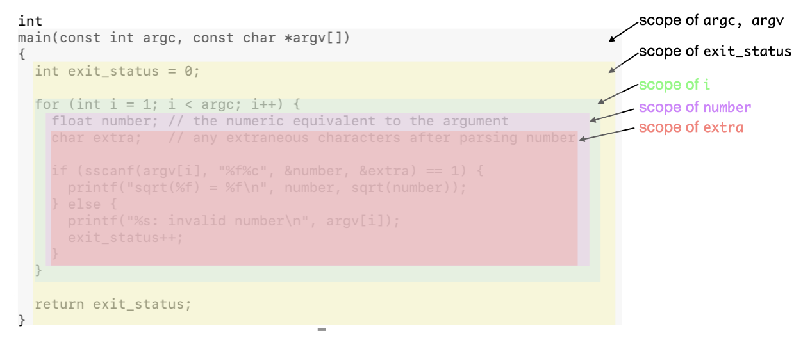

As we saw in the [unit about naming in C](https://github.com/CS50Dartmouth21FS1/home/blob/fall21s1/knowledge/units/c-names.md), in C you can name constants, variables, functions, and even types.
Each name has a *scope*, that is, the section of the source file where the variable is 'visible', that is, valid for use in the code.

C has true main types of scope, *global* and *local*, though in principle every block and sub-block (as defined by `{}` braces) can define a new subsidiary scope.

Once a name is defined, it is valid from that point in the source file down to the end of its scope.

*Global* names are typically defined near the top of the source file and are thus valid through the rest of the source file, within every function and the blocks within them.

*Local* names occur within a function; these include the function parameters, and other names defined within the function body.
As a matter of style and convention, local names are declared at the top of a function body, although there are instances where it is more readable to declare them further below.

Other, narrower scopes can occur inside a statement block within a function body; the most common example are loop variables – names valid only within the loop body.

Let's look at an example of each of these three types: global, local, and loop scopes.
But first, a quick note about initialization.

## Initialization of variables

Constant variables can be assigned only once: either initialized when they are defined, or assigned once thereafter.

**In CS50 we advocate for initializing every variable** right there in the definition, even if only to some default value.
Here's why.

*Global* variables are initialized to zero, by the compiler and linker.

*Local* variables (whether at the function or block level) *are not initialized*; thus, their initial value is undefined, aka, garbage.
It is dangerous to use the value of an uninitialized variable, especially a pointer, because it leads to undetermined results - or crashes your program.


## Global names

Global names (variables, functions, types, etc.) are visible from the point where they are declared until the end of that file.
Thus, they are typically declared near the top of the file.

This rule (from the declaration to the end of the file) is the main reason why we tend to declare all a file's functions near the top of the file: so they can be called from any point within the file.
For example, look at [guess6.c](https://github.com/CS50Dartmouth21FS1/examples/blob/fall21s1/guess6.c), which declares three functions near the top:

```c
/* function prototype *declaration*; the function is *defined* below */
int askGuess(const int low, const int high);
int pickAnswer(const int high);
bool str2int(const char string[], int* number);
```

and then uses them in the `main()` function.
(As a matter of style, we prefer to define the `main()` function first in the file.)

In CS50 we **never use global variables**.
They are risky, and thus bad style.
Thus, in CS50, global names are primarily functions, constants, and types.

### static vs extern

If a global name is declared or defined with a `static` modifier, it means that the variable is only available from within that file.

If a global name is declared with an `extern` modifier, it means it is not necessarily defined (implemented) within this file; the linker will need to later find its definition in another file, and *link* its use in this file with the implementation in that other file.
The variable may be *declared* as `extern` in all files, but must be *defined* (and not as a `static`!) in exactly one file.

Look again at [guess6.c](https://github.com/CS50Dartmouth21FS1/examples/blob/fall21s1/guess6.c); because it includes [readline.h](https://github.com/CS50Dartmouth21FS1/examples/blob/fall21s1/readline.h) near the top, the code from that file is incorporated into `guess6` right at that point, including the line

```c
extern bool readLine(char* buf, const int len);
```

Later, in a separate run of the compiler, [readline.c](https://github.com/CS50Dartmouth21FS1/examples/blob/fall21s1/readline.c) *also* includes [readline.h](https://github.com/CS50Dartmouth21FS1/examples/blob/fall21s1/readline.h) near the top of its file, declaring function `readLine()`.
In this case, the compiler also finds the *definition* of function `readLine()`.
That's fine; the function is declared in several files, but defined in only one.

> If neither `static` or `extern` modifier is applied, that name may be accessed from another source file... though in that file, it would need to be labeled with the `extern` modifier.
> Look again at [guess6.c](https://github.com/CS50Dartmouth21FS1/examples/blob/fall21s1/guess6.c); the three functions it declares and defines are not marked `static` or `extern`; they would thus be potentially visible to other code modules linked with this program.
> In such a small program, this issue is not important, but in a larger, more sophisticated program, we should mark those functions `static`.


## Local names

Local names (typically local variables and constants) are accessible from the point of their definition until the end of the block in which they are defined.

When the function returns, the variable's memory is automatically deallocated and, if the function is called again, is reallocated... but with undetermined content.
As above, we recommend initializing *all* local variables.

A local name may *shadow* that of a global variable, making that global variable inaccessible.
Blocks do not have names, and so shadowed variables cannot be named.
For example,

```c
int x, y, z;  // global variables

int foo(int x, int y) // shadows the globals named 'x' and 'y'
{
	int z = 99; // shadows the global named 'z'
	int sum = x + y + z;  // uses the local variables only
}

```


## Loop variables and statement blocks

Variables may also be declared at the beginning of a statement block, but may not be declared anywhere other than the top of the block.
Such variables are visible until the end of that block.

The most common use of this capability is for *loop variables*, specifically, for loops.
For example, we diagram the core of [sqrt.c](https://github.com/CS50Dartmouth21FS1/examples/blob/fall21s1/sqrt.c) below.



The function `main()` has three local names: two parameters (`argc`, `argv`, both defined with the `const` modifier and thus they act as local constants) and one local variable (`exit_status`).

Its `for` loop is a nice example of the use of a loop variable `i` to index the iterations over an array, and two statement-block variables to hold information only needed within that statement block (the body of the `for` loop).
