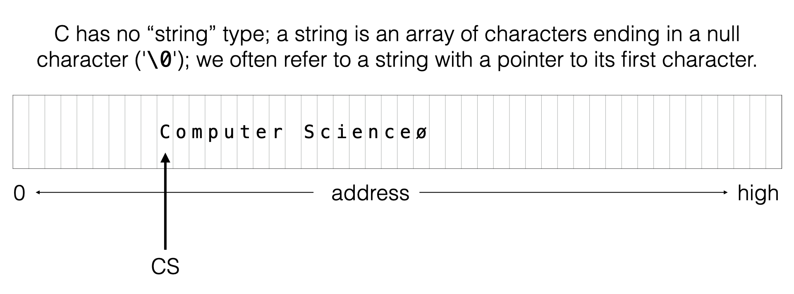

C does not have a "string" type, so C programs represent strings as an array of characters.
For example, consider the following:

```c
char* CS = "Computer Science";
```

This code declares a variable named `CS`, whose type is `char*`, that is, a *pointer to a character*.
We'll dig into 'pointers' more deeply, but for now think of it as pointing at a single byte in memory, which holds the first character of the string; the other characters of the string appear in the following bytes of memory.



After the last character of the string there is a byte with value zero; C represents that as `'\0'`.

When you provide a *string constant* like `"Computer Science"`, C will add that null character for you.
All other string operations in C are done by library functions, such as `printf()` or `strcmp()`.
All those functions expect a string parameter to be a pointer to the first character (`char*`) and then expect to read through memory until they hit a null character, indicating end of string.

## String variables

There are two ways to declare a *string variable*.

**First**, you can declare a new *string* (an array of characters):


```c
char dept[30];     // an array of characters, with uninitialized content
dept[0] = '\0';    // initialize it to the empty string
```

The first line defines a new variable `dept` and allocates room for a string of up to 29 characters (not 30!) because we need to allow one spot for the terminating null character;
the second line sets the first character to null, effectively initializing the string to be the empty string.

Alternatively, we could skip the initialization and immediately fill the new string with a copy of an existing string:

```c
strcpy(dept, "Computer Science");
```

Here we actually copy the string pointed at by `CS` into the space allocated for `dept`.
Because the C language does not provide any way to manipulate strings, we depend on a library function called `strcpy()`.

> Note the `strcpy()` parameters are like `strcpy(to, from)`, not `strcpy(from, to)`.

**Second**, you can just declare a *string pointer*, if you want a variable that will point to an existing string, e.g.,

```c
char* CS = "Computer Science";  // initialized to point at a constant string
char* department = NULL;  // initialized to "null pointer"
department = CS;          // now pointing to the same string.
```

When defining a new string pointer variable, it is always good practice to immediately initialize it; in this case, to the *null pointer*, that is, pointing at location zero in memory, which by convention is used to represent an unassigned pointer.

After the third line, both `CS` and `department` point at the same string -- it copies the pointer, not the string itself.

You may sometimes see the `[]` syntax, which implies an array of unspecified size:

```c
char   firstName[];  // this syntax...
char  *firstName;    // is equivalent to this syntax, and
char * firstName;    // is equivalent to this syntax, and
char*  firstName;    // is equivalent to this syntax.
```

The first form is most often seen as a function parameter, and is equivalent to the other forms: in all cases, `firstName` is a pointer to a character, but the first form makes it more clear to a reader that it is pointing to an *array* of characters (likely to a string) -- not to just one character.
We generally use the fourth syntax in CS50.

A final note: although `NULL` and `'\0'` are really both just names for the number zero, `NULL` is a pointer (*null pointer*) and `'\0'` is a character (*null character*).

## String library

The C library contains many useful string functions; see `man string`.
To use them, include the following at the top of your C code,

```c
#include <strings.h>
```

