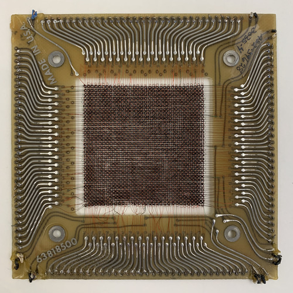
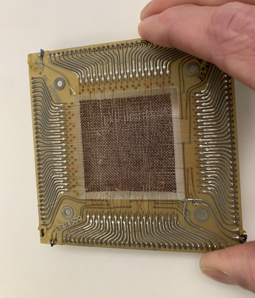

Bob: "Argh! not again!"

Alice (alarmed): "What's wrong, Bob?"

Bob (sighs): "My code dumped core, *again.*"

Alice (smiles): "No problem, Bob, it happens. Let me help...."

If you have not yet experienced the dreaded *Segmentation fault (core dumped)* output when you run a program, you surely will.

But why do programmers say "core dumped", anyway?
and what the heck is "core"?

A *core dump* is a file that contains a copy of the memory from a running process, typically created when the process aborts due to an unrecoverable error; in CS50, that most commonly occurs when the program tries to use a `NULL` pointer or other invalid pointer value.

The reason we still refer to a computer's memory as *core* dates back to the 1960s, when computer memory was literally made out of tiny magnetic donuts, each able to represent one bit (0 or 1), according to the direction of the magnetic field (clockwise or counter-clockwise) on that donut.

A couple decades ago Professor Kotz was lucky enough to purchase an artifact from that era, a memory card made out of core.
It contains a whopping 64x64 bits, i.e., 4096 bits or 512 bytes.
Each tiny magnetic donut sits at the intersection of very thin wires, horizontal, vertical, and diagonal, that allow the circuit to set, clear, and refresh the bits.
Here are three photos of that card; click each for a full-res version if you want to zoom in closer.
To read more about core memory – its history, working, and manufacture – see [Wikipedia](https://en.wikipedia.org/wiki/Magnetic-core_memory).

