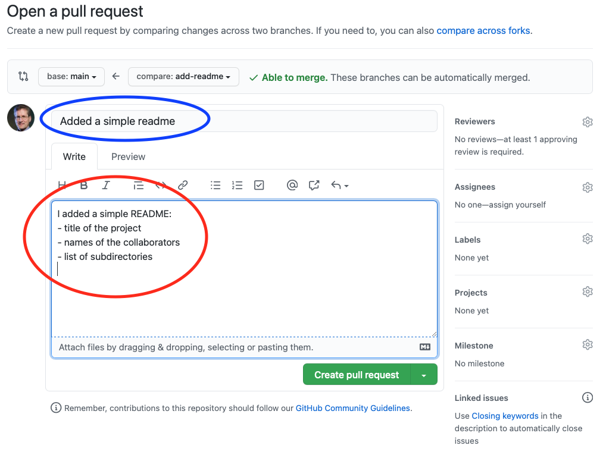
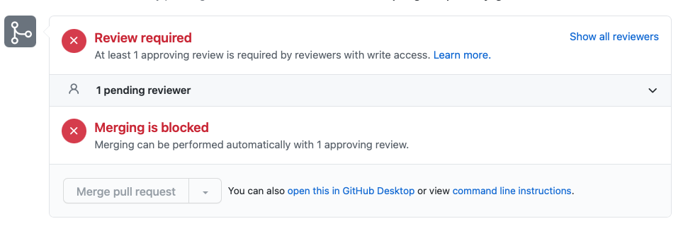
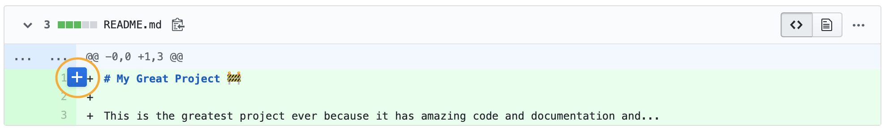
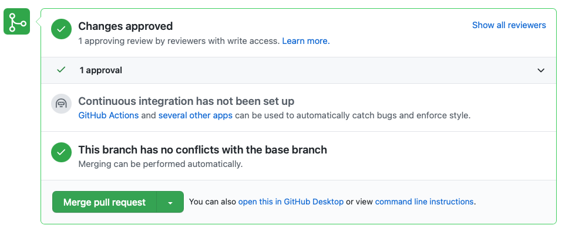
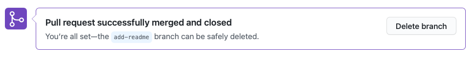

Recall the [unit about merge conflicts](https://github.com/CS50Dartmouth21FS1/home/blob/fall21s1/knowledge/units/git-conflict.md).

Wouldn't it be nice if there were a way of interacting with Git to minimize such conflicts? to interact with Git such that pulled code is always working but intermediate progress is still tracked?

One popular solution is *Git Flow* (git-flow), a technique of interacting with Git that makes developing projects within a team work smoothly and effectively.
This approach is now common in many development contexts.
The core concept of git-flow is the following:
*intermediate work is done on a side branch; it is only merged into `main` when perfected*.

Originally proposed by Vincent Driessen in a post on [nvie.com](https://nvie.com/posts/a-successful-git-branching-model), git-flow operates on the principle that the `main` branch should only contain release-ready code.
Because Vincent Driessen's proposed system is meant for much bigger projects than those in CS50, we use a simplified version of git-flow.

The basic structure of git-flow follows these steps:

1. Branch
2. Develop
3. Test
4. Push
3. Pull Request (aka "merge request" on some platforms)
4. Merge

## Branch

You're about to start working on a feature.
Before you get started, though, do one small thing: **branch**.
Because git-flow requires that we do in-progress work on dedicated feature branches, we must create a branch to track progress on that feature, even if it's not done yet!

```bash
# Switch to the main branch so your branch is based on the most recent work
git switch main
# Create the new branch named after the feature
git branch featureName
# Switch to the feature branch
git switch featureName
```

## Develop

Edit the code to add the desired feature.
In fact, make ***only*** the changes necessary for this feature.
Your branch's commits should include only that feature.
It helps to keep each branch focused on *one* feature... leading to quicker reviews, clearer merges, and an understandable git history.

> **Are you halfway done with one feature and want to start another one?** Not a problem. Commit whatever changes you have locally to your feature branch, then start from step 1 on the next feature (branch from `main`, develop, etc.)

As you code away, commit every time you finish something, pause to work on something else, and even taking a break to get lunch:

```bash
git commit -m "Made progress:
- Worked on this
- Coded that
- Optimized such and such"

git push origin featureName
```

For the example shown below, we envision a trivial task: adding a README to the repo.
First, create a branch and switch to it:

```
$ git branch add-readme
$ git switch add-readme
Switched to branch 'add-readme'
```

Power tip: you can create and switch to a new branch in one command:

```
$ git checkout -b add-readme
Switched to a new branch 'add-readme'
```

## Test

Ensure you run all the unit tests and regression tests, and add all the necessary documentation.
Then, merge any recent changes to the `main` branch, into this feature branch:

```
$ git fetch origin main
$ git merge main
```

If you get any conflicts, *now* is the place and time to fix them.
And, if you've pulled in any updated code, run all your regression tests *again*, to be sure your feature integrates properly with the new code from `main`.

Finally, if you had to make any changes - to fix conflicts or any integration bugs - commit them to this branch... and repeat this step.

## Push

Finally, when it seems your feature is complete, and fully tested with the latest code from `main`, push it to GitHub:

```
$ git push origin add-readme
Enumerating objects: 7, done.
Counting objects: 100% (7/7), done.
Delta compression using up to 16 threads
Compressing objects: 100% (5/5), done.
Writing objects: 100% (5/5), 738 bytes | 738.00 KiB/s, done.
Total 5 (delta 0), reused 0 (delta 0), pack-reused 0
remote: 
remote: Create a pull request for 'add-readme' on GitHub by visiting:
remote:      https://github.com/cs50spring2021/activity-git-flow/pull/new/add-readme
remote: 
To github.com:cs50spring2021/activity-git-flow.git
 * [new branch]      add-readme -> add-readme
```

Becuase this example shows the first push of this branch `add-readme` to GitHub, you'll see a confirmation that GitHub recognizes it as a `[new branch]` on the last line.

> As an aside: there is some value in pushing your feature branch to GitHub occasionally, rather than waiting until it is complete and ready for merging back into `main`: (1) GitHub serves as a backup for your laptop, and (2) your teammates can see your progress and, in event of a disaster or reshuffling of tasks, take over from you.

## Pull Request

Finally, your code is finished!
It is ready to be included in the whole project.
Time to open a *Pull Request (PR)!*

The first time you push your feature branch to GitHub, it offers you a handy link to open a pull request; see the example above.

If, however, you've been pushing your feature branch to GitHub for a while, you'll need to find that branch on GitHub; click the *branches* button on the repo's home page:


Then click the *Open* button:


Add a short and long description of this Pull Request, and then press the *Create Pull Request* button:


The *short description* (circled in blue above) is a short (one line) description of the feature being merged.

The *long description* (circled in red above) is a full description of the feature and all work included in this pull request. 

Another example of a long description:
		
```markdown
// Feature description
Adding a README that describes our project. Now when people arrive at our project they will know what it's about, how to compile and run it, and other important information.
	
// Other minor tasks accomplished
- Listed collaborators
- Added getting started instructions
- Linked to designs and other useful resources
	
// GitHub Issues that should be closed as a result of this PR
Fixes #13 // GitHub recognizes this syntax and closes issues automatically when PR is merged!
Fixes #5
	
## Testing:
// Brief description of what tests were run and the result
n/A
```

Now click on some of the 'gear' icons at right:

* **Reviewers:** 
  List at least one teammate who needs to review this code.
  (For CS50, assign it to everyone on your team.)
* **Assignees:** 
  List those who responsible for correcting the code when suggestions are made (should probably include you).
* **Labels:**
  (optional) Add labels that pertain to this code Pull Request.
* **Projects:**
  (optional) Add the pull request to a project.
  Useful for **Scrum**!
* **Milestone:**
  (optional) Assign to a milestone.
  Useful for **Scrum**!

At this point, you cannot (and should not) conclude the process -- which would merge this feature branch into the `main` branch.
That's because someone else on your team should review it first.

If the `main` branch is *protected* (as it should be; see this [unit](https://github.com/CS50Dartmouth21FS1/home/blob/fall21s1/knowledge/units/protect-main.md)),
you'll see something like this:



### Review

The review process is a really important part of any big coding project.
As the developer, you have the chance to ask questions of your teammates about your implementation or style.
And as one of those teammates, you are expected to give *good feedback*.

**What is good feedback?**

 - Ask clarifying questions
 - Suggest improvements to code style
 - Comment on implementation choices (perhaps offer alterations)
 - Enforce your team's chosen standards
 - **Most importantly:** Catch mistakes

### Add a comment

To view changes to the files and add comments, select the *Files changed* tab in the Pull Request.
Add a comment by hovering over a line and clicking the "+" button.


### Finish your review

Once you have added all your comments, click the *Finish your review* button.
Put in a comment that summarizes your review (e.g., `Looks good! I suggested one or two changes`).
If you are satisfied with these changes being merged in, select *Approve*.
Otherwise select *Request Changes*.


## Merge

Guess what?!
Your Pull Request has finally been approved, so it's time to merge it into `main`; either the submitter or Reviewer can now just click the *Merge pull request* button.



GitHub will ask you to confirm and give another chance for a comment:


GitHub automatically conducts the merge and creates a merge commit.

Then, if you no longer need the feature branch, it's a single click to delete that branch:




## Finally

All developers should `git pull origin main` to ensure their (local) `main` is up to date with the new (remote) `main`.
