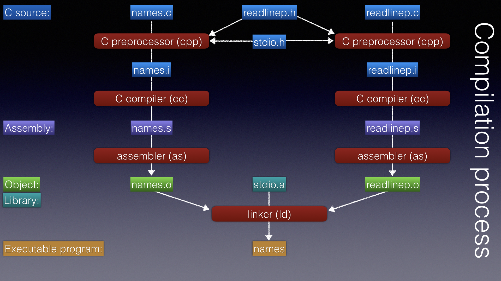

Recall the [process of compiling a C program](https://github.com/cs50dartmouth21FS1/home/blob/main/knowledge/units/c-compile.md):



Let's take a closer look at the contents and purpose of `readlinep.h`.
That file was first used in the example [sorter2.c](https://github.com/cs50dartmouth21FS1/examples/blob/main/sorter2.c), and in all subsequent examples of that series.

These examples actually depend on *two* files:

* [readlinep.c](https://github.com/cs50dartmouth21FS1/examples/blob/main/readlinep.c): a C 'source' file that *defines* the function `readLinep`.
* [readlinep.h](https://github.com/cs50dartmouth21FS1/examples/blob/main/readlinep.h): a C 'header' file that *declares* the function `readLinep`, used by any source file that wants to invoke the function.

**In CS50, *every* source file that does not include `main()` will need a corresponding header file, a header file that must be included both by that source file and by any other source file needing to interface with that source file.**

The C language does not, itself, have an 'import' or 'include' mechanism; instead, the *C preprocessor* supports an `#include` directive to wholly include one file within another.
Although the C preprocessor has many powerful capabilities, we will use it only for very specific purposes.
Most of the other uses for preprocessor directives are either beyond the scope of this course, or unnecessary (and bad style) in modern C.

## Header file inclusion - how?

The `#include` directive, often pronounced "pound include", should appear at the beginning of a C program.
It is used to literally copy the entire contents of another file at the point of the `#include` directive.
A common `#include` directive, seen at the beginning of most C files, is

```c
#include <stdio.h>
```

This directive indicates that the contents of the file named `stdio.h` should be included at this point (the directive is replaced with the contents).
There is no limit to the number of lines that may be included with this directive and, in fact, the contents of the included file may contain other `#include` directives which are handled in the same way.
We say that the inclusions are nested and, of course, care should be taken to avoid duplicate or, even worse, recursive nestings!

The example using `<stdio.h>`, above, demonstrates two important points.
The filename itself appears between the characters `< >`.
The use of these characters indicates that the enclosed filename should be found in the standard include directory `/usr/include`.
The required file is then `/usr/include/stdio.h`.

The standard include files are used to consistently provide system-wide data structures or declarations that are required in many different files.
By having the standard include files centrally located and globally available, all C programmers are guaranteed of using the same data structures and declarations that they (all) require.

Alternatively, the `" "` characters may also be used, as in the following example:

```c
#include "readline.h"
```

to include the contents of the file `readline.h` at the correct point in the C program.
Because double-quotes are used, the file is sought in the present working directory, that is `./readline.h`.
The filename in double-quotes can actually be a pathname, if your source code is spread over several directories; for example,

```c
#include "includes/readline.h"
```

In both of the above examples the indicated filename had the `.h` extension.
Whereas we have previously said that the extension of `.c` is expected by the C compiler, the use of `.h` is only a convention within UNIX.
The `.h` indicates that the file is a *header file*, because they generally contain information required at the head (beginning) of a C program.
Header files typically (and should) contain only *declarations* of C constructs, like data types, data structures, and constants used throughout the C program.
In CS50, **include files should contain only *declarations*, and no *definitions*, of variables or functions.**

You can also give the compiler a command-line flag to identify a directory where it can search for non-standard include files.
If, for example, you moved your `includes` directory up a level, you might write

```c
#include "readline.h"
```
but then tell the compiler where to look for such files:

```bash
mygcc -I ../includes    -c readline.c
```

## Header file inclusion - why?

Ok, all that's great, but why did we need this header file, `readlinep.h`, in the first place?
Because the compiler processes `sorter.c` and `readlinep.c` separately; `sorter.c` invokes the function, but `readlinep.c` defines the function.
When it compiles `sorter.c` it needs to see the *prototype* (declaration) for the function `readLinep`, just as we would have if `readLinep()` had been defined at the bottom of `sorter.c`.
When compiling `sorter.c` into `sorter.o` the C compiler leaves the `readlinep` symbol unresolved, and hopes the linker will later be able to connect it to the function's actual definition when the linker links `sorter.o` with other object file.

So: we write a prototype (declaration) for `readLinep()` into `readlinep.h`.
That file is #included in at least *two* places:
first, it is included in `readlinep.c`, allowing the compiler to compare the declaration (prototype) with the definition (implementation), and warn us if they somehow differ.
Second, it is included in `sorter.c`, allowing the compiler to compare the declaration (prototype) with the invocation (function call), and warn us if they somehow differ.

To repeat,
**in CS50, *every* source file that does not include `main()` will need a corresponding header file, a header file that must be included both by that source file and by any other source file needing to interface with that source file.**

## Header file protection

Recall the [unit](https://github.com/cs50dartmouth21FS1/home/blob/main/knowledge/units/c-conditional-compilation.md) about conditional compilation with `#ifdef...#endif`.
As a matter of style, and sometimes necessity, we use these same directives in *every* header file.
Take another look at [readline.h](https://github.com/cs50dartmouth21FS1/examples/blob/main/readline.h); all of its content is wrapped in an `#ifdef`:

```c
#ifndef __READLINEP_H__
#define __READLINEP_H__
...
#endif //  __READLINEP_H__
```


If the constant `__READLINE_H__` is not yet defined (`#ifndef`) then incude the remainder of the file up to `#endif`.
The first thing it does is to define that `__READLINE_H__`.
Thus, if a C file happens to include `readline.h` twice, which can happen in complex programs when header files include other include files, the C compiler won't see multiple copies of the included code.
That is,

```c
#include "readline.h"
#include "readline.h"
```

does not translate to

```c
extern bool readLine(char *buf, const int len);
extern bool readLine(char *buf, const int len);
```

but just to

```c
extern bool readLine(char *buf, const int len);
```

The standard file `stdbool` protects itself this way, which is good, because a programmer may well write into her `.c` file something like

```c
#include <stdio.h>
#include <stdbool.h>
#include <readline.h>
```

and, because `readline.h` also includes `stdbool.h`, the latter might get imported several times without that protection.

> Why do we care?
> Some include files can safely be repeated and the C compiler won't care; actually, `readline.h` is one like that.
> But others, e.g., if they declare global constants, will cause the compiler to complain about multiply-defined variables.


### Testing header files

How can you be sure your header file has included all the relevant header files?
Compile it!
To compile the header file `foo.h` by itself,

```bash
mygcc -c foo.h
```

If there are any errors, it's probaby because you forgot one of the include files.

When done, `rm foo.gch` to clean up the compiler's output.
