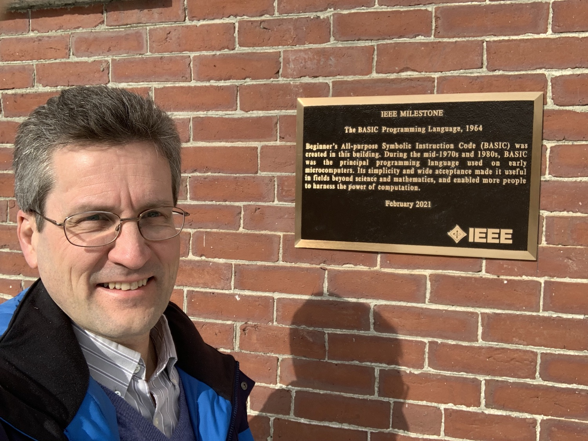

Another important computer language, [BASIC](https://en.wikipedia.org/wiki/BASIC), was developed here at Dartmouth in 1964 - and implemented by undergraduate students.

Dartmouth College created two videos on BASIC's 50th anniversary in 2014: 
[Birth of BASIC](https://www.youtube.com/watch?v=WYPNjSoDrqw), 
[BASIC at 50](https://www.youtube.com/watch?v=gxo9LVIgOiI&t=3s).

In 2021, the [IEEE recognized BASIC as a milestone in technology](https://news.dartmouth.edu/news/2021/02/new-ieee-plaque-collis-center-marks-birth-basic), with the placement of this plaque.

You can find this plaque on the sunny side of Collis.
