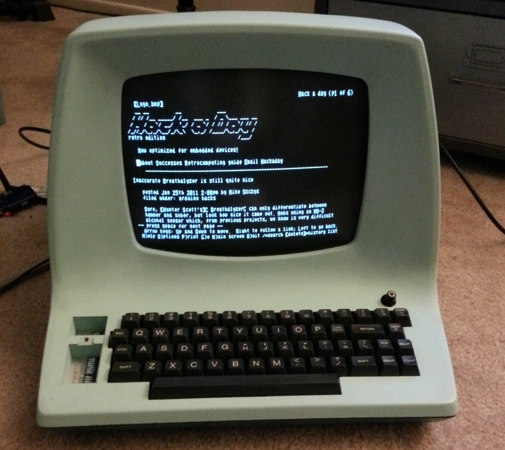

In this unit we introduce the *ncurses* library, enabling simple programs to make simple interactive ASCII graphics.

:arrow_forward:
[Video](https://dartmouth.hosted.panopto.com/Panopto/Pages/Viewer.aspx?id=49c4a191-bb42-4e42-a310-ad22015d23d9) explaining the purpose and use of the *ncurses* library, with examples.

## ASCII graphics

Long before there were graphical displays, there were *terminals.*
These text terminals typically presented 24 rows of 80 columns, and could display only text (from the [ASCII](https://www.rapidtables.com/code/text/ascii-table.html) character set) in a single color (typically blue, green, or yellow) on a black background. 

*Image from [hackaday.com](https://hackaday.com/2014/02/08/raspi-powered-adm-3a-dumb-terminal/)*

As you can see, people used simple characters to "draw" images on the screen; in this case, a simulation of large italics letters.

Some such terminals interpreted special control-character sequences to allow software to move the cursor, put some characters in reverse (black on blue instead of blue on black), and so forth.
But every terminal was different!
It was very difficult to write portable software.

The *ncurses* library was designed to make it easier for software developers to write programs that could control such terminals, abstracting away all the hardware-specific details, and supporting new capabilities like color.

## Example: curses

Our examples repo includes a minimal example, [curses.c](https://github.com/CS50Dartmouth21FS1/examples/blob/fall21s1/curse.c).
I encourage you to compile and play with it!
Once open, you can type characters onto the screen, and move around with emacs-like control characters.
Some things to notice:

* ncurses provides a lot of functions to initialize, query, and update the screen; use `man` to read about any of those functions.
* you always start a program with `initscr` and end a program with `endwin`.
* ncurses tracks the position of the *cursor*, which is where characters will next be written to the screen; you can move the cursor with `move()`.
* you can print a character with `addch`, you can printf with `printw`.
* nothing happens on the physical screen until you call `refresh`, so it is common to make a lot of changes and then call `refresh` to make it all appear at once.
* you can read one character from the input with `getch`; it blocks until a character is available, but returns immediately as soon as the user hits a key (because `cbreak` put us in that mode).
* the C 'switch' statement is a great way to handle keystroke input (recall this [unit](https://github.com/CS50Dartmouth21FS1/home/blob/fall21s1/knowledge/units/c-flow.md#switch)).
* after `endwin` the curses display disappears, but the normal stdin/stdout behavior resumes; in this case, the program prints "Goodbye" before exiting.

## Example: Conway's Game of Life

Our examples repo includes an even cooler example, [Conway's Game of Life](https://github.com/CS50Dartmouth21FS1/examples/blob/fall21s1/life.c).
Compile and run it!
In that code there is a comment `// CURSES` to help you find the curses-specific code.
Some things to notice:

* This program is bigger than the previous example, so the initialization code is pushed out of `main()` to a helper function.
* It uses `getmaxyx` to discover the size of the window.  This code checks window size only at initialization, and would break if the user changes window size later.
* It uses `getch` to pause at each generation, forcing user to press any key to continue.
* It loops over an array to add one character at a time to the screen, before calling `refresh` to make them all appear.
* It uses `mvprintw` to combine `move` and `printw` in one convenient call. 

## Minimal working knowledge

I have found the following set of functions sufficient for CS50; read the man page for each function.

 * `initscr`
 * `cbreak`
 * `noecho`
 * `start_color`
 * `init_pair`
 * `attron`
 * `getmaxyx`
 * `getch`
 * `addch`
 * `move`
 * `mvprintw`
 * `clrtoeol`
 * `refresh`
 * `endwin`

## Documentation

* man page: `man ncurses`
* online [documentation](https://www.mkssoftware.com/docs/man3/ncurses.3.asp)
* about the [ncurses library](https://en.wikipedia.org/wiki/Ncurses)
