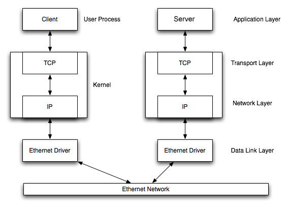

How do we build Internet applications?
In this unit, we discuss the socket API and support for network communications between Internet hosts.
Socket programming is the key API for programming distributed applications on the Internet.
This unit aims

* to overview the client-server model
* to provide a high-level understanding of TCP/IP
* to introduce the Berkeley Sockets API for networking

If you are interested in getting deeper into networking, take *CS60: Computer Networks*.

## The client-server model

The client-server model is one of the most commonly used communication paradigms in networked systems.
A *server* is a long-running program that stands idle until some clients connect to the server and request service.
Thus, it is the *client* who initiates communication with the *server*.
Clients normally communicate with one server at a time, but most servers can communicate with multiple clients simultaneously.
Clients need some advance knowledge of the server and its address, but the server does not need to know the address of (or even the existence of) the client prior to the connection being established.

Client and servers communicate by means of multiple layers of network protocols.
In this class we focus on the TCP/IP protocol suite.

When the client and server are both connected to the same Local Area Network (LAN) it looks like the following:



------------------------------------------------------------------------

Although the diagram shows an Ethernet, the case of Wi-Fi is exactly analogous.

The client and the server may be in different LANs, with both LANs connected to a Wide Area Network (WAN) by means of routers.
The largest WAN is the Internet, but companies may have their own WANs.
This scenario is depicted below:


------------------------------------------------------------------------

The flow of information between the client and the server goes down the protocol stack on one side, then across the network and then up the protocol stack on the other side.

### <a id="tcp">Transmission Control Protocol (TCP)</a>

TCP provides a connection-oriented service, since it is based on *connections* between clients and servers.

When the client contacts the server over TCP, it asks to 'connect' and the server must then 'accept' the connection.
Once open, the connection between a 'socket' on the client and a 'socket' on the server acts as if there is a 'stream' of bytes flowing from client to server, and a 'stream' of bytes flowing from server to client.
These 'streams' look and act almost exactly like the `stdin` and `stdout` streams you're accustomed to - the client writes to its socket and the bytes stream over the connection to the server, who then reads bytes from its socket...
and vice versa.

TCP provides reliability.
When a TCP client sends data to the server, it requires an acknowledgement in return.
If an acknowledgement is not received, TCP automatically retransmits the data and waits for a longer period of time.
These acknowledgements are all handled by the TCP layer of the protocol stack and are invisible to applications.

### <a id="addresses">Socket addresses</a>

The TCP protocol depends on the underlying IP protocol.
TCP bundles bytes from the outbound stream into "packets" and asks the IP layer to 'route' those packets across the LAN or WAN to the destination, where the receiving TCP layer drops those bytes ito the inbound stream.
In this class we use IP version 4 (IPv4) -- the traditional, and still most common, version of IP.

How does the sender identify the destination of the packets?
with an IP address.
In the Unix socket API (aka *[Berkeley sockets](https://en.wikipedia.org/wiki/Berkeley_sockets)*) the IPv4 socket address structure is named `sockaddr_in` and is defined by including the `netinet/in.h` header file.
(I have found it sufficient to include `netdb.h` for the client, or `arpa/inet.h` for the server, because there are many socket-related include files and they all appear to include each other.)

The standard definition is the following:

```c
struct in_addr {
  in_addr_t s_addr;  /* 32-bit IPv4 network byte ordered address */
};

struct sockaddr_in {
  uint8_t        sin_len;     /* length of structure (16) */
  sa_family_t    sin_family;  /* AF_INET */
  in_port_t      sin_port;    /* 16 bit TCP or UDP port number */
  struct in_addr sin_addr;    /* 32 bit IPv4 address */
  char           sin_zero[8]; /* not used, but always set to zero */
};
```

The `uint8_t` data type is an unsigned 8-bit integer.

### <a id="byte-order">Host Byte Order to Network Byte Order conversion </a>

There are two ways to store two- or four-byte integers in memory:

- *big endian*, with the *most-significant* byte first and bytes of *decreasing* significance as memory address increases.
See [diagram](https://en.wikipedia.org/wiki/Endianness#Big-endian).

- *little endian*, with the *least-significant* byte first and bytes of *increasing* significance as memory address increases.
See [diagram](https://en.wikipedia.org/wiki/Endianness#Example).

See Wikipedia about *[Endianness](https://en.wikipedia.org/wiki/Endianness#Example)*.

We refer to these orders as the *host byte order*.
For example, an Intel processor stores a 32-bit integer as four consecutive bytes in memory in the order 1-2-3-4, where 4 is the most significant byte, which is little endian.
IBM PowerPC processors would store the integer in the byte order 4-3-2-1, which is big endian.

Standard Internet protocols such as IP and TCP use big-endian byte ordering.

The following functions are provided on all Unix platforms to aid you converting between *host* byte order (whatever it may be) and *network* byte order: on a big-endian host, these functions do nothing; on a little-endian machine, they swap the order of bytes.
Code using these functions can thus be compiled on either a big-endian or little-endian machine and work correctly.

```c
#include <netinet/in.h>

uint16_t htons(uint16_t host16bitvalue); // host to network short

uint32_t htonl(uint32_t host32bitvalue); // host to network long

uint16_t ntohs(uint16_t net16bitvalue); // network to host short

uint32_t ntohl(uint32_t net32bitvalue); // network to host long
```

In network parlance, *short* means 16 bits and *long* means 32 bits.
The first two functions return the value in *network byte order* (16 and 32 bit, respectively).
The latter two functions return the value in *host byte order* (16 and 32 bit, respectively).

The type `uint32_t` refers to an unsigned 32-bit integer.
The type `uint16_t` refers to an unsigned 16-bit integer.
The type `uint8_t` refers to an unsigned 8-bit integer.


## <a id="api">TCP socket API</a>

For more information about the socket API, read *[Berkeley sockets](https://en.wikipedia.org/wiki/Berkeley_sockets)* (on Wikipedia) and the `man` pages for the functions you see used in below.

The sequence of function calls for the client and a server participating in a TCP connection is presented below:


------------------------------------------------------------------------


As shown in the figure, the steps for establishing a TCP socket on the client side are the following:

-   Create a socket using the `socket()` function;
-   Connect the socket to the address of the server using the `connect()` function;
-   Send and receive data by means of the `write()` and `read()` functions.

The steps involved in establishing a TCP socket on the server side are as follows:

-   Create a socket with the `socket()` function;
-   Bind the socket to an address using the `bind()` function;
-   Listen for connections with the `listen()` function;
-   Accept a connection with the `accept()` function system call.
This call typically blocks until a client connects with the server.
-   Send and receive data by means of `write()` and `read()`.

The actual determination of which side reads first, and which side writes first, depends on the particular protocol running atop TCP.


### <a id="socket">The `socket()` function</a>

The first step is to call the `socket()` function, specifying the type of communication protocol (TCP based on IPv4, TCP based on IPv6, UDP).

The function is defined as follows:

```c
#include <sys/socket.h>

int socket (int family, int type, int protocol);
```

where `family` specifies the protocol family (`AF_INET` for the IPv4 protocols), `type` is a constant described the type of socket (`SOCK_STREAM` for stream (TCP) sockets and `SOCK_DGRAM` for datagram (UDP) sockets), and `protocol` is a parameter that can be set to zero for this course.

The function returns a non-negative integer (or `-1` on error).
This number is a 'file descriptor'.

> ***File descriptors:*** File descriptors are small non-negative integers that the kernel uses to identify the files being accessed by a particular process.
> Whenever it opens an existing file or creates a new file, the kernel returns a file descriptor that is used to read or write the file.
> *They are not the same thing as stdio 'file pointers'.*
>  The stdio package 'wraps' file descriptors in its `FILE*` type to provide a more convenient API.
> By convention, file descriptor 0 is the 'standard input' (known in stdio as `stdin`),
> file descriptor 1 is the 'standard output' (wrapped by stdio as `stdout`), and
> file descriptor 2 is the 'standard error' (wrapped by stdio as `stderr`),


### <a id="bind">The `bind()` function</a>

The `bind()` assigns a local protocol address to a socket.
With the Internet protocols, the address is the combination of an IPv4 address and a 16-bit TCP port number.

The function is defined as follows:

```c
#include <sys/socket.h>

int bind(int sockfd, const struct sockaddr *servaddr, socklen_t addrlen);
```

where `sockfd` is the socket descriptor, `servaddr` points to a socket address structure and `addrlen` is its length..

`bind()` returns `0` if it succeeds, `-1` on error.

This use of the generic socket address `sockaddr` requires that any calls to these functions must cast the pointer to the protocol-specific address structure.
For example for an IPv4 socket structure that we use in this class:

```c
struct sockaddr_in serv; /* IPv4 socket address structure */

bind(sockfd, (struct sockaddr*) &serv, sizeof(serv))
```

A process can bind a specific IP address/port to its socket.
Normally, a TCP client does not bind an IP address to its socket; the kernel chooses the source IP, based on the outgoing interface that is used, and assigns an unused port number.
For a TCP server, `bind` is required and restricts the socket to receive incoming client connections destined to that IP address and port; that said, the server can pass a wildcard address to `bind` and allow the system to choose an address and unused port number.

### <a id="listen">The `listen()` function</a>

The `listen()` function converts an unconnected socket into a passive socket, indicating that the kernel should accept incoming connection requests directed to this socket.
It is defined as follows:

```c
#include <sys/socket.h>

int listen(int sockfd, int backlog);
```

where `sockfd` is the socket descriptor and `backlog` is the maximum number of connections the kernel should queue for this socket.
The `backlog` argument provides a hint to the system of the number of outstanding connect requests that it should enqueue in behalf of the process.
Once the queue is full, the system will reject additional connection requests.
The `backlog` value must be chosen based on the expected load of the server.

The function `listen()` returns `0` if it succeeds, `-1` on error.

### <a id="connect">The `connect()` function</a>

The `connect()` function is used by a TCP client to establish a connection with a TCP server.

The function is defined as follows:

```c
#include <sys/socket.h>

int connect (int sockfd, const struct sockaddr *servaddr, socklen_t addrlen);
```

where `sockfd` is the socket descriptor returned by the call to `socket()` and `servaddr` points to a socket address structure and `addrlen` is its length.

The function returns `0` if it succeeds in establishing a TCP connection, and `-1` otherwise.

The client does not have to call `bind()` before calling this function: the client's UNIX kernel will choose both an ephemeral port and the source IP if necessary.

### <a id="accept">The `accept()` function</a>

The `accept()` function is used to retrieve a connect request, create a new socket just like the original one, and allocate a new file descriptor for that socket.
It is defined as follows:

```c
#include <sys/socket.h>

int accept(int sockfd, struct sockaddr *cliaddr, socklen_t *addrlen);
```

where `sockfd` is a new file descriptor that is connected to the client that called the `connect()`.
The `cliaddr` and `addrlen` arguments are used to return the protocol address of the client.
The new socket descriptor has the same socket type and address family of the original socket.
The original socket passed to `accept()` is not associated with the connection, but instead remains available to receive additional connect requests.
The kernel creates one connected socket for each client connection that is accepted.

If we don't care about the client's identity, we can set the `cliaddr` and `addrlen` to `NULL`.
Otherwise, before calling the `accept()` function, the `cliaddr` parameter has to be set to a buffer large enough to hold the address and set the integer pointed by `addrlen` to the size of the buffer.


## <a id="tcp-example">TCP client/server example</a>

In this example, [client-server](https://github.com/CS50Dartmouth21FS1/examples/blob/fall21s1/client-server), we see a basic TCP client that can talk to our basic TCP server.

This code demonstrates

* the server's loop over clients, and handling each client in turn
* the server-side flow: `socket`, `bind`, `listen`, `accept`, `read`, `close`
* the client-side flow: `socket`, `connect`, `write`, `close`
* the use of `getsockname()` to retrieve the port number bound to a socket
* the use of `gethostbyname()` to find the IP address for a hostname
* the use of 	`bzero()` to zero all bytes in a buffer
* the use of 	`bcopy()` to copy all bytes from one buffer to another
* a `read`/`write` loop, recognizing that `read` does not always fill the buffer

## <a id="http-example">HTTP-over-TCP client/server example</a>

In this example, [client-server-http](https://github.com/CS50Dartmouth21FS1/examples/blob/fall21s1/client-server-http), we enhance the basic example to support HTTP.
The client can connect to our HTTP server, or to real HTTP servers.
The server can serve our basic HTTP client, or real browsers.

This code demonstrates

* the HTTP protocol on both server and client side
* the use of `fdopen()` to convert a 'file descriptor' into a 'file pointer' usable with stdio and our CS50 `file.c` module.

### To learn more

For more details about the handshake protocols see this excellent [TCP state diagram on Wikipedia](https://upload.wikimedia.org/wikipedia/commons/f/f6/Tcp_state_diagram_fixed_new.svg)
