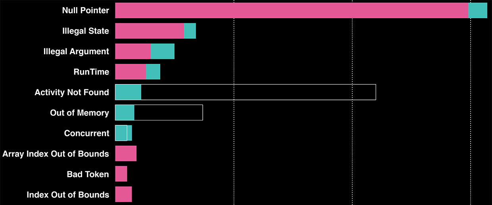

In this unit we emphasize the importance of testing.
We revisit how to turn on/off test code with Makefiles and `#ifdef`, mentioned earlier in a [unit](https://github.com/CS50Dartmouth21FS1/home/blob/main/knowledge/units/c-conditional-compilation.md) about conditional compilation.
In subsequent units we'll look at some specific methods and examples.

## Common errors

"A 2016 survey found that null pointers caused more crashes than any other coding error among the top 1,000 Android apps, and on Facebook’s app."
[*IEEE Spectrum*](https://spectrum.ieee.org/tech-talk/computing/software/meet-the-bots-that-review-and-write-snippets-of-facebooks-code)



> Image: Facebook, copied from [*IEEE Spectrum*](https://spectrum.ieee.org/tech-talk/computing/software/meet-the-bots-that-review-and-write-snippets-of-facebooks-code)


## Debugging vs. testing

> "Testing can demonstrate the presence of bugs but not their absence."
>  -- Edsger Dijkstra

This quote is a good to keep in mind when you are developing code.
What is the difference between debugging and testing?
You *debug* when you know or have identified problems in your code.
*Testing* is the art of systematically trying to break code, which you think (hope?) is bug free.
We test throughout the software life cycle because it is typically much less expensive to fix a bug earlier in the software's life than later.

These CS50 units are strongly influenced by *[The Practice of Programming](http://www.amazon.com/Practice-Programming-Addison-Wesley-Professional-Computing/dp/020161586X/ref=pd_bbs_sr_2?ie=UTF8&s=books&qid=1199226460&sr=1-2),* by Brian Kernighan and Rob Pike  [K&P 1999], an outstanding book that will advance your knowledge on good programming practices.
The notes use a number of programming examples from their Chapter 6 on Testing.


### Motivational example

Sometimes software updates add new bugs that wouldn't be caught without running all the tests again.
Here's an example from February 2014 in Apple MacOS X and iOS where hackers could trick those systems into accepting SSL (TLS) certificates that should be rejected.

```c
    . . .
    hashOut.data = hashes + SSL_MD5_DIGEST_LEN;
    hashOut.length = SSL_SHA1_DIGEST_LEN;
    if ((err = SSLFreeBuffer(&hashCtx)) != 0)
        goto fail;
    if ((err = ReadyHash(&SSLHashSHA1, &hashCtx)) != 0)
        goto fail;
    if ((err = SSLHashSHA1.update(&hashCtx, &clientRandom)) != 0)
        goto fail;
    if ((err = SSLHashSHA1.update(&hashCtx, &serverRandom)) != 0)
        goto fail;
    if ((err = SSLHashSHA1.update(&hashCtx, &signedParams)) != 0)
        goto fail;
        goto fail;  /* MISTAKE! THIS LINE SHOULD NOT BE HERE */
    if ((err = SSLHashSHA1.final(&hashCtx, &hashOut)) != 0)
        goto fail;

    err = sslRawVerify(...);
    . . .
```

Yes, C does have a `goto` statement.
It works as expected, providing an immediate transfer to the specified label.

Here the programmer is verifying the certificate; if any of the checks fail the `err` variable is set non-zero and the code exits to the failure handler.
Unfortunately, the programmer inserted two `goto fail`statements instead of just one.
As a result, even if `err==0` the code transfers to the fail section.
That returned with a return code of `err` which, if `err==0` means success, means the certificate is reported as valid, and ultimately accepted.
This bug could allow website spoofing or the acceptance of a bogus certificate containing a mismatched private key.

This bug was overlooked because the second `goto` is indented - but it is not part of the `if` statement.
Proper use of CS50 style (putting brackets around every code block) would have prevented this bug from manifesting itself!

This bug emphasizes the need for good style and for careful unit testing.
For a lengthy but interesting commentary, see *[Goto Fail, Heartbleed, and Unit Testing Culture](https://martinfowler.com/articles/testing-culture.html)*.

**For more examples,** read the next unit about [famous bugs](https://github.com/CS50Dartmouth21FS1/home/blob/main/knowledge/units/testing-bugs.md).

## Types of testing

There are many kinds of testing, each with its own purpose:

**Unit testing:**
The goal of unit testing is to verify that each functional unit of the system is working properly.
It's written from the unit developer's perspective, and aims to test the internal workings of the unit.
If this testing isn't done well, *all* of the subsequent testing is more painful, slow, and sometimes meaningless!
We focus the latter half of this unit on unit testing.

**Functional testing:**
The goal of functional testing is to verify that the unit, module, sub-system, or system is doing what its user wants.
For a system, the 'user' is the customer; for a unit, the 'user' may be a developer of other components that depend on this unit.
This testing usually requires "scaffolding" or a "test harness" to exercise the device or unit under test.

> "Unit tests tell a developer that the code is doing things right; functional tests tell a developer that the code is doing the right things." -- Jeff Canna, *Testing, Fun, Really*.

**Glass-box testing and black-box testing:**
These refer to two types of unit testing (or functional testing).
In *glass-box testing* you can peek inside the thing being tested.
In *black-box testing* you can only access the thing's public API: you can send the box input and see only what comes out of the box.
Both approaches have value, but the former is only useful if you have the source code to the thing being tested.
Unit testing is typically glass-box, whereas functional testing is usually black-box.

**Integration testing:**
After unit testing, the integration test verifies that the units (modules) can communicate properly with each other.
Interfaces defined by the units (modules) are properly implemented and used.
No special channels or connections should be used, even if they make things run faster!

**System testing:**
Also known as "big bang" testing, this is where you put the whole thing together and run tests to ensure that it meets the stated requirements without causing any unexpected side-effects.
  If you skip over the integration tests, you may encounter serious problems in system tests - problems that may be very expensive to fix.
Consider this example of unit tests that fails an integration test:

<iframe src="media/testing1/FrayedDefiniteArctichare-mobile.mp4" width="480" height="270" frameBorder="0" allowFullScreen></iframe><p><a href="media/testing1/FrayedDefiniteArctichare-mobile.mp4"></a></p>

**Regression testing:**
Regression testing is an automated means of running (and re-running) unit tests, integration tests, and sometimes system tests, each time you prepare a new release.
(For unit and integration tests, each time you 'git push'!
Indeed, some source-code control systems automatically run unit and integration tests before a commit is accepted, rejecting the commit if any tests fail.)

**Usability testing:**
This is testing with real users.
Not other programmers or engineers, and not friends and neighbors, but the real users.
When this isn't possible, you have to really work hard to find objective testers who will act like the end users.
People who have (or can simulate) the same level of experience, biases, and past experience are the kinds of usability testers you want.

In some products, you must also conduct *accessability testing* to determine whether your software is accessible for people with various disabilities.

**Security testing:**
Security tests verify security properties, e.g., to ensure that sensitive data are always encrypted, passwords and credit-card numbers are masked, and sensitive data is securely erased immediately after use.
Sometimes, the team hires outside testers to conduct *penetration tests*, in which the tester tries to break the system or leak sensitive information.
Unfortunately, one can never prove that a system is 'secure', that is, it has no bugs that lead to the failure of security or privacy properties.
Remember Dijkstra's quote about testing: one can only demonstrate the presence of bugs, not their absence.
This is especially true for security!

**Performance testing:**
Most software needs to perform 'well' according to one or more metrics, whether implicit or explict.
Performance metrics include *speed* (how long does it take to complete a task, sometimes called *latency*), *throughput* (how many tasks completed per second), *memory* (code size, stack size, heap usage), network *bandwidth*, *energy* (battery drain), or *cost* (in dollars, such as when using cloud resources billed by usage).
Performance testing subjects the software to various loads, measuring the relevant metrics, to determine whether the system performs within acceptable bounds.

**Acceptance testing:**
The ultimate test: whether the customer accepts your product.
Most of the time these tests are similar to the system tests.
However, you will occasionally encounter new, previously unstated "requirements" during acceptance testing.

Finally, the most important tip of all on testing from The [Pragmatic Programmer](https://pragprog.com/tips/):

> Find bugs once.

Once you or one of your testers (or even a customer) find a bug, that should be the last time a human finds that bug.
Once identified and fixed, your automated tests should be extended to check for that same bug every time they are run.
Finding a bug during regression testing is a lot better than how it was found the first time.

## Tips for Testing

Once again, **the difference between debugging and testing**:

-   **Testing** is a determined, systematic attempt to break a program that you think should be working.
As discussed above, tools and a test harness can automate this process.
-   **Debugging** is what you do when you know that the program crashes (e.g., segfaults), fails (e.g., answers queries incorrecly), underperforms (e.g., runs slowly) or acts inconsistently (e.g., intermittently fails on certain conditions).
These are all bugs that testing can find.
Better to find them and fix them.


### Test Early. Test Often. Test Automatically.

That's a [Pragmatic Programmer Tip](https://pragprog.com/tips/).

We should begin testing as soon as we have something to test (Makefile, parsing arguments, initialization, scaffolding, first units).
The sooner you find your bugs, the cheaper it will be in terms of your time, others' time, and downstream support costs.

[Pragmatic Programmer Tip](https://pragprog.com/tips/):

> The coding ain't done 'til all the tests run.

Furthermore:

-   Code that isn't tested does not work.
-   Code that isn't regression tested eventually stops working.
-   Code that isn't *automatically* regression tested to prove it works, does not work.

Thus, you should build automated testing code (unit tests, Makefile rules, shell scripts, test data) from the very beginning.

### I write bug free code - testing is a waste of time

Many people have the attitude that testing code is a waste of time and boring - why do it?
As Fred Brooks said, "All programmers are optimists"!

Consider the software lifecycle: requirements, design, coding, testing, debugging, integration, and delivery.
Professional programmers will tell you that testing and debugging take the largest chunk of time.
Thus, it's smart to *develop tools to automate the testing of code*.

Perhaps the most important tools are for *regression testing*, which systematically retest the code periodically.
Each of those words is important:

 * *retest:* they test older parts of the code even as you develop new parts of the code - just in case your new code broke the old code.
 * *systematic:* they run automatically through a large number of tests, validating the results of each test, so neither carelessness nor laziness causes you to overlook important tests.
 * *periodic:* they run at critical points in the development process; certainly, right before a new release, but in many organizations they run as part of a "nightly build" that compiles and tests the entire system and all of its units.
Woe to the programmer who "breaks the nightly build"!


If all the regression tests pass then you have some confidence that your new code did not introduce additional problems.
A more accurate statement might be "the changes didn't reintroduce any of the bugs that I already knew might exist."

### Write the unit-test code first, and keep it with the object/functions

The goal of effective ***unit testing*** is to isolate each functional part of the system and to demonstrate that each of those parts is working properly.

A short online reference is Jeff Canna's *Testing, Fun, Really*.
Although he is talking mostly about Java, his insights on unit testing are superb.

> "Unit tests tell a developer that the code is doing things right; functional tests tell a developer that the code is doing the right things." -- Jeff Canna, *Testing, Fun, Really*.

> "Unit tests are written from the developer's perspective and focus on particular methods of the class under test." -- Jeff Canna, *Testing, Fun, Really*.

As Jeff Canna observed, it's best to write the test code *before* you write the real code.
This ensures that you're paying attention to the specifications first, and not just leaping into the code.
When writing these unit tests, try to avoid any testing or dependence on things outside of the unit.
Aim to produce a unit test for *every* function or method that some other code or user will invoke.

### Test as you write code

The earlier you find a problem with your code the better; it will save significant time and your company money.
You will also get respect from other programmers.

I expect most of you sit at the terminal and hack at the code to reveal and fix bugs - you hack in some printfs and run your code again, iterating hundreds of times.
This brute-force method is wasteful, slow, and error prone - you'll get no respect in industry for this approach.
Read your code, think like a computer, and write test code as you write the real code.

### Use C idioms and be consistent when you write code

You already know many C idioms even if we haven't always labeled them that way.
In C, there are many ways to write a simple loop:

```c
  // example 1
  i = 0;
  while (i <= n-1)
      array[i++] = 1.0;

  // example 2
  for (i = 0; i < n; )
      array[i++] = 1.0;

  // example 3
  for (i = n; --i >= 0; )
      array[i] = 1.0;
```

As in any human language, C has *idioms*, that is, conventional ways that experienced programmers write common pieces of code.
Idioms aid understanding because they are immediately recognizable and any errors in their use is also quickly discernible.

All of the loops above would work... but they do not follow the C idiom for such loops.
The idiomatic C `for` loop is:

```c
  // Idiomatic form
  for (i = 0; i < n; i++ )
      array[i] = 1.0;
```

Being consistent when programming C will help enormously.
For example, when you see a piece of code that is not idiomatic you should stop and take a close look at that code: code that is not idiomatic suggests poor code (which may be buggy) ... or perhaps there is a good reason why the code does not follow a common idiom; such cases should be labeled with an explanatory comment.

Here are some more examples of C idioms that you should be familiar with:

```c
  // Infinite loop idioms
  for (;;) {
     ....
  }

  // or

  while (1) {
     ....
  }

  // malloc, string copy idiom
  char* newp = malloc(strlen(buf)+1);
  if (newp != NULL)
  		strcpy(newp, buf);
  else 
  		// handle the malloc error

  // copying characters from stdin to stdout until end of file
  while ((c = getchar()) != EOF)
       putchar(c);

  // traversal of a null-terminated string
  for (char* p=string; *p != '\0'; p++)
      // do something with *p  

```

Write in idioms as much as possible; it makes it easier to spot bugs - and harder to create them.

### Test code at its boundaries

So-called *boundary bugs* occur at the 'boundary cases' of a loop or function (sometimes called 'edge cases').
For example,

* a loop that executes zero times
* a function called with a NULL pointer
* code expecting a string that receives an empty string
* code reading a line of input that receives an empty line
* code handling an integer *n* where *n = 0*
* the base case of a recursive function
* a command-line with no arguments
* a function to print, iterate, or delete over a data structure that is empty

Every time *you* write a loop, or a function, think to yourself: "what are the boundary cases?  what will this code do in each case?"

### Break building blocks on purpose

Consider one of your important 'building block' functions.
Now break it!
Have it still operate, but just produce goofy results.
For example, in a hashtable implementation, suppose the hash function always returned the same hash value?
Would the hashtable work, perhaps more slowly, or would it crash?

Some of you may like the [mem module](https://github.com/CS50Dartmouth21FS1/home/blob/main/knowledge/units/lab3-mem.md) to help track the balance of `malloc` and `free` calls.
If you use them for every memory allocation and free, they are a great place to insert debugging code and breakpoints.
They are also a great place for testing!

For example, you could cause it to cause an out-of-memory situation after some number of calls (as suggested by Kernighan and Pike):

```c
// Usage example: gcc -DMEMORYTESTLIMIT=50 ...
void*
mem_malloc(size_t size)
{
#ifdef MEMORYTESTLIMIT
  if (nmalloc >= MEMORYTESTLIMIT)
    return NULL; // fake an out-of-memory condition
#endif

  void *ptr = malloc(size);
  if (ptr != NULL)
    nmalloc++;
  return ptr;
}
```

### Test pre- and post-conditions

It is always a good idea to test for pre- and post-conditions: *pre-conditions* are those you expect to be true before some block of code; *post-conditions* are those you expect to be true after some block of code executes.
For example, our example code often checks whether input values are with in range – an example of pre-condition testing.
Let's look at another simple example out of [K&P 1999] that computes the average of n elements in an array `a[]`.
Closer inspection of the code reveals that there is a problem if `n` is less than or equal to `0`.

```c
float
avg(float a[], int n)
{
  float sum = 0.0;
  for (int i = 0; i < n; i++)
    sum += a[i];
  return sum / n;
}
```

A natural question is what to do if someone calls `avg()` with `n=0`?
An array of zero elements does not make much sense but an average of `0` does.
Should our code catch the division by zero, perhaps with an assert or abort, or complain, or be silent?
One reasonable approach is to just return `0` as the average if `n` is less than or equal to zero.
While the code is idiomatic in style we need to tweak it to test pre-condition, as shown below.

```c
float
avg(float a[], int n)
{
  if (n <= 0)
    return 0;

  float sum = 0.0;
  for (int i = 0; i < n; i++)
    sum += a[i];
  return sum / n;
}
```

### Use 'assert'

C provides an assertion facility in `assert.h` useful for pre- and post-condition testing.
Asserts are usually used for unexpected failure where there is no clean way to recover the logic control.
The `avg()` function above could the assert function:

```c
#include <assert.h>
...
float
avg(float a[], int n)
{
  assert(n > 0);

  float sum = 0.0;
  for (int i = 0; i < n; i++)
    sum += a[i];
  return sum / n;
}
```

If the assertion is violated (the condition is false) it will cause an abort and standard message to be printed out:

```
Assertion failed: n > 0, file avgtest.c, line 7 
Abort(crash)
```

Assertions should be used only for testing "this should never happen" kinds of conditions...
other errors, especially those caused by the user, should be handled more gracefully.

We provide an assert-like function in the [mem module](https://github.com/CS50Dartmouth21FS1/home/blob/main/knowledge/units/lab3-mem.md), a wrapper for `malloc()`:

```c
void*
mem_malloc_assert(const size_t size, const char* message)
{
  void* ptr = mem_assert(malloc(size), message);
  nmalloc++;
  return ptr;
}
```

Normally, it acts just like `malloc()`.
In the rare instance where `malloc` returns NULL, however, it prints a message to `stderr` and exits.

I use another assert-like function from the *mem* module at the top of most functions to verify that all inbound pointers are not NULL (where NULL is not valid or expected):

```c
  mem_assert(page, "page_save gets NULL page");
  mem_assert(page->url, "page_save gets NULL page->url");
  mem_assert(page->html, "page_save gets NULL page->html");
  mem_assert(pageDirectory, "page_save gets NULL pageDirectory");
```

The function `mem_assert()` checks its first parameter; if NULL, it prints a message to stderr and exits non-zero.

### Test for the unexpected: aka, defensive programming

When coding, your code should always "expect the unexpected".
Checking for `NULL` pointers, error conditions returned by library functions, or bad parameters (like `n  < 0` in `avg()`), are all common examples.
Another is below:

```c
  if (grade < 0 || grade > 100)  // can't happen at Dartmouth
    letter = '?';
  else if (grade >= 90)
    letter = 'A';
  else
    ....
```

These checks are especially important for physical systems: the controlling software must be aware of the limitations of the physical system.
Otherwise, seeming valid, if perhaps unusual, software interactions could lead to disaster: See [this video](http://www.youtube.com/watch?v=fJyWngDco3g) of the effect of a hack on industrial machinery.


### Plan for automate-able and repeatable tests

Kernighan and Pike [K&P 1999] recommend that the test output should always contain all of the input parameter settings so that the results can be matched to the parameter settings.
Furthermore, you need to be able to precisely recreate the conditions of that test as accurately as possible.
Some situations complicate this goal.
If your program uses random numbers, you will need some way to set and print the starting seed so that you can ensure the same sequence of random numbers for each test run.
Alternatively, you can have a file of "random" numbers for use during test - the random number function just reads the next one from the file.

Another situation that poses a challenge here is testing in the presence of asynchronous processes.
These could be as simple as a collection of independent and variable length timers or as complicated as a distributed real-time process control system managing the flow of product through a refinery process.


### Always check error returns from functions

A really good programmer will always check the return status from functions, system calls, and libraries.
If you neglect to look at the return status ... how do you know that the function really worked?
If your code assumes it did not fail but it did, then the resulting segfault or error will be hard to debug.
Better to always check the error status returned by functions.

Another example from Kernighan and Pike [K&P 1999]:

```c
  fp = fopen(outfile, "w");
  if (fp == NULL) {
    // file could not be opened
  }
  while (some expression) {
    fprintf(fp, ...);  // but... what if there is an error?
  }
  if (fclose(fp) == EOF) {
    // some output error occurred
  }
```

The error status of `fprintf` is not checked; what if it fails?
The data written may have been lost.
In CS50 we often ignore the return status of functions like `printf` and `fclose`, but if you are coding production code that must be absolutely robust, your code should check the return value of *every* function that returns a value.

### Summary

1. Test incrementally and build confidence in your code.
2. Write unit tests that can be re-run once fixes or changes have been made.
3. Write self-contained unit tests
   * Test inputs and outputs.
   * Test the dataflow through the program.
   * Test all the execution paths through the program.
4. Stress-test the code; start simple and advance.
5. Don't implement new features if there are known bugs in the system.
6. The target runtime environment is as important a design and implementation point as the purpose of the code.
Design *and* test with that environment in mind.
7. Test for portability: run code and tests on multiple machines/OSs.
8. Before shipping code make sure that any debug/test modes are turned off.

If you follow at least 50% of the tips in these notes you will write better code and it will have considerably fewer bugs.


## Professional test frameworks

Although we don't have time to study any professional frameworks, there are several C unit testing frameworks available on the Internet: [Check](https://libcheck.github.io/check/) and [CUnit](http://cunit.sourceforge.net/).
Here's an [example](http://cunit.sourceforge.net/example.html) using CUnit.


[Google's C++ Testing Frameworks](http://code.google.com/p/googletest/wiki/V1_6_Primer) puts the goals of testing this way (and it's clearly applicable to C programming and unit testing as well as functional and system testing):

-   Tests should be independent and repeatable
-   Tests should be portable and reusable
-   When tests fail, they should provide as much information as possible about the failure
-   The testing framework should handle all the tracking of successful and unsuccessful tests for you
-   Tests should be as fast as possible

## Automated testing

Major code developers use automated tools to generate and test their code.
A recent [*IEEE Spectrum* article](https://spectrum.ieee.org/tech-talk/computing/software/meet-the-bots-that-review-and-write-snippets-of-facebooks-code) describes a tool called *Sapienz*; bold emphasis added.

"Facebook’s developers make more than 100,000 commits every week, and the Facebook app for Android contains millions of lines of code. Sapienz runs hundreds of emulators around the clock to review code before and after it’s shipped, conducting **tens of thousands of tests every day**."

...

"Instead of relying on randomly generated or developer-designed tests, Sapienz generates a list of possible tests and favors those that produce a crash in the shortest number of steps. It also prioritizes tests that have higher coverage, which means that they click through to more screens in the app. From there, it mutates these tests slightly (by changing a click or swapping a step) to come up with another batch of similar tests, and repeats the process."
