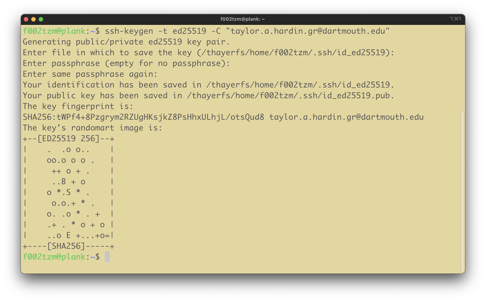
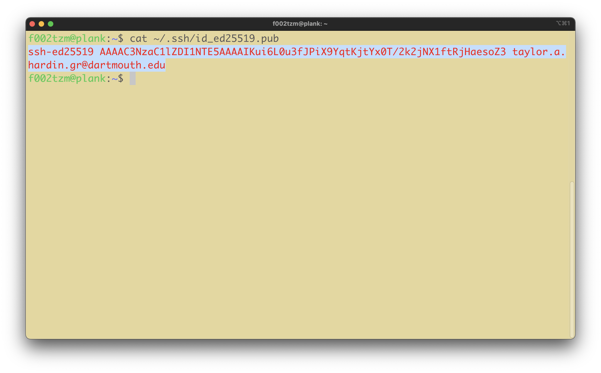
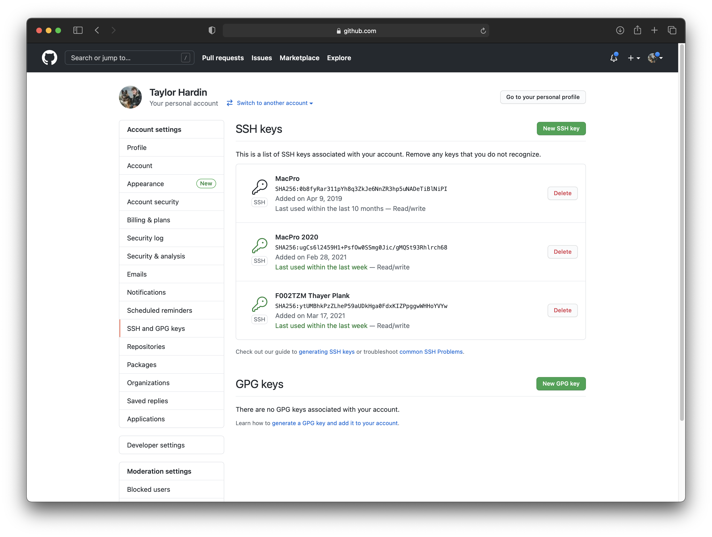
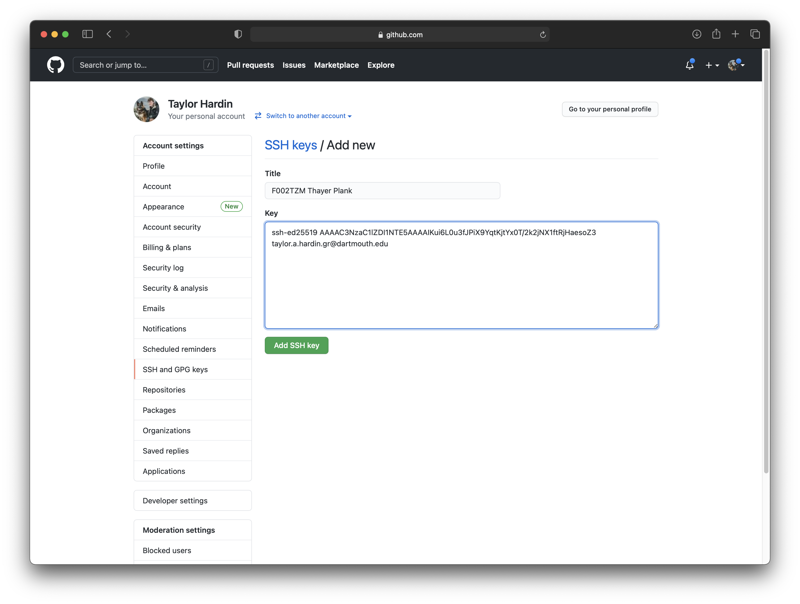

# CS50 GitHub setup

This page walks you through creating a GitHub account and configuring it for use in CS50.
[GitHub](https://github.com) is a code-hosting platform for version control and collaboration.
You will use GitHub to manage and share your lab and project code.

1. **Create an account** on [GitHub](https://github.com), if you don't already have one.

2. **Update your profile** on on [GitHub](https://github.com):  click on your account menu at top-right; select *Settings*.
	Under the *Profile* tab, edit *Name* to provide your real name, and add a Profile picture.

	> We advise you to include your ‘real name’ so others can recognize you when adding you to GitHub  Organizations, Teams, and Repositories.
	> We have made the mistake of adding the wrong person because, when inviting a user and typing what may be the right user, someone with a similar-looking username pops up and, thinking it is the person we want, we add the wrong user!
	> If your profile includes your name and photo, your collaborators can quickly confirm they have the right user.
	> It also makes your account look more professional!

3. **Generate an ssh key pair**.
	This key pair is used by GitHub to identify you and ensure that you have permission to download code from (and to push code to) some given code repository.
	On `plank`, run the command shown below to generate an ssh key pair (be sure to use the email address associated with your GitHub account).
	When you're prompted to "Enter a file in which to save the key," press *enter* (return) to accept the default.
	When you're prompted to "Enter passphrase (empty for no passphrase)" press *enter* (return) two more times.
	Pictured below is example output from generating an ssh key pair.
	
	```bash
	ssh-keygen -t ed25519 -C "your_email@example.com"
	```

	

4. **Copy your public key to the clipboard**.
	Run the following command to print your public key to the terminal, and then highlight and copy the key (be sure you do not highlight extraneous characters at the beginning or end).
	
	```bash
	cat ~/.ssh/id_ed25519.pub
	```
	

5. **Add your key to GitHub**.
	Use your browser to log into [GitHub](https://www.github.com); click on your profile photo in the upper-right corner of the page and navigate to **Settings/SSH and GPG Keys**.

	

	Click the button **New SSH Key**.
	In the **Title** field, give your key an appropriate name so that you know what machine this key resides on (e.g., *Thayer Plank*) and paste your clipboard into the **Key** field.
Finally, click **Add SSH Key**.

	

7. **Teach git your name**.
	Back in the Terminal, on `plank`, configure the local git client so it, too, knows your real name.
	Following these [instructions](https://docs.github.com/en/github/using-git/setting-your-username-in-git),
	
	```bash
	git config --global user.name "My Real Name"
	```


**That's it!**
You should now be able to clone, push, and pull git repositories to and from GitHub, from your Linux account.
